# 探索性数据分析:哈伯曼癌症生存数据集

> 原文：<https://towardsdatascience.com/exploratory-data-analysis-habermans-cancer-survival-dataset-c511255d62cb?source=collection_archive---------2----------------------->


# 什么是探索性数据分析？

E **探索性数据分析(EDA)** 是一种分析数据集以总结其主要特征的方法，通常采用可视化方法。EDA 是为了看看数据能告诉我们什么，而不仅仅是正式的建模或假设检验任务。

用多种探索技术探索一个数据集总是一个好主意，特别是当它们可以一起进行比较时。探索性数据分析的目标是获得对数据的信心，从而准备好使用机器学习算法。EDA 的另一个附带好处是细化您对稍后将用于机器学习的特征变量的选择。

# 为什么是埃达？

在匆忙进入机器学习阶段时，一些数据科学家要么完全跳过探索过程，要么做一个非常敷衍的工作。这是一个具有多种含义的错误，包括生成不准确的模型，生成准确的模型但基于错误的数据，在数据准备中没有创建正确类型的变量，以及由于仅在生成模型后才意识到数据可能有偏差，或有异常值，或有太多缺失值，或发现某些值不一致而导致资源使用效率低下。

在这篇博客中，我们采用了哈伯曼的癌症生存数据集，并使用 python 执行了各种 EDA 技术。你可以很容易地从 Kaggle 下载数据集。

[](https://www.kaggle.com/gilsousa/habermans-survival-data-set) [## 哈伯曼生存数据集

### 接受乳腺癌手术患者的存活率

www.kaggle.com](https://www.kaggle.com/gilsousa/habermans-survival-data-set) 

# 哈伯曼癌症生存数据集上的 EDA

# 1.了解数据集

标题:哈伯曼的生存数据
描述:该数据集包含 1958 年至 1970 年间在芝加哥大学比林斯医院进行的一项关于乳腺癌手术患者生存的研究。
属性信息:
患者手术时的年龄(数值)
患者手术年份(年份— 1900，数值)
检测到的阳性腋窝淋巴结数(数值)
存活状态(类别属性):
1 =患者存活 5 年或更长时间
2 =患者在 5 年内死亡

# 2.导入库并加载文件

```
import pandas as pd
import seaborn as sns
import matplotlib.pyplot as plt
import numpy as np*#reading the csv file*
haber = pd.read_csv(“haberman_dataset.csv”)
```

# 3.理解数据

```
*#Prints the first 5 entries from the csv file*
haber.head()
```

输出:

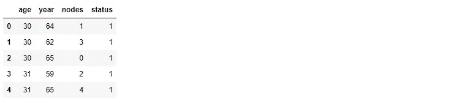

```
*#prints the number of rows and number of columns*
haber.shape
```

输出:(306，4)

## 观察:

1.  CSV 文件包含 306 行和 4 列。

```
*#printing the columns*
haber.columns
```

输出:索引(['年龄'，'年份'，'节点'，'状态']，dtype= '对象')

```
print(haber.info())
*#brief info about the dataset*
```

输出:

```
<class 'pandas.core.frame.DataFrame'>
RangeIndex: 306 entries, 0 to 305
Data columns (total 4 columns):
age       306 non-null int64
year      306 non-null int64
nodes     306 non-null int64
status    306 non-null int64
dtypes: int64(4)
memory usage: 9.6 KB
```

## 观察结果:

1.  该数据集中没有缺失值。
2.  所有列都是整数数据类型。
3.  状态的数据类型是整数，必须将其转换为分类数据类型
4.  在状态列中，值 1 可以映射为“是”，这意味着患者已经存活了 5 年或更长时间。值 2 可以映射为“否”,这意味着患者在 5 年内死亡。

```
haber[‘status’] = haber[‘status’].map({1:’Yes’, 2:’No’})
haber.head() 
*#mapping the values of 1 and 2 to yes and no respectively and #printing the first 5 records from the dataset.*
```

输出:

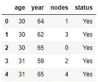

```
haber.describe()
*#describes the dataset*
```

输出:

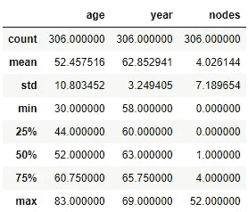

## 观察结果:

1.  Count:各列中存在的值的总数。
2.  Mean:各列中所有值的平均值。
3.  Std:各列中值的标准偏差。
4.  Min:列中的最小值。
5.  25%:给出第 25 个百分点值。
6.  50%:给出第 50 个百分位数的值。
7.  75%:给出第 75 个百分位数的值。
8.  Max:列中的最大值。

```
haber[“status”].value_counts()
*#gives each count of the status type*
```

输出:

是 225
否 81
名称:状态，数据类型:int64

## 观察结果:

1.  value_counts()函数告诉我们每个类有多少个数据点。在这里，它告诉多少病人存活，多少没有存活。
2.  在 306 名患者中，225 名患者存活，81 名患者死亡。
3.  数据集不平衡。

```
status_yes = haber[haber[‘status’]==’Yes’]
status_yes.describe()
*#status_yes dataframe stores all the records where status is yes*
```

输出:

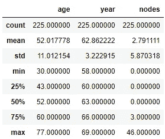

```
status_no = haber[haber[‘status’]==’No’]
status_no.describe()
*#status_no dataframe stores all the records where status is no*
```

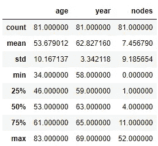

## 观察结果:

1.  两类患者的平均年龄和接受手术的年份几乎相似，而两类患者的淋巴结平均值相差约 5 个单位。
2.  与未存活的患者相比，存活患者的淋巴结更少。

# 4.单变量分析

单变量分析的主要目的是描述、总结和发现单一特征中的模式。

## 4.1 概率密度函数(PDF)

概率密度函数(PDF)是变量取值 x 的概率。(直方图的平滑版本)

这里，柱的高度表示相应组下的数据点的百分比

```
sns.FacetGrid(haber,hue=’status’,height = 5)\
 .map(sns.distplot,”age”)\
 . add_legend();
plt.show()
```

输出:

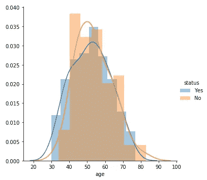

PDF of Age

## 观察结果:

1.  观察到大量重叠，这告诉我们生存机会与人的年龄无关。
2.  虽然有重叠，但我们可以隐约看出，年龄在 30-40 岁之间的人更有可能存活，而 40-60 岁的人不太可能存活。而年龄在 60-75 岁之间的人存活和死亡的机会均等。
3.  然而，这不是我们的最终结论。我们不能仅仅通过考虑年龄参数来决定病人的生存机会

```
sns.FacetGrid(haber,hue=’status’,height = 5)\
 .map(sns.distplot,”year”)\
 . add_legend();
plt.show()
```

输出:

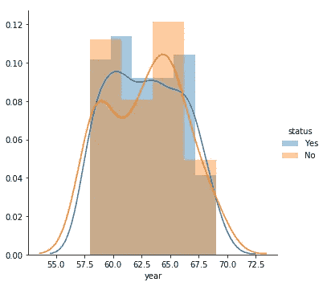

PDF of Year

## 观察结果:

1.  观察到大量重叠。这张图只显示了多少次手术成功，多少次手术失败。这不能成为决定病人生存机会的参数。
2.  然而，可以看出，在 1960 年和 1965 年有更多的不成功的行动。

```
sns.FacetGrid(haber,hue=’status’,height = 5)\
 .map(sns.distplot,”nodes”)\
 . add_legend();
plt.show()
```

输出:

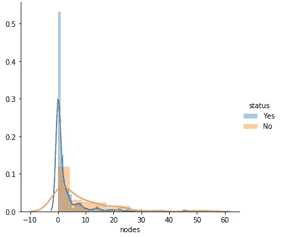

PDF of Nodes

## 观察结果:

1.  无淋巴结或有 1 个淋巴结的患者更有可能存活。如果有 25 个或更多的节点，存活的机会很小。

## 4.2 累积分布函数

累积分布函数(CDF)是变量取值小于或等于 x 的概率。

```
counts1, bin_edges1 **=** np.histogram(status_yes['nodes'], bins**=**10, density **=** **True**)
pdf1 **=** counts1**/**(sum(counts1))
print(pdf1);
print(bin_edges1)
cdf1 **=** np.cumsum(pdf1)
plt.plot(bin_edges1[1:], pdf1)
plt.plot(bin_edges1[1:], cdf1, label **=** 'Yes')
plt.xlabel('nodes')print("***********************************************************")
counts2, bin_edges2 **=** np.histogram(status_no['nodes'], bins**=**10, density **=** **True**)
pdf2 **=** counts2**/**(sum(counts2))
print(pdf2);
print(bin_edges2)
cdf2 **=** np.cumsum(pdf2)
plt.plot(bin_edges2[1:], pdf2)
plt.plot(bin_edges2[1:], cdf2, label **=** 'No')
plt.xlabel('nodes')plt.legend()
plt.show()
```

输出:

[0.835555560.08 0.02222222 0.02666670.0177778 0.00444444
0.00888889 0。0.0.00444444]
【0。4.6 9.2 13.8 18.4 23.27.6 32.2 36.8 41.4 46.]* * * * * * * * * * * * * * * * * * * * * * * * * * * * * * * * * * * * * * * * * * * * * * * * * * * * *
【0.56790123 0.14814815 0.13580247 0.04938272 0.07407407 0 .0.01234568 0。0.0.01234568]
【0。5.2 10.4 15.6 20.8 26.31.2 36.4 41.6 46.8 52.]

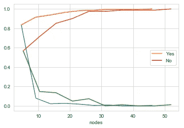

CDF of Nodes

## 观察结果:

1.  83.55%的存活患者的淋巴结在 0-4.6 之间

## 4.3 箱形图和小提琴图

该方框从数据的下四分位数延伸到上四分位数，中间有一条线。触须从框中延伸出来，以显示数据的范围。离群点是那些超过胡须末端的点。

小提琴图是箱线图和概率密度函数(CDF)的组合。

```
sns.boxplot(x**=**'status',y**=**'age',data**=**haber)
plt.show()sns.boxplot(x='status',y='year',data=haber)
plt.show()sns.boxplot(x='status',y='nodes',data=haber)
plt.show()
```

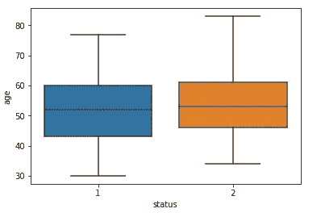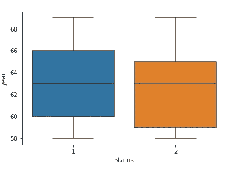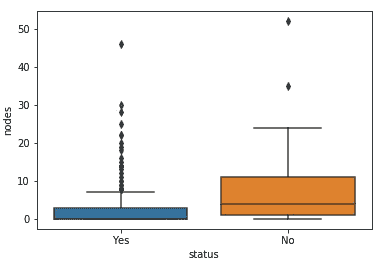

Box plots

```
sns.violinplot(x=”status”,y=”age”,data = haber,height = 10)
plt.show()sns.violinplot(x=”status”,y=”year”,data = haber,height = 10)
plt.show()sns.violinplot(x=”status”,y=”nodes”,data = haber,height = 10)
plt.show()
```

输出:

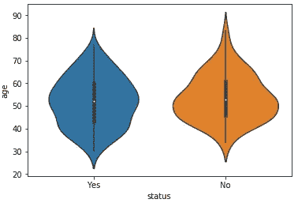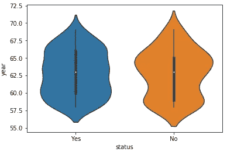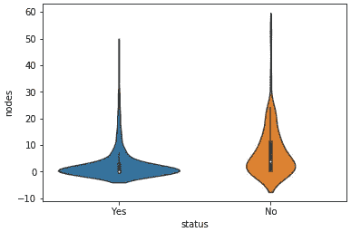

Violin Plots

## 观察结果:

1.  超过 1 个淋巴结的患者不太可能存活。节点数量越多，生存机会越小。
2.  大部分存活的患者没有淋巴结。然而，有一小部分没有阳性腋窝淋巴结的患者在手术后 5 年内死亡，因此没有阳性腋窝淋巴结并不总是能保证存活。
3.  在 1965 年接受手术的人中，存活时间不超过 5 年的相对较多。
4.  相对而言，45 至 65 岁年龄组中有更多的人没有活下来。患者年龄本身并不是决定患者存活率的重要参数。
5.  年龄和年份参数的箱线图和小提琴图给出了相似的结果，数据点有很大的重叠。与其他特征相比，节点的箱线图和小提琴图中的重叠较少，但是重叠仍然存在，因此很难设置阈值来对两类患者进行分类。

# 5.双变量分析

## 5.1 散点图

散点图是一种二维数据可视化，使用点来表示两个不同变量的值，一个沿 x 轴绘制，另一个沿 y 轴绘制。

```
sns.set_style(“whitegrid”)
sns.FacetGrid(haber, hue = “status” , height = 6)\
 .map(plt.scatter,”age”,”year”)\
 .add_legend()
plt.show()
```

输出:

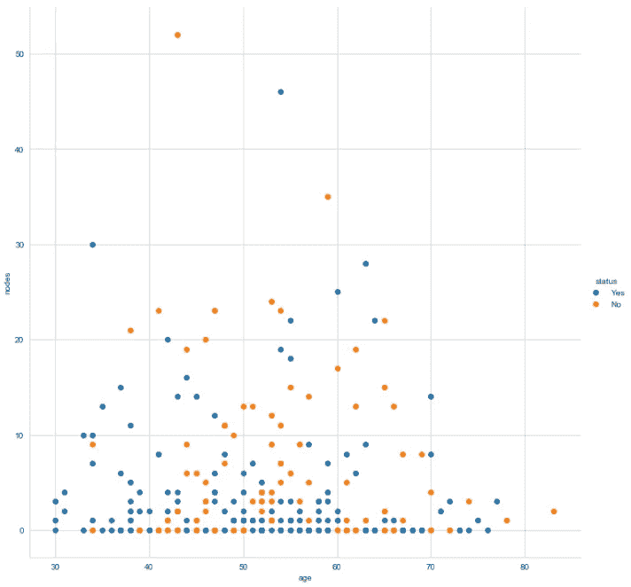

Scatter Plot: age vs nodes

## 观察:

1.  无论年龄大小，淋巴结为 0 的患者更有可能存活。
2.  几乎没有病人的淋巴结超过 25 个。
3.  年龄超过 50 岁且淋巴结超过 10 个的患者存活的可能性更小。

## 5.2 配对图

默认情况下，该函数将创建一个轴网格，这样数据中的每个变量将在 y 轴的一行中共享，在 x 轴的一列中共享。对角轴被区别对待，绘制一个图来显示该列中变量的数据的单变量分布。

```
sns.set_style(“whitegrid”)
sns.pairplot(haber, hue=”status”, height = 5)
plt.show()
```

输出:

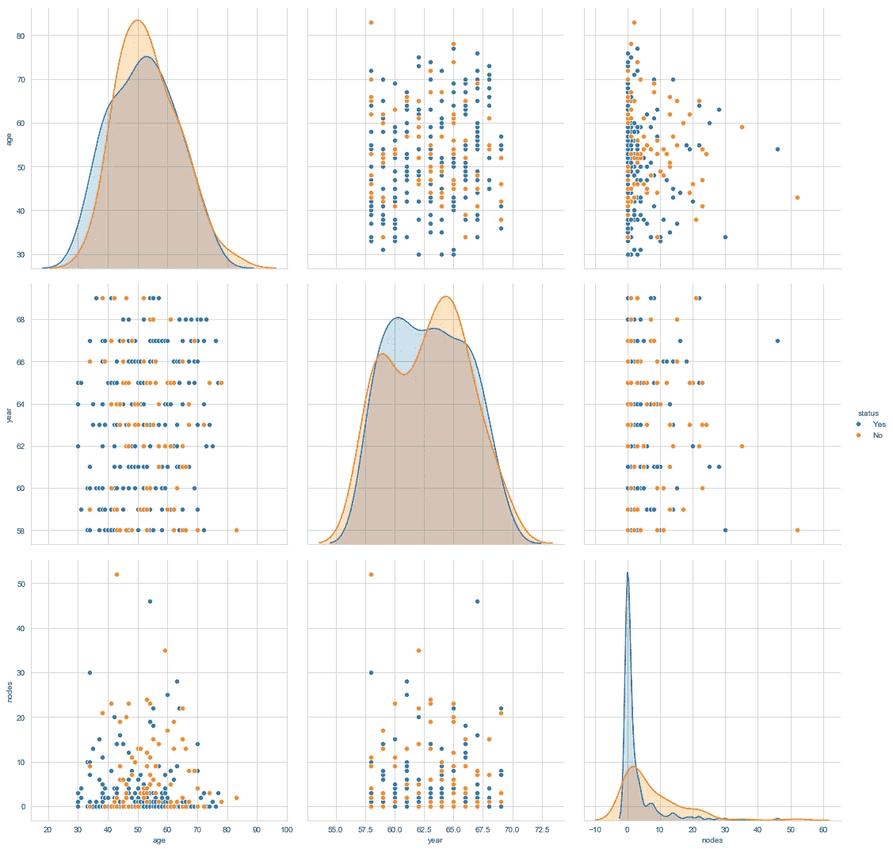

Pair Plot

## 观察结果:

1.  年份和节点之间的关系相对较好。

# 6.多变量分析

## 6.1 等高线图

二元函数的等高线或等值线是一条曲线，函数沿着这条曲线有一个常数值。它是三维图形的横截面。

```
sns.jointplot(x = ‘year’, y = ‘age’, data = haber, kind = “kde”)
plt.show()
```

输出:

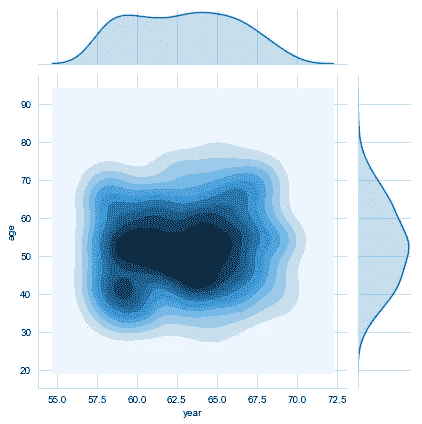

Contour Plot year vs age

## 观察:

1.  从 1960 年到 1964 年，45 岁到 55 岁年龄组的病人做了更多的手术。

# 结论:

1.  患者的年龄和手术年份本身并不是决定其生存的因素。然而，35 岁以下的人有更多的生存机会。
2.  生存机会与阳性腋窝淋巴结数成反比。我们也看到没有阳性腋窝淋巴结并不总是能保证存活。
3.  基于给定的特征对新患者的生存状态进行分类的目标是一项困难的任务，因为数据是不平衡的。