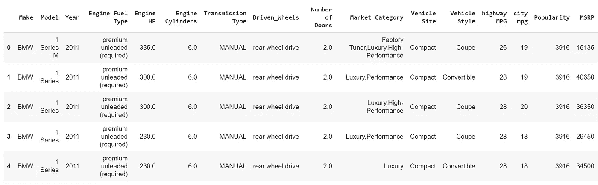
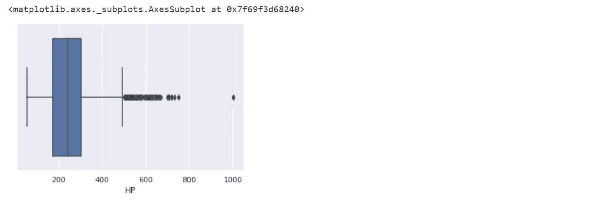

# Python 中的探索性数据分析。

> 原文：<https://towardsdatascience.com/exploratory-data-analysis-in-python-c9a77dfa39ce?source=collection_archive---------1----------------------->

## 让我们了解如何在 python 中探索数据。


Image Credits: [Morioh](https://morioh.com)

# 介绍

## **什么是探索性数据分析？**

探索性数据分析(EDA)是通过总结数据集的主要特征来理解数据集，通常是直观地绘制出来。这一步非常重要，尤其是当我们为了应用机器学习而对数据进行建模的时候。EDA 中的绘图包括直方图、箱线图、散点图等等。研究这些数据通常要花很多时间。通过 EDA 的过程，我们可以要求在我们的数据集上定义问题陈述或定义，这非常重要。

## **如何进行探索性数据分析？**

这是一个每个人都渴望知道答案的问题。答案是，这取决于您正在处理的数据集。执行 EDA 并没有单一的方法或共同的方法，而在本教程中，您可以了解一些将在 EDA 过程中使用的共同方法和图。

## **我们今天在探索什么数据？**

由于我是一个超级车迷，我从 Kaggle 获得了一组非常漂亮的汽车数据。数据集可以从[这里](https://www.kaggle.com/CooperUnion/cardataset)下载。给出一个关于数据集的简短信息，该数据包含 10，000 多行和 10 多列，包含汽车的特征，例如发动机燃料类型、发动机尺寸、马力、变速器类型、公路 MPG、城市 MPG 等等。因此，在本教程中，我们将探索数据，并为建模做好准备。

## 我们开始吧！！！

**1。导入 EDA 所需的库**

以下是本教程中用于执行 EDA(探索性数据分析)的库。**完整代码可以在我的** [**GitHub**](https://github.com/Tanu-N-Prabhu/Python/blob/master/Exploratory_data_Analysis.ipynb) 上找到。

```
**# Importing required libraries.** import pandas as pd
import numpy as np
import seaborn as sns #visualisation
import matplotlib.pyplot as plt #visualisation
%matplotlib inline 
sns.set(color_codes=True)
```

**2。将数据加载到数据框中。**

将数据加载到 pandas 数据框中肯定是 EDA 中最重要的步骤之一，因为我们可以看到数据集的值是用逗号分隔的。因此，我们所要做的就是将 CSV 读入数据帧，pandas 数据帧会为我们完成这项工作。

为了获取数据集或将数据集加载到笔记本中，我所做的只是一个微不足道的步骤。在笔记本左侧的 [**Google Colab**](https://colab.research.google.com/notebooks/welcome.ipynb) 中，你会发现一个“**”>”**(大于符号)。当你点击它时，你会发现一个有三个选项的标签，你只需要选择文件。然后你可以在上传选项的帮助下轻松上传你的文件。无需安装到 google drive 或使用任何特定的库，只需上传数据集，您的工作就完成了。在这一步要记住的一点是，当运行时被回收时，上传的文件将被删除。这就是我如何把数据集放进笔记本的。

```
df = pd.read_csv(“data.csv”)
**# To display the top 5 rows** df.head(5)
```



Displaying the top 5 rows.

```
**# To display the bottom 5 rows** df.tail(5) 
```


Displaying the last 10 rows.

**3。检查数据类型**

这里我们检查数据类型，因为有时汽车的 MSRP 或价格会存储为字符串或对象，如果在这种情况下，我们必须将字符串转换为整数数据，然后我们才能通过图形绘制数据。在这里，在这种情况下，数据已经是整数格式，所以没什么好担心的。

```
**# Checking the data type** df.dtypes
```


Checking the type of data.

**4。删除不相关的列**

这一步在每个 EDA 中都是必不可少的，因为有时会有许多列我们从未使用过，在这种情况下删除是唯一的解决方案。在这种情况下，诸如发动机燃料类型、市场类别、车型、受欢迎程度、车门数量、车辆尺寸等列对我来说没有任何意义，所以我只是放弃了这个实例。

```
**# Dropping irrelevant columns** df = df.drop([‘Engine Fuel Type’, ‘Market Category’, ‘Vehicle Style’, ‘Popularity’, ‘Number of Doors’, ‘Vehicle Size’], axis=1)
df.head(5)
```


Dropping irrelevant columns.

**5。重命名列**

在这种情况下，大多数列名读起来非常混乱，所以我只是调整了它们的列名。这是一个很好的方法，它提高了数据集的可读性。

```
**# Renaming the column names** df = df.rename(columns={“Engine HP”: “HP”, “Engine Cylinders”: “Cylinders”, “Transmission Type”: “Transmission”, “Driven_Wheels”: “Drive Mode”,”highway MPG”: “MPG-H”, “city mpg”: “MPG-C”, “MSRP”: “Price” })
df.head(5)
```


Renaming the column name.

**6。删除重复行**

这通常是一件很方便的事情，因为一个巨大的数据集(在本例中包含超过 10，000 行)通常会有一些重复的数据，这可能会令人不安，所以这里我从数据集中删除了所有重复的值。例如，在删除之前，我有 11914 行数据，但在删除重复数据后，有 10925 行数据，这意味着我有 989 行重复数据。

```
**# Total number of rows and columns** df.shape**(11914, 10)****# Rows containing duplicate data** duplicate_rows_df = df[df.duplicated()]
print(“number of duplicate rows: “, duplicate_rows_df.shape)**number of duplicate rows:  (989, 10)**
```

现在让我们删除重复的数据，因为可以删除它们。

```
**# Used to count the number of rows before removing the data** df.count() **Make            11914 
Model           11914 
Year            11914 
HP              11845 
Cylinders       11884 
Transmission    11914 
Drive Mode      11914 
MPG-H           11914 
MPG-C           11914 
Price           11914 
dtype: int64**
```

如上所示，共有 11914 行，我们删除了 989 行重复数据。

```
**# Dropping the duplicates** df = df.drop_duplicates()
df.head(5)
```


```
**# Counting the number of rows after removing duplicates.** df.count()Make            10925 
Model           10925 
Year            10925 
HP              10856 
Cylinders       10895 
Transmission    10925 
Drive Mode      10925 
MPG-H           10925 
MPG-C           10925 
Price           10925 
dtype: int64
```

**7。删除缺失值或空值。**

这与上一步非常相似，但在这里，所有丢失的值都被检测到，并在稍后被删除。现在，这不是一个好的方法，因为许多人只是用该列的平均值来替换缺失的值，但在这种情况下，我只是删除了缺失的值。这是因为与 10，000 个值相比，有将近 100 个值丢失了，这是一个很小的数字，可以忽略不计，所以我只是丢弃了这些值。

```
**# Finding the null values.** print(df.isnull().sum())**Make             0 
Model            0 
Year             0 
HP              69 
Cylinders       30 
Transmission     0 
Drive Mode       0 
MPG-H            0 
MPG-C            0 
Price            0 
dtype: int64**
```

这就是在上述步骤中，在 10925 行中计算气缸和马力(HP)的原因，分别为 10856 和 10895。

```
**# Dropping the missing values.** df = df.dropna() 
df.count()**Make            10827 
Model           10827 
Year            10827 
HP              10827 
Cylinders       10827 
Transmission    10827 
Drive Mode      10827 
MPG-H           10827 
MPG-C           10827 
Price           10827 
dtype: int64**
```

现在，我们已经删除了所有包含空值或不适用值(气缸和马力(HP))的行。

```
**# After dropping the values** print(df.isnull().sum()) **Make            0 
Model           0 
Year            0 
HP              0 
Cylinders       0 
Transmission    0 
Drive Mode      0 
MPG-H           0 
MPG-C           0 
Price           0 
dtype: int64**
```

**8。检测异常值**

离群点是不同于其他点的一个点或一组点。有时它们会很高或很低。检测并移除异常值通常是个好主意。因为离群值是导致模型不太精确的主要原因之一。因此，移除它们是个好主意。我将要执行的异常值检测和去除被称为 IQR 评分技术。通常，使用箱线图可以看到异常值。下面显示的是建议零售价，气缸，马力和发动机大小的方框图。在所有的图中，你可以发现一些点在方框之外，它们不是别的，就是异常值。我在这项任务中执行的寻找和去除异常值的技术得到了来自[的数据科学](/ways-to-detect-and-remove-the-outliers-404d16608dba)教程的帮助。

```
sns.boxplot(x=df[‘Price’])
```


Box plot of Price

```
sns.boxplot(x=df[‘HP’])
```



Box Plot of HP

```
sns.boxplot(x=df['Cylinders'])
```


Box Plot of Cylinders

```
Q1 = df.quantile(0.25)
Q3 = df.quantile(0.75)
IQR = Q3 — Q1
print(IQR)**Year             9.0 
HP             130.0 
Cylinders        2.0 
MPG-H            8.0 
MPG-C            6.0 
Price        21327.5 
dtype: float64**
```

不要担心上面的值，因为知道它们中的每一个并不重要，重要的是知道如何使用这种技术来去除异常值。

```
df = df[~((df < (Q1–1.5 * IQR)) |(df > (Q3 + 1.5 * IQR))).any(axis=1)]
df.shape**(9191, 10)**
```

如上所示，大约有 1600 行是异常值。但是你不能完全去除异常值，因为即使你使用了上面的技术，也可能有 1-2 个异常值没有去除，但是这没关系，因为有超过 100 个异常值。有总比没有好。

**9。绘制不同特征之间的对比图(散点图)，对比频率图(直方图)**

**直方图**

直方图是指变量在一个区间内出现的频率。在这种情况下，主要有 10 个不同类型的汽车制造公司，但了解谁拥有最多的汽车往往是很重要的。做这个直方图是一个简单的解决方案，它让我们知道不同公司生产的汽车总数。

```
**# Plotting a Histogram** df.Make.value_counts().nlargest(40).plot(kind=’bar’, figsize=(10,5))
plt.title(“Number of cars by make”)
plt.ylabel(‘Number of cars’)
plt.xlabel(‘Make’);
```


Histogram

**热图**

热图是一种绘图，当我们需要找到因变量时，它是必要的。找到特征之间关系的最好方法之一是使用热图。在下面的热图中，我们知道价格特征主要取决于发动机尺寸、马力和气缸。

```
**# Finding the relations between the variables.** plt.figure(figsize=(20,10))
c= df.corr()
sns.heatmap(c,cmap=”BrBG”,annot=True)
c
```


Heat Maps.

**散点图**

我们通常使用散点图来寻找两个变量之间的相关性。这里散点图是马力和价格之间的关系，我们可以看到下图。根据下面给出的图表，我们可以很容易地画出一条趋势线。这些特征提供了良好的点分散。

```
**# Plotting a scatter plot** fig, ax = plt.subplots(figsize=(10,6))
ax.scatter(df[‘HP’], df[‘Price’])
ax.set_xlabel(‘HP’)
ax.set_ylabel(‘Price’)
plt.show()
```


Scatter Plot

因此，以上是探索性数据分析中涉及的一些步骤，这些是为了执行 EDA 您必须遵循的一些一般步骤。还有更多的，但现在，这是足够多的想法，如何执行一个好的 EDA 给定的任何数据集。敬请关注更多更新。如果你有疑问，那么评论区就是你的了。我会尽我所能回答你的问题。

谢谢你。