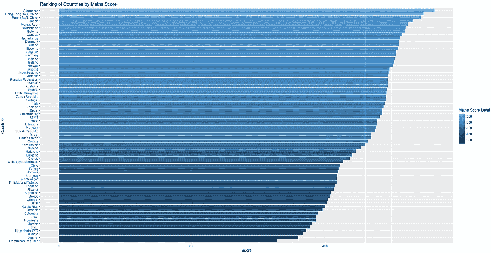
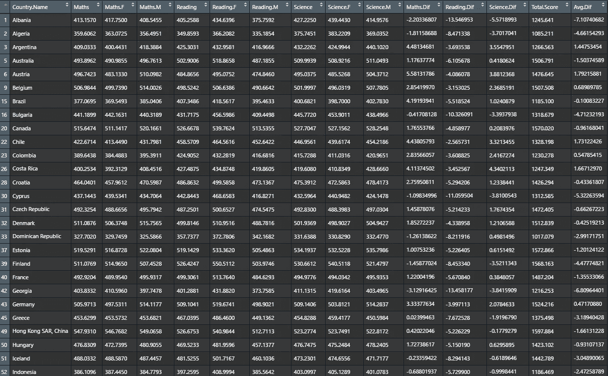

# 面向初学者的 R 中的探索性数据分析(第 1 部分)

> 原文：<https://towardsdatascience.com/exploratory-data-analysis-in-r-for-beginners-fe031add7072?source=collection_archive---------0----------------------->

## 从数据导入到清理和可视化的逐步方法


Photo by [Lukas Blazek](https://unsplash.com/@goumbik?utm_source=medium&utm_medium=referral) on [Unsplash](https://unsplash.com?utm_source=medium&utm_medium=referral)

**探索性数据分析** ( **EDA** )是对数据进行分析和可视化的过程，以更好地理解数据并从中获得洞察力。进行 EDA 时会涉及各种步骤，但以下是数据分析师在进行 EDA 时可以采取的常见步骤:

1.  导入数据
2.  清理数据
3.  处理数据
4.  将数据可视化

# 你希望在这篇文章中找到什么？

本文重点关注数据集的 EDA，这意味着它将涉及上述所有步骤。因此，本文将带您了解所需的所有步骤以及每个步骤中使用的工具。因此，您可能会在本文中找到以下内容:

1.  **整理数据集的 Tidyverse** 包
2.  用于可视化的 **ggplot2** 包
3.  **相关图**相关图包
4.  其他一些操作数据的基本函数，如 strsplit()、cbind()、matrix()等等。

对于 EDA 初学者，*如果你没有很多时间*和*不知道从哪里开始*，我会推荐你从 **Tidyverse** 和 **ggplot2** 开始。你可以用这两个包做几乎所有关于 EDA 的事情。网上有各种资源，像 [DataCamp](https://www.datacamp.com/) 、 [Setscholars](https://setscholars.net/) ，还有像[Data Science Introduction](https://rafalab.github.io/dsbook/)之类的书籍。

在本文中，我将通过对 PISA 分数数据集的分析，带您了解 EDA 的过程。

让我们开始吧，伙计们！！

# 导入数据

在将数据导入 R 进行分析之前，让我们看看数据是什么样子的:


当将这些数据导入 R 时，我们希望最后一列是“数字”，其余的是“因子”。考虑到这一点，我们来看看以下 3 种情况:

```
df.raw <- read.csv(file ='Pisa scores 2013 - 2015 Data.csv', fileEncoding="UTF-8-BOM", na.strings = '..')df.raw1 <- read.csv(file ='Pisa scores 2013 - 2015 Data.csv')df.raw2 <- read.csv(file ='Pisa scores 2013 - 2015 Data.csv',na.strings = '..')
```

这是将数据导入 r 的 3 种方式。通常，一种是用 go 导入 df.raw1，因为这似乎是导入数据最方便的方式。让我们看看导入数据的结构:

```
df.raw1 <- read.csv(file ='Pisa scores 2013 - 2015 Data.csv')str(df.raw1)
```


我们可以立即发现两个问题。最后一列是“因子”，而不是我们想要的“数字”。其次，第一列“国家名称”的编码不同于原始数据集。

**现在让我们尝试第二种情况**

```
df.raw2 <- read.csv(file ='Pisa scores 2013 - 2015 Data.csv',na.strings = '..')str(df.raw2)
```


最后一列现在是“数字”。但是，第一列的名称没有正确导入。

最后一个场景呢？

```
df.raw <- read.csv(file ='Pisa scores 2013 - 2015 Data.csv', fileEncoding="UTF-8-BOM", na.strings = '..')
str(df.raw)
```


如您所见，第一列现在已正确命名，最后一列是“数字”。

```
**na.strings = '..'**
```

这允许 R 用 NA 替换数据集中的那些空白。这将是有用的和方便的，当我们想删除所有的 NA 的时候。

```
**fileEncoding="UTF-8-BOM"**
```

用外行人的话来说，这允许 R 正确地读取字符，就像它们出现在原始数据集中一样。

# 清理和处理数据

```
install.packages("tidyverse")
library(tidyverse)
```

我们想做一些事情来清理数据集:

1.  确保数据集中的每一行只对应一个国家:使用 tidyverse 包中的 spread()函数
2.  确保只保留有用的列和行:使用 drop_na()和数据子集
3.  重命名系列代码列以获得有意义的解释:使用 Rename()

```
df <- df.raw[1:1161, c(1, 4, 7)] #select relevant rows and cols
    %>%  spread(key=Series.Code, value=X2015..YR2015.) 
    %>%  rename(Maths = LO.PISA.MAT,                        
         Maths.F = LO.PISA.MAT.FE,
         Maths.M = LO.PISA.MAT.MA,
         Reading = LO.PISA.REA,
         Reading.F = LO.PISA.REA.FE,
         Reading.M = LO.PISA.REA.MA,
         Science = LO.PISA.SCI,
         Science.F = LO.PISA.SCI.FE,
         Science.M = LO.PISA.SCI.MA
         ) %>%
  drop_na()
```

现在让我们看看干净的数据是什么样的:

```
view(df)
```


# **可视化数据**

1.  **柱状图**

```
install.packages("ggplot2")
library(ggplot2)#Ranking of Maths Score by Countriesggplot(data=df,aes(x=reorder(Country.Name,Maths),y=Maths)) + 
  geom_bar(stat ='identity',aes(fill=Maths))+
  coord_flip() + 
  theme_grey() + 
  scale_fill_gradient(name="Maths Score Level")+
  labs(title = 'Ranking of Countries by Maths Score',
       y='Score',x='Countries')+ 
  geom_hline(yintercept = mean(df$Maths),size = 1, color = 'blue')
```



同样，我们也可以通过科学分数和阅读分数来排名，只是相应地改变名称。

**2。箱线图**

如果我们使用上面的数据集，我们将无法绘制箱线图。这是因为箱线图只需要 2 个变量 x 和 y，但在我们清理过的数据中，有如此多的变量。所以我们需要把它们合并成两个变量。我们将其命名为 **df2**

```
df2 = df[,c(1,3,4,6,7,9,10)] %>%   # select relevant columns 
  pivot_longer(c(2,3,4,5,6,7),names_to = 'Score')view(df2) 
```


太好了！现在我们可以做箱线图了

```
ggplot(data = df2, aes(x=Score,y=value, **color=Score**)) + 
  geom_boxplot()+
  scale_**color**_brewer(palette="Dark2") + 
  geom_jitter(shape=16, position=position_jitter(0.2))+
  labs(title = 'Did males perform better than females?',
       y='Scores',x='Test Type')
```


geom_jitter()允许您在图上绘制数据点。

你可以用上面的代码来得到不同的情节。例如，我可以将“颜色=分数”改为“填充=分数”:

```
ggplot(data = df2, aes(x=Score,y=value, **fill=Score**)) + 
  geom_boxplot()+
  scale_**fill**_brewer(palette="Green") + 
  geom_jitter(shape=16, position=position_jitter(0.2))+
  labs(title = 'Did males perform better than females?',
       y='Scores',x='Test Type')
```


剧情看起来有点乱。一个更好的视觉化方法是将主题和性别分开，并把它们并排放在一起。

我们如何才能做到这一点？

因为我们想从包含“主题”的列中分离主题和性别。性别’(如数学。f)，我们需要使用 strsplit()来为我们做这项工作

```
S = numeric(408)     # create an empty vector
for (i in 1:length(df2$Score)) {
  S[i] = strsplit(df2$Score[i],".",fixed = TRUE)
}
```

现在 S 是 408 个组件的列表，每个组件有 2 个子组件“主题”和“性别”。我们需要将 S 转换成 1 列**主题**和 1 列**性别**的数据帧。我们将这个数据帧命名为 **df3**

```
df3 = S%>%unlist() %>% matrix(ncol = 2, byrow = TRUE)%>% as.data.frame()view(df3)
```


我们现在需要将这个 **df3** 与我们之前创建的 **df2** 合并，并将结果命名为 **df4**

```
df4 = cbind(df2,df3) 
colnames(df4) = c('Country','Score','Value','Test','Gender')
df4$Score = NULL # since the 'Score' column is redundant
view(df4)
```


厉害！现在数据看起来干净整洁。让我们使用 **ggplot2** 中的 **facet_wrap()** 函数创建**多个图**

```
ggplot(data = df4, aes(x=Test,y=Value, fill=Test)) + 
  geom_boxplot()+
  scale_fill_brewer(palette="Green") + 
  geom_jitter(shape=16, position=position_jitter(0.2))+
  labs(title = 'Did males perform better than females?',
       y='Scores',x='Test')+
  **facet_wrap(~Gender,nrow = 1)**
```


这里，我们按照性别对情节进行分类，因此 **facet_wrap(~Gender，nrow = 1)**

我们也可以通过改变 **facet_wrap(~Test，nrow = 1)** 来对图进行分类

```
ggplot(data = df4, aes(x=Gender,y=Value, fill=Gender)) + 
  geom_boxplot()+
  scale_fill_brewer(palette="Green") + 
  geom_jitter(shape=16, position=position_jitter(0.2))+
  labs(title = 'Did males perform better than females?',
       y='Scores',x='')+
  **facet_wrap(~Test,nrow = 1)**
```


通过观察这些情节，我们可以对男性和女性的表现有所了解。一般来说，男性在科学和数学方面表现更好，但女性在阅读方面表现更好。然而，如果我们只看了箱线图就下结论，那就太天真了。让我们更深入地研究数据，看看在处理数据集后我们还能获得什么其他见解。

因为我想比较所有参与国家中男性和女性在每一科目中的表现，所以我需要计算男性和女性在每一科目中得分的百分比差异，然后绘制出来以进行可视化。

在 R 中我该如何做呢？使用 mutate()函数

让我们看看我们拥有的原始干净数据集， **df**

现在，我们将使用 mutate()函数来计算每个国家的男性和女性之间的百分比差异。

```
df = df %>% mutate(Maths.Diff = ((Maths.M - Maths.F)/Maths.F)*100,
         Reading.Diff = ((Reading.M - Reading.F)/Reading.F)*100,
         Science.Diff = ((Science.M - Science.F)/Science.F)*100,
         Total.Score = Maths + Reading + Science,
         Avg.Diff = (Maths.Diff+Reading.Diff+Science.Diff)/3
         )view(df)
```



现在让我们把它画出来，以便更好地可视化数据

```
##### MATHS SCORE #####
ggplot(data=df, aes(x=reorder(Country.Name, Maths.Diff), y=Maths.Diff)) +
  geom_bar(stat = "identity", aes(fill=Maths.Diff)) +
  coord_flip() +
  theme_light() +
  geom_hline(yintercept = mean(df$Maths.Diff), size=1, color="black") +
  scale_fill_gradient(name="% Difference Level") +
  labs(title="Are Males better at math?", x="", y="% difference from female")
```


该图表示使用**雌性**作为**参照**的分数差异百分比。**正差异** **表示男性得分较高，负差异表示男性得分较低**。黑线代表所有国家的平均差异。

从这里可以得出一些有趣的见解:

*   总体而言，男性在数学方面比女性表现更好，尤其是在大多数发展中国家，男性的分数普遍高于女性
*   有趣的是，在新加坡和香港，女性和男性的表现一样好，在这两个国家的得分差异都在 0 左右。这也许对政策制定者来说是一个很好的见解，因为我们不希望男女在教育方面有巨大的差距。

我们可以对阅读和科学分数做同样的事情。

**3。相关图**

```
df = df[,c(1,3,4,6,7,9,10)] #select relevant columns
```

要创建相关图，只需使用 cor():

```
res = cor(df[,-1]) # -1 here means we look at all columns except the first columnres
```


我们可以计算 p 值，看看相关性是否显著

```
install.packages("Hmisc")
library("Hmisc")res2 <- rcorr(as.matrix(df[,-1))
```


p 值越小，相关性越显著。

本节关于相关图的目的是向您介绍如何计算 r 中变量之间的相关性。对于这个数据集，很明显所有变量都是相关的

想象

```
install.packages("corrplot")

library(corrplot)
corrplot(res, type = "upper", order = "hclust", 
         tl.col = "black", tl.srt = 45)
```


颜色越浓，尺寸越大，相关性越高。结果和我们之前得到的相似:所有的变量都是相互关联的。

就是这样！希望你们喜欢这篇文章，并从中有所收获。虽然本指南并不详尽，但它或多或少会给你一些如何用 r 做一些基本 EDA 的想法。

如果你有任何问题，请在下面的评论区写下来。谢谢你的阅读。祝您愉快，编程愉快！！！

> 点击查看本系列[的第 2 部分](https://medium.com/@hoangkhangtran99/exploratory-data-analysis-in-r-for-beginners-part-2-5bfd35fc9781)
> 
> 如果你有兴趣，可以看看我在[随机森林](/implement-random-forest-in-r-b00b69eb8501)和[预测](/implementing-prophet-time-series-forecasting-model-f16d2a191acc)上的其他帖子！