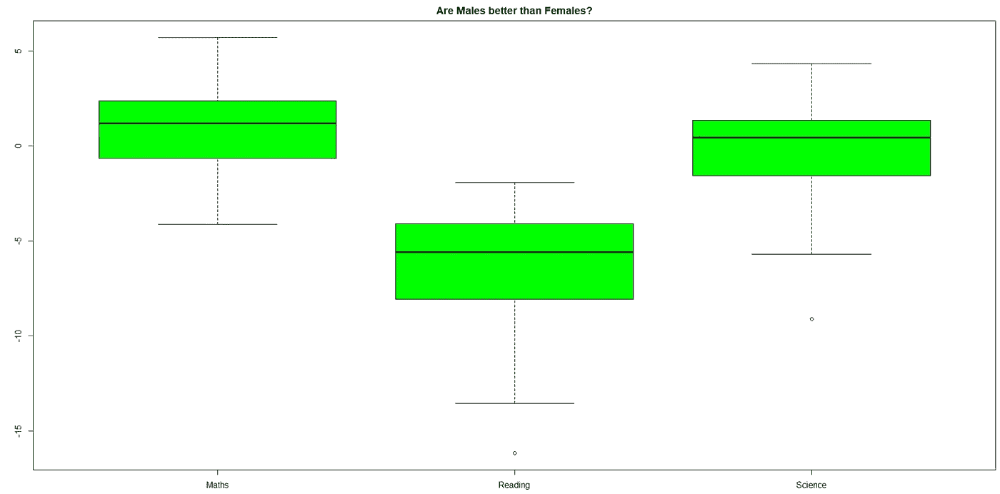

# 面向初学者的 R 中的探索性数据分析(第 2 部分)

> 原文：<https://towardsdatascience.com/exploratory-data-analysis-in-r-for-beginners-part-2-5bfd35fc9781?source=collection_archive---------15----------------------->

## 使用“ggplot2”和“tidyverse”进行 EDA 的更高级方法


ggplot2

在我的上一篇文章， [***初学者 R 中的探索性数据分析(第 1 部分)***](/exploratory-data-analysis-in-r-for-beginners-fe031add7072)’中，我已经介绍了从数据导入到清理和可视化的基本分步方法。下面是第 1 部分的简要总结:

*   用 *fileEncoding* 和 *na.strings* 参数适当导入数据。我展示了它与使用 read.csv()导入 csv 文件的普通方式有何不同。
*   用“tidyverse”包清理数据的一些基本操作
*   “ggplot2”包中的箱线图、柱状图、相关图的可视化

这些是执行简单 EDA 的基本步骤。然而，为了让我们的图、图表和图形更丰富，当然也更具视觉吸引力，我们需要更进一步。我这么说是什么意思？让我们去发现它！

# 你希望在这篇文章中找到什么？

做 EDA 不仅仅是绘制图表。它是关于制作**信息图**的。在本文中，您可能会发现以下技巧:

1.  如何摆弄数据集以获得每种分析的最佳版本？没有放之四海而皆准的数据集。每个分析和可视化有不同的目的，因此有不同的数据结构。
2.  更改图中图例的顺序
3.  让 R 识别异常值，并在图上标记它们
4.  使用' ***gridExtra*** '包组合图形

到本文结束时，您将能够生成以下图形:


让我们开始吧，伙计们！！！！

# 来唤起你的记忆

让我们快速查看一下我们在本系列的第 1 部分中创建的数据集类型。

```
view(df)
```


```
View(df2)
```


```
View(df4) ## df3 combines with df2 to get df4
```


请参考我的[上一篇文章](/exploratory-data-analysis-in-r-for-beginners-fe031add7072)中关于如何操作原始数据集以获得这些不同版本的详细解释。

太好了！让我们现在开始新的视觉情节

# 箱线图

## **简单箱线图**

首先，我们想实现这种箱线图



为了得到这个，我们必须有一个数据框，其中**行**是**国家**和 4 列，即国家名称、数学、阅读和科学的百分比差异。现在回头参考我们之前创建的所有数据帧，我们可以看到 **df** 具有所有这些需求。因此，我们将从 **df** 中选择相关列，并将其命名为 **df5**

```
df5 = df[,c(1,11,12,13)]
boxplot(df5$Maths.Diff, df5$Reading.Diff, df5$Science.Diff,
        main = 'Are Males better than Females?',
        names = c('Maths','Reading','Science'),
        col = 'green'
        )
```

搞定了。按照这段代码，你应该能够得到如上图。

## 高层箱线图

现在我们想进入下一个阶段。这是我们想要得到的情节


请注意以下差异:

1.  副标题
2.  坐标轴的名称
3.  离群值的布局和颜色。
4.  标题

谢天谢地，' **ggplot2** '包拥有我们需要的一切。问题只是我们能否在' **ggplot2** '包中找到这些**参数**和**函数**。但是在我们继续讨论使用什么参数和函数之前，我们需要确定数据集应该是什么样的数据框架/结构。通过查看该图，我们可以看到数据框必须有 **1 列 3 个类别(数学、阅读和科学)，1 列数字结果表示每个科目的成绩差异百分比，当然还有 1 列国家名称。因此总共有 3 列**。

现在我们有了看起来像这样的 df5


我们如何将它转换成上述的数据帧？还记得我在本系列[第 1 部分](/exploratory-data-analysis-in-r-for-beginners-fe031add7072)介绍的一个招数吗，神奇的功能是 **pivot_longer()。**现在，我们开始吧:

```
df6 = df5 %>% pivot_longer(c(2,3,4))
names(df6) = c('Country','Test Diff','Result')
View(df6)
```


```
new = rep(c('Maths', 'Reading', 'Science'),68) #to create a new   column indicating 'Maths', 'Reading' and 'Science'df6 = cbind(df6, new)
names(df6) = c('Country','Test Diff','Result', 'Test')   #change column names
View(df6)
```


“Test Diff”列现在是多余的，所以您可以选择删除它，只需使用下面的代码。(这一步不是强制性的)

```
df6$'Test Diff' = NULL
```

在这里，我就不删了。

太好了！现在，我们已经为可视化准备好了正确结构的数据集，现在让我们使用 ggplot

1.  要获取标题、副标题、题注，请使用 **labs(title = ' …'，y = ' …'，x = ' …'，caption = ' …'，subtitle = ' …')**
2.  如果标题或题注很长，使用 **' …。\n …'** 将其分成两行。
3.  为了指示异常值，在 geom_boxplot()内

```
geom_boxplot(alpha = 0.7,
               outlier.colour='blue',   #color of outlier
               outlier.shape=19,        #shape of outlier
               outlier.size=3,          #size of outlier
               width = 0.6, color = "#1F3552", fill = "#4271AE"
               )
```

将一切结合在一起:

```
ggplot(data = df6, aes(x=Test,y=Result, fill=Test)) + 
  geom_boxplot(alpha = 0.7,
               outlier.colour='blue', 
               outlier.shape=19, 
               outlier.size=3, 
               width = 0.6, color = "#1F3552", fill = "#4271AE"
               )+
  theme_grey() +
  labs(title = 'Did males perform better than females?',
       y='% Difference from FEMALES',x='',
       caption  = 'Positive % Difference means Males performed \n better than Females and vice versa',
       subtitle = 'Based on PISA Score 2015')
```


这样够好了吗？答案是**否:**题注、片头和字幕太小，情节的比例和大小都不如我们在这一节开头介绍的情节。

我们可以做得更好。

要调整尺寸等，使用**主题()**功能

```
theme(axis.text=element_text(size=20),
        plot.title = element_text(size = 20, face = "bold"),
        plot.subtitle = element_text(size = 10),
        plot.caption = element_text(color = "Red", face = "italic", size = 13)

        )
```

在这里，不要问我如何得到这些数字。这是试错法。你可以尝试任何数字，直到你得到完美的尺寸和位置。

现在让我们把所有的东西结合在一起

```
ggplot(data = df6, aes(x=Test,y=Result, fill=Test)) + 
  geom_boxplot(alpha = 0.7,
               outlier.colour='blue', 
               outlier.shape=19, 
               outlier.size=3, 
               width = 0.6, color = "#1F3552", fill = "#4271AE"
               )+
  theme_grey() +
  labs(title = 'Did males perform better than females?',
       y='% Difference from FEMALES',x='',
       caption  = 'Positive % Difference means Males performed \n better than Females and vice versa',
       subtitle = 'Based on PISA Score 2015') + 
theme(axis.text=element_text(size=20),
        plot.title = element_text(size = 20, face = "bold"),
        plot.subtitle = element_text(size = 10),
        plot.caption = element_text(color = "Red", face = "italic", size = 13)
)
```


现在剧情看起来好多了。你可以停在这里。但是，我想介绍一种方法，重新排列变量的顺序，得到一个递减的趋势。简单使用

```
scale_x_discrete(limits=c("Maths","Science","Reading"))
```

因此，结合一切

```
ggplot(data = df6, aes(x=Test,y=Result, fill=Test)) + 
  geom_boxplot(alpha = 0.7,
               outlier.colour='blue', 
               outlier.shape=19, 
               outlier.size=3, 
               width = 0.6, color = "#1F3552", fill = "#4271AE"
               )+
**scale_x_discrete(limits=c("Maths","Science","Reading"))+** theme_grey() +
  labs(title = 'Did males perform better than females?',
       y='% Difference from FEMALES',x='',
       caption  = 'Positive % Difference means Males performed \n better than Females and vice versa',
       subtitle = 'Based on PISA Score 2015') + 
theme(axis.text=element_text(size=20),
        plot.title = element_text(size = 20, face = "bold"),
        plot.subtitle = element_text(size = 10),
        plot.caption = element_text(color = "Red", face = "italic", size = 13)
)
```


厉害！！现在剧情看起来真的很有知识性。然而，更好的数据分析师会产生更丰富的信息，如下所示:


## 怎样才能让 R 识别出离群值，并为我们贴上标签？

```
df6$Test = factor(df6$Test, levels = c("Maths","Science","Reading"))  # To change order of legend
```

让我们来定义离群值。这部分需要一点统计学知识。我会推荐你在这里阅读迈克尔·加拉尼克的文章[。他很好地解释了这些概念。](/understanding-boxplots-5e2df7bcbd51)

```
is_outlier <- function(x) {
   return(x < quantile(x, 0.25) - 1.5 * IQR(x) | x > quantile(x, 0.75) + 1.5 * IQR(x))
}   # define a function to detect outliersstr(df6)
```


请注意，列“国家”和“测试”是因子。首先让我们把它改成字符。

```
df6$Country = as.character(df6$Country)
df7 <- df6  %>% group_by(as.character(Test)) %>% 
  mutate(is_outlier=ifelse(is_outlier(Result), Country, as.numeric(NA)))### What we are doing now is that we are creating a new data frame with the last column 'is_outlier' indicating whether the data point is an outlier or notView(df7)
```


如您所见，数据框的最后一列显示 Jordan 是一个异常值。现在，在“Country”列，我们希望确保只标记异常值，其余的应该标记为“NA”。这将有助于我们以后编写可视化绘图代码。

```
df7$Country[which(is.na(df7$is_outlier))] <- as.numeric(NA)
View(df7)
```


现在，让我们绘制图表。与上面相同的代码。然而，我们需要添加 **geom_text ()** 来标记异常值

```
ggplot(data = df7, aes(x=Test,y=Result, fill=Test)) + 
  geom_boxplot(alpha = 0.7,
               outlier.colour='red', 
               outlier.shape=19, 
               outlier.size=3, 
               width = 0.6)+
  **geom_text(aes(label = Country), na.rm = TRUE, hjust = -0.2)**+         
  theme_grey() +
  labs(title = 'Did males perform better than females?',
       y='% Difference from FEMALES',x='',
       caption  = 'Positive % Difference means Males performed \n better than Females and vice versa',
       subtitle = 'Based on PISA Score 2015') + 
  theme(axis.text=element_text(size=20),
        legend.text = element_text(size = 16), 
        legend.title = element_text(size = 16),

        legend.position = 'right', aspect.ratio = 1.4,
        plot.title = element_text(size = 20, face = "bold"),
        plot.subtitle = element_text(size = 10),
        plot.caption = element_text(color = "Red", face = "italic", size = 13)
  )
```


## 组合多个地块


对于上面组合情节中的每个情节，我们已经在本系列的[第一部](/exploratory-data-analysis-in-r-for-beginners-fe031add7072)中讲述了如何创建它。以下是概要:

```
plot1 = ggplot(data=df, aes(x=reorder(Country.Name, Maths.Diff), y=Maths.Diff)) +
  geom_bar(stat = "identity", aes(fill=Maths.Diff)) +
  coord_flip() +
  theme_light() +
  geom_hline(yintercept = mean(df$Maths.Diff), size=1, color="black") +
  labs(x="", y="Maths")+
  scale_fill_gradient(name="% Difference Level", low = "red", high = "green")+
  theme(legend.position = "none") plot2 = ggplot(data=df, aes(x=reorder(Country.Name, Reading.Diff), y=Reading.Diff)) +
  geom_bar(stat = "identity", aes(fill=Reading.Diff)) +
  coord_flip() +
  theme_light() +
  geom_hline(yintercept = mean(df$Reading.Diff), size=1, color="black") +
  labs(x="", y="Reading")+
  scale_fill_gradient(name="% Difference Level", low = "red", high = "green") +
  theme(legend.position = "none") plot3 = ggplot(data=df, aes(x=reorder(Country.Name, Science.Diff), y=Science.Diff)) +
  geom_bar(stat = "identity", aes(fill=Science.Diff)) +
  coord_flip() +
  theme_light() +
  geom_hline(yintercept = mean(df$Science.Diff), size=1, color="black") +
  labs(x="", y="Science")+
  scale_fill_gradient(name="% Difference", low = "red", high = "green") +
  theme(legend.position = "none")
```

要将它们结合在一起，请使用“gridExtra”包。

```
install.packages('gridExtra')
library(gridExtra)grid.arrange(plot1, plot2,plot3, nrow = 1,
             top = 'Are Males better than Females?',
             bottom = '% Difference from Females'
             )#nrow=1 means all the plots are placed in one row
```

就是这样！同样，我希望你们喜欢这篇文章，并从中有所收获。当然，本指南并不详尽，还有很多其他技术可以用来做 EDA。然而，我相信这个指南或多或少会给你一些如何用 R 从一个简单的情节改进到一个更复杂和更有信息的情节的想法。

如果你有任何问题，请在下面的评论区写下来。再次感谢您的阅读。祝您愉快，编程愉快！！！