# Python 中 FIFA 19 数据集的探索性数据分析

> 原文：<https://towardsdatascience.com/exploratory-data-analysis-of-the-fifa-19-dataset-in-python-24eb27de9e59?source=collection_archive---------10----------------------->

## FIFA 19 数据分析


Photo by [Pixabay](https://www.pexels.com/@pixabay) on [Pexels](https://www.pexels.com/photo/multicolored-soccer-ball-on-green-field-47730/)

在本帖中，我们将对 FIFA 19 数据集进行简单的探索性数据分析。数据集可以在 [Kaggle](https://www.kaggle.com/karangadiya/fifa19) 上找到。FIFA 是国际足球协会联合会，FIFA 19 是 FIFA 系列足球电子游戏的一部分。这是有史以来最畅销的视频游戏之一，迄今为止已经在 T2 卖出了 2 . 6 亿份拷贝。

对于这个分析，我们将使用 python pandas 库、numpy、seaborn 和 matplotlib。数据集包含 89 列，但我们将分析限制在以下 10 列:

1.  **姓名** —玩家姓名
2.  **年龄** —玩家的年龄
3.  **国籍** —球员的国籍
4.  **价值** —当前市场价值
5.  **工资** —球员的工资
6.  **首选脚** —玩家首选脚
7.  **身高** —球员的身高
8.  **体重** —玩家的体重
9.  **位置** —球场上的位置
10.  **总体** —玩家的总体评分

我们开始吧！

首先，让我们导入 pandas 库，将 csv 文件读入 pandas 数据帧，并打印前 16 列的前 5 行:

```
import pandas as pddf = pd.read_csv("data.csv")print(df.head())
```

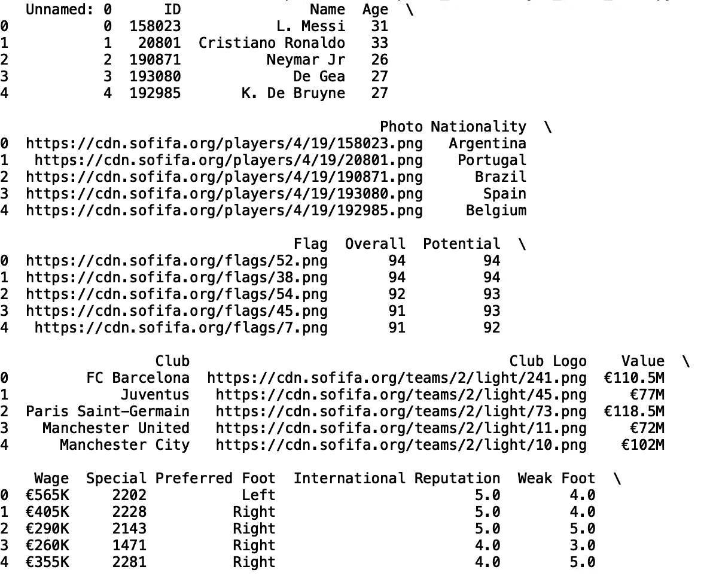

我们可以过滤数据帧，使其只包含我们需要的十列:

```
df = df[['Name**',** 'Age', 'Nationality', Value', 'Wage', 'Preferred Foot', 'Height', 'Weight', Position', 'Overall']]
print(df.head())
```

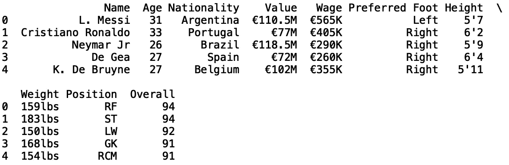

我们可以做的第一件事是在 height 列上生成一些统计数据。这些值是以字符串的形式给出的，所以我们希望将它们转换成可以在计算中使用的数字。这里我们将高度字符串转换成厘米值。为此，我们将字符串的第一个元素(例如“5'7”)乘以 12.0(英寸)，然后添加字符串的第三个元素“7”(英寸)，并将最终结果乘以 2.54(厘米):

```
Height_cm = []for i in list(df['Height'].values):
    try:
        Height_cm.append((float(str(i)[0])*12.0 + float(str(i)[2:]))*2.54)
    except(ValueError):
        Height_cm.append(np.nan)

df['Height_cm'] = Height_cm
```

首先，我们初始化一个名为“Height_cm”的列表，并迭代 dataframe 中的高度字符串值。我们在 try except 子句之间插入转换语句，因为存在字符串包含非数值的情况，特别是缺少高度值的情况。每当我们到达一个缺失值时，我们就追加一个 np.nan (numpy '非数字')值。最后，我们将新列定义为我们刚刚填充的列表。

接下来，让我们删除数据帧中缺少的值，并打印前五行:

```
df.dropna(inplace = True)
print(df['Height_cm'].head())
```

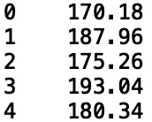

我们可以查看以厘米为单位的身高平均值和标准差:

```
print("Mean: ", df['Height_cm'].mean())
print("Standard Deviation: ", df['Height_cm'].std())
```

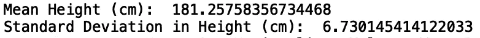

我们还可以生成高度直方图:

```
import seaborn as sns 
sns.set()
df['Height_cm'].hist(bins = 10)
```

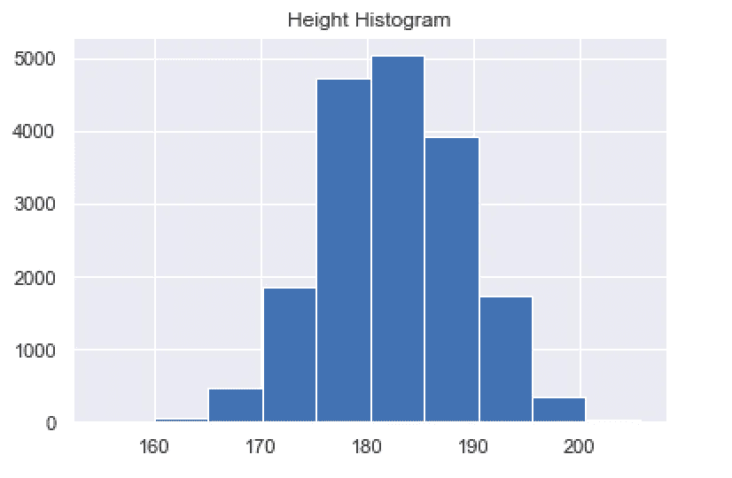

我们还可以将其封装在一个函数中，并将其用于任何数字列:

```
import seaborn as sns 
    import matplotlib.pyplot as plt
def get_statistics(numeric_column_name):
    print("Mean {}: ".format(numeric_column_name),   df[numeric_column_name].mean())
    print("Standard Deviation in {}: ".format(numeric_column_name), df[numeric_column_name].std())
    sns.set()
    plt.title("{} Histogram".format(numeric_column_name))
    df[numeric_column_name].hist(bins = 10)

get_statistics('Height_cm')
```

它生成与上面相同的输出。

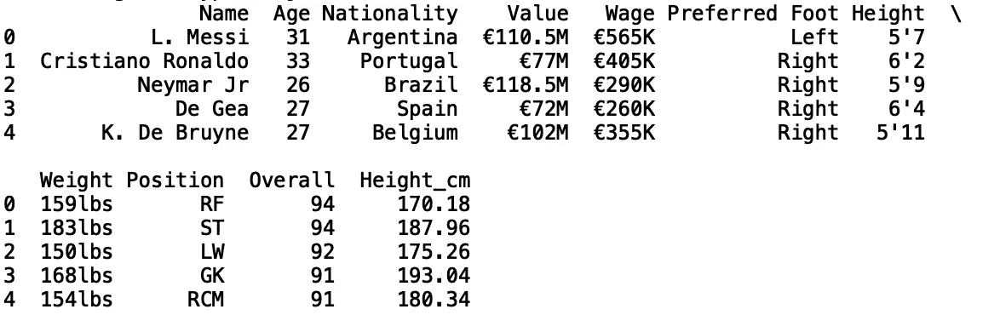

我们还可以将重量列转换为千克，以便与公制保持一致。我们通过取“重量”列中每个字符串值的前三个元素，将它们转换为浮点值，然后除以千克和磅之间的转换因子(2.20462)来实现这一点:

```
df['Weight_kg'] = df['Weight'].str[:3].astype(float)/2.20462
print(df.head())
```

我们可以用‘Weight _ kg’调用 generate_statistics 函数:

```
get_statistics('Weight_kg')
```

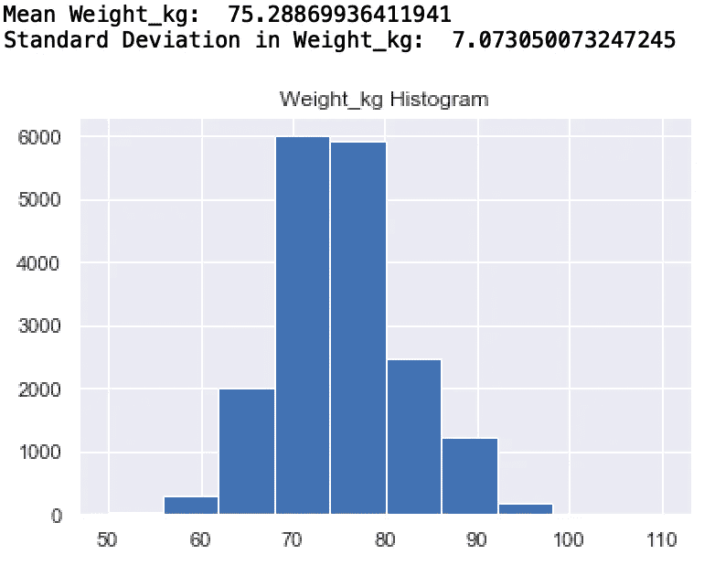

我们还可以使用 collections 模块中的“Counter”方法来查看每个球员的国籍频率:

```
from collections import Counter
print(Counter(df['Nationality'].values))
```

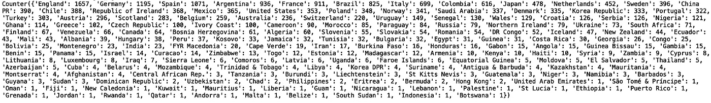

我们可以限制计数器只输出五种最常见的国籍:

```
print(Counter(df['Nationality'].values).most_common(5))
```

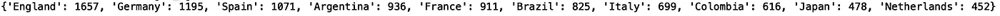

如你所见，英格兰是最常见的国籍，有 1657 项记录，其次是德国，有 1195 项，西班牙有 1071 项。我们可以在条形图中显示此输出:

```
bar_plot = dict(Counter(df['Nationality'].values).most_common(5))
plt.bar(*zip(*bar_plot.items()))
plt.show()
```

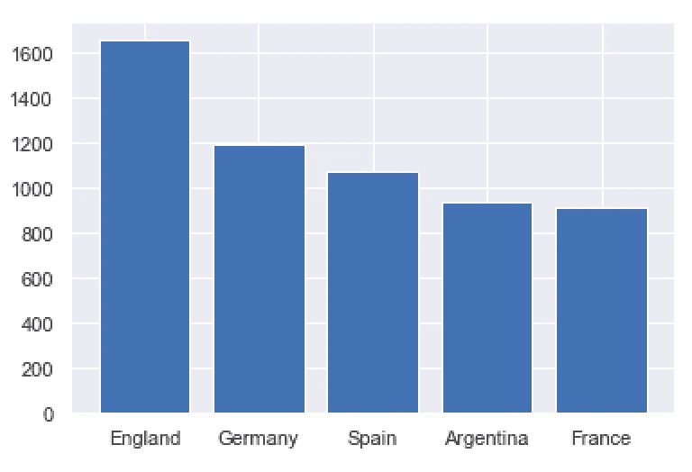

同样，我们可以定义一个函数来绘制任何分类列的最常见值:

```
def plot_most_common(category):
    bar_plot = dict(Counter(df[category].values).most_common(5))
    plt.bar(*zip(*bar_plot.items()))
    plt.show()
```

如果我们用‘Position’调用函数，我们得到:

```
plot_most_common('Position')
```

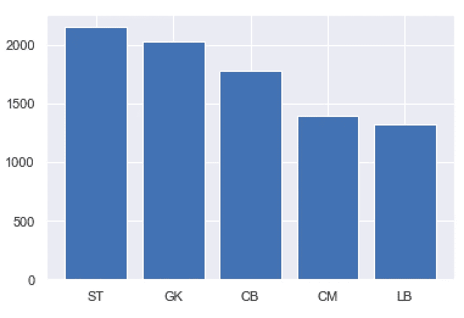

接下来，让我们将价值(球员的市场价值)和工资转换成可以在计算中使用的数值。首先，让我们截断“值”列中的字符串值，以便删除“欧元”和“M”。然后，我们可以将每个字符串转换为一个浮点并乘以 1e6:

```
value_list = []
for i in list(df['Value'].values):
    try:
        value_list.append(float(i)*1e6)
    except(ValueError):
        value_list.append(np.nan)
df['Value_numeric'] = value_list
```

我们可以对“工资”做同样的处理，但这里我们乘以 1e3:

```
wage_list = []
for i in list(df['Wage'].values):
    try:
        wage_list.append(float(i)*1e3)
    except(ValueError):
        wage_list.append(np.nan)
df['Wage_numeric'] = wage_list
```

我们还想将“年龄”列中的字符串值转换成整数:

```
df['Age'] = df['Age'].astype(int)
```

在这里，我们可以从数字列中生成一个热图，它将向我们显示每个变量与其他变量的相关性有多强。让我们过滤数据帧，使其仅包含数值，并从结果数据帧中生成热图:

```
numerical_columns = df[['Height_cm', 'Weight_kg', 'Value_numeric', 'Age', 'Wage_numeric']]sns.heatmap(numerical_columns.corr(), annot=True)
plt.show()
```

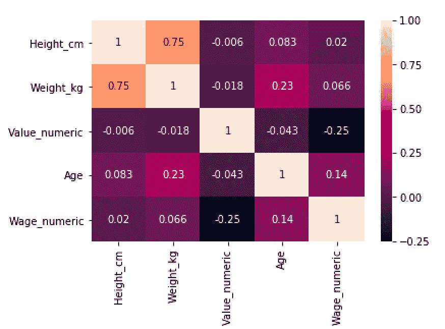

我们还可以使用盒状图来显示基于最小值、最大值、中值、第一个四分位数和第三个四分位数的数值分布。如果你对它们不熟悉，可以看看文章[了解盒子情节](/understanding-boxplots-5e2df7bcbd51)。

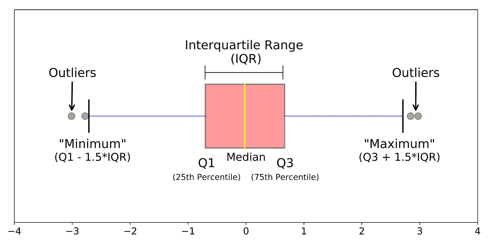

[Source](/understanding-boxplots-5e2df7bcbd51)

例如，英国、德国和西班牙的市场价值分布:

```
df = df[df['Nationality'].isin(['England', 'Germany', 'Spain'])]
sns.boxplot(x= df['Nationality'], y = df['Value_numeric'])
plt.show()
```

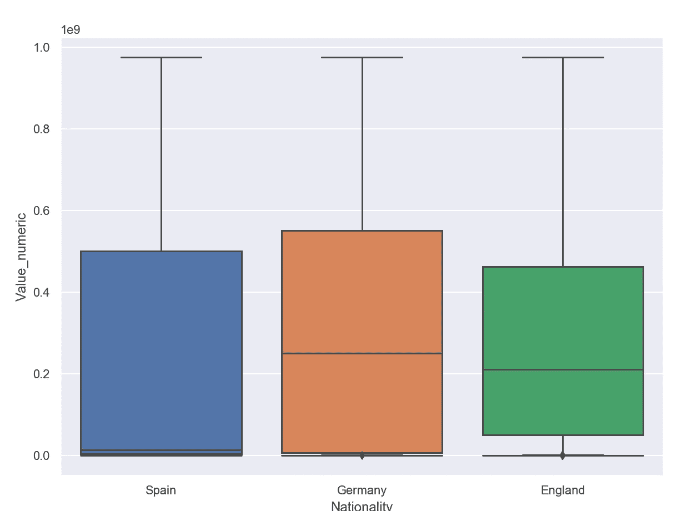

年龄分布:

```
sns.boxplot(x= df['Nationality'], y = df['Age'])
plt.show()
```

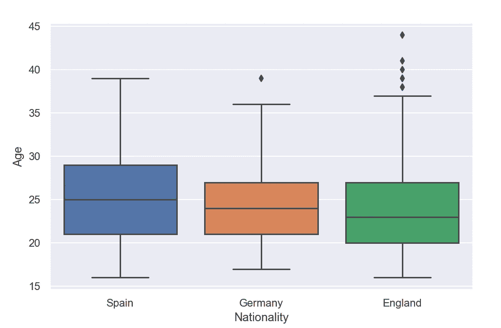

重量分布:

```
sns.boxplot(x= df['Nationality'], y = df['Weight_kg'])
plt.show()
```

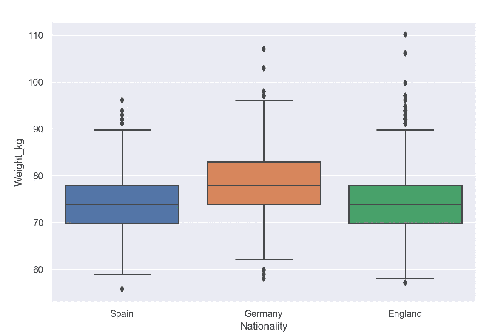

和高度:

```
sns.boxplot(x= df['Nationality'], y = df['Height_cm'])
plt.show()
```

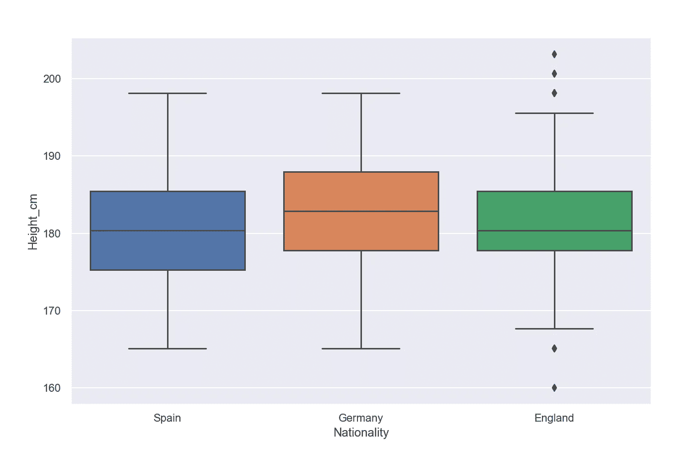

我就讲到这里，但是您可以随意使用数据并自己编码。这篇文章的代码可以在 [GitHub](https://github.com/spierre91/medium_code) 上找到。感谢您的阅读！