# 探索性数据分析——第一部分

> 原文：<https://towardsdatascience.com/exploratory-data-analysis-part-i-9825e658e668?source=collection_archive---------24----------------------->

在本文中，我们将了解如何用**熊猫**探索**数字数据**。


Source : [“Panda”](https://www.flickr.com/photos/61904084@N00/13917433335) by [thedailyenglishshow](https://www.flickr.com/photos/61904084@N00) is licensed under [CC BY 2.0](https://creativecommons.org/licenses/by/2.0/?ref=ccsearch&atype=rich)

**什么是数据分析中使用的数据集？**

数据分析中使用的数据集是某些数字或字符串或两者的组合，它们可能有也可能没有任何特定的顺序，我们需要从中预测未来可能发生的结果。

现在，当我们有了原始数据集，我们必须从中做出预测，几个问题将出现，以采取这样的决定。例如，如果我想在 5 年内投资获得最佳回报，我会首先研究公共和私营企业的几种投资方案并进行比较，联系企业的客户服务部门以消除我的疑虑，阅读其他客户的评论以更深入地了解他们，彻底检查他们的条款和条件以及更多此类调查。对于数据科学家来说，这些调查方法不过是“探索性数据分析”,同时处理这些原始数据并从中推断预测。

在开始探索性数据分析过程之前，需要了解以下重要问题:

*   我在给定的数据集中寻找的问题是什么
*   我的数据集包含哪种类型的数据
*   为了预测我的目标变量，需要在数据集中添加或删除哪些特征
*   是否存在任何缺失值，如果是，如何处理
*   如果有异常值，我们如何消除它们

在本文中，我们将只在一个**数字**数据集上探索 EDA 的过程。

*   让**读取**给定的数据集(使用`read_csv)`)，并考虑到要训练的给定数据集在，使用`head`方法查看前 5 行。csv 格式。

```
import pandas as pd
import numpy as np
df = pd.read_csv("train.csv")
df.head(5)
```

注意:如果原始数据由分隔符“；”分隔那么我们的命令将是:

`df = pd.readcsv(“train.csv”, sep = “;”)`

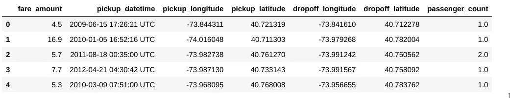

这里我们需要预测“票价金额”

我们使用了一个数据集，该数据集将根据在纽约市内行驶的距离来预测出租车的费用。`head()`和`tail()`函数返回数据集的第一个和最后一个观察值。

*   `df.shape()`可以获取数据集中的行数和列数。
*   `df.describe()`为我们提供每个变量数据集的平均值、标准偏差和其他特征。

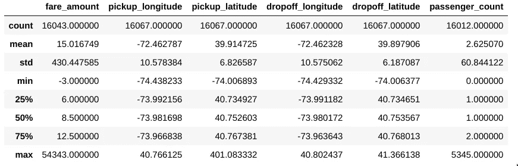

*   此处，我们的目标变量“票价 _ 金额”和其他变量(如“乘客 _ 数量”和“接送 _ 纬度”)的 75%和最大值之间存在显著的差异。这些值清楚地暗示了我们的数据集包含了异常值。
*   我们在这里也可以注意到，均值远高于变量“fare_amount”的中值。
*   `df.dtypes`给出了`df`数据帧中每个变量的数据类型。

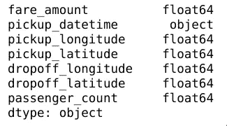

*   `df.info()`可以帮助我们查看是否有丢失的值

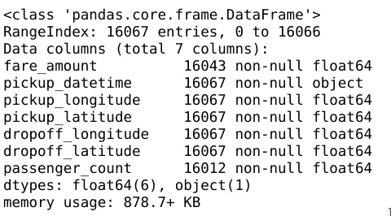

*   在我们的数据集中，可变列“fare_amount”和“passenger_count”包含缺失值。

我们的目标变量“票价金额”本质上是数字。

`missing_value = pd.DataFrame(df.isnull().sum())`

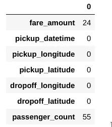

我们需要弥补我们缺失的价值观。但是在执行相同的操作之前，我们需要移除异常值。

**为什么我们要在缺失值插补之前移除异常值？**

因为缺失值插补有不同的方法；其中之一是用特定列的平均值、中值或众数替换该列的缺失值。现在，如果在执行插补过程时数据集包含这些异常值，那么丢失的值将被错误地替换。因此，我们需要去除异常值。

**异常值去除**

我们将继续为每个变量构建箱线图，以了解每个变量的异常值。

```
import seaborn as sns
import matplotlib.pyplot as plt
%matplotlib inline
sns.boxplot(df['passenger_count'])
```

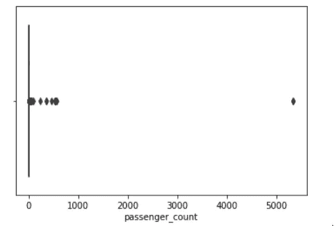

这里我们可以清楚地看到，有些数据点表明“乘客计数”超过 5000，我们将删除这些数据点。事实上，没有一辆出租车能够搭载超过 8 名乘客，因此，我们将删除那些值大于 8 的数据点，并对<1.

```
df=df.drop(((df[df['passenger_count']>8])).index,axis=0
df=df.drop(((df[df['passenger_count']<1])).index,axis=0)
df
```

Once the rows with outliers are deleted, we can once again check our boxplot.

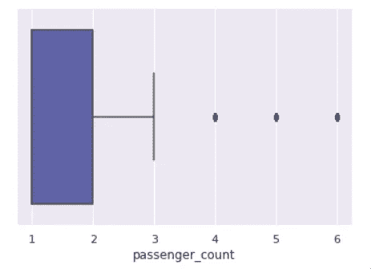

We also checked if any latitude or longitude is out of the range. If so, we have dropped it along with the outliers present in every column.

**进行排序**:

*   在这里，我们可以根据特定变量对数据框进行升序或降序排序。

```
df.sort_values(by='passenger_count', ascending =True).head(5)
df
```

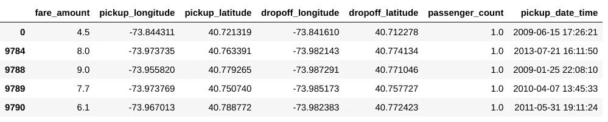

*   现在，如果我们需要对多列进行排序:

```
df.sort_values(by=['passenger_count','fare_amount'], ascending =[True,True] ).head(5)
```

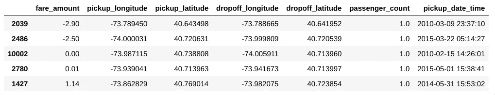

上面我们可以看到，我们的代码几乎相同，但输出是不同的。通过这种方式，我们可以获得所需的数据框架，以便对其进行更深入的分析。

*   现在，如果我需要知道当我的 passenger_count 为 1 或 2 时所有其他变量的平均值，我可以得到相同的结果:

```
df[df['passenger_count'] == 1].mean()
```

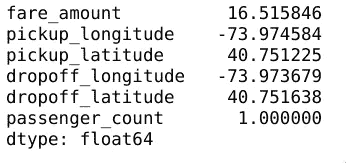

**缺失值分析**

*   现在，我们需要检查所有变量中缺失值的数量。

```
missing_value = pd.DataFrame(df.isnull().sum())
missing_value
```

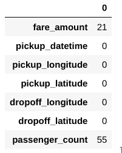

我一直认为重要的是估算缺失的值，而不是删除它们。在这里，我对每一列使用了“最频繁出现的数据”的方法来替换各自缺失的值。

```
imp = SimpleImputer(missing_values=np.nan, strategy=’most_frequent’)
train_data=pd.DataFrame(imp.fit_transform(df), columns=df.columns)
print(f’Row count after imputing missing values — {train_data.shape[0]}’)
```

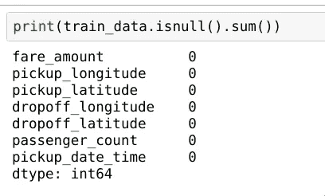

**通过图表检查变量之间的相关性**

检查任何变量之间是否高度相关是非常重要的。如果是这样，那么我们不应该考虑这些变量，而是在它们之间只选择一个变量，用于预测因变量所需的数据框。

`df.corr(method=’pearson’).style.format(“{:.2}”).background_gradient(cmap=plt.get_cmap(‘coolwarm’), axis=1)`

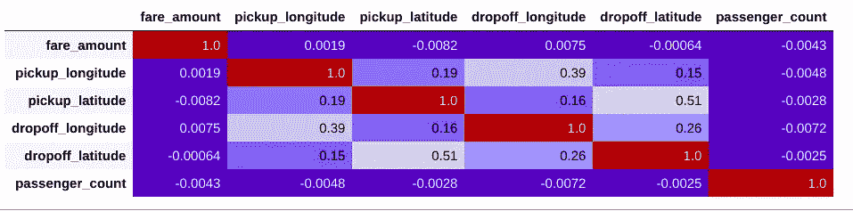

*   我们使用了 corr()函数和所有变量的图形表示来观察它们是否与数据集中的任何其他变量高度相关。

在清理和删除某些数据点之后，我们获得了所需的数据框，可以在此基础上进行更深入的分析。

*   这里，我们通过列联表比较两个变量:

```
pd.crosstab(df['passenger_count'], df['fare_amount'], normalize = True)
```

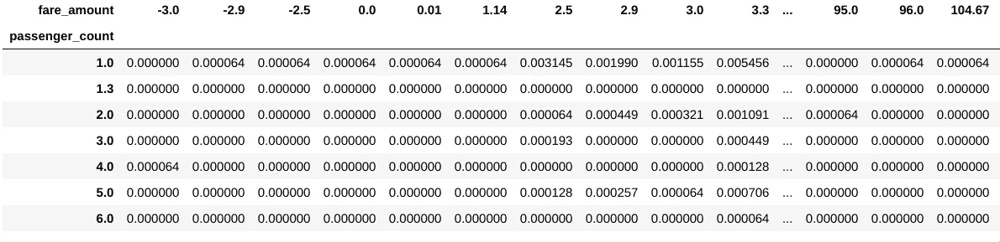

让我们来看看用纬度和经度衡量的特定地区的平均乘车人数:

```
df.pivot_table(['pickup_latitude', 'dropoff_latitude', 'pickup_longitude','dropoff_longitude'], ['passenger_count'], aggfunc='mean')
```

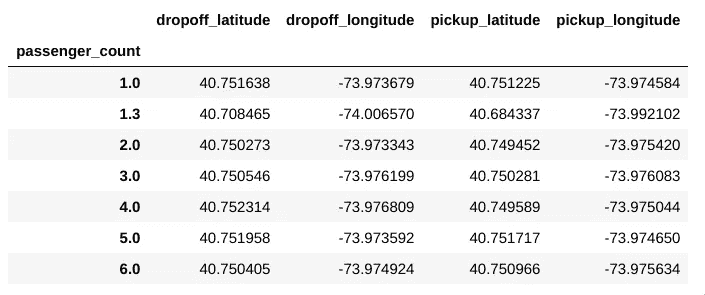

现在我们的数据集可以进行机器学习了！

类似地，您可以添加几个其他高级功能来从数据中推断出更好的洞察力。这只是分析任何数值数据集的一个基本方法。在下一篇文章中，我们将讨论如何在分类数据集上执行 EDA。