# 启动资金、投资和收购

> 原文：<https://towardsdatascience.com/exploratory-data-analysis-startup-funding-investments-and-acquisitions-4d7a19507cdf?source=collection_archive---------9----------------------->


Source: Pixabay

## 探索性数据分析

以下是我最近决定做的一个有趣的小数据分析项目，主要是作为练习 SQL 和做一点探索性数据分析(EDA)的一种方式。在我的互联网旅行中，我遇到了 [*模式分析*](https://modeanalytics.com) ，并看到他们有一个非常好的界面来编写 SQL 查询，以及可供选择的数据集(该界面被称为 ***模式工作室*** ，我非常确定数据保存在 ***PostgreSQL*** 数据库中)。另一个很棒的特性是你可以将 SQL 分析与 ***Python*** 笔记本集成在一起。我是这个的忠实粉丝，因为我正在努力寻找其他在线资源，在那里我可以很容易地访问一些免费的 SQL 数据库。

写这篇文章时，我有三个主要目标:

1.  ***练习我的 SQL 技能并实现一个有趣的迷你项目***
2.  ***概述一个数据分析项目的典型工作流程，着重于初始数据探索。(至少对我来说是典型的工作流程)。***
3.  ***为那些试图学习 SQL 或 Python 的人提供一个教程，并展示你可以从一点点 EDA 和一些相关问题中产生一些真正强大而有趣的见解。***

我真的很喜欢分析这个数据集，并且发现我探索得越多，我提出的问题就越多，但是为了保持这篇文章的相对简洁和正确，我将提出我想探索并获得一些见解的 **3** ***主要*** ***主题/问题(下)*** 。我鼓励任何跟随我的人提出他们自己的问题，因为有比我在这里讨论的更多的问题。

## 数据集和初始问题

我们今天要看的数据集是 **Crunchbase** 数据集。它包含了自 20 世纪初以来超过 40，000 家初创企业的融资、收购和投资信息。我将使用数据集的教程版本，据我所知，它们基本上是相同的，除了教程版本比原始版本稍短，并且一些列已被清理，这对我们来说是个好消息，因为我们不必花时间清理数据(然而，通常，这是任何分析中至关重要的一步，我建议熟悉清理不同类型的数据)。该数据库由三个表组成:

*   [***公司***](https://modeanalytics.com/crunchbase/tables/companies)
*   [***收购***](https://modeanalytics.com/crunchbase/tables/acquisitions)
*   [***投资***](https://modeanalytics.com/crunchbase/tables/investments)

我想探究的数据的主要方面是融资、投资和收购的趋势。更明确地说，我将提出 3 个一般性问题来尝试和回答。这样做将有助于我们集中分析，并使我们的最终目标更加清晰。

1.  ***按行业和国家划分的资助有哪些主要特点？***
2.  ***收购倾向于同行业内还是跨行业？即是否有纵向或横向整合的证据？***
3.  ***有没有投资泡沫的迹象？***

好了，我们已经提出了几个要探讨的问题，实际上我们可以在这里做一些分析。最初，我将查询数据库来回答这些问题，当然也是为了实际获取数据。我还将使用 Python 做一些进一步的分析和可视化。Mode 通过将我们的查询结果转换成 Python 对象，并允许我们从一个 notebook 实例访问它们，使得两者之间的切换非常无缝。为了获得数据的概述，我建议查看每个表的上面的链接。

# 探索性数据分析

## 提供资金

我将直接切入正题，看看我们能否回答第一个问题。嗯，我们可以把它分解一下，因为这个问题有几个部分。让我们先来看看平均资助金额、总资助金额和行业资助的公司数量，并将结果限定为前 10 名。

```
SELECT  category_code,
        COUNT(*) AS number_of_companies,
        AVG(funding_total_usd) AS avg_funding,
        SUM(funding_total_usd) AS total_funding
FROM tutorial.crunchbase_companies
WHERE funding_total_usd IS NOT NULL AND category_code IS NOT NULL
GROUP BY 1
ORDER BY 4 DESC
LIMIT 10;
```

这里的结果非常有趣，但也许并不出乎意料，因为获得最多资金的行业似乎都与技术相关，如生物技术/软件/电子商务等。在以下三个图表中出现的行业之间也有非常密切的相关性(这些图表都是使用 mode studio btw 制作的)。我在这篇文章的结尾提供了一个完整报告的链接，其中包含了那些想看的人的交互式图表。最高的平均资助额似乎出现在清洁技术领域，这与推动生产对环境负面影响较小的技术相一致。从表面上看，鉴于许多国家都有严格的碳排放目标，这是一个非常受欢迎的进展。

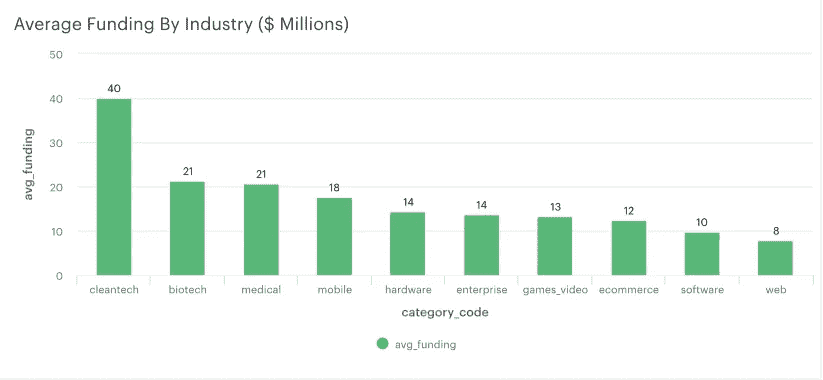

Figure 1: Average Funding By Industry

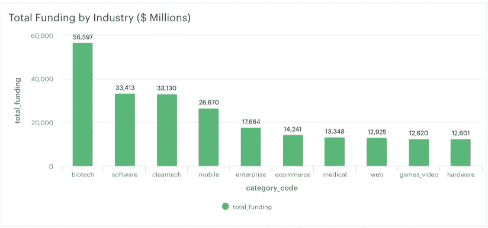

Figure 2: Total Funding By Industry

如果我们仔细研究一下，会得到什么样的见解？嗯，如果我们长期观察融资情况，我们会得出一个不同的结论。从图 3 中我们可以看出，从 2002 年到 2006 年，资金总额大幅增加，达到 80 亿美元左右的峰值。然而，2006 年后，该部门的资金大幅减少。这似乎是投资繁荣和萧条的标志，或者换句话说，是泡沫。在做了一点研究后，似乎有许多因素可能促成了这一繁荣，包括这一时期的税收减免和清洁技术贷款担保。还有一些因素可能导致清洁技术在随后几年的资金下降，如燃料价格下跌，当然还有始于 2007/2008 年的金融危机。这减少了投资清洁技术和燃料来源的资金激励，也可能导致投资者在当前经济环境下的不确定性。

好吧，这是分析的一个好的开始，似乎在回答问题 1 和问题 3 方面都有所进展。让我们看看我们还能从这些数据中收集到什么有趣的见解。

```
SELECT category_code,
       DATE_PART('year', first_funding_at::DATE) AS year,
       SUM(total_funding_amt) AS sum_funding_amt
FROM tutorial.crunchbase_companies
WHERE category_code = 'cleantech' AND first_funding_at IS NOT NULL 
GROUP BY 1,2
ORDER BY 2 ASC;
```

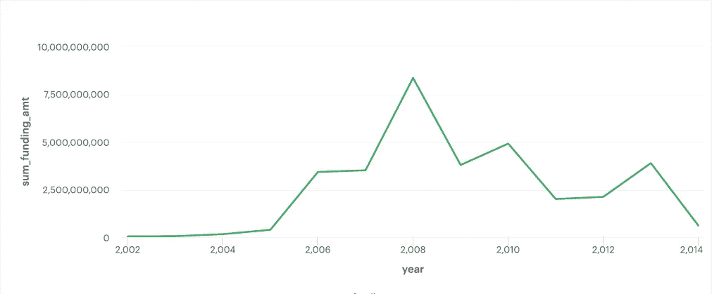

Figure 3: Total Funding in cleantech Sector

既然我们已经了解了一个特定的行业，不如我们来更全面地了解一下，看看这些年来所有行业中获得累计最高融资水平的公司，看看我们是否认识其中的任何一家。所以我敢肯定，你们大多数人都知道这些公司，比如脸书、Groupon、Twitter、威瑞森等等(图 4)。我们也可以看看排名前 10 的公司是在什么样的时间段得到资助的。他们是一次获得一次性付款，还是长期获得资助？我们可以通过简单地从**最后资助的 t 变量中减去**第一资助的 t 变量来得到天数差。我们还可以计算每个人获得的融资轮数，并以此计算每轮融资的平均水平。****

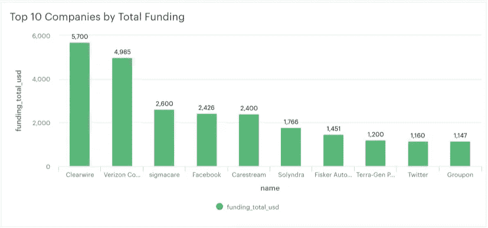

Figure 4: Top 10 Companies by Total Funding

```
SELECT  name,
        funding_total_usd,
        TO_DATE(first_funding_at, 'DD/MM/YY') AS first_month,
        TO_DATE(last_funding_at, 'DD/MM/YY') AS last_month,
        (TO_DATE(last_funding_at, 'DD/MM/YY') - TO_DATE(first_funding_at, 'DD/MM/YY')) AS days_difference,
        funding_rounds,
        funding_total_usd/funding_rounds AS funding_per_roundFROM tutorial.crunchbase_companies
WHERE funding_total_usd is NOT NULL
ORDER BY 2 DESC
LIMIT 10;
```

我们可以在下面的表 1 中看到这个查询的结果。这张表告诉了我们什么？看起来有 3 家公司，Sigmacare，Carestream 和 Terra-Gen Power 进行了首轮融资。前 10 名中的其余公司似乎已经获得了多轮融资，平均每轮融资 5。这些公司也在几年内获得了资助。除了只进行了一轮融资的 3 家公司之外，平均每轮融资约为 5.67 亿美元，这是一笔惊人的资金。相比之下，其他超过一轮融资的初创公司平均只有不到 800 万美元。

```
with t1 as (SELECT funding_total_usd/funding_rounds AS funding_per_round
FROM tutorial.crunchbase_companies
WHERE funding_rounds > 1)
SELECT AVG(funding_per_round) FROM t1;
```

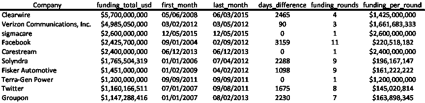

Table 1

我们还可以绘制资金的分布图，这将为我们提供资金数量的直观概览。出于绘图的目的，我已经删除了一些非常大的投资，包括数字，以便我们可以更好地可视化其余的数据(下面的 Python 代码)。平均值约为 1600 万美元，而中值为 500 万美元，这表明该样本中仍有显著的异常值。

```
fund_dist = fund_dist[fund_dist['funding_total_usd'] < 2.050000e+08]
plt.figure(figsize=(16,6))sns.distplot(fund_dist['funding_total_usd'], bins = 30)
```

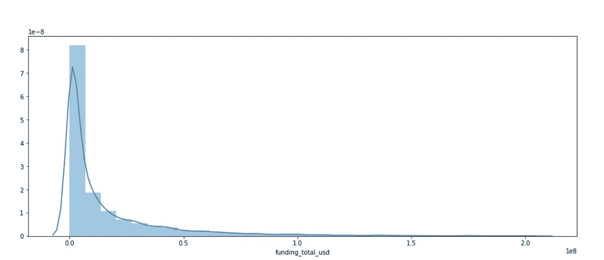

Figure X: Distribution of Funding Amount

好了，现在我们对融资数据有了一个相当好的概述，让我们看看一家公司收到的融资额和他们是否还存在之间是否有关系？用 Python 来看看吧。首先，我们来探讨一下公司的现状。下面的代码获取每个类别中公司的原始计数和百分比。绝大多数公司仍在运营(82%)，但也有 8%的公司在此期间已经关闭。查看表 3，我们可以看到最高平均融资水平来自 IPO(股票市场的首次公开发行),这很有趣，因为它是状态列中最不常见的类别。

```
datasets[3]['status'].value_counts()
datasets[3]['status'].value_counts(normalize = True)datasets[3].groupby('status')['funding_total_usd'].agg(['mean', 'sum'])
```

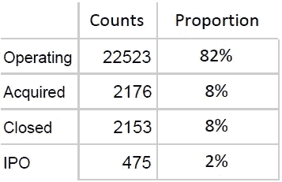

Table 2: Status Categories

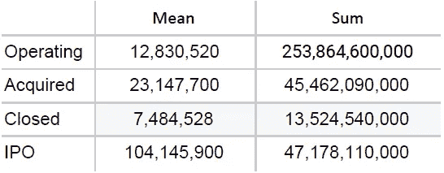

Table 3: Average and Total Funding by Status.

鉴于平均融资额最高的是 IPO，让我们快速浏览一下融资额最高的 10 家 IPO。这里又出现了一些熟悉的面孔，如威瑞森、脸书和特斯拉，它们都从 IPO 中获得了大量资金。我还计算了数据集中所有 IPO 产生的资金占总资金的比例，非常惊讶地发现前 2 名产生了总资金的 16%。当时显然有很多投资者对这些公司感兴趣。

```
datasets[3][datasets[3]['status'] == 'ipo'][['name', 'category_code', 'funding_total_usd']].sort_values(by = 'funding_total_usd', ascending=False)[:10]
```

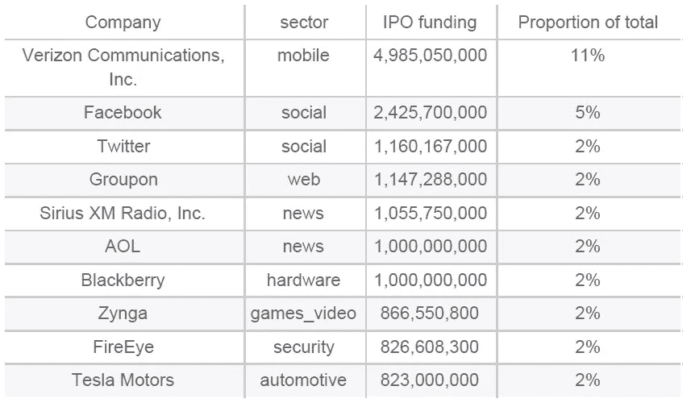

Table 5: Top 10 IPO’s

那么，对于仍在运营的公司和现在关闭的公司之间的区别，我们能说些什么呢？从上面的信息中，我们可以说，现在关闭的公司平均获得的资金更少，总的资金也更少。那么这仅仅是资金问题吗？大概不会。这些公司不再运营可能还有很多其他原因。我试图找出运营公司和非运营公司的特征之间的一些差异，比如它们获得的融资轮数以及它们运营的国家，但我真的没有发现任何明显的差异。不幸的是，我们似乎无法找到这个问题的确切答案。这实际上是非常重要的一点，

***利用现有的数据，并不总能找到你想要的答案。这是我们进行探索性数据分析的原因之一，因为它让我们能够找出我们有望找到答案的问题。***

对数据进行初步探索性分析是分析项目中非常重要的一步，因为它可以帮助制定现实的目标，也可以帮助分析师设定和管理对项目结果的预期。

在资金表中，我想看的最后一件事是整个美国资金的分布，因为我怀疑其中很大一部分在美国，特别是在加利福尼亚州。这是 Python 擅长的地方。我在以前的帖子中曾使用过*，这是另一个使用它的绝佳机会。下面是 Python 代码，用于从 mode 创建的对象中获取我们需要的数据，然后绘制一个漂亮的交互式 Chloropleth(我必须附加一个 PNG，因为 Plotly 的自由层有视图限制)。*

```
*import matplotlib.pyplot as plt
%matplotlib inline
from plotly.offline import download_plotlyjs, init_notebook_mode, plot, iplot
import plotly as py
import plotly.graph_objs as go
init_notebook_mode(connected=True) #do not miss this line
from plotly import tools comp_df = datasets[3] # object created by mode
temp_plot = comp_df[['funding_total_usd', 'country_code', 'state_code']].dropna()
grouped_data = temp_plot.groupby('state_code').sum().reset_index() data = [ dict(
 type='choropleth',
 locations = grouped_data['state_code'],
 autocolorscale = True,
 z = grouped_data['funding_total_usd'],
 locationmode = 'USA-states',
 marker = dict(
 line = dict (
 color = 'rgb(255,255,255)',
 width = 2
 )
 ),
 colorbar = dict(
 title = 'Millions USD'
 )
 ) ]
layout = dict(
        title = 'Total Funding for startups across the US',
        geo = dict(
            scope='usa',
            projection=dict( type='albers usa' ),
            showlakes = True,
            lakecolor = 'rgb(255, 255, 255)'),
             )
fig = go.Figure(data = data, layout = layout)
py.offline.iplot(fig)*
```

*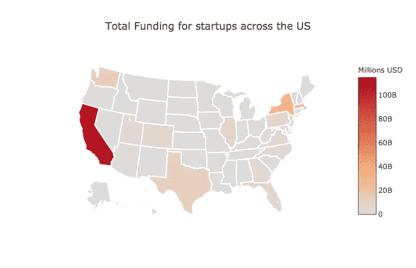*

*Figure 5: Funding across the US*

*看起来我的怀疑是正确的，最强烈的红色是在加利福尼亚州，表明最高水平的资金出现在那里，主要是因为硅谷的高科技公司密度高。在美国的其他地区，如纽约、马萨诸塞州和马里兰州，也有大量的资助。考虑到这些州有众多的大学和科技公司，这也不足为奇。既然我们已经看了美国，为什么我们不快速看一下资金的全球分布呢？(为了简洁起见，我将省略 python 代码，但它与上面的代码非常相似。)*

*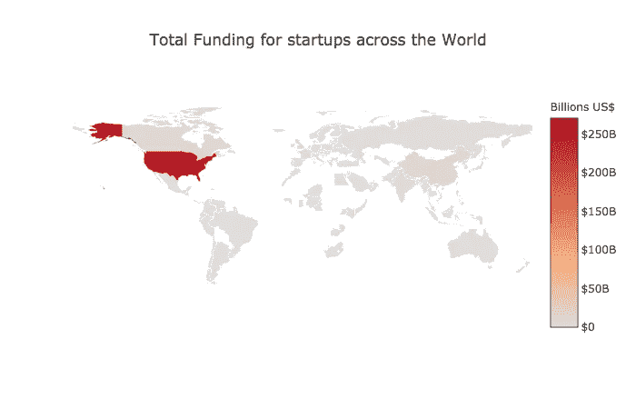*

*Figure 6: Funding across the world*

*同样，大部分资金位于美国，然而，中国、印度和英国也有大量资金，尽管从上面的图表中可能有点难以看出(这在我在底部链接的互动报告中更明显)。*

## *获得*

*我们已经花了相当多的时间来分析公司表，但是其他表呢？这些年来的收购情况如何？本节的主要目的是了解正在进行的收购的类型，即正在进行的收购是跨行业还是在同一行业内进行。这可以帮助我们了解横向和纵向[整合](https://www.investopedia.com/ask/answers/051315/what-difference-between-horizontal-integration-and-vertical-integration.asp)的水平(这些是竞争经济学中的重要概念)。我们可以从一些最大的收购开始，看看它们是在同一个行业还是不同的行业。这可以让我们对每个行业的集中度有一点了解。*

*我们可以做的第一件事是观察一段时间内收购数量的总体趋势，并检查数据集中最大的收购。这在 PostgreSQL 中相对简单。第一个查询非常简单，只返回按价格排序的前 10 项收购。第二个查询使用窗口函数返回每年的收购数量以及累计数量。*

```
*SELECT  company_name,
        company_category_code,
        acquirer_name,
        acquirer_category_code,
        acquired_year,
        price_amount
FROM tutorial.crunchbase_acquisitions
WHERE price_amount IS NOT NULL
ORDER BY price_amount DESC
LIMIT 10;------------------------------------------------------------------SELECT  acquired_year,
        AVG(price_amount),
        COUNT(*),
        SUM(COUNT(*)) OVER (ORDER BY acquired_year) AS total_count
FROM tutorial.crunchbase_acquisitions
WHERE price_amount IS NOT NULL AND acquired_year > 1995
GROUP BY 1
ORDER BY 1;*
```

*从总价排名前十的收购来看，似乎大多数收购是跨行业的，而不是同一行业内的。这表明，没有太多的横向整合，因为收购和被收购的公司往往处于不同的行业，至少对于最大的收购来说是这样。有趣的是，似乎有一些公关公司正在被其他公司收购(表 2)。这可能与品牌或公司试图改善自己的形象有关吗？我们还可以看到，几乎所有这些收购都是在过去 10 年中完成的，几乎所有的公司都被技术相关行业的公司收购了。这些观察结果与我们目前所看到的非常一致。*

*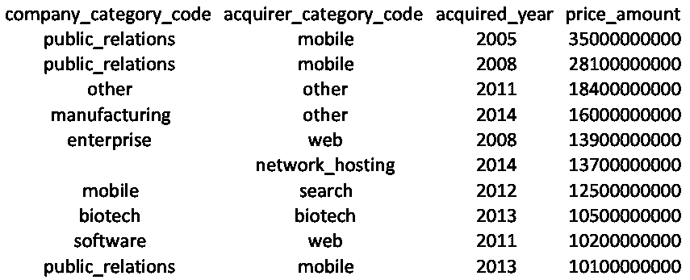*

*Table 6: Top 10 Acquisitions by Price ($)*

*下图对应于上面的第二个查询，并突出显示了从 2000 年到 2014 年(数据集中的最后一年)收购的激增。综上所述，这些行业显然存在大量的金融活动。总的来说，随着时间的推移，收购数量的增长相当不稳定，但从 2010 年起(除了 2013 年)，收购数量似乎呈下降趋势。有趣的是，尽管数字有所下降，但在同一时期，平均成本方面的收购规模一直在上升。换句话说，近年来出现了大规模收购的趋势。这是否意味着某些公司或行业垄断力量的增强？*

*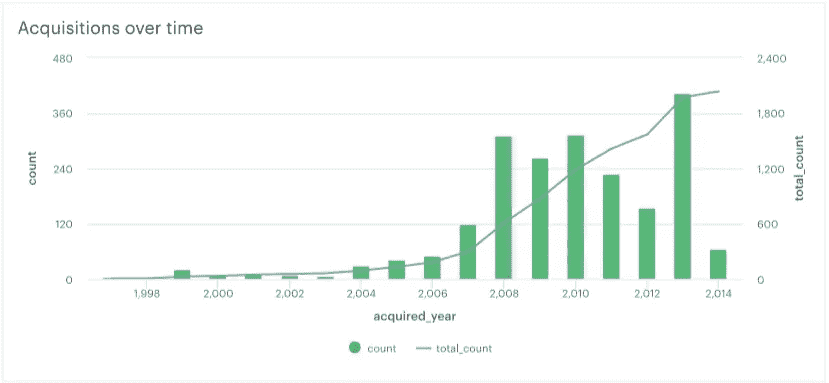*

*Figure 7: Acquisitions over time — number and amount paid*

## *投资*

*在这一部分，我想简要地看一下投资表。首先，我绘制了每笔投资筹集金额的分布图，让我们更好地了解数据的分布情况。图 9 显示了整个时间段内投资价值的直方图。从图中我们可以看到，大多数投资似乎在 1，200 万美元左右。也有一些异常值。让我们来看看哪些公司获得了巨额投资，以及这是哪一轮融资。结果显示，几乎所有最大的投资都是在 IPO 之后。这大概意味着投资是购买股票。*

```
*SELECT funding_round_type, raised_amount_usd
FROM tutorial.crunchbase_investments
WHERE funding_round_type IS NOT NULL AND raised_amount_usd IS NOT NULL
ORDER BY 2 DESC;------------------------------------------SELECT funding_round_type, COUNT(*)
FROM tutorial.crunchbase_investments
WHERE funding_round_type IS NOT NULL AND raised_amount_usd IS NOT NULL
GROUP BY 1
ORDER BY 2 DESC;-----------------------------------------SELECT company_name, company_category_code, investor_name, investor_category_code,
funding_round_type, raised_amount_usd, funded_at
FROM tutorial.crunchbase_investments
WHERE raised_amount_usd IS NOT NULL
ORDER BY 6 DESC LIMIT 15;*
```

*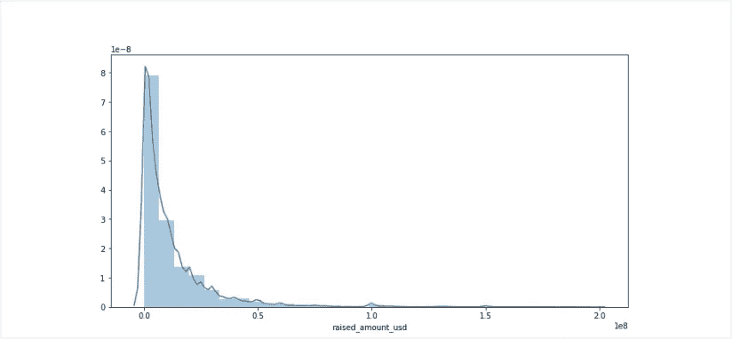*

*Figure 8*

*样本的其余部分呢？他们的资金来源是股权、债务还是天使投资者？按融资轮类型划分的投资总数如图 10 所示。首轮融资似乎是公司获得的最常见的融资类型，其次是风险资本和天使投资。顾名思义，A 轮融资是初创企业可以获得的首批融资之一。之后通常是 B 轮和 C 轮。事实上，首轮融资可能比后续融资更频繁，因为许多初创企业实际上并不成功，因此无法进入下一轮融资。请参见[此处](https://www.investopedia.com/articles/personal-finance/102015/series-b-c-funding-what-it-all-means-and-how-it-works.asp)了解融资轮类型的更深入的解释。*

*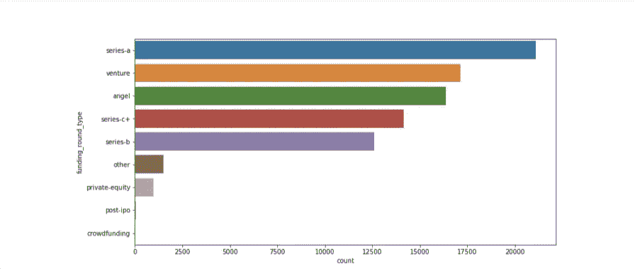*

*Figure 9*

```
*with t1 AS
  (SELECT company_name, investor_name,  funded_year ,investor_category_code,
          company_category_code,
          SUM(raised_amount_usd) AS total_raised,
          rank() OVER(PARTITION BY investor_category_code
                      ORDER BY SUM(raised_amount_usd) DESC) AS rank
   FROM tutorial.crunchbase_investments
   WHERE raised_amount_usd IS NOT NULL
     AND investor_category_code IS NOT NULL
   GROUP BY 1,
            2,
            3,
            4,
            5
   ORDER BY 5,
            3 DESC)
SELECT *
FROM t1
WHERE rank < 2
ORDER BY 6 DESC
LIMIT 15;*
```

*上面的查询显示了每个行业的最高投资以及哪个行业正在接受投资。出于展示数据的目的，我们仅选择了前 15 项投资。前 15 名主要是移动行业。大量资金涌入移动行业，这就引出了一个问题:这些资金是流向一家公司还是多家公司？为什么人们对这个行业如此感兴趣？经过进一步调查，我们发现 2008 年在 Clearwire 上有大量投资，这基本上就是我们在表 1 中看到的。为什么对 Clearwire 这么感兴趣？2008 年有许多公司投资 Clearwire，包括 Sprint Nextel、Google、Intel 和 Comcast 等，这些公司似乎被用来推出 4G 无线技术。*

*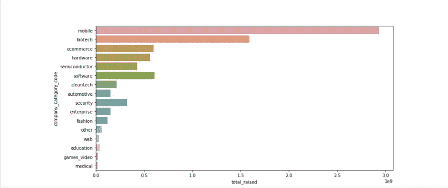*

*Figure 10*

## *主要要点*

*   *似乎没有证据表明*的横向整合，尤其是那些最大的收购。因此，没有明显的证据表明缺乏竞争。这当然不是最终的结论，因为一些行业可能已经集中了。这表明，至少它没有因为收购而变得更加集中。**
*   **似乎确实有更大规模收购的总趋势，这可能预示着公司垄断力量的增强。**
*   **我们确实发现了一些***投资泡沫的证据，特别是在清洁技术领域。有其他泡沫的证据吗？我会让你们自己去发现。*****
*   **大部分资金都流入了美国，尤其是流入了加州，鉴于近年来硅谷科技公司的激增，这确实是我们所期待的。**
*   **最高水平的资助主要集中在与技术相关的行业，如清洁技术、生物技术、移动等。**
*   **毫无疑问，产生最多资金的融资类型是 ***IPO*** *。***

**感谢大家的阅读，希望你们都觉得这很有趣，学到了一些东西，在下一个帖子里再见。**

**[***链接到报表模式分析***](https://modeanalytics.com/dfoly1/reports/c3fa07ec2bf4)**