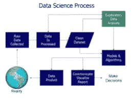
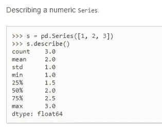
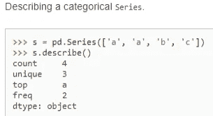
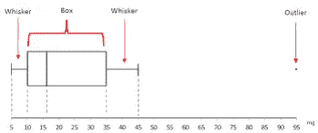
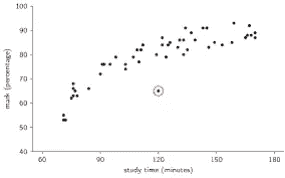
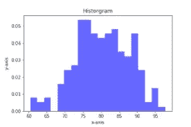
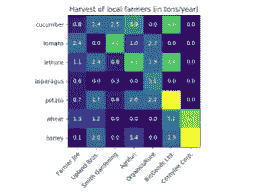
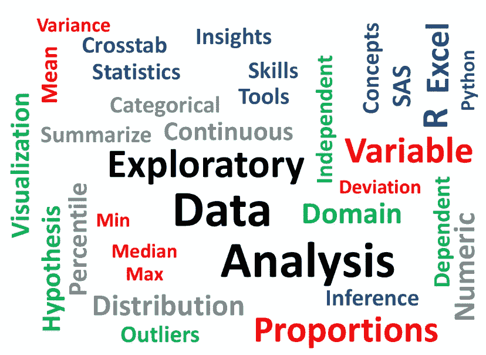

# 探索性数据分析……一个在数据科学项目中被忽视的话题

> 原文：<https://towardsdatascience.com/exploratory-data-analysis-topic-that-is-neglected-in-data-science-projects-9962ae078a56?source=collection_archive---------12----------------------->


**探索性数据分析**

作为探索性数据分析的一部分，我们将讨论以下主题:

*   **什么是探索性数据分析？**
*   **我们为什么要做 EDA？**
*   **EDA 有哪些步骤？**
*   **EDA 用的工具有哪些？**
*   **如果我们不做 EDA 会怎么样？**

**什么是探索性数据分析？**

**探索性数据分析(EDA)** 是由“**John Tukey**”**于 20 世纪 70 年代开发的数据分析过程的第一步。在统计学中，探索性数据分析是一种分析数据集以总结其主要特征的方法，通常采用可视化方法。从名字本身就可以知道，这是我们需要探索数据集的一个步骤。**

****例如**，你打算去一趟“ **X** 的地方。做决定前要做的事情:**

*   **你将在谷歌、Instagram、脸书和其他社交网站上探索该位置的所有地方、瀑布、徒步旅行、海滩和餐馆。**
*   **计算它是否在你的预算之内。**
*   **检查覆盖所有地方的时间。**
*   **旅行方式的类型。**

**同样，当你试图建立一个机器学习模型时，你需要非常确定你的数据是否有意义。探索性数据分析的主要目的是获得对数据的信心，从而准备好使用机器学习算法。**

****

****我们为什么要做 EDA？****

**探索性的数据分析是你跳到机器学习或数据建模之前至关重要的一步。通过这样做，您可以了解所选的特征是否足以建模，是否所有的特征都是必需的，是否有任何相关性，基于这些相关性我们可以返回到数据预处理步骤或继续建模。**

**一旦 **EDA** 完成并得出见解，其特征就可以用于监督和非监督机器学习建模。**

**在每个机器学习工作流程中，最后一步是向利益相关者报告或提供见解，作为一名数据科学家，你可以解释每一点代码，但你需要记住受众。完成 **EDA** 后，您将获得许多图表、热图、频率分布、图表、相关矩阵以及假设，通过这些图表，任何个人都可以了解您的数据是关于什么的，以及您从探索您的数据集中获得了什么见解。**

**我们有句谚语“一图胜千言”。**

**我想为 data scientist 修改为"**一个图值一千行**"**

**在我们的**旅行示例**中，我们对选定的地方进行了所有的探索，在此基础上，我们将获得计划旅行的信心，甚至与我们的朋友分享我们对该地方的见解，以便他们也能加入。**

****EDA 有哪些步骤？****

**进行探索性数据分析有许多步骤。我想就以下几个步骤进行讨论**

*   **数据描述**
*   **处理缺失数据**
*   **处理异常值**
*   **通过情节理解关系和新的见解**

****a)数据描述:****

**我们需要了解不同种类的数据和数据的其他统计数据，然后才能继续其他步骤。一个好的方法是从 python 中的 **describe()** 函数开始。在 Pandas 中，我们可以对数据框应用函数 describe，这有助于生成描述性统计数据，这些统计数据总结了数据集分布的集中趋势、分散性和形状，不包括" **NaN** "值。**

**对于数字数据，结果的索引将包括计数、平均值、标准差、最小值、最大值以及下限、50%和上限。默认情况下，下百分位是 25，上百分位是 75。50%与中位数相同。**

****

**对于对象数据(如字符串或时间戳)，结果的索引将包括计数、唯一、顶部和频率。顶部是最常见的值。Freq 是最常见的值频率。时间戳还包括第一项和最后一项。**

****

****b)处理缺失数据:****

**现实世界中的数据很少是干净的和同质的。由于多种原因，数据可能在数据提取或收集过程中丢失。缺少的值需要小心处理，因为它们会降低我们任何性能指标的质量。它还会导致错误的预测或分类，并且还会对所使用的任何给定模型造成高偏差。有几种处理缺失值的方法。然而，应该做什么的选择在很大程度上取决于我们的数据和缺失值的性质。以下是一些技巧:**

*   **删除空值或缺失值**
*   **填充缺失值**
*   **用 ML 算法预测缺失值**

**(i) **删除空值或缺失值:****

**这是处理缺失值的最快和最容易的步骤。不过一般不建议。这种方法降低了我们模型的质量，因为它减少了样本量，因为它通过删除任何变量缺失的所有其他观察值来工作。**

****Python 代码**:**

```
 dataset.dropna()
```

****(二)填补缺失值**:**

**这是处理缺失值的最常见方法。在此过程中，缺失值将被测试统计数据(如缺失值所属的特定特征的平均值、中值或众数)替换。**

****Python 代码:****

```
dataset[‘Column_name’]=dataset[‘Column_name’].fillna(mean_value).
```

****(三)用 ML 算法预测缺失值:****

**这是迄今为止处理缺失数据的最好和最有效的方法之一。根据缺失数据的类别，可以使用回归或分类模型来预测缺失数据。**

****c)处理异常值:****

**离群值是指与人群分离或不同的东西。异常值可能是数据收集过程中出现错误的结果，也可能只是数据中出现偏差的迹象。检测和处理异常值的一些方法:**

*   **箱形图**
*   **散点图**
*   **z 分数**
*   **IQR(四分位数间距)**

****(一)方框图:****

****

**箱线图是一种通过四分位数以图形方式描绘数字数据组的方法。该方框从数据的 Q1 值延伸到第三季度的四分位值，中间有一条线(Q2)。触须从框的边缘延伸出来，以显示数据的范围。离群点是那些超过胡须末端的点。箱线图显示了位置和分布的稳健度量，并提供了关于对称性和异常值的信息。**

****(二)散点图**:**

****

**散点图是一种数学图表，使用笛卡尔坐标来显示一组数据的两个变量的值。数据显示为点的集合，每个点的一个变量的值决定水平轴上的位置，另一个变量的值决定垂直轴上的位置。远离总体的点可以称为异常值。**

****(三)Z 值:****

**Z 得分是标准偏差的有符号数，通过它，观察值或数据点的值高于正在观察或测量的平均值。在计算 Z 值时，我们会重新调整数据的比例并使其居中，同时寻找离零太远的数据点。这些离零太远的数据点将被视为异常值。在大多数情况下，使用阈值 3 或-3，即如果 Z 分值分别大于或小于 3 或-3，则该数据点将被识别为异常值。**

****Python 代码:****

```
z = np.abs(stats.zscore(dataset))
```

**一旦我们得到 z 分数，我们就可以在此基础上拟合我们的数据集。**

****Python 代码:****

```
dataset = dataset[(z < 3).all(axis=1)]
```

****(四)IQR:****

**四分位数间距(IQR)是统计离差的一种度量，等于第 75 个和第 25 个百分位数之间的差值，或者上四分位数和下四分位数之间的差值。**

> **IQR = Q3 Q1。**

****Python 代码**:**

```
Q1 = dataset.quantile(0.25)Q3 = dataset.quantile(0.75)IQR = Q3 — Q1
```

**一旦我们得到了 IQR 分数，下面的代码将给出一个包含真值和假值的输出。值为假的数据点表示值有效，值为真表示存在异常值。**

****Python 代码:****

```
print(boston_df_o1 < (Q1–1.5 * IQR)) |(boston_df_o1 > (Q3 + 1.5 * IQR))
```

****d)通过情节理解关系和新见解:****

**通过可视化数据集，我们可以获得数据中的许多关系。让我们来看一些技巧，以便了解其中的洞见。**

*   **柱状图**
*   **热图**

****(一)直方图:****

****

**直方图是快速评估概率分布的一个很好的工具，几乎任何观众都能很容易理解。Python 为构建和绘制直方图提供了一些不同的选项。**

****(二)热图:****

****

**热图程序显示了定量变量在 2 个分类因素的所有组合中的分布。如果这两个因素中有一个代表时间，那么这个变量的演变就可以很容易地用图来观察。渐变色标用于表示定量变量的值。两个随机变量之间的相关性是一个从-1 到 0 到+1 的数字，分别表示强的反比关系、无关系和强的正关系。**

****EDA 用的工具有哪些？****

**有很多开源工具可以自动执行预测建模的步骤，如数据清理、数据可视化。其中一些也很受欢迎，如 Excel，Tableau，Qlikview，Weka 和许多除了编程之外的其他软件。**

**在编程上，我们可以用 Python，R，SAS 来完成 EDA。Python 中的一些重要包是:**

*   **熊猫**
*   **Numpy**
*   **Matplotlib**
*   **海生的**
*   **散景**

****

****如果我们不做 EDA 会怎么样？****

**许多数据科学家将急于进入机器学习阶段，有些人要么完全跳过探索过程，要么只做很少的工作。这是一个具有多种含义的错误，包括生成不准确的模型，生成准确的模型但基于错误的数据，在数据准备中没有创建正确类型的变量，以及由于仅在生成模型后才意识到数据可能有偏差，或有异常值，或有太多缺失值，或发现某些值不一致而导致资源使用效率低下。**

**在我们的**旅行示例**中，在没有对该地点进行任何预先探索的情况下，您将在旅行中面临许多问题，如方向、成本、旅行，这些都可以通过 EDA 来减少，这同样适用于机器学习问题。**

****谢谢****