# 探索性数据分析——用数据阐明故事

> 原文：<https://towardsdatascience.com/exploratory-data-analysis-unravelling-a-story-with-data-b01d70069035?source=collection_archive---------19----------------------->

## 在本文中，我们将探讨如何挖掘数据中隐藏的模式。

我发现 Kaggle 上的 ***房价竞赛是磨练你的分析技能并开始像数据科学家一样思考的好地方。对于一些背景，请务必阅读**艾姆斯住房数据文档**。这 80 个解释变量似乎是典型的影响房价的因素。然而，有些变量对销售价格的影响比其他变量更大，而有些变量对销售价格没有任何影响。***


我们将从研究整体数据开始，使用描述和信息方法。正如您将看到的，数据集有 80 列。要获得一些关于变量的上下文，请参考数据描述文件。目标变量是销售价格，其右偏如下:

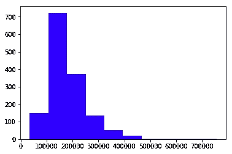

为了使数据正常化，我们需要取销售价格的对数。此外，Kaggle 问题度量表明了观察价格和预测价格之间的 RMSE。在记录日志时，我们注意到下图:

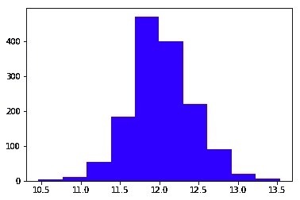

谈到变量，我们看到有数字和分类的特点。记下不同的特征是个好主意。

```
#Numeric Features
numeric_features = train.select_dtypes(include=[np.number])
numeric_features.dtypes#Categorical Features
categoricals = train.select_dtypes(exclude=[np.number])
print(categoricals.dtypes)
categoricals.describe()
```

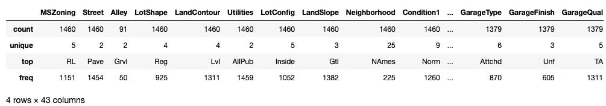

There are 43 categorical variables and the rest are numeric

我们将很快开始研究变量，但在此之前，我们应该看看训练数据集中的空值。

```
sns.heatmap(train.isnull(), cbar=False)
```

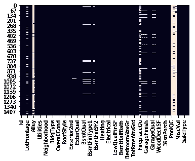

PoolQC and Alley have maximum missing values

请注意，PoolQC 数据可能会丢失，因为大多数房屋中可能没有游泳池。通过观察 PoolArea 列中的数据，可以再次检查这一事实。几乎所有列的值都为零。因此，我们可以有把握地假设，这两列对于预测销售价格可能不是很重要。

但是，如果您查看变量 alley，丢失的数据表示没有 Alley 访问。我们将很快看到小巷如何影响销售价格。

下图给出了所有变量之间的汇总关系:

```
corr = numeric_features.corr()
plt.subplots(figsize=(20, 9))
sns.heatmap(corr, square=True)
```

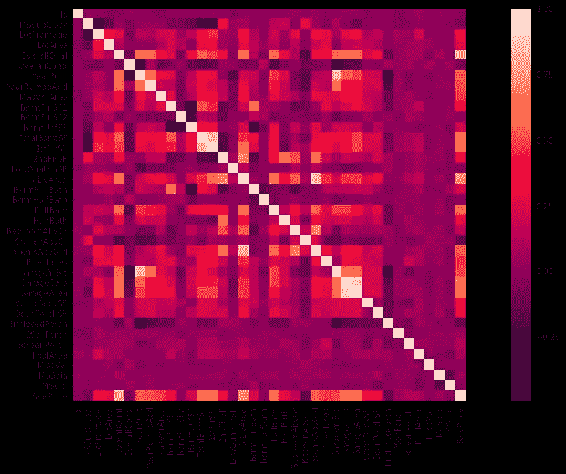

注意我们关于 PoolArea 的假设是如何被证明是正确的。与销售价格的相关性实际上几乎为零！

MSSubclass 实际上是一个分类变量，但是因为分类是数字，所以它被错误地标记为数字。如果有人不仔细阅读数据描述文本，就很容易忽略这一事实！

此外，一些变量似乎显示多重共线性，即，相互关联(用白色方块表示)。

```
**TotRoomsAbvGrd & GrLivArea**- Generally a big house will have a bigger living room and more number of rooms, hence data seems consistent**GarageArea & GarageCars**- This sounds logical, more garage area will translate to more car capacity, and vice versa**1stFloorSF & TotalBsmtSF**- Ideally basement will be the same size as 1st floor, and the reverse is also true in most cases.**GarageYrBlt & YearBuilt**- Building a garage will depend on the house being built, but not vice versa! Hence this warrants some investigation!
```

在绘制 year build 与 GarageYrBlt 的散点图时，请注意，在某些情况下，year build 大于 GarageYrBlt！这显然是数据输入错误。

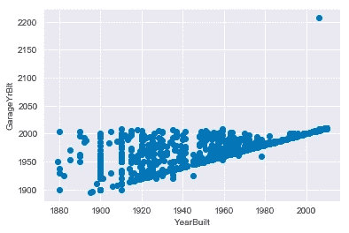

我们将在特征工程中处理时间变量。

转到其他变量，我实际上绘制了每一个变量，以检查分布情况以及它们如何影响销售价格。建议检查哪些是影响销售价格的最重要的变量。最重要的变量是(忽略销售价格):

```
print(corr[‘SalePrice’].sort_values(ascending=False)[:5],’\n’)SalePrice      1.000000
OverallQual    0.790982
GrLivArea      0.708624
GarageCars     0.640409
GarageArea     0.623431
```

在绘制 GrLivArea 对销售价格的对数时，我发现:

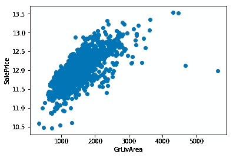

总的来说，它显示出增加的趋势，但是明显存在一些异常值，在继续进行数据训练之前必须去除这些异常值。

如果不好好研究数据，就不可能找到异常值，因此，尽管很乏味，我还是建议在为机器学习准备数据之前探索每一个变量。

我们已经停在可变的巷子里做进一步的调查。让我们看看它是否影响销售价格。在绘制小巷与销售价格的箱线图时，我们发现:

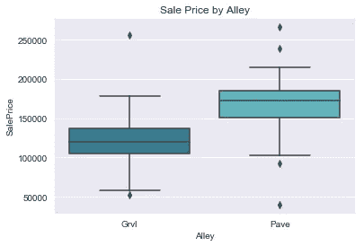

看起来，铺设的小巷肯定比碎石路要价更高。因此，没有小巷通道的房子可能会比碎石房价格更低。这绝对是一个重要的专栏，您会希望保留它。

同样，在探索分类变量时，您会发现许多变量的数据受一个类别支配。例如，在用计数图检查组合数据(训练+测试)中外部类型的优势时，我发现:

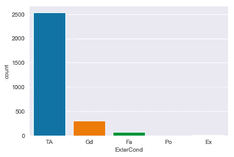

根据数据描述，大多数房屋都有“TA”，这意味着典型条件。现在绘制一个 ExterCond 与销售价格的箱线图，我们得到下图:

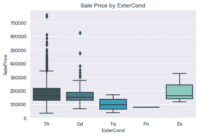

从该图可以清楚地看出，“TA”、“Gd”和“Ex”房屋最终具有相似的销售价格，这意味着它们并没有真正影响我们的目标变量。这听起来合乎逻辑。我们听说过影响销售价格的外部材料的现状吗？

但是我们确实经历了位置对房价的影响，这一点在下图中得到证实:

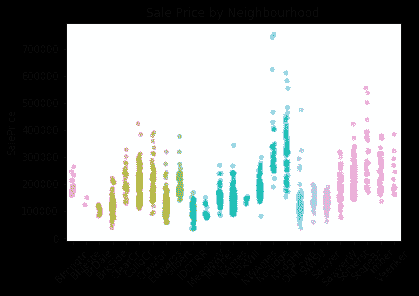

总之，在接近 EDA 时，一个人需要的基本行为品质是好奇心。发现空值、异常值或不相关的特征只是这种质量的结果。本文旨在开始思考过程，这将使你成为一名成功的数据科学家。

请继续关注我关于数据争论/特征工程以及最终机器学习的下一篇博客。