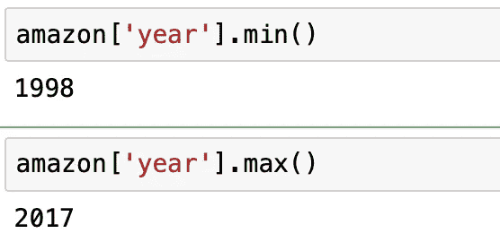

# 使用 Pandas 进行探索性数据分析

> 原文：<https://towardsdatascience.com/exploratory-data-analysis-using-pandas-4f97de631456?source=collection_archive---------22----------------------->


Image by Author

> 在本文中，我们将重点关注'**巴西亚马逊森林火灾数据集'**，并使用`*Pandas*`库执行一些基本分析，使用`*Matplotlib*` 和`*Seaborn*` 库可视化数据。

andas 是 Python 中最强大的工具，它允许我们对数据集做任何事情，例如分析数据、组织、清理、排序、过滤、聚合、计算等等！，这使得数据分析非常容易。


Pandas — Python’s most powerful library for Data Analysis…[Image by Author]

在这篇文章中，我们将回顾“亚马逊火灾数据集”*(从 Kaggle.com 下载)*，并探索 pandas 的功能，通过做一些练习，然后使用 python 的可视化库可视化数据，这些功能将帮助我们进行探索性数据分析(EDA)。

首先，我们来深入挖掘一下我们的 **Kaggle 数据集** - *巴西森林火灾* (amazon.csv)，你可以在这里下载[。](https://www.kaggle.com/gustavomodelli/forest-fires-in-brazil)

对于那些不了解 Kaggle.com 的人，让我给你们一些建议..

> Kaggle 是一个最受数据科学家和机器学习者欢迎的在线社区，他们可以参加分析比赛，建立预测模型，并且是用户寻找有趣数据集的好地方。我们可以找到各种数据，包括图像数据集、CSV、时间序列数据集等。，可免费下载。

**这个数据集是关于什么的？**

该数据集包含 10 年的数据，其中包含了 1998 年至 2017 年期间亚马逊雨林(巴西各州)发生的**起森林火灾的总数**。

亚马逊地区幅员辽阔，横跨八个快速发展的国家:巴西、玻利维亚、秘鲁、厄瓜多尔、哥伦比亚、委内瑞拉、圭亚那、苏里南和法属圭亚那。**亚马逊森林的大部分包含在巴西境内，其中 60%是雨林。**


Amazon rainforest wildfires[Image by Author]

现在，让我们开始我们的熊猫练习来探索这个数据集并得出一些见解。

让我们遵循以下步骤:

*   首先，我们将导入所有需要的 python 库。
*   从 kaggle 下载数据集，保存到我们的桌面，并使用 python 将其提取到 Jupyter 笔记本。
*   分析几个问题，将数据可视化。

在导入我们的库之前，让我们使用 *pip install* 命令将它们安装到我们的 python Jupyter 笔记本或任何其他我们进行编码的 python 接口中。

```
Pandas     : pip install pandas
Numpy      : pip install numpy
Matplotlib : pip install matplotlib
Seaborn    : pip install seaborn
```

让我们使用 pandas 读取 csv 文件，并将其保存到数据帧中


现在，让我们快速检查数据集的前 10 行


> ***数据集描述:***

*   **第 1 栏-【年份】:森林火灾发生的**年
*   **第 2 列-“州”:**巴西州
*   **第 3 栏-【月份】:森林火灾发生的**月份
*   **第 4 栏-"数字":**报告的森林火灾数量
*   **第 5 栏-“日期”:**报告森林火灾的日期

方法为我们提供了数据集的快速概览，如行和列的总数、数据类型和空值的数量(如果有的话)


> 从上面的输出可以清楚地看到，我们总共有 6454 行(包括标题)，5 列，没有空字段(这对于我们的分析来说是一个好兆头*🙂*)

让我们使用`describe()` 方法来看看关于我们的数据集(数值)的统计摘要


> ***数据清理:***

清理数据是第一步，也是最重要的一步，因为它可以确保数据质量，为可视化做好准备。经过全面检查后，我们从上面的数据集中看到，浮点型的“**数字**”列(报告的森林火灾数量)具有小数点值，例如 *18.566、14.59、11.068……*，这意味着该值没有四舍五入，对于报告的森林火灾数量没有任何意义。因此，让我们使用 round 函数清理这些数据，并将数据存储回我们的主数据帧。

首先让我们对样本数据应用`round()`函数…

**之前:**


**之后:**


现在我们将使用 numpy 对整个数据集应用`round()`方法


‘number’ column values are now corrected

**练习 1 :** 检查“年”列的最小值和最大值



**练习 2 :** 找出“**英亩**州”的火灾总数，并基于每个“年度”可视化数据

在开始这个练习之前，我想深入了解 Pandas 中一个叫做'**布尔索引'**的重要概念，它将在处理基于数据实际值的数据子集时非常有帮助。

> ***布尔索引:***

顾名思义，当我们希望根据某些条件从数据帧中提取数据子集时，就会使用布尔索引。我们还可以有多个条件，这些条件可以分组放在括号中，并应用于数据帧。

让我们看看下面的例子，看看熊猫布尔索引是如何工作的。在我们的示例中，我们将使用雇员及其工资的数据框架:

```
import pandas as pd
df = pd.DataFrame({'EmployeeName':  ['John','Sam','Sara','Nick','Bob','Julie'],
                   'Salary':[5000,8000,7000,10000,3000,5000]})
```


我们来查一下哪个员工的工资是 **5000** 。首先，我们将执行矢量化布尔运算，生成一个布尔序列:

```
salary_bool = df['Salary'] == 5000
```


现在，我们可以使用这个序列来索引整个数据帧，留下只对应于薪水为 **5000** 的雇员的行

```
salary_5000 = df[salary_bool] 
*# that means it returns only those rows which are 'True'*
```


我希望现在你对布尔索引的工作原理有所了解..你可以在这里 *找到更多关于布尔索引教程* [*的信息..*](https://appdividend.com/2019/01/25/pandas-boolean-indexing-example-python-tutorial/)

现在，让我们开始我们的实际练习，即找出“英亩”州的森林火灾总数:


从上面的输出可以清楚地看到,“Acre”州报告的火灾总数为 **18463** 。是的，这个第一次太难理解了:)。所以让我来破解这段代码，一步一步解释。

**步骤 1 :** 让我们使用布尔索引来仅获取‘Acre’状态子集，并将其分配给名为‘Amazon _ Acre’的变量

```
amazon_acre = amazon['state'] == 'Acre' 
```

“amazon_acre”将根据我们的条件为我们生成一个序列，显示每行的真和假。

**第 2 步:**让我们使用这个系列来索引整个数据集，并将其分配给名为“amazon_acre_data”的变量

```
amazon_acre_data = amazon[amazon_acre] # total 239 entries
```


First five rows of amazon_acre_data

**第 3 步:**接下来，我们只显示上面数据集中的“数字”列

`amazon_acre_number = amazon_acre_data['number']` #这将只显示‘数字’列值。

**第四步:**现在我们可以使用`sum()`函数对`amazon_acre_number` 变量求火灾总数。


给你。！！当我们第一次试验数据时，打破代码总是一个最佳实践。但是，最终为了获得更好的编程技能，我们应该致力于减少代码行。

现在让我们使用`groupby()`方法在“年”列上得到每年的火灾总数。


在这里的输出中，我们看到“year”被标记为索引，“number”被标记为列。为了使数据可视化更加简单，我们可以使用`reset_index()`方法将索引作为列来处理。


**上述数据集的可视化:**


Importing libraries

> ***Matplotlib****是 python 的数据可视化库，可以让我们将数据可视化，对于简单的情节非常容易上手。Matplotlib 由几个图组成，如线形图、条形图、散点图、直方图等。，推荐你去探索官方 Matplotlib* [*网页*](https://matplotlib.org/) *了解更多信息。*
> 
> ***Seaborn*** *是 python 最流行的统计可视化库，构建在 Matplotlib 之上。查看 seaborn 官方* [*网页*](https://seaborn.pydata.org/introduction.html) *了解所有不同类型的 seaborn 地块。*

让我们使用`matplotlib`和`seaborn(barplot)`来可视化“英亩火灾年份”数据集


More number of fires are reported in 2002[Image by Author]

***注意:*** *plt.figure()创建一个 figure 对象，我们这里用来自定义图表的大小。*

**练习 3 :** 找出所有州的火灾总数

为此，让我们使用“州”栏上的`groupby()`,找出火灾总数。


Image by Author

从上图可以明显看出，大多数森林火灾发生在马托格罗索州，其次是帕莱巴州和圣保罗州。

**练习 4 :** 找出 2017 年的火灾总数，并根据每个“月”可视化数据


Image by Author

练习 5 : 找出火灾发生的平均次数


练习 6 : 找出“十二月”月份发生火灾的州名


这就是这篇文章的全部内容…你现在应该对 pandas、matplotlib 和 seaborn 有了很好的了解，并且知道如何使用它们进行数据准备和数据可视化。

嗯，谢谢你看我的第一篇文章:)。我希望这篇文章对你有用，如果你有任何问题，请随时在下面的评论区发表评论，并给我一些建议和意见🙂