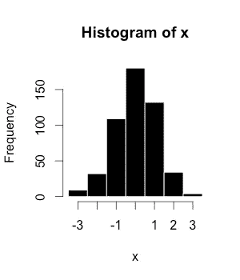
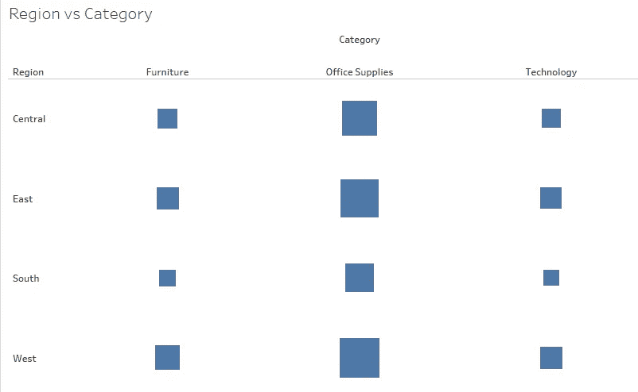
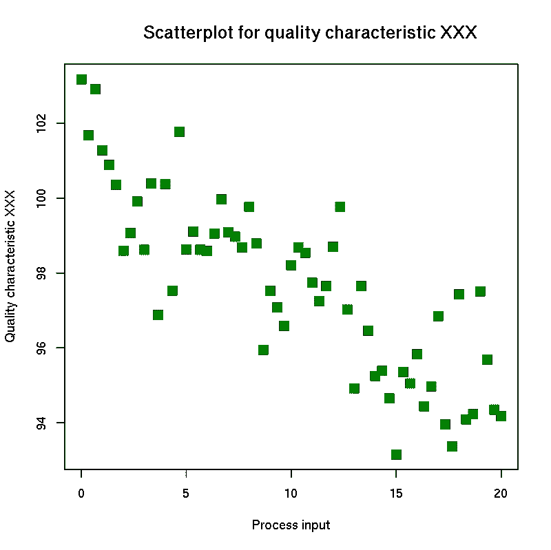
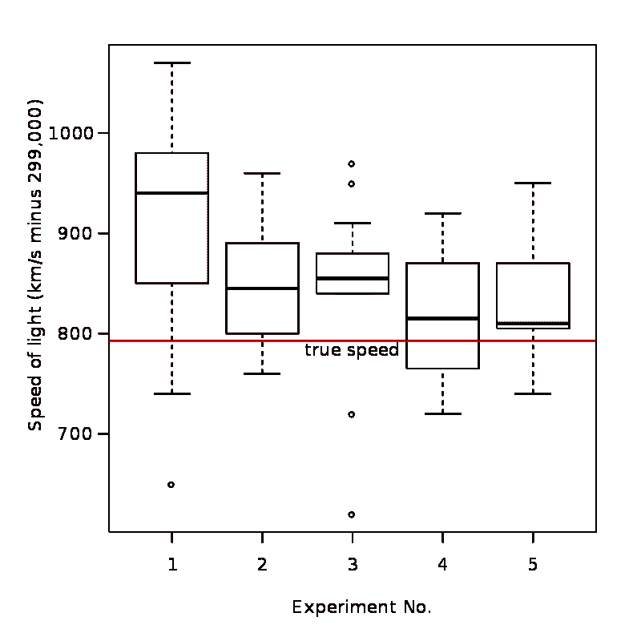

# 探索性数据分析(可视化)

> 原文：<https://towardsdatascience.com/exploratory-data-analysis-visual-790990f64c7c?source=collection_archive---------18----------------------->

Visuals, graphs and more visuals!

继我之前关于进行探索性数据分析时要做的计算的[帖子](/exploratory-data-analysis-non-visual-9225f55e9d89)之后，在这篇博文中，我将讨论如何使用 visual 来更好地探索我们的数据。

这里重申一下，做好 EDA 的两个主要好处是:

1.  对数据质量有很好的理解。我们需要高质量的数据来建立好的模型。我告诉我的大多数学生和实习生，数据从来都不是干净的。我们只能让它达到我们可以使用的质量水平。
2.  快速了解项目。了解监督学习的潜在驱动因素或可能的模式。这些见解可以立竿见影，从其他利益相关者那里获得更多的认同。

**假设:**在这个讨论中，我假设读者对变量有一些背景知识(理解什么是分类变量或连续变量)和基本的汇总统计，如均值、中值、众数和统计分布。

在数据的可视化探索中，我们关注两件事:

1 —一个*单变量*的值分布。

2—*两个变量*之间的关系。

**1 —单个变量的值分布**

**分类变量**

为了探究分类变量，我们可以绘制一个频率条形图。

Created from Tableau Public (Superstore.xls)

因此，当我们探索单个分类变量时，我们会寻找以下内容:

a.最受欢迎和最不受欢迎的类别是什么？

b.有没有不希望出现的值？

c.某些类别出现的频率是否低于/高于预期？

d.有没有不应该存在的分类值？

这些问题旨在检查数据质量，以及数据是否能够“可信”地反映现实。

**连续变量**

Source: Wikipedia

直方图是我用来理解连续变量分布的直观工具。在试图创建直方图之前，需要首先对连续变量进行分箱(即创建箱)。例如，年龄是连续的，我们可以将其分为 0–5、5–10、10–15……一旦我们将其分类，我们就可以绘制该分类中潜在价值的频率。

宁滨实际上是一门艺术和科学，如果你不仔细设置垃圾桶的宽度，你可能会错过重要的信息。例如，当仓宽度较小时，分布可能显示为双峰(2 个或更多个模式)，但是当仓宽度较大时，它变成单峰。因此，仔细选择你的箱子宽度，最好从较小的箱子宽度开始。

从视觉上看，我们正在寻找偏斜度和峰度。偏斜度非常重要，尤其是当您打算将其用作回归模型的要素或目标时，因为假设要素和目标呈正态分布，以获得系数/参数的蓝色(最佳线性无偏估计)。绘制直方图可以更好地规划以后的数据清理。

**2 —两个变量之间的关系**

**绝对与绝对**

为了理解两个分类变量之间的关系，即哪些独特的组具有最大的大小，我们可以使用热图，其中每个分类变量作为行和列，每个组的频率由矩形或正方形的大小表示。下面的例子:

Created from Tableau Public (Superstore.xls)

您询问的关于热图的问题类似于您询问的关于频率条形图的问题(如上所述)。这是为了了解不同分类值的相互作用，以及所呈现的数字是否有意义，如果没有意义，其原因是什么，以及原因是否合理。

通常，通过提出正确的问题并将其与预期相匹配，可以获得更多的非数据发现，如营销活动何时进行，以及谁是上个月的目标市场等。你可以从中发现很多关于你的业务。

**连续 vs 连续**

Source: Wikipedia

散点图是观察两个连续变量之间关系的很好的可视化工具。你要寻找的是数据点在平面/图形中的位置。例如，你问的问题是:

a.数据点在二维平面上是如何分布的？它们是否形成一种模式/线条？

b.这两个连续变量之间有什么样的关系？积极还是消极？线性还是非线性(二次或三次)？

c.它们有集群/组吗？它们是截然不同、相距甚远还是非常接近？这些集群有什么特点？

毫无疑问，我们可以使用相关性来找出两个连续变量是正相关还是负相关，但如果不看散点图，它永远不会揭示关系的全部细节。

散点图的另一个优点是它允许我们人类消化大量的数据。假设用于创建上述散点图的数据又增加了 5000 个观察值，因此我们在上述散点图中添加了另外 5000 个数据点。我们中的大多数人仍然能够辨别两个连续变量之间是否存在关系，以及这两个变量之间的关系。

**连续与分类**

Source: Wikipedia

为了查看连续变量和分类变量之间的关系，我们有盒图来帮助我们。可以提出的问题有:

a.哪个类别的均值/中值最高？

b.哪一类是正态分布，哪一类不是？

c.哪一类的范围和分布更广？

d.哪个类别有异常值？

e.每个类别的分布(左偏或右偏)？

通过大量的实践，盒状图变得更容易阅读和解释，因此对于那些刚开始的人来说，这是一个需要克服的小障碍。阅读和解释更具挑战性的箱线图是那些具有许多独特分类值的箱线图。这是箱线图变宽的地方，并且很难在两个分类值/组之间进行比较。建议使用过滤器使箱线图“更小”,以便于比较。

**结论**

写这两篇关于探索性数据分析(EDA)、[非可视化](/exploratory-data-analysis-non-visual-9225f55e9d89)和可视化的帖子的目的，是为了帮助任何希望在 EDA 方面做得更好的人，以便他们可以建立对他们的组织有用的健壮的机器学习模型。

我希望这篇文章对你有用。也欢迎反馈，因为我希望改进我自己的 EDA 过程。

祝所有读者有一个有趣的数据科学/人工智能学习之旅。请访问我的[其他博客文章](http://koopingshung.com/blog)和 [LinkedIn 个人资料](https://www.linkedin.com/in/koopingshung/)。谢谢大家！

**补充说明:**我已经建立了自己的网站，作为我 2020 年新年计划的一部分，最新消息请访问[这里](http://koopingshung.com)。感谢支持！