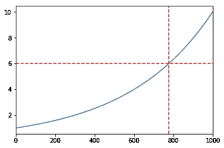
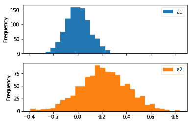

# 熊猫的探索性数据分析

> 原文：<https://towardsdatascience.com/exploratory-data-analysis-with-pandas-508a5e8a5964?source=collection_archive---------8----------------------->


*Pandas provides high-performance, easy-to-use data structures and data analysis tools for the Python*

作为一名数据科学家，我每天都使用 pandas，我总是对它的众多功能感到惊讶。探索性数据分析是一种分析数据集以总结其主要特征的方法，通常采用可视化方法。*许多复杂的可视化可以用熊猫来实现，通常不需要导入其他库。要运行示例，请下载本* [*Jupyter 笔记本。*](https://romanorac.github.io/assets/notebooks/2019-11-13-5-lesser-known-pandas-tricks-part-2.ipynb)

> 探索性数据分析是一种分析数据集以总结其主要特征的方法，通常采用可视化方法

**这里有几个你可能会感兴趣的链接:**

```
- [Labeling and Data Engineering for Conversational AI and Analytics](https://www.humanfirst.ai/)- [Data Science for Business Leaders](https://imp.i115008.net/c/2402645/880006/11298) [Course]- [Intro to Machine Learning with PyTorch](https://imp.i115008.net/c/2402645/788201/11298) [Course]- [Become a Growth Product Manager](https://imp.i115008.net/c/2402645/803127/11298) [Course]- [Deep Learning (Adaptive Computation and ML series)](https://amzn.to/3ncTG7D) [Ebook]- [Free skill tests for Data Scientists & Machine Learning Engineers](https://aigents.co/skills)
```

*上面的一些链接是附属链接，如果你通过它们购买，我会赚取佣金。请记住，我链接课程是因为它们的质量，而不是因为我从你的购买中获得的佣金。*

要升级您的熊猫游戏，请参见:

[](https://medium.com/@romanorac/pandas-data-analysis-series-b8cec5b38b22) [## 熊猫数据分析系列

### 从提示和技巧，如何不指南到与大数据分析相关的提示，熊猫文章的精选列表。

medium.com](https://medium.com/@romanorac/pandas-data-analysis-series-b8cec5b38b22) 

# 设置

让我们创建一个有 5 列 1000 行的熊猫数据帧:

*   a1 和 a2 具有从正态(高斯)分布中抽取的随机样本，
*   a3 具有从一组(0，1，2，3，4)中随机分布的整数，
*   y1 具有在从 0 到 1 的对数标度上均匀间隔的数字，
*   y2 从一组(0，1)中随机分配整数。

```
mu1, sigma1 **=** 0, 0.1
mu2, sigma2 **=** 0.2, 0.2
n **=** 1000df **=** pd**.**DataFrame(
    {
        "a1": pd**.**np**.**random**.**normal(mu1, sigma1, n),
        "a2": pd**.**np**.**random**.**normal(mu2, sigma2, n),
        "a3": pd**.**np**.**random**.**randint(0, 5, n),
        "y1": pd**.**np**.**logspace(0, 1, num**=**n),
        "y2": pd**.**np**.**random**.**randint(0, 2, n),
    }
)
```

有机器学习背景的读者会认可其中 a1、a2、a3 代表属性，y1、y2 代表目标变量的记法。简而言之，机器学习算法试图在属性中找到模式，并使用它们来预测看不见的目标变量——但这不是这篇博客文章的主要焦点。我们在数据帧中有两个目标变量(y1 和 y2 )(一个二进制变量和一个连续变量)的原因是为了使示例更容易理解。

我们重置索引，将索引列添加到数据帧中，以枚举行。

```
df**.**reset_index(inplace**=**True)
```


# 1.打印自定义

当我第一次开始使用熊猫时，绘图功能似乎很笨拙。我在这一点上大错特错，因为 pandas 公开了完整的 matplotlib 功能。

# 1.1 定制输出轴

Pandas plot 函数返回 matplotlib.axes.Axes 或它们的 numpy . n array，这样我们可以额外定制我们的绘图。在下面的示例中，我们向熊猫线图添加了一条水平红线和一条垂直红线。如果我们需要:

*   将平均线添加到直方图中，
*   在图上标出重要的一点等。

```
ax **=** df**.**y1**.**plot()
ax**.**axhline(6, color**=**"red", linestyle**=**"--")
ax**.**axvline(775, color**=**"red", linestyle**=**"--")
```



# 1.2 自定义输入轴

Pandas plot 函数也接受输入的轴参数。这使我们能够定制我们喜欢的情节。在下面的例子中，我们用不同类型的图创建了一个 2×2 的网格。

```
fig, ax **=** mpl**.**pyplot**.**subplots(2, 2, figsize**=**(14,7))
df**.**plot(x**=**"index", y**=**"y1", ax**=**ax[0, 0])
df**.**plot**.**scatter(x**=**"index", y**=**"y2", ax**=**ax[0, 1])
df**.**plot**.**scatter(x**=**"index", y**=**"a3", ax**=**ax[1, 0])
df**.**plot(x**=**"index", y**=**"a1", ax**=**ax[1, 1])
```


# 2.直方图

直方图是数字数据分布的精确表示。它是对连续变量概率分布的估计，由卡尔·皮尔逊[【1】](https://en.wikipedia.org/wiki/Histogram)首先提出。

# 2.1 堆叠直方图

Pandas 使我们能够通过一次函数调用，在一个直方图上比较多个变量的分布。

```
df[["a1", "a2"]]**.**plot(bins**=**30, kind**=**"hist")
```


为了创建两个独立的图，我们设置了`subplots=True`。

```
df[["a1", "a2"]]**.**plot(bins**=**30, kind**=**"hist", subplots**=**True)
```



# 2.2 概率密度函数

概率密度函数(PDF)是一个函数，其在可能值集合中任何给定样本的值可以被解释为随机变量的值等于该样本[【2】](https://en.wikipedia.org/wiki/Probability_density_function)的相对可能性。换句话说，在随机变量的任何特定抽取中，两个不同样本的 PDF 值可用于推断随机变量与一个样本相比更有可能等于另一个样本。

请注意，在 pandas 中，有一个`density=1`参数，我们可以将其传递给`hist`函数，但使用它，我们不会得到 PDF，因为 y 轴不在从 0 到 1 的范围内，正如下面的图中所示。其原因在 [numpy 文档](https://docs.scipy.org/doc/numpy/reference/generated/numpy.histogram.html)中有解释:“注意，直方图值的总和将不等于 1，除非选择了宽度一致的条块；它不是一个概率质量函数。”。

```
df**.**a1**.**hist(bins**=**30, density**=**1)
```


为了计算一个变量的 PDF，我们使用一个`hist`函数的`weights`参数。我们可以在下图中观察到，y 轴的最大值小于 1。

```
weights **=** pd**.**np**.**ones_like(df**.**a1**.**values) **/** len(df**.**a1**.**values)
df**.**a1**.**hist(bins**=**30, weights**=**weights)
```


# 2.3 累积分布函数

累积直方图是一种映射，它计算直到指定条柱为止的所有条柱中的累积观察次数。

让我们为 a1 列制作一个累积直方图。我们可以在下图中观察到，大约有 500 个数据点的 x 小于或等于 0.0。

```
df**.**a1**.**hist(bins**=**30, cumulative**=**True)
```


归一化的累积直方图就是统计学中我们所说的累积分布函数(CDF)。CDF 是变量取值小于或等于 x 的概率。在下面的示例中，x <= 0.0 的概率为 0.5，x <= 0.2 的概率约为 0.98。请注意，`densitiy=1`参数对累积直方图起着预期的作用。

```
df**.**a1**.**hist(bins**=**30, cumulative**=**True, density**=**1)
```


# 3.单独组的图

Pandas 使我们能够可视化由指定列的值分隔的数据。按某些列分隔数据并观察分布中的差异是探索性数据分析中的常见步骤。让我们用 y2 列来分隔 a1 和 a2 列的分布，并绘制直方图。

```
df[['a1', 'a2']]**.**hist(by**=**df**.**y2)
```


由于数据是随机生成的，因此分离的分布之间没有太大差异。

我们可以对线图做同样的处理。

```
df[['a1', 'a2']]**.**plot(by**=**df**.**y2, subplots**=**True)
```


# 4.虚拟变量

一些机器学习算法不能处理多元属性，比如我们例子中的 a3 列。a3 列有 5 个不同的值(0、1、2、3、4 和 5)。要将一个多变量属性转换为多个二进制属性，我们可以对列进行二进制化，这样我们可以得到 5 个值为 0 和 1 的属性。

让我们看看下面的例子。a3 列的前三行的值为 2。所以 a3_2 属性的前三行标记为 1，其他所有属性都为 0。a3 中第四行的值为 3，因此 a3_3 为 1，其他所有行为 0，以此类推。

```
df**.**a3**.**head()
```


```
df_a4_dummy **=** pd**.**get_dummies(df**.**a3, prefix**=**'a3_')
df_a4_dummy.head()
```


`get_dummies`功能还使我们能够删除第一列，这样我们就不会存储多余的信息。当 a3_1，a3_2，a3_3，a3_4 都是 0 时，我们可以假设 a3_0 应该是 1，我们不需要存储它。

```
pd**.**get_dummies(df**.**a3, prefix**=**'a3_', drop_first**=**True)**.**head()
```


现在我们已经二进制化了 a3 列，让我们将它从 DataFrame 中移除，并向它添加二进制化的属性。

```
df **=** df**.**drop('a3', axis**=**1)df **=** pd**.**concat([df, df_a4_dummy], axis**=**1)
```


# 5.安装线路

有时我们想用一条直线来比较某个分布。确定月销售增长是否高于线性增长。当我们观察到我们的数据是线性的，我们可以预测未来的值。

Pandas(在 numpy 的帮助下)使我们能够对数据进行线性拟合。这是机器学习中的线性回归算法，尽量使直线与数据点的垂直距离尽可能小。这被称为“拟合数据线”

下图显示了 y1 柱。让我们画一条与 y1 列的数据点非常匹配的直线。

```
df**.**plot**.**scatter(x**=**'index', y**=**'y1', s**=**1)
```


下面的代码计算线性方程的最小二乘解。我们感兴趣的函数的输出是最小二乘解。

```
df['ones'] **=** pd**.**np**.**ones(len(df))
m, c **=** pd**.**np**.**linalg**.**lstsq(df[['index', 'ones']], df['y1'], rcond**=**None)[0]
```

一条线的方程是`y = m * x + c`。让我们用这个等式来计算最接近`y1`线的`y`线的值。

```
df['y'] **=** df['index']**.**apply(**lambda** x: x ***** m **+** c)df[['y', 'y1']]**.**plot()
```


# 在你走之前

在[推特](https://twitter.com/romanorac)上关注我，在那里我定期[发关于数据科学和机器学习的](https://twitter.com/romanorac/status/1328952374447267843)推特。

