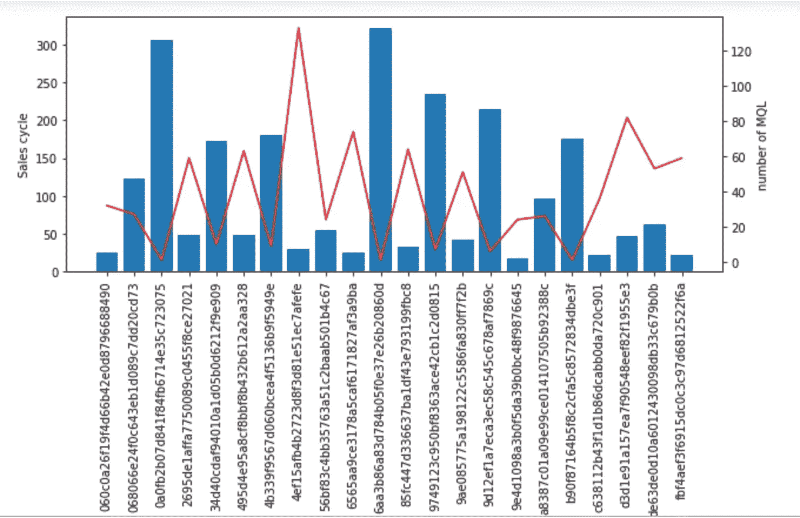

# B2B 营销中的 Python 探索性数据分析

> 原文：<https://towardsdatascience.com/exploratory-data-analysis-with-python-in-b2b-marketing-3e4b2b230a50?source=collection_archive---------7----------------------->

## 使用数据可视化深入研究 B2B 营销


这个项目的重点是使用 Python 对 B2B 营销进行探索性数据分析(EDA)。我们将使用 Olist 的数据作为例子，Olist 是一个连接巴西中小企业和顶级市场的电子商务平台。除了提供方法和代码，我还想讨论 B2B 营销的基础，以及这些来自 EDA 的见解如何帮助 Olist 做出更好的营销决策。 [*我的 GitHub 上提供了所有的 Python 代码。*](https://github.com/Fumanguyen/EDA-Python-B2B-Marketing)

# 介绍

Olist 是一个连接中小型企业和巴西市场的平台(Extra、Shoptime、Walmart、Submarino、。并帮助商家在这些市场销售。与一些国家不同，巴西快速增长的电子商务领域是由一些大型市场主导的，而不是由少数几个市场主导的(如美国的亚马逊和易趣)。因此，商家有动力在多个市场经营以最大化他们的收入。人力资源的限制是主要的棘手问题，商家希望使用 Olist 来管理其在不同市场的销售渠道，并简化库存管理和订单执行流程。


Olist’s business model

通过这种 B2B2C 模式，Olist 的营销团队有两个主要目标:

*   从卖家方面来说，他们想增加使用 Olist 平台的商家数量。
*   从买方来看，他们希望最大限度地提高这些市场上商家的电子商务销售额。

这个分析的范围更多地集中在 Olist 的卖方(B2B)方面。有了给定的数据集，我将进行**探索性数据分析(EDA)** ，这可以为 Olist 的 B2B 营销团队带来一些有用的见解。

B2B 的营销和销售流程:


B2B Marketing Funnel

# **数据特征**

数据集是从 Kaggle 获得的。你可以在这里下载[。](https://www.kaggle.com/olistbr/marketing-funnel-olist)

*   第一个数据集有 4 个变量，8000 个数据点。这些变量包括 MQL 标识(市场营销合格销售线索)、首次联系日期、获取销售线索的登录页面以及销售线索来源(将销售线索带到登录页面的渠道)。


*   第二个数据集包含 842 个观察值和 14 个变量。每个观察都是 Olist 的一个成功交易，它由商家的 mql_id、seller_id(在 Olist 平台中使用)、sdr_id 和 sr_id(负责该交易的销售开发代表和销售代表)、won_date、业务部门、lead_type、lead _ behaviour _ profile、business_type、declared_monthly_revenue 组成。其中，5 个变量的空值过多，无法为分析带来价值。


*   第三个数据集:通过 Kaggle，Olist 也捐赠了他们关于需求方的数据集。我们将利用这一点向 Olist 营销人员通报销售人员的表现，从而帮助他们改进 B2B 营销流程。

# **探索性数据分析**

**MQL 数量:**MQL 数据提供时间为 2017 年 7 月至 2018 年 6 月，而韩元 MQL 数据提供时间为 2018 年 1 月至 2018 年 12 月。2017 年，Olist 营销团队产生的 MQLs 约为 400 MQLs/月。2018 年，他们将这一数字提升至每月 1000–1400 条线索。关于韩元 MQL，其峰值出现在 2018 年 5 月，有 200 个韩元机会。

```
#Figure 1
num_mql = mql.set_index(pd.to_datetime(mql[‘first_contact_date’]))
num_mql = num_mql.groupby(pd.Grouper(freq = “M”)).count().drop(axis =1, columns = [‘first_contact_date’,“landing_page_id”, “origin”])num_won = close.set_index(pd.to_datetime(close[“won_date”]))num_won = num_won.groupby(pd.Grouper(freq = “M”)).count().drop(axis = 1, columns = [“seller_id”, “sdr_id”, “sr_id”,“business_segment”, “lead_type”, “lead_behaviour_profile”, “has_company”, “has_gtin”, “average_stock”, “business_type”,“declared_product_catalog_size”,
 “declared_monthly_revenue”, “won_date”])plt.figure(figsize = (8,6))
plt.plot(num_mql.index, num_mql, "-", label = "number of MQL")
plt.plot(num_won.index, num_won, "-", label = "number of won MQL")
plt.legend()
plt.title("Number of MQL", size = 15)
plt.savefig("NumMQL.png")
```


FIGURE 1

**渠道:**MQLs 大部分来自 organic_search 渠道，其次是直接流量和社交。Other、other _ publicities、referral 和 display 是给 Olist 带来最少 MQLs 的来源。有机搜索 MQL 在 2018–02 年显著增加，之后有所下降。这可能是大型活动/公关活动的结果。

```
#Figure 2
mql_origin = mql.groupby(‘origin’).agg({‘mql_id’:”count”});print(mql_origin)origin = list(mql_origin.index)plt.figure(figsize = (10,8))
fancy_plot = plt.subplot()
for i in origin:
  channel = mql[mql[‘origin’] == i]
  channel = channel.set_index(pd.to_datetime(channel[‘first_contact_date’]))
  channel_agg = channel.groupby(pd.Grouper(freq = “M”)).count().drop(axis = 1, columns =[“first_contact_date”, 
 “landing_page_id”, “origin”])
  fancy_plot.plot(channel_agg.index, channel_agg, “-o”, label = i)
fancy_plot.legend()
plt.title(‘Number of MQL by channels overtime’, size = 15)
plt.savefig(“channel-mql.png”)
```


FIGURE 2

这些通道的转换率各不相同。Organic_search、付费 _search 和直接流量是享有最高转化率的来源(分别为 12.5%、11.5%和 11%)。邮件、其他 _ 公众号和社交的转化率最低(分别为 3%、5%、5.5%)。这意味着 SEO 和 Google Adwords 是 Olist 最有效的营销渠道。这一结果似乎与说明 B2B 公司最有效营销渠道的几项调查有关。

[](https://www.bizible.com/blog/b2b-industry-analysis-best-marketing-channels) [## 以下是对最有效的 B2B 营销渠道的行业分析[2017 年更新数据]

### 2015 年，我们发布了首份管道营销状况报告，并分享了我们对管道营销人员如何…

www.bizible.com](https://www.bizible.com/blog/b2b-industry-analysis-best-marketing-channels) 

```
#Figure 3
origin_lost = data.groupby([‘origin’, ‘lost’]).count().drop(axis = 1, columns =[‘first_contact_date’,’landing_page_id’,
 “seller_id”, “sdr_id”, “sr_id”, “won_date”,
 “business_segment”, “lead_type”, “lead_behaviour_profile”,
 “has_company”, “has_gtin”, “average_stock”, “business_type”,
 “declared_product_catalog_size”, “declared_monthly_revenue”])percentage = []
for i in origin:
 pct = origin_lost.loc[i].loc[False][0]/(origin_lost.loc[i].loc[True][0]+origin_lost.loc[i].loc[False][0])
 percentage.append(pct)plt.figure(figsize = (6,4))
plt.bar(origin, percentage)
plt.xticks(rotation = 90)
plt.ylabel(‘won rate’)
plt.savefig(“won-rate.png”)
```


FIGURE 3: Won rate by channels

# 登录页面

Olist 使用了 495 个登录页面来捕获 mql。尽管销售团队负责将 MQL 转化为成功机会，但营销团队可以通过在登录页面上提供相关信息和优势，从漏斗顶部影响这种可能性。从上面的图 4 中可以看出，有 2 个登录页面拥有非常高的 mql 数量(大约 800 个 mql)以及非常高的赢得率(大约 20%)，这意味着从这些登录页面获取的 mql 中有 20%成为了 Olist 的卖家。

```
#Figure 4
mql_lp = mql.groupby(‘landing_page_id’).agg({‘mql_id’:”count”})
mql_lp = mql_lp[mql_lp[‘mql_id’] > 30]data_lp = pd.merge(data, mql_lp, how = “inner”, left_on = “landing_page_id”, right_index = True)
lp_lost = data_lp.groupby([‘landing_page_id’, ‘lost’]).agg({‘mql_id_x’:”count”})landing_page = list(mql_lp.index)
percentage_lp = []
landing_page_2 = []
Num_mql = []
for i in landing_page:
 if mql_lp.loc[i][0] == lp_lost.loc[i].loc[True][0]:
 lp_lost.drop([i])
 else:
 pct = lp_lost.loc[i].loc[False][0]/(lp_lost.loc[i].loc[True][0]+lp_lost.loc[i].loc[False][0])
 percentage_lp.append(pct)
 landing_page_2.append(i)
 Num_mql.append(mql_lp.loc[i][0])fig = plt.figure(figsize = (10,4))
ax = fig.add_subplot(111)
ax2 = ax.twinx()
ax.bar(landing_page_2, percentage_lp)
ax2.plot(landing_page_2, Num_mql, color = “red”)
ax.set_ylabel(‘won rate’)
ax2.set_ylabel(‘number of MQL’)
for tick in ax.get_xticklabels():
 tick.set_rotation(90)
plt.savefig(“landing-page.png”)
```


FIGURE 4: Number of MQLs and won opportunity by landing pages

从这些登录页面中学习可以帮助 Olist 将成功复制到其他登录页面。

# **定位-业务领域**

目标定位在 B2B 营销中非常重要。有些细分市场会对 Olist 非常感兴趣，反之亦然。下图显示了通过使用销售周期(销售过程有多长)作为指示:

```
#Figure 5
data2 = pd.merge(mql, close, how = “right”, on = “mql_id”)
data2[‘first_contact_date’] = pd.to_datetime(data2[‘first_contact_date’])
data2[‘won_date’] = pd.to_datetime(data2[‘won_date’])
data2[‘sales cycle’] = data2[‘won_date’] — data2[‘first_contact_date’]
data2[‘sales cycle’] = data2[‘sales cycle’].dt.dayssegment_time = data2.groupby([‘business_segment’]).agg({“mql_id”:”count”, “sales cycle”:”mean”})
fig = plt.figure(figsize = (10,4))
ax = fig.add_subplot(111)
ax2 = ax.twinx()
ax.bar(segment_time.index, segment_time[‘sales cycle’])
ax2.plot(segment_time.index, segment_time[‘mql_id’], color = “red”)
ax.set_ylabel(‘Sales cycle’)
ax2.set_ylabel(‘number of MQL’)
for tick in ax.get_xticklabels():
 tick.set_rotation(90)
```


FIGURE 5

家居装饰、健康美容、家用设施、房屋和花园建筑工具、汽车配件和电子产品等业务领域是卖家的主要业务，销售周期通常为 50 天左右。一些细分市场的销售周期比其他市场更长，如香水和手表。然而，由于这两个部分只有少量的 mql(7 & 10 个),所以 Olist 可能应该等待更多的 mql 来获得更精确的观察。


FIGURE 6: Number of MQLs and sales length by lead type

关于 Lead_type 变量，Online_medium 是 Olist MQLs 中最流行的类型。这些业务类型的销售周期没有显著差异。

```
#Figure 7fig = plt.figure(figsize = (10,4))
ax = fig.add_subplot(111)
ax2 = ax.twinx()
ax.bar(lead_time.index, lead_time[‘sales cycle’])
ax2.plot(lead_time.index, lead_time[‘mql_id’], color = “red”)
ax.set_ylabel(‘Sales cycle’)
ax2.set_ylabel(‘number of MQL’)
for tick in ax.get_xticklabels():
 tick.set_rotation(90)
```

Olist 还可以根据销售周期来评估销售代表的表现。从图 7 中可以看出，销售代表拥有的销售线索越多，销售周期就越短。这可以解释为有经验的销售代表(更多 mql)会比新的销售代表表现得更好(销售时间更短)



FIGURE 7: Number of MQLs and sales length by Sales Reps

# **领导行为**

下表是每个行为特征的描述，基于心理学家威廉·莫尔顿·马斯顿的 DiSC 理论开发的行为评估工具 DiSC。


```
#Figure 8segment = pd.DataFrame(index = ['cat','eagle', 'wolf', 'shark'])
**for** i **in** segment_time.index:
    lead_profile = close[close['business_segment'] == i]
    segment = lead_profile.groupby('lead_behaviour_profile').agg({'mql_id':"count"}).rename(columns = {'mql_id':i}).merge(segment, 
                                                                                                how = "right", left_index = **True**, right_index = **True**)

segment = segment.fillna(0)
plt.figure(figsize = (14,4))
snb.heatmap(segment, annot = **True**)
plt.title("Heatmap of Lead Behaviour Profile and Business Segment", size = 15)
```


FIGURE 8

48.3%的领导行为特征是坚定，这意味着此人强调合作、真诚和可靠性。了解销售线索的特征可以帮助 Olist 团队创建相关的人物角色，使他们更容易为目标受众设计内容、信息和故事。

**业务类型**

```
#Figure 9segment2 = pd.DataFrame(index = ['reseller', 'manufacturer', 'other'])
**for** i **in** segment_time.index:
    lead_profile = close[close['business_segment'] == i]
    segment2 = lead_profile.groupby('business_type').agg({'mql_id':"count"}).rename(columns = {'mql_id':i}).merge(segment2, how = "right", left_index = **True**, right_index = **True**)
segment2 = segment2.fillna(0)
plt.figure(figsize = (14,4))
snb.heatmap(segment2, annot = **True**)
```


FIGURE 9

有两种商业类型:经销商和制造商。经销商占 mql 总数的 69.7%。因此，经销商在业务领域中出现得最多也就不足为奇了。然而，在家居装饰行业，56%是制造商。

# **成交业绩**

**第一批订单的时间**

```
#Figure 10seller = pd.merge(order_item, orders[['order_id','order_approved_at']], how = "left", left_on = "order_id",right_on = "order_id")
seller['order_approved_at'] = pd.to_datetime(seller['order_approved_at'])

seller_first_order = seller.groupby('seller_id').agg({"order_approved_at":"min"})
diff = pd.merge(close, seller_first_order, how = "inner", left_on = "seller_id", right_index = **True**)
diff['first_order_time'] = diff['order_approved_at'] - pd.to_datetime(diff['won_date'])
diff['first_order_time'] = diff["first_order_time"].dt.days

*#Histogram*
plt.figure()
plt.hist(diff["first_order_time"], bins = 15, rwidth = 0.9)
plt.title("Histogram of time for first order",size = 15)
plt.xlabel("Days")
plt.show()
```


FIGURE 10

自同意加入 Olist 平台之日起，大多数卖家必须等待不到 50 天才能收到来自 Olist 的第一个订单(图 10)。

健康美容、家居装饰、家用设施、音频视频电子产品等主要业务领域通常要等 50-60 天才收到第一份订单。我们也看到一些其他细分市场，如食品饮料、手工制品和时尚配饰，在第一次订购前有明显较长的时间。

```
#Figure 11first_order_segment = diff.groupby("business_segment").agg({"first_order_time":"mean", "mql_id":"count"})

fig = plt.figure(figsize = (10,4))
ax = fig.add_subplot(111)
ax2 = ax.twinx()
ax.bar(first_order_segment.index, first_order_segment['first_order_time'])
ax2.plot(first_order_segment.index, first_order_segment['mql_id'], color = "red")
ax.set_ylabel('Days')
ax2.set_ylabel('number of MQL')
**for** tick **in** ax.get_xticklabels():
    tick.set_rotation(90)
plt.title("First order time by segments", size = 15)
```


FIGURE 11

**每个细分市场的销售额:**

```
#Figure 12product = pd.merge(product[["product_id", "product_category_name"]], category, how = "left", left_on = "product_category_name", 
                   right_on = "product_category_name")

product_by_value = pd.merge(seller, product, how = "left", left_on = "product_id", right_on = "product_id")

category_sales = product_by_value.groupby("product_category_name_english").agg({"price":"sum"})
category_sales = category_sales.sort_values(by = ["price"], ascending = **False**)
top10 = category_sales.iloc[:10]
top10_category = top10.indexplt.figure(figsize = (10,6)) fancy_plot_2 = plt.subplot() **for** i **in** top10_category:     order_category = product_by_value[product_by_value['product_category_name_english'] == i]     order_category = order_category.set_index(pd.to_datetime(order_category['order_approved_at']))     order_category_agg = order_category.groupby(pd.Grouper(freq = "M")).agg({"price":"sum"})     fancy_plot_2.plot(order_category_agg.index, order_category_agg,'-x', label = i) fancy_plot_2.legend() plt.title("Sales by segment overtime", size =15)
```


FIGURE 12

图 12 是 Olist 销售额最高的前 10 个产品类别。由于健康美容、电脑配件、家具开发、家庭用品、汽车和园艺工具也是 MQLs 的主要业务领域，这些领域的销售价值也很高。唯一让我惊讶的是手表。虽然手表市场只有少量卖家，但与其他市场相比，手表的收入确实很高。

**结论&建议**

我们从不同的角度来看 Olist 卖方市场营销:渠道、消息(登录页面)、目标(业务细分、销售线索行为、业务类型、..)、销售流程(销售周期、销售代表)、达成交易的绩效，以表明平台的使用情况。每个角度都可以增加团队优化营销活动的价值。

以下是一些详细建议:

*   继续致力于 SEO/活动，以增加有机流量
*   从成功的登录页面中学习，为 A/B 测试创建假设。目标是复制其他登录页面中的成功
*   运动休闲和手表细分市场可以得到更大的发展，因为 Olist 可以从中获得高收入
*   引线是稳定型的。Olist 可以围绕这些类型的人建立客户角色，并针对这些人设计信息/内容。
*   调查为什么它在家居装饰领域吸引了很多制造商。能否在其他细分领域复制？

***关于作者:*** *我是加州大学戴维斯分校的 MBA 学生。我对营销分析、建模、机器学习和数据科学充满热情。如果您有任何意见、反馈或问题，请随时通过 mapnguyen@ucdavis.edu 联系我，或通过*[*LinkedIn*](https://www.linkedin.com/in/maiptnguyen/)*联系我。快乐造型！*