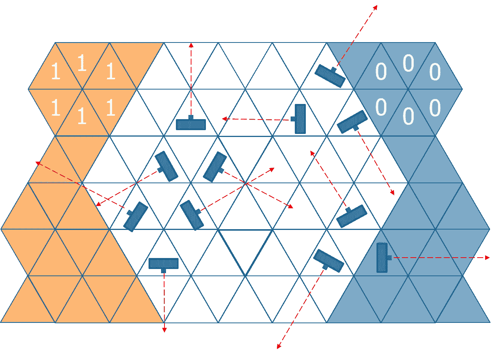
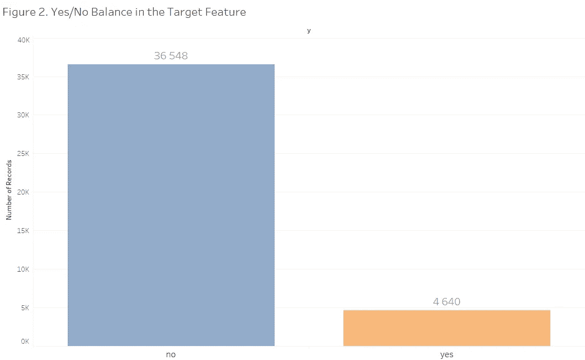
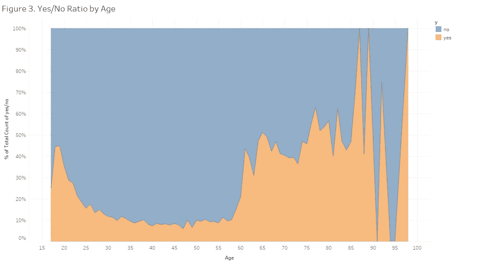
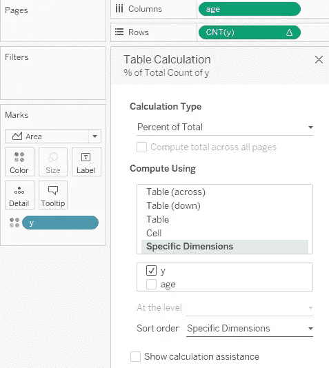
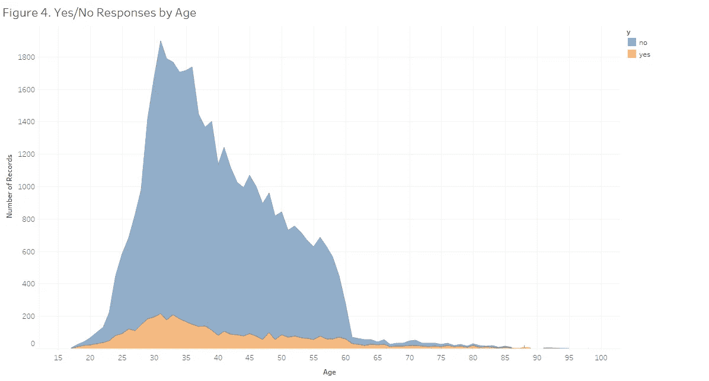
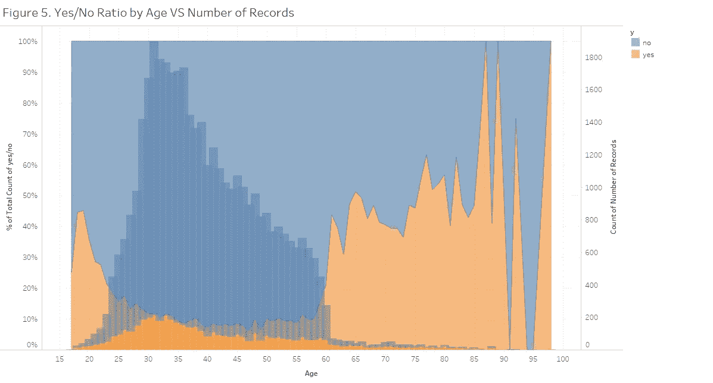
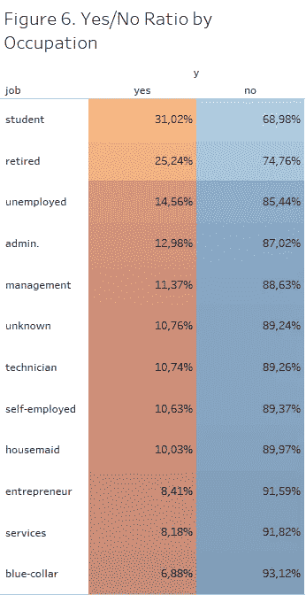
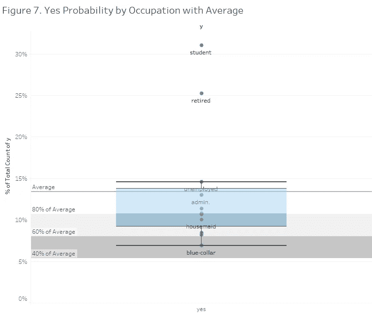

# 使用 Tableau 进行探索性数据分析

> 原文：<https://towardsdatascience.com/exploratory-data-analysis-with-tableau-for-classification-problems-9dea20ab8c01?source=collection_archive---------13----------------------->

在机器学习中，探索性数据分析或 EDA 通常是我们向新数据集介绍自己的第一件事。它的作用是对数据进行一般性观察、总结、探索一些基本趋势或揭示变量之间的隐藏关系。Qlik 或 Tableau 等数据可视化工具有助于更好地浏览新数据，并以流行的方式呈现 EDA 结果。在接下来的几分钟阅读时间里，我将使用 Tableau Prep Builder 和 Tableau 桌面软件讲述一个特定的分类案例。

我们将在这里使用的数据集对这个城镇来说并不陌生，您可能以前就遇到过。该数据由一家葡萄牙银行在 2008 年至 2013 年间收集，包含电话营销活动的结果，包括客户对该银行提供定期存款合同的回应。**我们的目标**将是在数据集中找到那些能够更好地对活动做出肯定反应的客户群。数据集在加州大学欧文分校的机器学习库中[可用](https://archive.ics.uci.edu/ml/datasets/bank+marketing)。所以让我们开始吧！

首先，让我们使用 Tableau Prep Builder 连接到数据集，然后单击“添加步骤”以了解有关其功能的更多信息，软件将自动为我们生成数据集中所有变量的摘要:

Figure 1\. Quick Summary of the Features by Tableau Prep Builder

这也是我们使用 Tableau Prep Builder 向数据中引入一些更改时的要点，例如，重命名或删除列、更改数据类型、删除明显的异常值等。

现在，让我们使用 Tableau Desktop 来研究这些数据，以获得一些有趣的数字。首先，让我们看看二元目标变量“y”与客户对银行提供存款合同的反应。

例如，随着欺诈性信用卡交易或在线活动的结果等分类案例的出现，往往会出现类别失衡的问题。图 2 显示了变量“y”的两个类在我们的数据集中也没有被平等地表示。确切地说，有 36，548 条记录属于“否”类，4，640 条记录属于“是”类。

这种不平衡表明，后来——如果我们要用这些数据建立一个机器学习模型——我们必须在训练模型之前对数据进行过采样或欠采样。

图 3 显示了数据集中任何给定年龄的“是”和“否”回答数之间的比率，与记录总数无关。有了这个图表，我们可以评估不同年龄的人对这个活动的反应。从图中我们可以得出这样的结论:是/否比率在年轻人中更好，但它也显示了一个稳定的负面趋势。大约在 30 岁左右达到一个虚拟的平台期，最低的数字一直持续到大约 57 岁左右，几乎没有变化。然后，回答“是”的比例进入快速积极变化的阶段，这可能与通常的退休年龄有关。数据集中没有足够的数据来充分代表 85 岁以上的人——因此图表的这一部分是不规则的。(要与此图互动，请点击单词 [Chewbacca](https://public.tableau.com/views/MLClassificationwithPythonforBankTelemarketing/Figure3?:embed=y&:display_count=yes&:origin=viz_share_link) )

要创建这样一个数字，您应该从相关变量的菜单中应用表计算功能(在本例中为 *CNT(y)* )，选择“合计百分比”作为计算类型，并指定“y”作为计算百分比的维度，如下所示:

现在，这就是前面的图表显示的实数:

在图 4 的年龄范围内，对活动做出肯定回答的人数在 23 岁到 40 岁之间上升，但没有否定回答的人数上升得那么快。我们在之前的图表中看到，这种“是”的增加完全被人口统计中“否”的激增所抵消。

在图 5 中，我们将最后两张图连接在一起。该图强调了这样一个观点，即具有最低“是/否”比率的区域也代表了数据集中最大的记录份额-这必然对活动的结果产生了双重打击。虽然在一个非常大的年龄组中，反对得到了很大一部分人的支持，但在样本中人数不足的组中，赞成成功了。(如果你想更详细地探究这张图，你应该先摸摸这只姜黄色的小狗>[🐕](https://public.tableau.com/views/MLClassificationwithPythonforBankTelemarketing/Figure5?:embed=y&:display_count=yes&:origin=viz_share_link))

我们从图 4 中得出的结论在这个表(图 6)中也得到了支持。如您所见，职业列表中有两个类别在对活动的响应方面非常突出，即“学生”和“退休人员”。这些阶层与图 4 中的两个高峰有关:年轻人和 60 岁或以上的人。我们认为，后者可能与这个年龄段的人开始大量退休有关。我们从这张表中获得的洞察力证实了一定存在某种程度的因果关系。

具有平均线的盒须图(图 7)再次强调了这两组客户在“是”类中的比例过高。但我们现在不会对这一点进行更彻底的调查。

虽然探索性数据分析绝不是找到此类业务问题的全面答案的充分方法，但底线是我们所做的分析已经证明数据集展示了一些我们应该注意的有趣趋势。请阅读我的帖子'[使用 Python 进行直接营销的机器学习分类](https://medium.com/@mediamedvedev/machine-learning-classification-with-python-for-direct-marketing-2da27906ddac)，了解如何使用预测性机器学习模型以更彻底的方式解决这种分类情况。

感谢您的关注！！