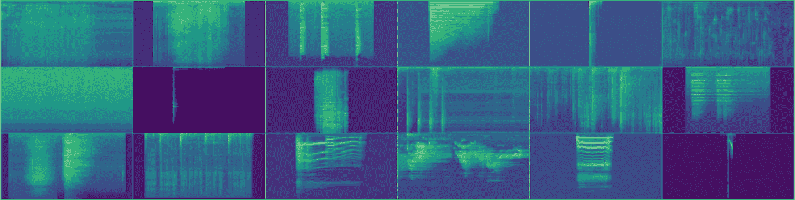

# 使用方便的工具探索图像放大

> 原文：<https://towardsdatascience.com/explore-image-augmentations-using-a-convenient-tool-a199b4ac8214?source=collection_archive---------26----------------------->

## 了解图像转换工作原理的简单方法由 Albumentations 和 Streamlit 提供支持


The interface of the service. Original photo by [Binyamin Mellish](https://www.pexels.com/@binyaminmellish?utm_content=attributionCopyText&utm_medium=referral&utm_source=pexels) from [Pexels](https://www.pexels.com/photo/home-real-estate-106399/?utm_content=attributionCopyText&utm_medium=referral&utm_source=pexels)

图像增强是一个重要的概念，已经成为计算机视觉的行业标准。它使 ML 模型更加精确和健壮，提高了泛化能力，并有助于用最少的数据创建高精度的模型。

有现成的工具可以将不同的转换应用到您的培训渠道中。我的选择是[相册库](https://github.com/albumentations-team/albumentations)

但是为了有效地使用它，你应该理解它是如何工作的。在本文中，我将告诉您如何选择正确的转换集，并为您提供一个简单的工具来可视化和探索不同的增强技术。

如果你熟悉“增强”的概念，并且已经在使用白蛋白，你可以[现在就点击这个链接](https://albumentations-demo.herokuapp.com/)；你可以在交互界面上玩不同的转换，并实时看到结果(就像上面的 gif)，或者你甚至可以获取源代码并在本地运行它。

否则，我建议你继续阅读，然后检查它。


Original photo by [Jose Mueses](https://www.pexels.com/@jose-mueses-540180?utm_content=attributionCopyText&utm_medium=referral&utm_source=pexels) from [Pexels](https://www.pexels.com/photo/photo-of-five-cars-parked-1280560/?utm_content=attributionCopyText&utm_medium=referral&utm_source=pexels)

## 什么是增强？

简单地说，增强是一种从现有样本中生成额外训练样本的技术。

让我们假设你正在训练一个 CV 模型，用“猫”和“狗”对图像进行分类。但是由于某种原因，你只有一些训练图像。


Dog image (Photo by [Svetozar Milashevich](https://www.pexels.com/@svetozar-milashevich-99573?utm_content=attributionCopyText&utm_medium=referral&utm_source=pexels) from [Pexels](https://www.pexels.com/photo/adult-golden-retriever-close-up-photography-1490908/?utm_content=attributionCopyText&utm_medium=referral&utm_source=pexels))

但是尽可能多地向你的模型展示训练图像总是好的。获得新样品而不制作新照片的最简单方法是稍微改变现有图像:

*   翻转
*   辐状的
*   规模和作物
*   添加一些噪点或模糊
*   更改亮度和对比度
*   或者稍微改变一下颜色通道

结果，你会得到许多新的图像，这些图像仍然是狗的图像，并且会告诉模型一个重要的信息:“狗的旋转图像仍然是狗的图像。”


Light transformations made using Albumentations library

最后，你可以应用一些更强的变换，这在某些情况下也是有用的(只要我们能在这些图像上认出狗):


Stronger transformations made using Albumentations library

## 如何将这种增强技术应用到实践中？

如今，你不需要通过你的双手来完成所有这些转变；有一些现成的实现库。而我最喜欢的是[**albumenations**](https://github.com/albumentations-team/albumentations)**。**

Albumenatations 是一个广泛使用的图像增强库，由计算机视觉专家、Kaggle Masters 和 Grandmasters 创建。您可以找到几十种不同的变换，它们都是以计算效率非常高的方式实现的。

您现在就可以开始使用它(如果您还没有使用的话),按照[展示笔记本](https://github.com/albumentations-team/albumentations/blob/master/notebooks/showcase.ipynb)中的示例进行操作。

## 哪些转换是最好的？

有一些标准的转换集，在大多数任务中工作得很好(翻转、旋转、调整大小)，但没有灵丹妙药，每个特定的工作都有其最佳组合。

让我们看看最近的 Kaggle 比赛，看看获胜者使用了哪些增强功能。

*注意:下面我列出了第一名解决方案的总结，他们中的许多人使用了白蛋白，但不是全部。为了一致性，我使用了 Albumentations 名称来描述转换，如果它适用的话。*

[**Severstal:钢材缺陷检测**](https://www.kaggle.com/c/severstal-steel-defect-detection/overview)

**任务:**查找钢板上不同类型的缺陷


Source: [https://www.kaggle.com/c/severstal-steel-defect-detection/data](https://www.kaggle.com/c/severstal-steel-defect-detection/data)

[**获胜者使用的增强**](https://www.kaggle.com/c/severstal-steel-defect-detection/discussion/114254) **:**

*   随机作物
*   水平翻转
*   垂直滑动
*   随机亮度对比
*   定制缺陷封锁

[**递归细胞图像分类**](https://www.kaggle.com/c/recursion-cellular-image-classification/overview)


Source: [https://www.kaggle.com/c/recursion-cellular-image-classification/overview](https://www.kaggle.com/c/recursion-cellular-image-classification/overview)

**任务:**在特殊的 6 通道图像上从真实的生物信号中分离出实验噪声

[**胜利者使用的扩充**](https://www.kaggle.com/c/recursion-cellular-image-classification/discussion/110543#latest-648051) **:**

*   随机调整裁剪大小
*   水平翻转
*   垂直滑动
*   RandomRotate90
*   将每个图像通道归一化为 N(0，1)
*   对于每个通道:通道=通道* a + b，其中 a ~ N(1，0.1)，b ~ N(0，0.1)

[**APTOS 2019 失明检测**](https://www.kaggle.com/c/aptos2019-blindness-detection/overview)

**任务:**在视网膜图像上发现糖尿病视网膜病变


Source: [https://www.kaggle.com/ratthachat/aptos-eye-preprocessing-in-diabetic-retinopathy](https://www.kaggle.com/ratthachat/aptos-eye-preprocessing-in-diabetic-retinopathy)

[](https://www.kaggle.com/c/aptos2019-blindness-detection/discussion/108065)****:****

*   **随机对比**
*   **翻转**
*   **随机标度**
*   **随机亮度**
*   **hue 饱和值**
*   **随机旋转**
*   **虚化**
*   **弹性变形**

**[**【SIIM-ACR】气胸分割**](https://www.kaggle.com/c/siim-acr-pneumothorax-segmentation/overview)**

****任务:**在胸片中识别气胸疾病**

****

**Source: [https://www.kaggle.com/c/siim-acr-pneumothorax-segmentation/data](https://www.kaggle.com/c/siim-acr-pneumothorax-segmentation/data)**

**[**胜者使用的增强**](https://www.kaggle.com/c/siim-acr-pneumothorax-segmentation/discussion/107824#latest-650999) **:****

*   **水平翻转**
*   **随机对比**
*   **随机伽玛**
*   **随机亮度**
*   **弹性变形**
*   **网格历史**
*   **光学失真**
*   **ShiftScaleRotate**

**[**iMaterialist(时尚)2019 在 FGVC6**](https://www.kaggle.com/c/imaterialist-fashion-2019-FGVC6/overview)**

****

**Source: [https://www.kaggle.com/c/imaterialist-fashion-2019-FGVC6/overview](https://www.kaggle.com/c/imaterialist-fashion-2019-FGVC6/overview)**

****任务:**服装分割和属性分类**

**[](https://www.kaggle.com/c/imaterialist-fashion-2019-FGVC6/discussion/95247#latest-626701)****:******

*   ****水平翻转****
*   ****随机亮度对比****
*   ****JPEG 压缩****

*******加成！非图像竞赛*******

****计算机视觉模型可以应用于其他领域，增强也是如此。例如，在音频处理中，大多数 SOTA 算法将原始音频转换成 Mel 频谱图，并将其作为普通图像进行处理。****

****[**Freesound 音频标注 2019**](https://www.kaggle.com/c/freesound-audio-tagging-2019/overview)****

****任务:识别声音并应用不同性质的标签****

********

****Source [https://github.com/lRomul/argus-freesound](https://github.com/lRomul/argus-freesound)****

****[**获胜者使用的扩充:**](https://www.kaggle.com/c/freesound-audio-tagging-2019/discussion/95924#553818)****

*   ****随机作物****
*   ****RandomResizedCrop****
*   ****光谱增强(光谱图的～剪切)****

****正如您在大多数示例中所看到的，使用了相似的基本转换集，但是更复杂的转换是针对每个特定任务的。此外，不仅变换而且它们的参数也很重要，看看 parrot 的这些图像。****

********************************************

Original photo by [Skitterphoto](https://www.pexels.com/@skitterphoto?utm_content=attributionCopyText&utm_medium=referral&utm_source=pexels) from [Pexels](https://www.pexels.com/photo/bird-flying-zoo-beak-9291/?utm_content=attributionCopyText&utm_medium=referral&utm_source=pexels)**** 

****所有的(除了原来的)都是相同尺度(0.25)但是插值方法不同的降尺度变换的结果——那个乍一看似乎不是很重要的参数。但结果却大相径庭。****

## ****那么，如何选择变换和调整它们的参数呢？****

****有时候，选择变换背后的逻辑是很清楚的:当你处理来自显微镜的图像时，你可以很容易地将其旋转 360 度，当你处理人们的照片时，在大多数情况下，旋转应该更加温和。有时意想不到的事情可能会像 Freesound 比赛中的 RandomResizedCrop 一样，因为它与声谱图的物理意义相矛盾。从常识的角度来看，有些案例是可疑的，也不明显。例如我们是否应该将水平翻转应用于 x 射线图像，并使用上面有器官异常侧面的结果照片？****

****对于每个特定的任务，所有这些问题都应该独立地回答。即使您处理来自同一域的不同数据集，也可能最终得到不同的最佳变换集。****

****有一些尝试自动化这一过程。看看这篇关于自动增强的[论文](https://arxiv.org/abs/1805.09501)。但现在主要是科学练习，而不是生产技术。艰苦的工作应该手工完成。****

****选择增强策略的最佳方式是通过反复试验——将您引向交叉验证的最佳度量值或测试集的一组转换及其参数是最佳的。****

****但是有一些经验法则告诉我们如何做得更快。常见的增强搜索方法包括 3-4 个步骤:****

1.  ****[可选]在没有增强的情况下训练您的模型，以获得可靠的基线。这对于调试很有用，但有时第 2 步也可以用作基线。****
2.  ****尝试一些光线变换(移动，旋转，翻转，裁剪，亮度，对比度等。)遵循常识。如果您得到的结果与数据集中的原始图像非常相似，您最有可能接受它。****
3.  ****尝试添加一些特定于数据集的扩充。例如，如果您知道在制作阶段，您将使用低质量的图像—尝试某种模糊、压缩或噪声是值得的。如果您处理街道照片，并且有许多不同天气条件的照片，请尝试随机雾、显示或下雨。但是不要依赖视觉评估；比较您的模型在使用这些增强前后的指标。如果他们在简历上变得更好——保持这种转变，否则就放弃。****
4.  ****尝试一些强转换。将它们视为您想要优化的一些超参数。剪切、曝光或通道拉伸等变换会产生非常不寻常的非自然图像，但有时，它可以帮助您训练更好的模型。现在，你应该完全依靠你的 CV 指标——测试一些组合，找到最好的一个。同时，你也可以尝试第二步和第三步中更激进的参数。****

****最后，您将得出最佳的转换组合。****

****最终的选择总是基于度量标准，但是您的经验、直觉和常识可以帮助您更快地找到解决方案。****

## ****但是我如何能直观地了解不同的转换是如何工作的呢？****

****有些变换直观上很清楚，例如，裁剪“裁剪输入的中心部分”而且它只有两个参数“高度”和“宽度”的作物。****

****但是像 RandomRain 这样的复杂函数就不那么直观了，可能有多达 10 个不同的参数。很难想象在头脑中改变它们的结果。****

****这就是为什么我创建了这个服务来试验不同的转换，在线版本可以在这里找到[](https://albumentations-demo.herokuapp.com/)****

************

******Screenshot of the service******

******我使用了优秀的 [Steamlit 框架](https://streamlit.io/)来创建一个方便的界面。******

************

******Params of the MultiplicativeNoise transform******

******您可以选择任何想要的变换，并使用可视化控制元素调整参数，以查看生成的变换图像。******

******为了方便起见，您还可以看到使用所选参数调用所选转换的代码——将其复制粘贴到 Python 脚本中并使用它。您还将看到来自这个转换的源代码的原始 docstring，在这里您可以找到关于这个转换的解释和细节。******

************

******The code to call the transformation and the docstring******

******摆弄参数并了解它们如何在不同的图像上工作是获得快速增强调音所需直觉的最佳方式。******

## ******我可以在这项服务中使用我的图像吗？******

******是的，如果您在本地运行该服务，您可以做到这一点。******

```
****git clone https://github.com/IliaLarchenko/albumentations-demo
cd albumentations-demo
pip install -r requirements.txt
streamlit run src/app.py -- --image_folder PATH_TO_YOUR_IMAGE_FOLDER****
```

******这项服务的源代码可以在 GitHub([https://github.com/IliaLarchenko/albumentations-demo](https://github.com/IliaLarchenko/albumentations-demo))上找到，你可以克隆它，做任何你想做的事情。******

******当您想要探索所有可用的转换或只是快速检查它们如何工作时，在线版本是有用的，而本地版本更灵活，可以根据您的需要进行定制。******

*******我希望这个工具和这篇文章对你有用！不要犹豫问我任何事情或提出任何改进。祝你好运！*******