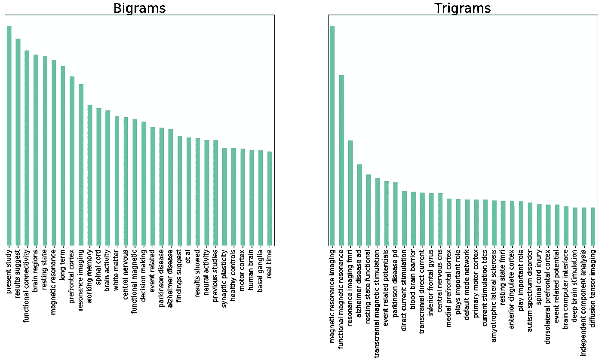
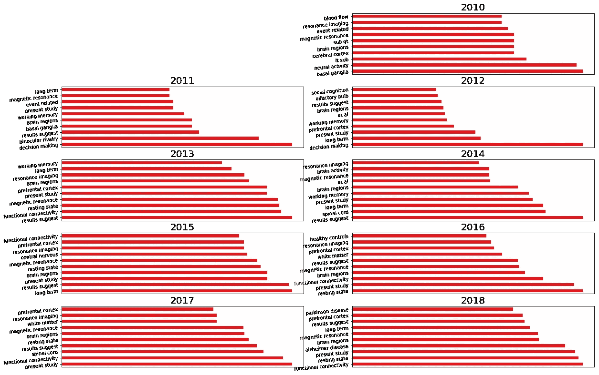
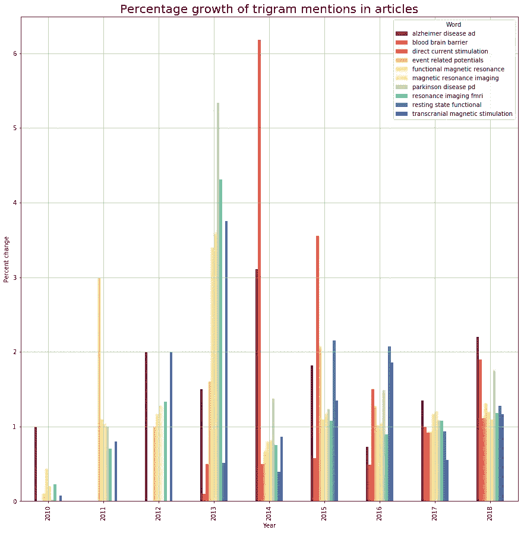
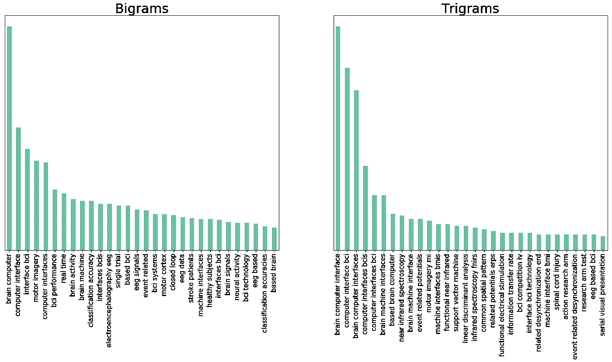
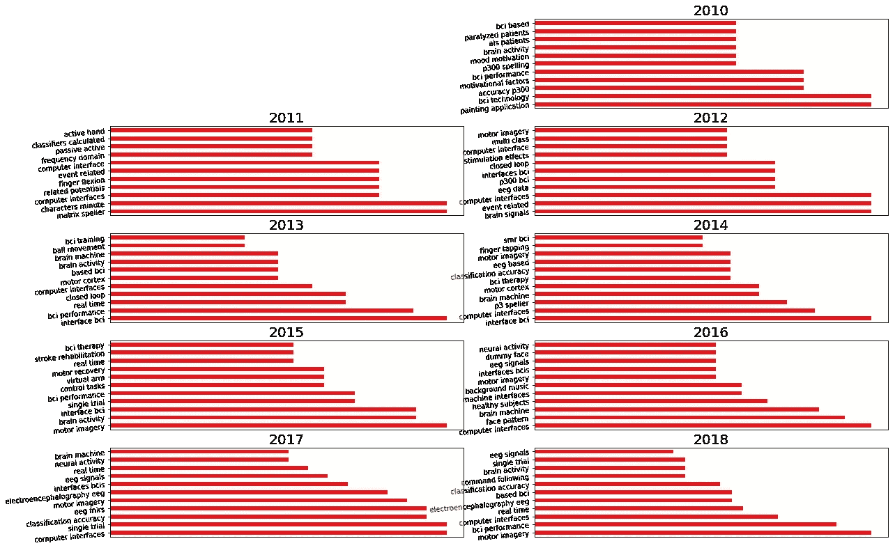

# 探索 16000 篇神经科学前沿文章

> 原文：<https://towardsdatascience.com/exploring-16000-frontiers-in-neuroscience-articles-7f362de76ba3?source=collection_archive---------16----------------------->


Photo by [jesse orrico](https://unsplash.com/@jessedo81?utm_source=unsplash&utm_medium=referral&utm_content=creditCopyText) on [Unsplash](https://unsplash.com/search/photos/brain?utm_source=unsplash&utm_medium=referral&utm_content=creditCopyText)

最近我一直在做语音应用。对我来说真正突出的一点是对话界面是多么自然。如果技术足够进步，它将允许我们更轻松地完成任务，因为我们可以简单地说我们想做什么。然而，无论一个设备呈现信息的效率有多高，你消化信息的能力总是会受到你阅读、听或看的速度的限制。

这就是高级脑机接口(BCIs)如此伟大的原因。它们将允许人们比以往任何时候都更有效地学习、保留知识和交流。埃隆·马斯克一直在谈论他的神秘初创公司 Neuralink 如何开发高带宽脑机接口来连接人类和计算机。Neuralink 背后的想法是，如果大脑可以被实时解释和操纵，你就可以“扩展”大脑。这可以增加一个新的能力、理解和沟通的层次。人们将能够直接向另一个人传递想法，而不需要用书面/口头语言交流。然而，脑机接口已经研究了一段时间，许多应用集中在帮助瘫痪的人。

Neuralink 背后最近的炒作是这一分析背后的灵感。我想探索脑机接口研究的一些趋势。因此，在设定目标后，我准备花一天时间与熊猫和 Matplotlib 战斗，看看我是否能从我的数据集中收集到任何有趣的信息。

# 准备数据集

前沿媒体是同行评审的开放存取科学期刊的学术出版商。他们有许多科学、技术和医学期刊。在我的分析中，我使用了神经科学前沿期刊系列的文章，其中包含了一些在[影响力和质量](https://blog.frontiersin.org/2018/07/06/journal-impact-factor-frontiers-in-neuroscience-journal-series/?utm_source=FWEB&utm_medium=FJOUR&utm_campaign=IF18_JOURN_FNINS-MID)方面的世界顶级神经科学期刊。其中一些期刊包括《神经科学前沿》、《神经信息学前沿》和《细胞神经科学前沿》。

我的第一步是收集数据。在这种情况下，我编写了一个 Python 脚本来收集所有的神经科学文章。web scraper 保存了文章的文本和元数据。为了收集所有文章的 URL，我使用了一点 regex 来解析 sitemap.xml 文件中神经科学系列的 URL。一旦我的 web scraper 运行完毕，我的数据集就包含了 15803 篇以 JSON 格式存储的文章。这些文章带有丰富的元数据，包括出版国家、作者、引用日期和关键词。

对于 Pandas 来说，将 JSON 数据集转换成 CSV 是没有问题的。如果 JSON 对象被展平(只有一级键)，您可以简单地使用普通的 dataframe 构造函数。然而，仔细观察就会发现，在缺少值的字段中有空的 dict 对象。这里有一个巧妙的技巧，你可以用 NaN 替换这些空字典:

```
df = df.mask(df.applymap(str).eq(‘{}’))
```

现在一切看起来都很好，我们调用 df.to_csv()，将数据集上传到 Kaggle，做一些探索性的数据分析。

**查看内核:**[https://www . ka ggle . com/markoarezina/frontiers-in-neuroscience-article-EDA](https://www.kaggle.com/markoarezina/frontiers-in-neuroscience-article-eda)

**你可以在 Kaggle 上找到数据集:**[https://www . ka ggle . com/markoarezina/frontiers-in-neuroscience-articles](https://www.kaggle.com/markoarezina/frontiers-in-neuroscience-articles)

# 了解数据

在深入研究 BCI 的具体研究之前，我想先了解一下数据集中的文章类型。除了期刊文本，数据集还包含了大量有趣的元数据。这包括有用的字段，如“引文 _ 期刊 _ 标题”,它指定了文章的具体神经科学期刊。例如，细胞神经科学前沿。由于元数据还包含引用国家，我认为国家和神经科学期刊的热图可能是获得数据集概览的好方法。


从热图中你可以看到该系列中一些最大的期刊是《细胞神经科学前沿》、《神经科学前沿》和《人类神经科学前沿》。

接下来，我想探索文章中的一些共同主题。为此，我找到了引文摘要中最常见的单字、双字和三元字。下面的情节展示了一些常见的主题。



单字谜没有透露太多，不出所料，最常见的词是“大脑”。最常见的三元模型与成像有关，这对研究大脑至关重要。磁共振成像使用强磁场和无线电波来生成体内器官的图像。功能磁共振是指通过检测与血流相关的变化来测量大脑活动的方法。

我也认为随着时间的推移，分析二元模型的流行程度可能是个好主意。这揭示了一些关键概念，如磁共振，这是多年来的顶级双字母组合。这也表明了这些年来研究的焦点是如何转移的。



随着时间的推移，绘制三元模型提及的百分比增长，显示了特定关键字的峰值，因为在特定年份有大量研究论文涌入。



# BCI 特定研究

为了开始分析某些特定于 BCIs 的主题，我查询了抽象地提到大脑计算机/机器接口短语的文章。这给了我们 332 篇文章。

对二元模型和三元模型进行类似的分析，揭示了 BCI 特定文章中的一些共同主题。



以下是一些最常见的 BCI 专用术语及其解释:

**运动想象:**是 BCI 的标准概念之一，用户可以通过想象运动动作来产生诱发活动。用户在学会如何产生期望的大脑活动并发出预期的命令之前，可能需要几次训练。这种 BCI 的典型训练协议包括用户执行运动想象任务，随后在计算机屏幕上移动物体。

**“支持向量机”/“分类准确率”:**这些短语出现在对运动想象脑电信号进行分类的上下文中。支持向量机可用于[对运动想象脑电图信号](https://www.ncbi.nlm.nih.gov/pmc/articles/PMC4904086/)进行分类，以确定用户正试图采取何种行动。

随着时间的推移绘制二元图揭示了多年来焦点的转移。



一些有趣的模式包括 p300 波及其在拼写 BCI 中的应用。在 2017 年和 2018 年，对脑电图和对这些信号进行分类的关注也有所增加。

未来可以尝试一些有趣的事情，包括比较该系列不同期刊的研究主题。探索包括机构、关键词和参考文献在内的更多数据也很有趣。我对神经科学了解不多，我发现这种分析是一种很好的方式，可以让我对神经科学的一些研究领域有一个总体的了解，重点是 BCI。我很想听听你在哪些方面做得更好，或者是否有我可以纠正的地方。

我在 Vecgraph 开发谷歌助手和亚马逊 Alexa 技能。目前，我们正在寻求与一些品牌合作，开发他们的语音集成。由于我们希望在案例研究上进行合作，我们为您的语音应用程序的设计和开发提供折扣率。这个机会是先到先得的。让我知道你想创造什么！[marko.arezina@vecgraph.com](mailto:marko.arezina@vecgraph.com)