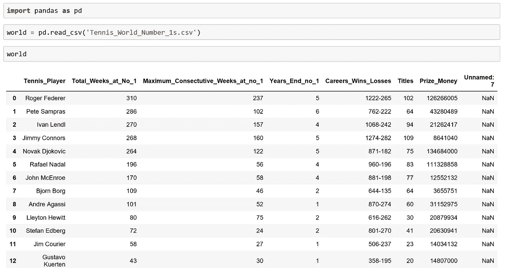
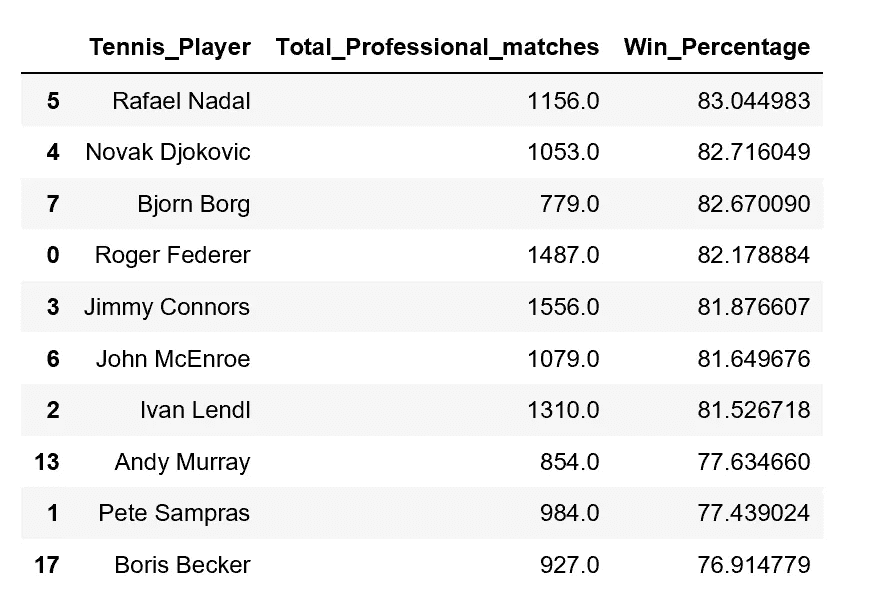

# 探索具有简单熊猫和绘图可视化功能的数据集

> 原文：<https://towardsdatascience.com/exploring-a-data-set-with-simple-pandas-and-plot-visualizations-features-73901ee76c6c?source=collection_archive---------14----------------------->

## Pandas 和 Plotly 进行初始数据分析——以网球为例

Image Courtesy of [Kevin Mueller](https://unsplash.com/@kevinmueller) via Unsplash

# 介绍

Python Pandas 库与 Pandas graphing 库 plotly 相结合，可以帮助进行初始数据集探索。通过使用这两个库的简单函数和方法，可以快速获得快速但信息丰富的数据集摘要。

# 过去 20 年中最好的网球运动员

本教程将使用我从 ATP 巡回赛网站上搜集的数据集。具体来说，该数据集包含过去 20 年前世界排名第一的各种统计参数的信息。这篇文章的 CSV 文件的链接可以在我的 Github 页面[这里](https://github.com/StephenFordham/data_training)找到。

# 数据集介绍

首先，在读入数据集时对其进行检查是一种很好的做法。数据集作为 CSV 文件保存在我的本地目录中，我使用 pd.read_csv 方法读取该文件并将其保存到名为 World 的数据帧中。数据集看起来不错，但是在右边有一个额外的不必要的列，我可以删除它。示出了 26 行中的 12 行。

12 of 26 Former World Number 1’s are shown

当处理一个新的数据集时，运行一些简单的 pandas 函数并检查各种属性总是最佳实践。如图所示，我删除了不必要的列，确保指定列 axis 1，并将关键字参数 inplace 设置为 True。为了检查这个函数是否按预期工作，我简要地看了一下列和形状属性。

尽管对于这个特殊的例子，数据集相对较小，但我鼓励检查空值，并使用 sum 方法给出关于任何缺失数据的信息。最后，我检查 dtypes 属性，因为我想在后续步骤中对列值执行数值运算。

Using convenient attributes such as .column/shape/dtypes/ and checking for missing data will serve you well when you familiarize yourself with any data-set.

# 谁是最好的前世界第一？

数据集有一些有用的信息，可以用来决定谁可能是最好的前世界第一。一个简单的方法来确定谁可能是最好的前世界排名第一，可能是确定谁有最高的胜率。

World DataFrame 有一个名为 Careers _ Wins _ Losses 的列，其中包含有关职业比赛输赢的信息。为了得到这些数据，把这一栏分成两个独立的栏可能是有用的，在它们各自的栏中有赢和输。

Pandas 提供了使用一行程序执行强大操作的能力。在这里，我创建了两个名为“Career_Wins”和“Career _ losses”的新列，并在连字符(-)分隔符上将该列从原始世界数据帧 Careers _ Wins _ Losses 中分离出来，使用 expand=True 参数，并将这些列指定为数字浮点数据类型列。

下面，我包含了世界数据框架中列的子集，以展示这是如何工作的。

现在可以创建一个包含所有职业比赛的新列，并且可以通过创建一个名为 win percentage 的新列来确定胜率，用职业胜率除以所有比赛次数，然后乘以 100 得到一个百分比数字。

接下来，我查看了下面所示的三列中的前 10 行，按成功百分比排序。数据显示拉斐尔·纳达尔拥有最高的胜率，这是否意味着他是最好中的最好？可能吧。最好是保持谨慎，并考虑不同时代对手的素质等限制因素。

通过使用简单的 Pandas 函数和方法，我们可以开始进行尝试性的总结。

Top 10 Current/Former World Number 1’s sorted by Win Percentage

# 对多列排序

按多列排序也可能有助于进一步区分。例如，我已经进行了排序(使用 DataFrame 系列方法，sort_values)，首先是世界排名第一的年数，然后是获胜百分比。这可能是决定谁是最好的前世界第一的另一种方法。

Sorting by Years at No 1, places Pete Sampras in top position despite having a lower win percentage

# 每个玩家之间的百分比差异

为了从数据集中收集更多的信息，可以获得每个玩家之间的获胜百分比差异。在这里，我创建了一个名为 Tennis_Win_Perc 的新数据帧，它按照获胜百分比排序。然后我简单的使用。pct_change()方法，乘以 100，并从这个数据帧的三列中查看头部。

现在很容易按顺序看到每个玩家的胜率变化！

Incremental percentage difference (%) between each player (Top 10 rows shown)

# 易于阅读的过滤

当在筛选过程中使用多个条件时，筛选条件语句会变得很长，难以阅读。避免这种情况发生的一个有用的技术是将每个过滤条件分配给它自己的标准，并在过滤数据帧时将它们组合在一起。为了避免输出所有的列，我使用 loc 访问器只选择符合这个标准的网球运动员。

functools 模块中的 reduce 函数与 lambda 表达式的工作方式类似，它采用前两个条件的过滤乘积，并将它们与第三个条件相结合，以生成可应用于 DataFrame 的单个过滤条件。

# 将数据可视化

使用 Pandas 图形库 plotly 可视化数据对于探索性分析非常有用。通过一行代码(虽然我把这一行分成了 4 行，因为它是换行的)，可以清楚地看出哪些球员在第一名的位置上呆了最多的周数。虽然这个输出当然可以使用一些增强，但对于初始数据探索来说并不坏！在 plot 方法()之前添加一个过滤条件来过滤世界数据帧，允许某些数据，在这种情况下，玩家从最终的视觉输出中被修剪掉。

***有用的提示！*** *在使用 Jupyter 笔记本*中的绘图方法绘图时

当在 barh 的括号内时，如果您按下 **shift+tab 四次**，将出现 barh 栏类型的文档字符串，为您提供可应用于视觉增强的特定定制的信息！

The output has been trimmed to only include players who have 50 or more weeks at no.1.

# 信息散点图

探索性散点图可用于研究两个连续变量之间的关系。在这里，我简单地创建了网球运动员、他们的收入和他们的胜率的列表。然后我创建一个 for 循环，遍历这三个列表并绘制它们，创建一个信息散点图。

注意:收益列是为这个散点图创建的，如代码片段所示。

现在显而易见的是，像比约·伯格这样的球员和诺瓦克·德约科维奇、费德勒、纳达尔有着相似的胜率，但是他们挣的钱要少得多。

现代社会的钱多了吗？需要更多的信息来找出答案。

# 摘要

Pandas 及其相关的绘图库 Plotly，可以帮助提供任何初始数据集的介绍，以表格和可视化格式给出有用的摘要。