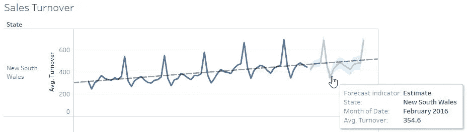

# 探索 Tableau 中的分析

> 原文：<https://towardsdatascience.com/exploring-analytics-in-tableau-bc14767d2e4c?source=collection_archive---------18----------------------->

Tableau 的分析能力非常全面。使用分析中的一些功能，用户可以从他们的数据中得出有趣的推论。根据所需的输出，用户可以选择应用各种模型来总结他们的结果。

Tableau 在版本 9 中引入了分析选项卡。它位于数据选项卡旁边。

> 分析功能根据功能分为三组。让我们探讨一些分析数据时常用的选项。

**箱线图**:箱线图通常用于检查数据的分布情况。用户可以通过箱线图了解数据的分布情况。在 Tableau 中，要使用方框图，第一步是使用任何标准图表绘制数据。使用盒状图进行分析时，不应聚集数据。这可以通过不选择分析菜单中的*集合测量*选项来实现。这样，数据中的每个值都将包含在绘图中。绘图后，您可以选择位于分析选项卡中的*框绘图*选项。瞧，你的有胡须的方框图准备好了。您可以轻松识别异常值、中值、第 25 和第 75 百分位值。

可以根据特定要求编辑和格式化箱线图。

**趋势线，预测**:趋势线表示数据序列的趋势。趋势可以是积极的，也可以是消极的。它也被称为最佳拟合线。线性趋势线用于线性数据集。曲线也用于表示数据随时间变化的一般模式。趋势线在根据当前数据预测未来值时非常有用。

在 Tableau 中，通过单击按钮可以很容易地将趋势线添加到绘图中。

T 趋势线主要用于时间序列数据，即以连续时间间隔获取的一系列数据点。在上图中，您可以看到如何在 Tableau 中为一个数据集添加趋势线，该数据集包括澳大利亚四个地区的平均销售额(*礼貌用语:Udemy* )。这个数据是从 2010 年到 2015 年的。要在 Tableau 中添加趋势线，首先绘制数据点。

接下来，点击位于分析菜单中的*趋势线*选项。所有图的趋势线立即出现。您可以通过点击*编辑趋势线*选项选择要添加的趋势线类型，并进行其他修改。您可以添加置信区间，以显示相对于趋势线的 95%置信上限和置信下限。但是，这不适用于指数模型。

每条趋势线都有自己的描述。您可以点击*描述趋势线*选项查看所用模型的详细描述。

> 在分析和比较多个实体的数据时，这些信息非常有用。R 平方值和 P 值有助于推断数据模式，例如，R 平方值表示数据与线性模型的拟合程度。

**预测**是分析时间序列数据的下一步。一旦添加了趋势线，根据历史数据和趋势预测未来数据就变得容易了。在 Tableau 中，您只需点击位于*趋势线*链接下方的*预测*选项即可查看预测。

> 预测在当前图中显示为阴影区域。将鼠标悬停在预测图上，可以查看其描述。

与趋势线类似，您可以编辑预测选项，并根据您的需求进行定制。默认情况下，预测遵循包括季节性在内的源数据趋势。你可以预测几个月到几年的数据。

您可以通过查看“描述预测”窗口中显示的详细信息来了解预测描述。

> 与趋势线和预测功能一起，分析和可视化时间序列数据，如销售数据、人口增长、气候变化等。可能很容易。

**聚类**:聚类是一种将数据分成不同组的技术，这样每个组中的数据点都有一些相似性。它用于不涉及训练或学习的无监督学习。

在 Tableau 中，要实现一个集群，首先必须绘制数据。一旦绘图准备就绪，您只需点击分析选项卡中的*聚类*选项。

Y 我们的数据瞬间被漂亮地分成不同的聚类。如上图所示，Tableau 将数据点分成了三个不同的簇，并分别进行了颜色编码。您可以将鼠标悬停在数据点上，以了解 Tableau 将数据分组到不同集群所使用的逻辑。对数据所做的任何更改都会改变群集分组。

在 Tableau 中，聚类分析不适用于混合数据以及无法聚合维度的情况。此外，应该有可以分组到集群中的有效变量。可以修改聚类变量和聚类数量。

> 通过在数据窗格中将分类保存为组，可以将分类添加为维度。完成后，可以编辑组中的单个集群。该组的一个有用特性是，它可以在其他工作表中重用，就像使用任何维一样。该组和创建的原始集群相互独立。

趋势线也可以添加到聚类中。这有助于轻松识别每个集群中的异常值。此外，基于趋势线预测每个聚类的结果更有效。

这些是 Tableau 的一些关键分析功能。您可以更深入地研究它们，以了解它的完整应用。使用分析生成的输出，您可以在 Tableau 中创建引人注目的演示文稿，方法是将表单拖到仪表板中或创建令人印象深刻的故事。

*你可以在 https://public.tableau.com/profile/rajeshwari.rai#!/*查看这里给出的剧情