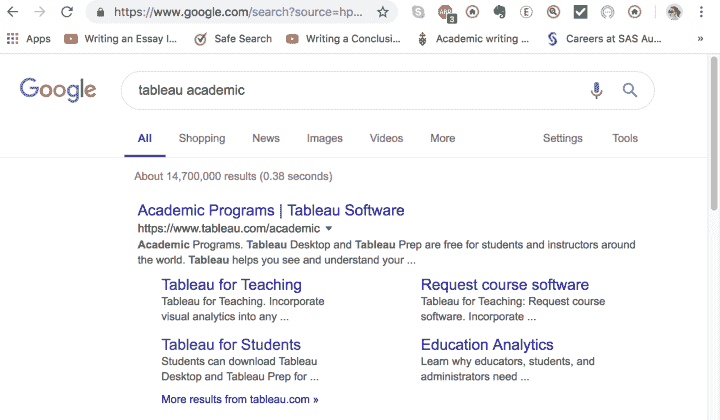
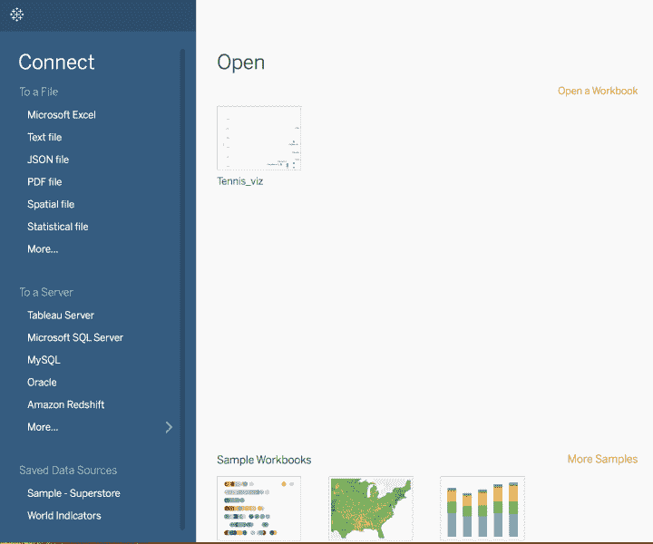
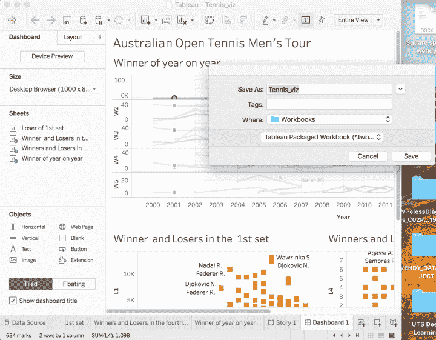
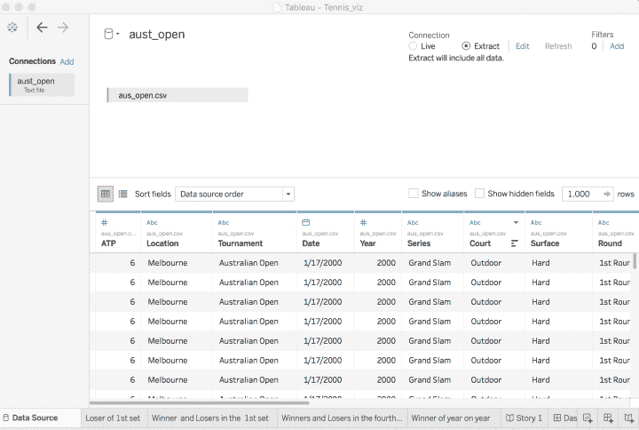
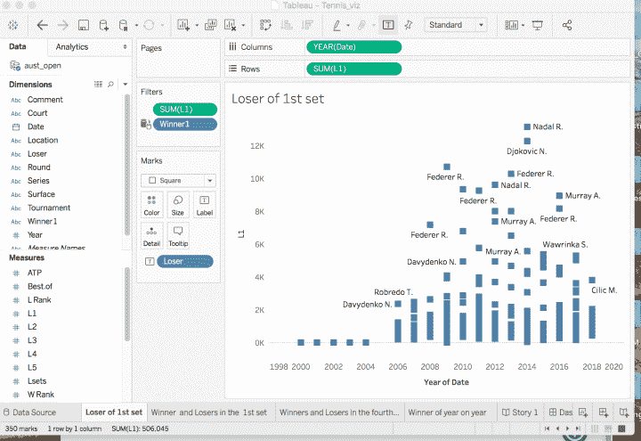
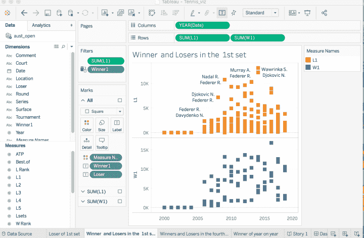
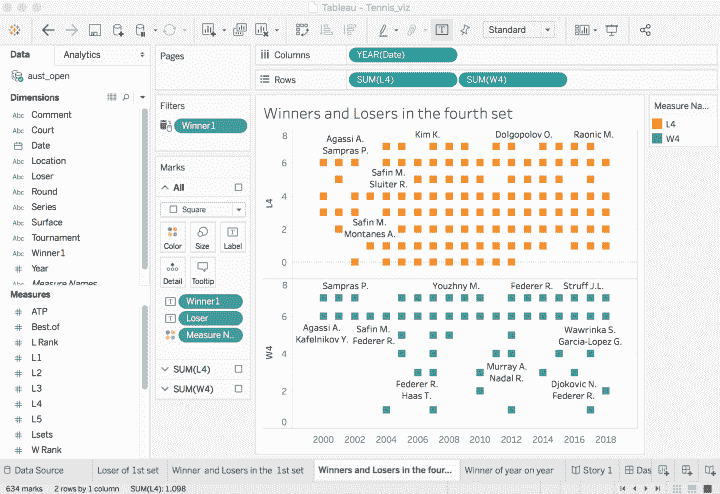
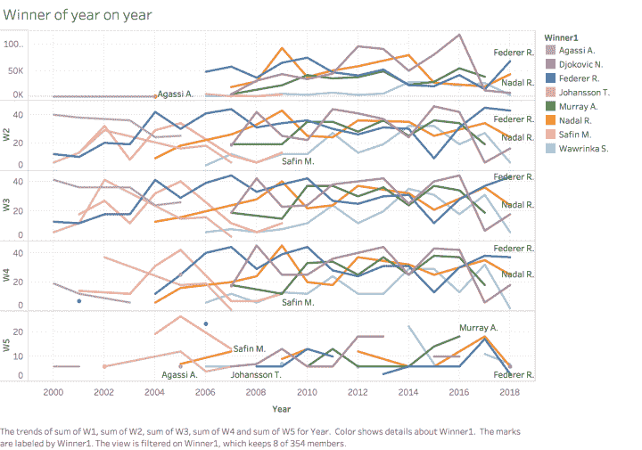

# 用 Tableau 探索澳大利亚网球公开赛数据——第三部分

> 原文：<https://towardsdatascience.com/exploring-australian-open-tennis-data-with-tableau-7cdcd9c2490e?source=collection_archive---------23----------------------->

使用 Tableau 了解 2000 年至 2018 年男子巡回赛的澳大利亚网球公开赛数据。Tableau 就像 visual SQL。

本周悉尼热浪袭人，气温高达 30 多度。冬天什么时候到来？

我已经错过了我的帖子，我继续**给未来的自己**写信，继续#29dayproject。为期 29 天的项目是一个热情的项目，应用分析和一些数据科学和工具的分析思维。在上一篇文章中，我们使用 R 进行了探索性数据分析(EDA ),评估了缺失值并生成了一些描述性统计数据。

# 为什么我需要画面？

Tableau 是一个商业智能工具，在全球范围内用于帮助行业理解他们的数据。您不需要在 Tableau 中编写任何代码，但它将帮助您使用单个或多个数据源讲述故事，您可以根据数据关系将这些数据源联合、混合或连接在一起，以创建工作表和仪表板或故事板。

通俗地说 Tableau 就是 visual SQL。

# 我如何访问 Tableau？

## Tableau 桌面对在大学注册的学生和学者是免费的

你可能是一名学生或在学术界工作，你知道 Tableau 桌面是免费的，只要你在大学注册？我知道你知道。你只需要谷歌一下 [Tableau 软件|学术项目](https://www.tableau.com/academic)

有一些内务管理项目需要向 Tableau 团队注册，您必须表明自己是一名学者或学生，并使用您的学生证或学术成绩单来验证您的身份。审查过程完成后，您将获得一个产品密钥。

# Tableau 入门

我今天的目标是在进行任何预测建模之前，可视化 Tableau 中的数据，以理解这些数据。取预处理后的数据' aus_open.csv '文件，通过选择'文本文件'上传到 Tableau Desktop 2018 v3。

我之前已经准备了一些东西，创建了一个工作簿，保存为“Tennis_viz”。twbx '文件，而不是*。twb 文件。我在安联保险公司使用 Tableau Desktop，你只能通过将工作簿保存为 ***来分享见解。twbx** 文件，你的股东将需要安装 [Tableau 阅读器](https://www.tableau.com/products/reader)，这是免费查看你的可视化。

# 数据源

一旦您的数据上传到 Tableau，您将必须检查您的数据，以确保 Tableau 已经正确地估计了您的数据属性，如日期、数字(度量)、分类变量(维度)或字符串(文本)。

一旦您对数据类型感到满意，将鼠标悬停在**连接**上，并将您的连接保存为**提取**而不是实时连接，因为读取实时数据的内存可能会降低您的计算机数据处理时间。我推荐 extract 版本，特别是当你在笔记本电脑上工作的时候。

# 创建您的第一个工作表

当您在 Tableau 中访问第一个工作表时，请像对 Excel 电子表格一样重命名工作表，并且不要忘记保存文件。

我检查了数据上传，确保 Tableau 正确地将变量分配为度量或维度。我感兴趣的是策划多年来第一盘的失败者。在列中，我拖动“年份”，在行中用总和聚集“L1”。

# 第一盘的进展

第一盘的进展 setI 希望通过比较第一盘的赢家和输家来进一步探索数据。从 tennis-data.co.uk[提供的数据和注释](http://www.tennis-data.co.uk/alldata.php)我们可以看到**缺少 2000 年到 2003 年的数据**，这在之前的 R 中显示过。

# 他们在第四盘的表现如何？

# 他们在第五盘是如何追踪的？

根据 Tableau，看起来澳大利亚网球公开赛男子决赛要么是拉斐尔·纳达尔，要么是罗杰·费德勒。然而，在我们的下一篇文章中，我们将着眼于建立一个预测模型，以检查我们的建模和特征工程的准确性。

Tableau 工作簿在 [Github](https://github.com/wendy-wong/wendywong.github.io/blob/master/Tennis_viz.twbx) 上分享。

快乐编码，享受网球！🎾