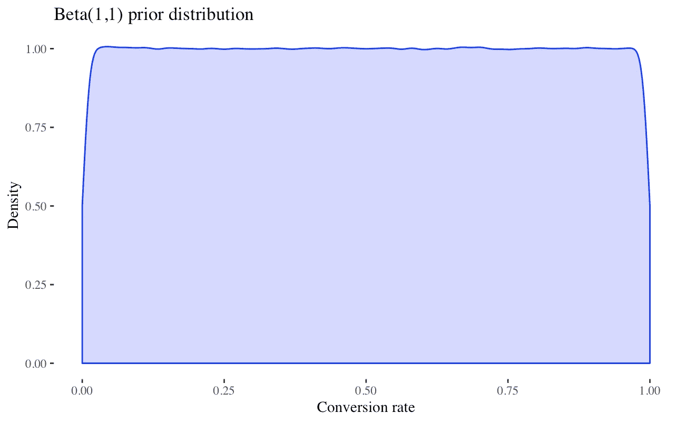
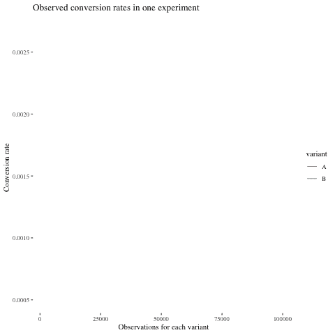

# 贝叶斯 A/B 测试——模拟实践探索

> 原文：<https://towardsdatascience.com/exploring-bayesian-a-b-testing-with-simulations-7500b4fc55bc?source=collection_archive---------8----------------------->

如今，A/B 测试是几乎所有数字产品公司发布功能的核心组成部分——这是有充分理由的。我们已经用科学的洞察力取代了猜测和直觉，了解什么能引起用户的共鸣，什么不能。但是我们从实验中获得的洞察力不是免费的。每次我们做实验，都是在冒险。我们要么冒着将次优版本投入生产的风险，要么冒着维护可能不如我们想要发布的新特性的体验的风险。此外，实验可能需要很长时间，尤其是在那些没有产生谷歌规模数据的初创企业。对于一些公司来说，实验的速度会成为在产品路线图上发布新功能的瓶颈。

许多公司的数据科学家都在寻找传统 A/B 测试方法的快速替代方案。因此，贝叶斯 A/B 测试成为了主流。虽然其他人已经写了贝叶斯 A/B 测试方法背后的理论和基本原理(见这里的和这里的)，但很少有资源提供关于如何实施这些方法以及预期影响有多大的实用建议。例如，我对以下问题感兴趣:

1.  贝叶斯方法能在多大程度上缩短实验时间？
2.  实验*速度*和*精度*之间的权衡？
3.  我们如何选择一个*优先*分布？我们选择的先验分布有多重要？

在本文中，我们将探讨这些问题，并为您提供将贝叶斯 A/B 测试实用地应用到您自己的项目中的工具。

# 审查方法

在开始分析之前，让我们简要回顾一下这种方法是如何工作的。正如我在介绍中提到的，其他人已经详细介绍了这一点，我从他们的文章中借用了一些。

任何实验的设计都有三个组成部分:构建变量，随机分组，分析结果。Frequentist 和 Bayesian A/B 测试方法的区别仅在于分析步骤。

## 频繁主义方法

我们大多数人都熟悉统计学入门课程中的频率主义方法。该方法如下进行:

1.  声明一些假设。通常，零假设是新的变体并不比现有的更好。另一种选择是相反的。
2.  使用[统计功效计算](https://clincalc.com/stats/samplesize.aspx)提前确定样本大小，除非您使用[顺序测试](https://en.wikipedia.org/wiki/Sequential_analysis)方法。
3.  通过随机实验收集数据。
4.  计算观察到结果*的概率，至少与零假设(p 值)下的数据一样极端*。如果 p 值<为 5%，则拒绝零假设并将新变体部署到生产中。

## 贝叶斯方法

虽然 frequentist 方法将每个变量的总体参数视为一个(未知)常数，但 Bayesian 方法将每个参数建模为一个具有某种概率分布的随机变量。虽然这种区别是微妙的，但它使我们能够计算我们在频繁主义世界观中无法计算的量。最重要的是，我们可以直接计算感兴趣参数的概率分布(以及期望值)。

为了对每个变量的概率分布进行建模，我们依靠贝叶斯规则将实验结果与我们所拥有的关于感兴趣的度量的任何先验信息相结合。我们可以通过在之前使用[共轭来简化计算。当我们处理样本比例时(如本文后面的例子)，一个自然的选择是 Beta 分布。](https://en.wikipedia.org/wiki/Conjugate_prior)

## 贝叶斯决策

我们定义*损失*为停止测试并选择一个变量，如下所示。

这里， *α* 和 *β* 代表实验每一侧的感兴趣的度量，而 *x* 代表选择的变量。用英语来说，这个函数的意思是，如果我们选择变量 A，如果我们做了错误的决定，我们所经历的损失要么是 *β* 大于 *α* 的量，要么是如果我们做了正确的决定，我们什么也没有。

因为贝叶斯法则允许我们直接计算每个指标的概率分布，我们可以计算出选择 A 或 B 的*预期损失*,给出我们收集的数据如下:

该指标考虑了我们通过 p.d.f. *f(α，β)* 选择最差方案的*概率*和通过 *L(α，β，x)* 选择潜在错误决策的*幅度*。

然后，我们可以设置某个*损失阈值*、 *ε、*，并在预期损失低于该阈值*时停止测试。这个数字代表我们对错误的容忍度。正如我们将很快看到的，它在控制实验的速度和准确性之间的权衡中起着重要的作用。*

# 检查和调整方法

介绍完毕后，让我们探索一下贝叶斯 A/B 测试是如何根据经验进行的。为了做到这一点，我们将使用蒙特卡罗模拟来探索该方法在几个假设场景中的行为。我在本文末尾链接了我的代码，因此您可以应用相同的方法来研究这些问题，并针对其他感兴趣的场景调整参数。

## 模拟

假设我们正在测试我们网站上的一个新的登陆页面。我们目前登陆页面的转化率是 0.20%。一个频率专家[的功率计算](https://clincalc.com/stats/samplesize.aspx)会告诉我们，如果我们预期由于一个新的变体，这个指标会有 25%的改进，我们需要 22 万次观察才能有 80%的概率检测到这个差异(在 5%的显著性水平上)。哇哦。对于许多公司来说，这些数据需要几周或几个月的时间来收集。

让我们用一些模拟来看看贝叶斯方法会做什么。现在，我们将假设我们没有太多关于感兴趣的度量的历史数据，所以我们将选择统一的先验 Beta(1，1)，它只假设两个先验观察值(一个转换，一个非转换)。此外，我们必须设置一个损失阈值。我们将使用 0.004%，这将代表我们的基本利率 0.20%的 2%的相对损失。我们的第一个模拟“实验”如下图所示。

在这个实验中，变体 B 的转换率很快就超过了变体 A。在每个时间步，我们通过数值积分计算选择变量 A 或变量 B 的预期损失。通过对每个变量的第一万次观察，变量 B 的预期损失低于阈值(由黑色虚线表示)。这将是对传统方法建议的每个变体 110k 的巨大改进，但这只是一个模拟。

在 500 次模拟中，我们几乎 90%的时候都正确选择了变量 B。此外，75%的实验在 50k 的观测值内结束。这不到传统方法所需样本量的四分之一！速度的提高并没有什么神奇之处——我们只是调整了决策标准。贝叶斯方法不仅考虑出错的概率，还考虑潜在错误的预期程度。贝叶斯 A/B 测试更能容忍低成本的错误，而 frequentist 方法(A)不考虑大小,( B)将误报视为*,特别是*高成本。请注意，我们仍然没有纳入任何先前的信息——速度的提高完全是因为我们增加了对小错误的容忍度。

## 速度和准确性

自然，下一个问题是:我们应该对错误有多大的容忍度？与任何 A/B 测试方法一样，我们面临着准确性和速度之间的权衡。在贝叶斯 A/B 测试中，损失阈值是控制这种权衡的节流阀。

We can use the loss threshold to trade accuracy for speed, and vice-versa

虽然没有解析公式告诉我们这种关系是什么样子，但模拟可以帮助我们建立直觉。以下是在不同效应大小(范围从 10%到 50%)下的几个模拟结果。这些图表显示了当我们改变损失阈值时，精确度和实验持续时间是如何变化的。

不出所料，随着我们对损失容忍度的提高，准确性往往会下降。当真正的效果尺寸更小时，我们往往会失去更多的准确性，这并不奇怪。在损失阈值非常高的情况下，我们倾向于很早就停止我们的实验，更有可能的是，次优的变体将完全凭运气首先达到损失阈值。你可以在右边的图表中看到这种效果:不管效果大小，当损失阈值足够高时，实验总是立即停止。

虽然选择的损失阈值将取决于业务环境，但在这种情况下，正确的选择可能在 0.002%到 0.007%的范围内。在这个范围之外，我们可以做便宜的交易:要么以很小的准确性成本减少我们的实验时间(当损失阈值为<0.002%), or improve our accuracy with little cost to experiment duration (when loss threshold is > 0.007%时)。

## 优先选择

贝叶斯分析中最有争议的问题之一是先验选择。这是许多贝叶斯统计新手认为感觉“主观”的部分，因为对于如何形成先验信念没有严格的科学指导方针。但是我们应该对我们在分析中的发现感到欣慰:在一开始，我们选择了*弱*β(1，1)先验分布，并且我们仍然能够在实验速度和可容忍的准确性方面获得不错的收益。

在大多数情况下，我们有一些预先的信息可以利用:我们在 A/B 测试中试图移动的度量标准通常是公司的 KPI。我个人发现用柱状图(通常是过去几个月的每周观察窗口)来可视化这些指标很有用。然后，我们可以在这个数据之前“目测”一下，或者更好的是，使用像[fitdistplus](https://cran.r-project.org/web/packages/fitdistrplus/vignettes/paper2JSS.pdf)这样的包来参数化地拟合一个分布。我通常采用比历史数据稍弱的先验分布。

选择一个好的先验将帮助你提高速度和准确性，而不是用一个去换另一个——也就是说，它是一个前沿移动器。但是正如我们已经看到的，即使没有强有力的背景，你也可以得到好的结果。所以如果你缺乏历史数据，不要放弃贝叶斯 A/B 测试。这个方法仍然可以帮助你更好地平衡速度和风险。

# 结论

我希望这篇文章有助于建立你对贝叶斯 A/B 检验的理解，以及你对如何选择损失阈值和先验的直觉。正如数据科学中的典型情况一样，上下文至关重要。用准确性换取速度的意愿将因公司而异，作为形成先验的历史数据的可用性也是如此。但是本文中使用的框架和工具应该足够通用，能够帮助您针对自己的用例调整贝叶斯 A/B 测试。

我发现蒙特卡罗模拟在试图理解许多不熟悉的量的行为时很有帮助，如预期损失，但我很想听听其他人对他们发现有价值的其他工具的看法——请在评论中分享！

**参考文献:**

*   我的代码:[https://github . com/Blake ar/Bayesian _ ab _ testing/blob/master/Bayesian _ a _ b _ sims。Rmd](https://github.com/blakear/bayesian_ab_testing/blob/master/bayesian_a_b_sims.Rmd)
*   克里斯·斯图基奥的 VWO 白皮书
*   迈克尔弗拉斯科的[合成](https://medium.com/convoy-tech/the-power-of-bayesian-a-b-testing-f859d2219d5)