# 使用 Python 进行探索性数据分析:牛肉干数据集

> 原文：<https://towardsdatascience.com/exploring-beef-jerky-data-using-python-115054741608?source=collection_archive---------30----------------------->

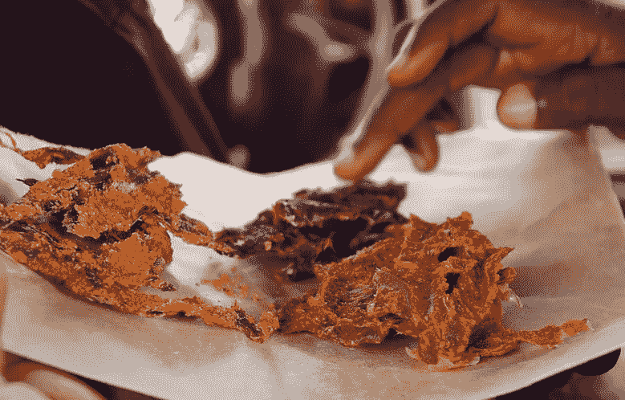

Kilishi (Spicy Beef Jerky)

# 为什么是牛肉干？

在我进入编码领域之前，我尝试过联盟营销。我决定回顾牛肉干，并试图把它卖给志同道合的消费者。我喜欢牛肉干，也喜欢收集数据，所以我觉得把我的兴趣结合起来，为我吃过的牛肉干创建一个数据集会很有趣。我从制造商的网站或肉干包装上收集数据。本文涵盖了使用 python 库 [Pandas](https://pandas.pydata.org/pandas-docs/stable/getting_started/index.html) 、Matplotlib 和 [WordCloud](https://amueller.github.io/word_cloud/) 进行基本的数据清理和探索。

[你可以在这里](https://www.kaggle.com/bendgame/beef-jerky)下载 kaggle 的数据。

你可以从我的 github 下载这个笔记本。

# 导入、检查、清理

## 导入依赖项和数据:

```
import numpy as np 
import pandas as pdimport matplotlib.pyplot as plt
import seaborn as snsimport re
from wordcloud import WordCloud, STOPWORDSjerky_df = pd.read_csv(r"C:\Users\Admin\Downloads\jerky.csv")
jerky_df.head(3)
```

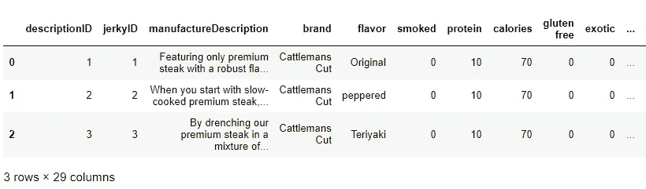

## 创建一个[热图](https://seaborn.pydata.org/generated/seaborn.heatmap.html)来发现具有空值的列:

热图是可视化数据的一种流行方式，因为它们使用从暖到冷的色谱将单个数据值转换为矩阵中的颜色。**下面是一个热图，将非空值显示为黑色，空值显示为白色**:

```
plt.figure(figsize=(8,6))
sns.heatmap(jerky_df.isnull(),cbar=True);
```

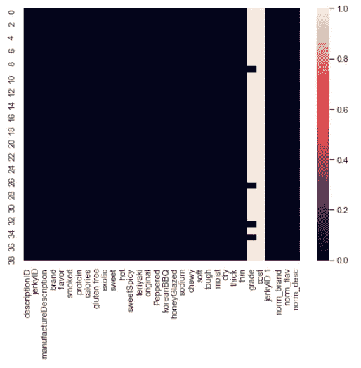

## 检查“品牌”和“口味”列的唯一值

```
print(jerky_df['brand'].unique())
print(len(jerky_df['brand'].unique()))
print(jerky_df['flavor'].unique())
print(len(jerky_df['flavor'].unique()))
```

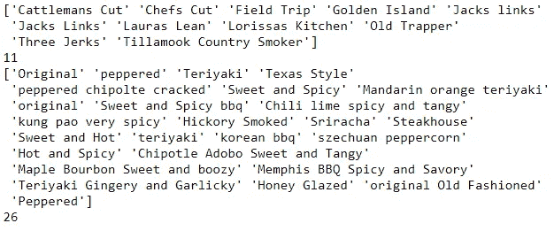

注意数据有点乱。例如，由于大小写不同，品牌“Jack Links”出现了两次。同样，一些味道也可以被清除。特别是因为我们将制作一个单词云，将所有单词都设置为小写是有意义的。

## 创建新列来存储修改后的数据:

```
jerky_df['norm_brand'] = [brand.lower() for brand in jerky_df['brand']]
jerky_df['norm_flav'] = [flavor.lower() for flavor in jerky_df['flavor']]
jerky_df['norm_desc'] = [manufactureDescription.lower() for manufactureDescription in jerky_df['manufactureDescription']]print(jerky_df['norm_brand'].unique())
print(len(jerky_df['norm_brand'].unique()))
print(jerky_df['norm_flav'].unique())
print(len(jerky_df['norm_flav'].unique()))
```

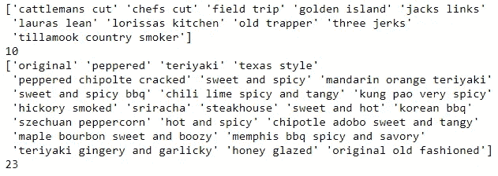

将值设置为小写会将品牌减少到 10 个，口味减少到 23 个。

## 计算一些统计数据

```
print("Sodium Per Serving Mean: " + str(jerky_df['sodium'].mean()))
print("Calories Per Serving Mean: " + str(jerky_df['calories'].mean()))
print("Protein Per Serving Mean: " + str(jerky_df['protein'].mean()))
```

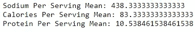

# 探索营养信息

我们可以使用 pandas、matplotlib 和 seaborn 来创建可视化，让我们探索口味、品牌和营养信息之间的关系。

> 某些品牌每份比其他品牌含有更多的钠或卡路里吗？

## 想象钠、卡路里和蛋白质

```
jerky_df[["sodium", "calories", "protein"]].plot.bar(label = 'Nutrition',figsize=(12,8),subplots = True, title = 'Nutrition Information Per Serving')
plt.show()
```

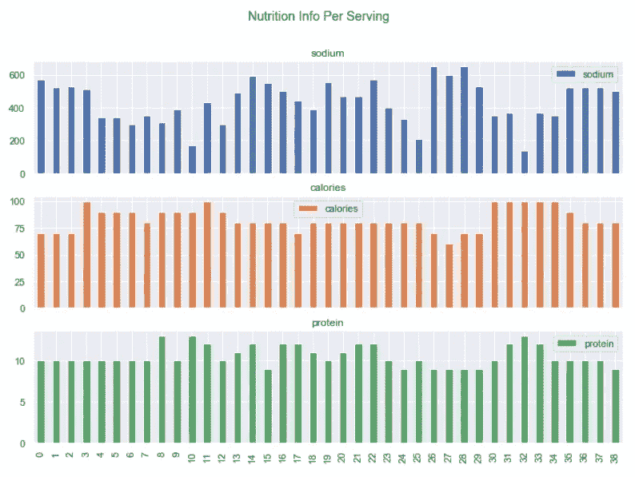

> 看起来钠含量有很大差异，但卡路里和蛋白质含量相当稳定。

## 根据品牌和味道来想象钠

```
#Create new data frame
brand_flav = jerky_df[['norm_brand', 'norm_flav', 'sodium', 'calories', 'protein']]#Group the data
brand_flavg = brand_flav.groupby(['norm_brand']).mean().sort_values(by = 'sodium', ascending=False)
brand_flavg.head()
```

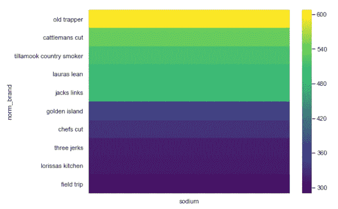

```
#Group the data by brand and flavor
brand_flavg = brand_flav.groupby(['norm_brand', 'norm_flav']).mean().sort_values(by = 'sodium', ascending=False)
brand_flavg.head()
```

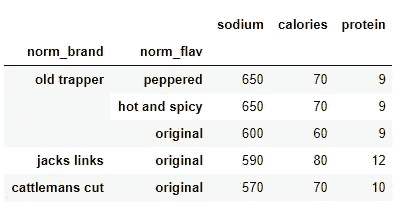

```
#plot the heatmap
plt.figure(figsize=(8,6))
sns.heatmap(brand_flavg[['sodium']],cbar=True, cmap='viridis')
```

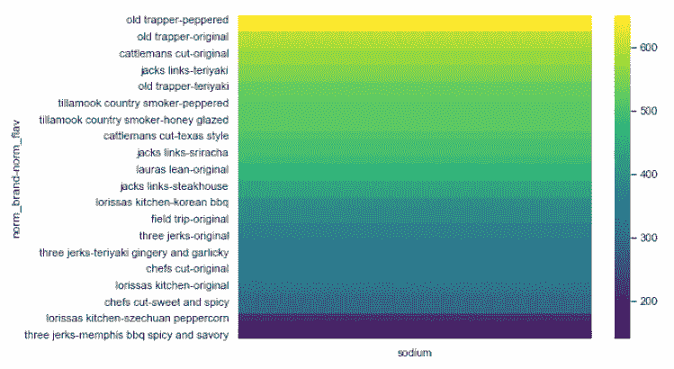

## 根据品牌和口味直观显示卡路里

```
brand_calg = brand_flav.groupby(['norm_brand', 'norm_flav']).mean().sort_values(by = 'calories', ascending=False)plt.figure(figsize=(8,6))
sns.heatmap(brand_calg[['calories']],cbar=True, cmap='viridis')
```

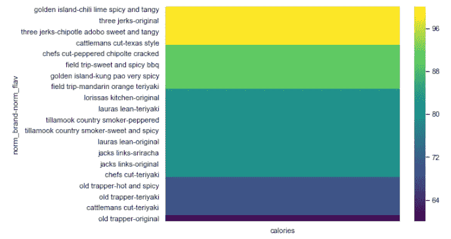

# 用词云分析描述

词云是可视化文本数据的一种有用方式，因为它们使理解词频变得更容易。在葡萄酒描述中出现频率更高的词在云中会显得更大。这是一种提取和可视化关键词的方法。

## 清除描述并检查最高频率

```
clean_desc = []
for w in range(len(jerky_df.norm_desc)):
   #Remove punctuation
    desc = re.sub('[^a-zA-Z]', ' ', jerky_df['norm_desc'][w])

    #remove tags
    desc = re.sub("&lt;/?.*?&gt;"," &lt;&gt; ",desc)

    # remove special characters and digits
    desc = re.sub("(\\d|\\W)+"," ",desc)

    clean_desc.append(desc)

jerky_df['clean_desc'] = clean_descword_frequency = pd.Series(' '.join(jerky_df['clean_desc']).split()).value_counts()[:20]
word_frequency
```

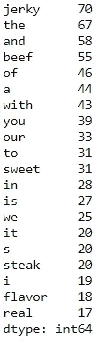

## 拆分文本并删除停用词

停用字词是最常见的字词列表，如“the”和“of”将它们从描述中移除可以突出更相关的常用词。此外，在本文中创建单词云之前，我没有对单词使用词干化或词汇化技术。如果对更高级的自然语言分析感兴趣，[可以看看 t](/analyzing-wine-descriptions-using-the-natural-language-toolkit-in-python-497ac1e228d5) 我的这篇文章。

```
#load stopwords
stop_words = set(STOPWORDS)#add additional stopwords to the set
add_stopwords = ["beef", "jerky", "flavor"]
stop_words = stop_words.union(add_stopwords)#create list of split words
split = []#iterate through using for loop
for w in range(len(jerky_df['clean_desc'])):split_text = jerky_df['clean_desc'][w].split()
    split_text = [word for word in split_text if not word in stop_words] 
    split_text = " ".join(split_text)
    split.append(split_text)
```

## 生成[字云](https://amueller.github.io/word_cloud/)

```
Generate the wordclould
wordcloud = WordCloud(width = 800, height = 800, background_color = 'black',
                          stopwords = stop_words,
                          max_words = 1000,
                          min_font_size = 20 
                          ).generate(str(split))
#print(wordcloud)
fig = plt.figure(figsize = (8,8), facecolor = None)
plt.imshow(wordcloud)
plt.axis('off')
plt.show()
#fig.savefig("wordcloud.png")
```

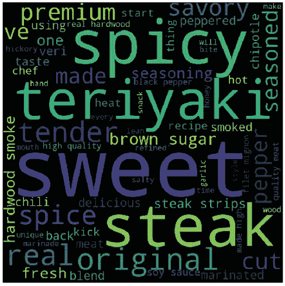

# 最后的想法

使用正确的包，在 Python 中探索和可视化数据是很容易的！Pandas 和 matplotlib 使可视化数据变得容易，WordCloud 简化了识别自然语言中的关键字。使用这些工具，我们能够对牛肉干的营养和风味进行基本的数据分析。

# 谢谢大家！

*   *如果你喜欢这个，* [*跟我上 Medium*](https://medium.com/@erickleppen) *了解更多*
*   [*通过订阅*](https://erickleppen.medium.com/membership) 获得完全访问权限并帮助支持我的内容
*   *我们连线上*[*LinkedIn*](https://www.linkedin.com/in/erickleppen01/)
*   *用 Python 分析数据？查看我的* [*网站*](https://pythondashboards.com/)

[**—埃里克·克莱本**](http://pythondashboards.com/)