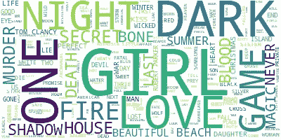
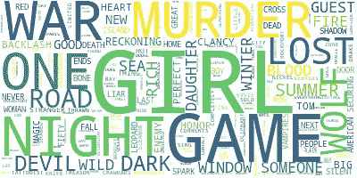
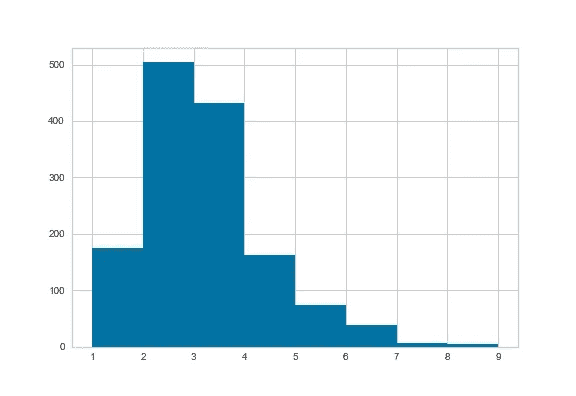
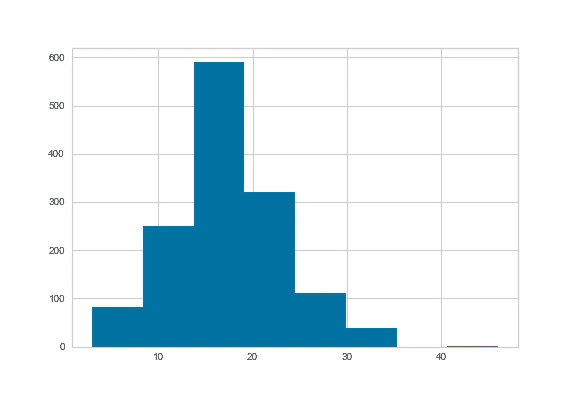
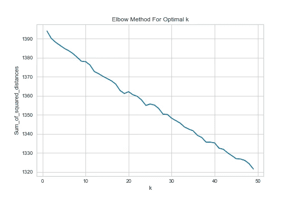
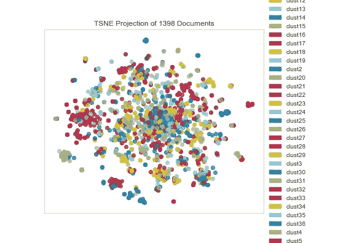

# 探索过去五年的畅销书

> 原文：<https://towardsdatascience.com/exploring-best-selling-books-of-the-last-five-years-8f4740449289?source=collection_archive---------20----------------------->

每周,《纽约时报》( NYT)都会公布小说和非小说类的十大畅销小说。作为一个狂热的读者，我想确定这些列表是否会为未来的阅读提供建议(即它们是否会更强烈地迎合特定的子流派)，并最终回答过去一年多来对我来说最困扰的问题之一:是只有我还是最近的畅销书中有很大一部分包含“女孩”这个词？！

接下来是我用报纸自己的 API 自行策划的 NYT 畅销书数据集的快速探索。这项工作部分受到了其他人的工作的启发，特别是迈克尔·陶伯格([https://medium . com/@迈克尔·陶伯格/how-to-name-a-best seller-6f 7313 fbb 9 e，](https://medium.com/@michaeltauberg/how-to-name-a-bestseller-6f7313fbb9e6))https://towards data science . com/book-titles-are-getting-longer-1c 341 FBD 4829)。我选择考察两个时间段:去年和过去五年，以便挖掘任何潜在的趋势。

正如你对每周出版率的预期，每周出现在列表上的书名没有太大变化。因此，作为第一步，我删除了所有重复的内容。下面的词云显示了前五年剩余语料库中每个词的流行程度。果然，我们马上看到“女孩”这个词在图表中占主导地位。



Best selling title words over the last five years.

仅在去年，这一趋势并没有消失。取而代之的是出现频率更高、主题更黑暗的词汇，比如“谋杀”、“战争”、“迷失”、“魔鬼”，甚至“黑暗”本身。



Best selling title words over the last year.

在这个续集和前传的时代，我们可能还会期待最近看到更长的标题，因为系列附加了修改描述(想想《哈利波特与……》)。事实上，这是勉强正确的，因为五年期间的平均标题长度为 2.74 个单词，而去年增加到 2.79 个单词(逐年分析在这里将被证明是最有用的)。



Distribution of title lengths over the last five years (left) and one year (right).

# **图书描述的聚类**

除了书名之外，API 还提供了对小说适度详尽的描述。有了这些数据，我们应该可以初步猜测这本书的类型。然而，由于最畅销的书籍是那些吸引最广泛的人，我们可能不会期望在这项工作中取得突出的成果。

标题本身的信息内容可能不够密集，无法做出任何准确的判断。因此，我们将使用描述的原始文本。实际上，无论何时处理原始文本，都必须执行标记化、删除常用(停用)单词以及将每个单词简化为最基本形式(词干化/词汇化)的标准预处理步骤。在这里，我们在将标记提交给 TfidfVectorizer 之前这样做，TfidfVectorizer 根据每个标记在所学词汇中的出现频率将其转换为数字特征。通过这种方式，我们已经建立了自己的“书籍相关”语料库，而没有使用任何先前创建的嵌入。

有许多广泛使用和可用的聚类技术。对于这些无监督学习方法中的任何一种，最困难的决定是使用多少个聚类作为起始参数。在我们的例子中，我们可以想象的类型数量肯定是有限的，至少在第一次剪辑时是如此。再说一次，NYT 畅销书排行榜不太可能在可能的子流派的嵌套树中走得太深。(无监督学习的大部分乐趣是看算法能得出什么)。

在最常见的聚类类型 k-means 中，有一些聪明的方法来证明这种选择，比如“肘方法”。该方法试图选择“k ”,使得由下一个最高选择所解释的方差的边际增益第一次降低。换句话说，它选择的转折点，或“肘”在方差图解释对集群数量。使用我们的数据集，多达 50 个集群，我们获得了下图:



Attempt to select the ideal number of clusters using the elbow method.

我们已经可以看到，K-means 很难对聚类进行排序，因为在图中没有可识别的肘部。由于这个原因和其他原因，更常见的是使用剪影方法，该方法使用距离度量(通常为欧几里得距离)来评估聚类的点之间的间隔。接近 1 的轮廓系数意味着良好的分离。然而，同样在这里，我们获得了随着聚类数几乎线性增加的轮廓分数，这表明没有实现清楚的分离。

在我们五年的数据集中，我们有大约 1400 个独特的标题。剩下的最明显的选择是假设在集群之间平均分配，并选择 sqrt(1400)=37 作为第一个猜测。

这样做后，我们可以通过使用 TSNEVisualizer 来证实我们对分离不良的聚类的怀疑，TSNEVisualizer 在二维空间中呈现矢量化的语料库，由预定的聚类着色。



TSNE Visualization of our novel descriptions.

虽然乍一看这看起来很乱，但似乎确实有一些更密集的口袋可能真正捕捉到相似之处。

与 K-means 聚类相比，谱聚类是一种图聚类技术，它使用相似性矩阵来识别聚类，而不仅仅是距离度量。实际上，谱聚类通常更好地分离重叠的数据点；它不太关心它们在空间中的位置，而更关心它们在内容上的相似性。这些声音与我们息息相关；从现在开始，我们将使用谱聚类。

这样做，我们得到了一个在集群中很常见的分布，其中最大的集群使那些比它小的集群相形见绌。

```
Cluster_number Count
0     261
33     88
13     87
36     65
18     64
17     64
2      63
10     59
1      58
19     49
30     48
32     47
24     42
.
.
.
```

我们如何最好地可视化文本聚类以了解它们包含的内容？最好的方法之一是使用华盛顿大学的白蚁 d3 软件包，它可以按主题绘制常用词的流行度或显著性。这个项目的工作主要是用 Python 来完成的，所以我们现在将把自己限制在这种语言上。也许我们可以对每个主题中的单词进行排序，并给出一个或两个单词的中间值？通常，这仍然会导致单词缺乏意义，尤其是当集群的规模很小时。

nltk 包有一个很好的方法，叫做 freqDist，它确定单词在字符串中的频率分布。对于上面显示的最常见的聚类 0，如果我们只对那些长于 5 个字符并且出现超过 3 次的单词进行采样，我们将得到如下列表:

```
Cluster 0:

['america', 'american', 'ancient', 'artist', 'becomes', 'between', 'british', 'criminal', 'dangerous', 'during', 'encounters', 'father', 'follows', 'forensic', 'former', 'friendship', 'herself', 'investigation', 'investigator', 'involving', 'island', 'missing', 'mysterious', 'nantucket', 'parents', 'people', 'private', 'pursues', 'search', 'sequel', 'series', 'summer', 'together', 'treasure', 'vampire', 'wedding']
```

这里当然有很多词，但它们确实非常多样，缺乏一致性。与具有 63 个数据点的更紧密的集群 2 相比，我们开始看到一种模式出现:

```
Cluster 2:

['detective', 'detectives', 'disappearance', 'husband', 'investigate', 'investigates', 'lieutenant', 'murder', 'partner', 'president', 'series']
```

事实上，如果我们访问第 2 类的前 5 个元素的完整描述，我们会得到:

```
Sally Grissom investigates the disappearance of President Harrison Tucker’s wife.
D.D. Warren and Flora Dane investigate whether a pregnant woman shot and killed her husband.
Detective Dave Robicheaux and his new partner Bailey Ribbons investigate the death of a young woman by crucifixion.
Nick Fourcade and Annie Broussard, a husband-and-wife detective team, investigate a boy’s murder and the disappearance of his babysitter.
A television producer investigates the murder of a physician and whether it was his wife who killed him.
```

所有明显的调查秘密！

最后，我们还可以仅使用上面找到的最大聚类的描述作为我们的新语料库来进一步对其进行子聚类。现在我们有了 sqrt(261)=16 个更小的集群。对于其中最大的一个，我们现在有以下常用词和一些描述的样本:

```
['american', 'encounters', 'finds', 'found', 'widow']
A Star Wars saga. Grand Admiral Thrawn must choose between his sense of duty to the Chiss Ascendancy and loyalty to the Empire.
A photographer embarks on a road trip to reconnect with three men she might have married.
Maxim Trevelyan inherits several estates and beds his cleaner Alessia Demachi, an Albanian piano prodigy who has been trafficked into England.
Hans-Peter Schneider pauses his ghastly deeds to seek a dead man’s gold hidden under a Miami mansion, but its caretaker’s surprising skills prove daunting.
Investigations by Leaphorn, Chee and Manuelito overlap in the desert Southwest.
```

我们仍然有单词“american”和“encounters ”,但是比我们最初的集群 0 少了很多。然而，这些描述本身仍然缺乏一致性。

# **结论**

我们研究了《纽约时报》畅销书数据库，揭示了近年来更黑暗主题的趋势。似乎也有迹象表明书名的长度正在增加。然后，我们看了看使用 K-means 和谱聚类基于书籍的描述对书籍进行聚类，并就可视化结果的方法提出了一些想法。虽然出现了一些共同的主题，但似乎没有足够的信息来对流派做出结论性的陈述。

敬请关注后续文章，我们将使用迁移学习来预测 Kindle 书评的极性(积极或消极)!

请在[https://github.com/scjones5/nyt-bestsellers.git](https://github.com/scjones5/nyt-bestsellers.git)找到代码。