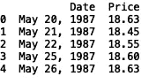
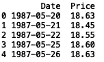
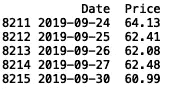
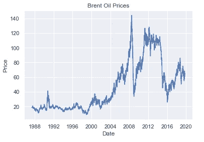
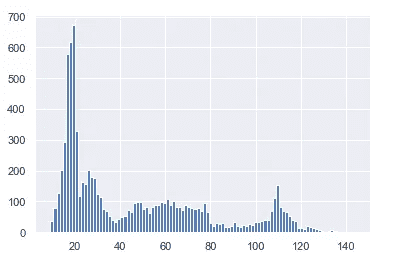

# 使用 Python 探索布伦特原油价格数据

> 原文：<https://towardsdatascience.com/exploring-brent-oil-prices-data-using-python-9742b64aad57?source=collection_archive---------34----------------------->


Photo by [Pixabay](https://www.pexels.com/@pixabay) on [Pexels](https://www.pexels.com/photo/gray-industrial-machine-during-golden-hour-162568/)

在本帖中，我们将对[布伦特油价数据集](https://www.kaggle.com/mabusalah/brent-oil-prices)进行一些简单的探索性分析。我们首先导入 pandas 库并将数据读入 pandas 数据框:

```
import pandas as pddf = pd.read_csv("BrentOilPRices.csv")
```

我们还可以显示前五行:

```
print(df.head())
```



First five rows of Brent oil price data

接下来，我们可以将“Date”列转换为 datetime 对象，并查看前五行:

```
df['Date'] = pd.to_datetime(df['Date'])
print(df.head())
```



First five rows of Brent oil price data with datetime object timestamps

我们还可以查看最后五行数据:

```
print(df.head())
```



Last five rows of Brent oil price data

我们可以从数据中看到，价格是从 1987 年到 2019 年。我们还可以看到有 8，216 行数据。接下来，我们可以使用“seaborn”数据可视化软件包绘制价格与时间的关系图:

```
import seaborn as sns
sns.set()
plt.title('Brent Oil Prices')
sns.lineplot(df['Date'], df['Price'])
```



prices vs. time

我们还可以看看价格的分布:



Histogram of Brent Oil Prices

在下一篇文章中，我们将建立一个简单的回归模型来预测未来的布伦特原油价格。这篇文章的代码可以在 [GitHub](https://github.com/spierre91/medium_code) 上找到。感谢阅读。祝好运，机器学习快乐！