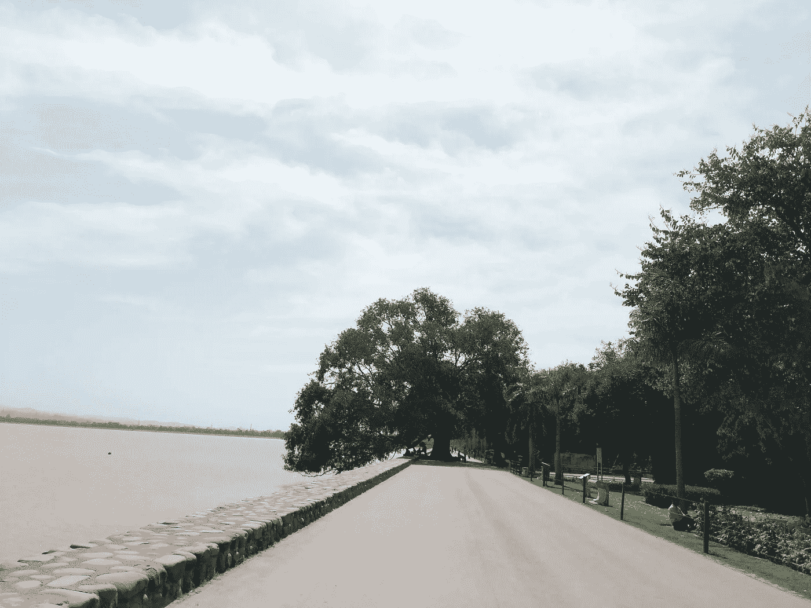
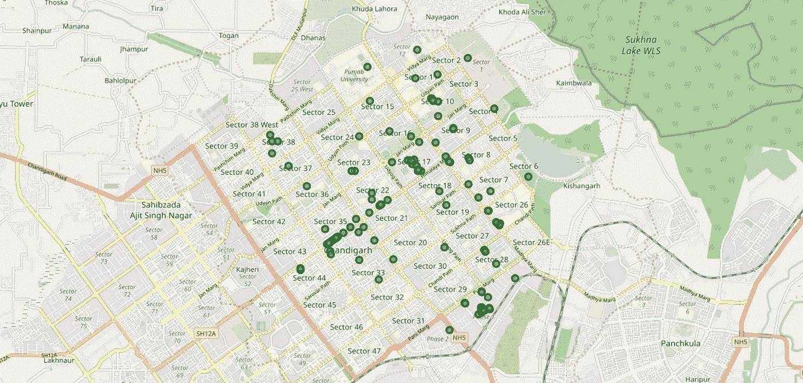
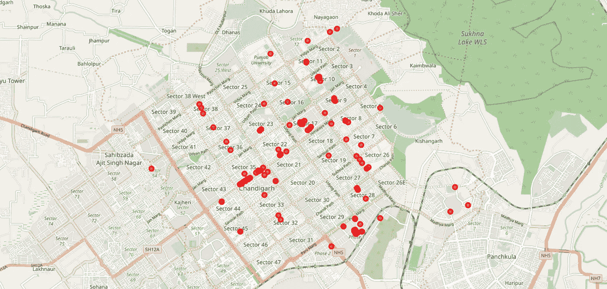
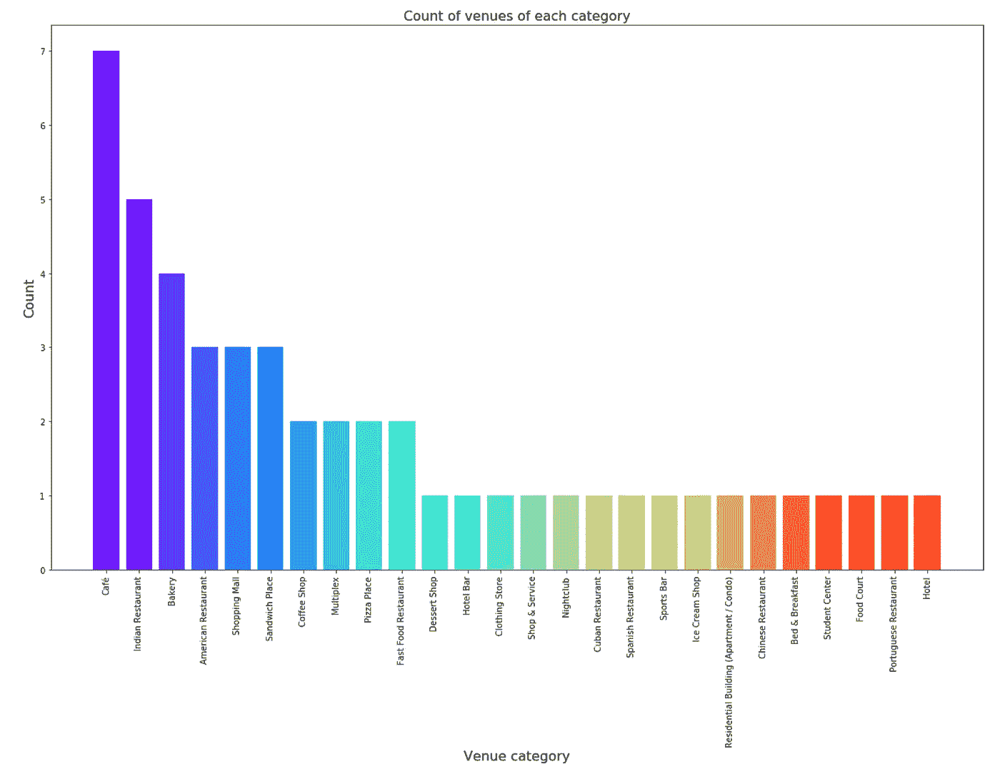
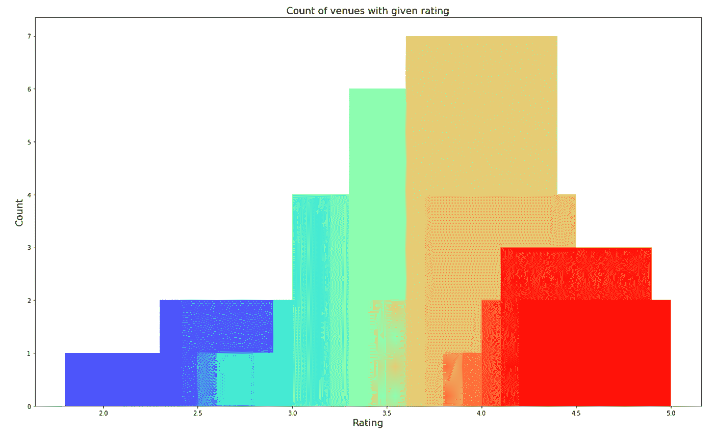
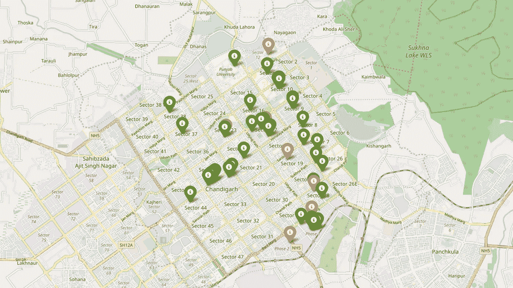
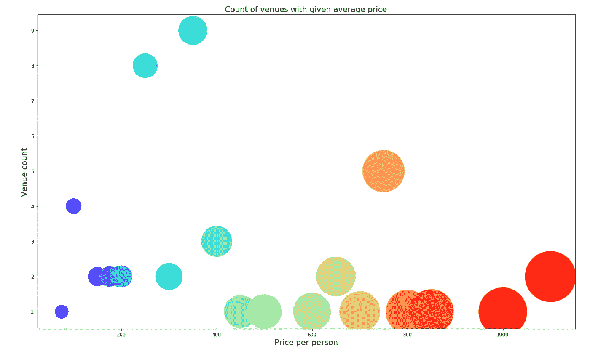
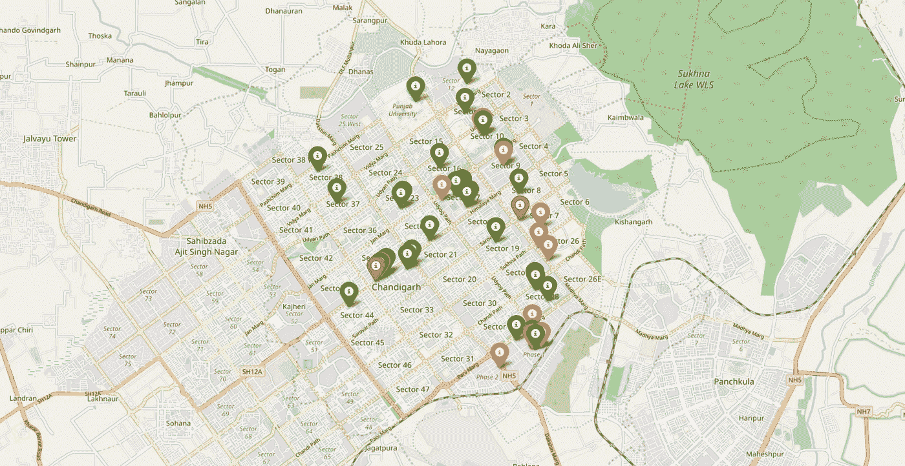
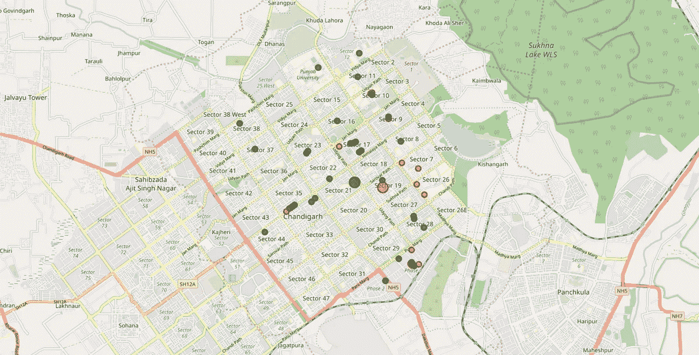

# 使用 Foursquare 和 Zomato API 探索印度昌迪加尔的场馆

> 原文：<https://towardsdatascience.com/exploring-chandigarh-india-using-foursquare-and-zomato-api-1d4501291320?source=collection_archive---------9----------------------->

## 数据科学顶点项目

Sukhna Lake, Chandigarh

作为 IBM 在 Coursera.org 的[应用数据科学顶点](https://www.coursera.org/learn/applied-data-science-capstone)课程的一部分，我参与了一个顶点项目，在这个项目中，我使用 Foursquare API 和 Zomato API 来获取印度昌迪加尔各个场馆的位置、评级和价格信息。在本文中，我将讨论我将来自两个 API 的数据结合起来并从中提取有意义的信息的方法。

 [## kb22/Coursera _ 顶石

### 该库将包括 Coursera 上应用数据科学顶点课程顶点项目的代码。…

github.com](https://github.com/kb22/Coursera_Capstone/blob/master/Exploring%20venues%20in%20Chandigarh.ipynb) 

> 请注意，这些地图可能不会直接出现在 Github 的笔记本视图中，因此您可以通过克隆 repo 并检查`maps`文件夹来检查它们。

# 介绍

在本文中，我们将根据评级和平均价格来探索印度昌迪加尔的场馆。每当一个人游览一个城市时，他们就开始寻找逗留期间可以参观的场所。他们主要根据所有场馆的场馆评级和平均价格来寻找场所，以便这些场所符合他们的预算。因此，我们在这里的目的是确定人们可以参观的地方。

在这里，我们将根据从 Foursquare 和 Zomato APIs 收集的数据以及从 Data Science 应用程序检索的信息来确定适合不同个人的地方。

# 数据讨论

数据是从两个 API 收集的，Foursquare API 和 Zomato API。第一步是在昌迪加尔中心点半径 4 公里的范围内搜寻场地。在使用 Foursquare API 提取了 120 多个位置之后，使用 Zomato API 将纬度和经度值用于获取场地的详细信息。

Venues retrieved from Foursquare API

Venues retrieved from Zomato API

我们看到一些场地重叠，而另一些场地则相距甚远。因此，通过仔细分析，我们决定从两个数据集中删除所有纬度和经度值相差超过`0.0004`的相应地点。完成后，我们发现仍有一些场馆没有对齐，可分类如下:

1.  有些场馆内有 Zomato API(Elante Mall 的必胜客)提供的特定餐厅/咖啡馆。
2.  两个位置如此接近，以至于它们实际上具有相同的纬度和经度值(披萨厨房和 Zara)。
3.  一些场馆已被新场馆取代(Underdoggs 现已被 Brew Estate 取代)。

虽然可以保留属于第 1 类和第 3 类的场馆，但我们应该放弃第 2 类场馆。这给我们留下了 49 个场馆的数据集。

# 方法学

作为第一步，我们从两个 API(four square 和 Zomato)中检索数据。我们从昌迪加尔市中心提取场地信息，最远距离为 4 公里。然后，纬度和经度值用于从 Zomato 获取场馆评级和价格。

基于两个源的名称、纬度和经度值，来自这两个源的数据被仔细地组合在一起。最终数据集将包括每个场馆的评级和价格值。

接下来，我们分析根据每个场馆的收视率和价格创建的数据。我们识别顶级类别类型。我们确定了许多场馆所在的地方，以便任何游客都可以去一个地方，享受在众多场馆选项中进行选择的机会。我们还探索了高评分和低评分的区域，同时还绘制了高价位和低价位场馆的地图。最后，我们根据每个场馆的可用信息对场馆进行聚类。这将使我们能够清楚地确定哪些场馆可以推荐，以及具有哪些特点。

最后，我们将根据游客的评分要求和费用来讨论和总结哪些场馆需要开发。

# 分析

在分析阶段，我研究了昌迪加尔地图上的场馆类别、场馆评级分布和价格区间。

## 种类

当我们从 Foursquare API 中提取类别时，识别城市中最受欢迎的场馆类型真的会很有帮助。我们绘制了同样的柱状图。

看来**昌迪加尔的大多数场所不是咖啡馆就是印度餐馆**。如果游客试图探索其中任何一个，他们是幸运的。

## 评级

接下来我们就来看看场馆的收视率。作为一名游客，你想知道哪些地方有评级较高的场馆。我们可以绘制一个条形图，显示所有场馆的评分和每个评分的计数，以查看所有场馆的平均评分。

我们看到评级范围从`1.0`到`5.0`。剧情揭示**最大场馆评分接近 4** 。游客也可能有兴趣知道高评级场馆实际位于何处。

Venues with different ratings

橙色或红色的场馆等级低于 3 级，而标有绿色或深绿色的场馆等级为 3 级及以上。我们可以看到，很多**高收视率场馆**都位于**第 35** 扇区、**第 17** 扇区附近。 **Elante Mall** 拥有**个分级在全系列**的场馆。另外，**从第 11 区到第 7 区和第 26 区的场馆带有高评级场馆**。

## 价格

接下来，我们使用散点图探索所有场馆的人均价格，以及具有人均平均价格的场馆数量。

从上图我们可以看到，大量场馆的**均价在 200 卢比到 400 卢比**之间。我们还可以根据场馆的价格范围来划分场馆，看看哪些区域有什么价格的场馆。

Venues with different prices

从地块中，我们观察到**35 区和 17 区附近的场馆主要是价格较低的**。靠近**7 区和 26 区的场馆价格很高**。Elante Mall 似乎有高价和低价的混合场地。

## 使聚集

我们现在将根据价格范围、位置等因素对所有这些场馆进行分类，以确定相似的场馆以及它们之间的关系。我们将把场地分成两个独立的组。

从地图上，我们可以看到两个集群:

1.  **第一集群(绿色)**遍布整个城市，包括大部分场馆。这些场馆的**平均价格区间为 1.71，评级差约为 3.57** 。
2.  **第二集群(红色)**分布非常稀疏，场地非常有限。这些场馆的**平均价格区间为 3.21，评级差约为 4.03** 。

# 结果和讨论

在从 Foursquare 和 zoma to T21 API 中收集数据后，我们得到了 120 个不同场馆的列表。然而，并不是两个 API 中的所有场地都是相同的。因此，我们必须检查它们的纬度和经度值以及它们的名称，以便将它们组合起来，并删除所有异常值。这导致场地总数为 49 个。

我们发现，在所有的场地中，**大多数是咖啡馆和印度餐馆**。喜欢咖啡馆/印度餐馆的游客肯定会从昌迪加尔之旅中受益。

虽然评分范围从 1 到 5，**大多数场馆的评分接近 4** 。这意味着大多数餐馆提供的食物质量好，受到城市居民的喜爱，因此表明其评价高。当我们在地图上标出这些场馆时，我们发现**在 17 区、35 区和伊兰特购物中心周围有一簇簇场馆**。这些集群也有**非常高的评级(超过 3)** 。

当我们看一下每个场馆的价格时，我们发现许多场馆的价格在每人 200 到 400 卢比之间。然而，**的价格变化非常大**，整个系列从 100 卢比开始，一直涨到 1200 卢比。根据价格范围在地图上标出场馆，我们发现位于**17 区和 35 区附近的场馆价格相对低于 7 区和 26 区的场馆。Elante Mall 中存在低价和高价的组合。**

最后，通过聚类，我们发现**许多场馆价格相对较低，但平均评分为 3.57** 。另一方面，**少数场馆价格较高，平均评分为 4.03** 。

1.  如果你想找价格便宜、评级相对较高的地方，你应该去 35 区看看。
2.  如果你在寻找最好的地方，有最高的评级，但也可能有很高的价格标签，你应该参观第 7 区和第 26 区。
3.  如果你想探索这座城市，但没有具体的标准来决定你想去的地方，你应该试试 Elante Mall。

公司可以使用这些信息来构建在线网站/移动应用程序，根据搜索标准(名称、评级和价格)为用户提供城市中各种场馆的最新信息。

# 结论

这个项目的目的是探索参观昌迪加尔的人可以探索的地方。已经使用 Foursquare 和 Zomato API 确定了比赛场地，并在地图上进行了标注。地图显示一个人可以参观的三大区域**:**第 35 区**，**第 7 区&第 26 区**和**伊兰特购物中心**。根据游客的场地评级和价格偏好，他/她可以在三个地方中进行选择。**