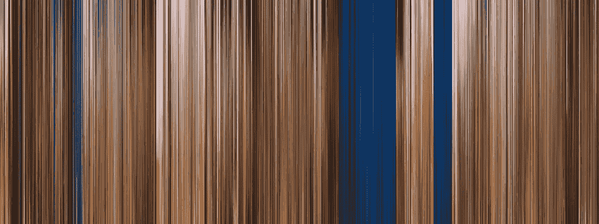
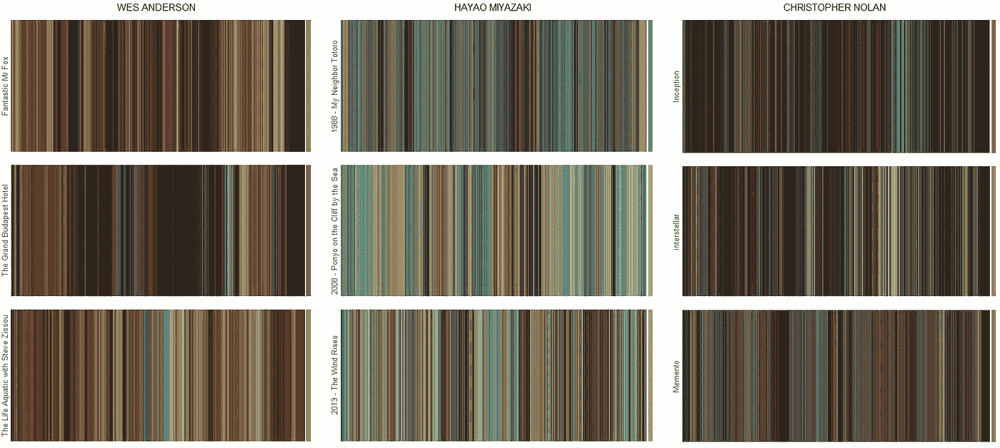

# 用 R 探索电影中的彩色故事

> 原文：<https://towardsdatascience.com/exploring-chromatic-storytelling-with-r-part-1-8e9ddf8d4187?source=collection_archive---------12----------------------->

## 一次丰富多彩、数据驱动的电影色彩世界之旅

你最喜欢的电影的主色调是什么？电影制作人对色彩的运用是如何随着时间而变化的？光看一部电影的调色板就能猜出谁是导演吗？

在电影制作中，**色彩是向观众传达信息最有力的手段之一**。掌握色彩的确至关重要，许多最伟大的导演和摄影师都有丰富的视觉艺术背景。

**颜色可以在我们不知不觉中影响我们的心理和情感。不同的颜色可以用来创造场景中的和谐或紧张，加强导演试图传达给观众的想法，引起对关键视觉主题的注意，展示角色的旅程，等等。**

根据情节、主题、目标观众甚至只是导演的喜好，电影可以是激进的色彩，深入探索整个色轮，也可以是单色的，温和的，遵循完全不同的审美。

从下一章开始，我们将使用**数据驱动的方法**和构建适当的**数据-viz 工具**来探索彩色故事的这些和许多其他观点。
在我们丰富多彩的旅程中，我们将探索一些从著名电影中挑选出来的有趣例子，试图猜测导演选择背后的原因，并通过 **R 脚本**了解能够做些什么。

A glimpse of Wes Anderson’s color aesthetic in The Life Aquatic with Steve Zissou. [©Touchstone Pictures]

> **注**:技术部分已标注*⑇*。如果您想了解文章的主要内容，而不想参与令人讨厌的编码部分，请随意跳过它们！

# 一.一切从哪里开始:数据

## 什么是视频？

V 视频只是连续图像的集合(即*帧*),当以合适的速度再现时，这些图像给人以运动的感觉。每个**视频可以正式表示为一个 4 阶张量**。

图像在数字上被定义为三阶张量，其中每一层都是代表不同颜色通道的二维数字阵列。**因此，图像的颜色由这些通道的组合来定义**。

根据编码的不同，张量的每个单位(即*像素*)可以是实数(HSL，HSB/HSV，归一化 RGB)，也可以是整数(RGB)。为了更好地解释颜色模型，看看[这个](https://www.designersinsights.com/designer-resources/understanding-color-models/)。现在让我们坚持使用 RGB 编码，这是最直观的一种。
RGB 是加色模型，其中**帧由三个颜色通道** : **红色**(R)**绿色**(G)**蓝色** (B)叠加表示。通道的每个单元是 0-255 强度范围内的整数(即 8 位)。

Visual representation of second, third and fourth order tensors in imaging.

## 用 Matlab ⑇实现视频导入和帧预处理

我们要处理的数据是张量。在 R 中检索视频源的张量分量有点棘手；因此，在最初阶段，我们将使用`VideoReader`对象在 Matlab 中工作。

上面的脚本逐帧检查视频源。每一帧都是一个*高* ×宽*×3 张量。因为我们最感兴趣的是**探索整个剪辑**的颜色趋势，而不是关注此时单个帧的调色板，所以我们需要提取的唯一信息是每个帧的**平均颜色**(即 RGB 三色组)**。***

运行这个预处理管道需要一些时间。电影通常以 24 fps(即每秒帧数)显示，这意味着我们每秒钟的视频要处理二十多张图像。假设输入分辨率为 720p，为了获得单个帧的平均颜色，我们必须计算 1280 ⋅720 =921600 像素≃ 1 Mp 的平均值三次(每个通道一次)。所以**得到一秒** **视频需要处理的字节量是** 0.92 Mpixel ⋅24 frames⋅ 8 bit⋅ 3 声道≃ **66 Mb** ！这基本上就是视频源这么重的原因了，对了。

Converting Uma Thurman from frames to RGB spreadsheets. Frames from Pulp Fiction, by Quentin Tarantino. [©Miramax]

一旦处理流水线已经运行，我们最终得到一个三列(即 RGB 平均值)和 *N* 行的逗号分隔值文件，输入视频源的每一帧一个。现在我们准备好出发了！

# 二。弄脏双手:框架线

## 框架线

S 由于我们的输入基本上只是一个**时间序列的颜色**，人们可能绘制的第一件事就是颜色**时间线**。从现在开始，我们将要创建的所有彩色条形码将被称为 ***框架线*** 。基于电影框架的美丽艺术作品可以在这里找到(非常感谢查理·克拉克的灵感！)和这里的。
这是我们在本章结束时能够构建的示例:

Frameline representation of 2001: A Space Odyssey, by Stanley Kubrick.

**每一行代表一组连续帧**的平均颜色，从时间 0(左)开始到电影结束(右)。最后一个瓦片是整部电影的平均色调。**图块的厚度取决于我们想要平均的时间窗口**。如果时间窗口太宽，**有意义的颜色信息会在平均过程中丢失**；如果我们选择一个非常短的时间窗口，过度拟合会使框架线很难解释。如果我们将宫崎骏的*幽灵公主*和*娜乌西卡*的框架线并列，我们可以清楚地看到当采样窗口太宽时，最有趣的颜色变化是如何被洗掉的。

Princess Mononoke and Nausicaa of The Valley of The Wind framelines. In both the movies, blue scenes start to fade out when the sampling window exceeds 100 seconds. As the time window become wider, the main color of the movie kills all the other tones, starting from the less represented ones.

## 在⑇实施框架线

*现在让我们看看如何在 R 中实现所有这些。我们已经有了一个*。csv* 文件，每帧的平均 RGB 值，所以数据导入已经基本完成。*

*现在我们有了一个合适的输入数据框，我们将使用`ggplot2`包来绘制我们的第一个彩色框架线。 **Ggplot 大概是 R** 上最强大最流行的数据 viz 包 **。绘制复杂的框架线需要掌握一点 ggplot，这不符合第一篇文章的目的。无论如何，这里有一个简化但功能齐全的脚本来绘制您的第一个框架线:***

*颜色平均值通常看起来非常暗/不饱和。这是非常生理的，因为场景经常在灰色和暗色调的中性色调下播放，而[今天的电影往往有点无色](https://www.cracked.com/blog/the-annoying-visual-trick-all-films-are-doing-these-days/)。我们可以帮助我们的大脑和眼球使用鲜艳的颜色。这可以很容易地从 RGB 颜色模型切换到**色调-饱和度-亮度** **模型** (HSL)并打开最后两个组件。我们稍后会花一些关于 HSL 的单词。现在，我们只能说`plotwidgets`包中的`modCol`函数使得生动性增强实现非常直接。*

## *框架检查:星球大战传奇*

*现在，让我们通过**检查*星球大战*宇宙**的颜色来让事情变得更有趣。通过对前面的脚本稍加修改，我们可以轻松地构建一个如下所示的可视化地图:*

**

*The Star Wars Saga framelines, starting from first trilogy (1st-3rd row) to Episode VIII (last row).*

*除了是一件我会自豪地挂在我床头的艺术品之外，这本画框集还揭示了乔治·卢卡斯在他史诗般的太空歌剧中使用色彩的大量信息。例如，让我们把注意力集中在使用更非典型调色板的那一集:*《帝国反击战》*(第二排)。*

**

*The Empire Strikes Back frameline with some manually extracted key frames. [©Lucasfilm LTD]*

*在这一集《天行者的奥德赛》中，我们的英雄穿越银河系，在三个不同的地方着陆:*霍斯*、*达格巴*和*云城*。在这里，乔治·卢卡斯巧妙地将不同的主色与每个地点联系在一起:耶鲁蓝代表冰冷的霍斯，深绿色代表沼泽，淡紫色代表云城。**不同的颜色有助于展示故事的空间过渡**、**但它们也设定了每个部分的基调**、**调整饱和度和亮度**:卢克在*达戈巴*沼泽的自省时刻没有周围部分那么饱和，每次原力的黑暗面上升，暗色调就占主导地位。在整个故事中，这些图案可以被观察到几次，给它一些颜色一致性。*

**

*The most vivid and intense point of the entire saga. Can you spot it on the framelines map? [©Lucasfilm LTD]*

*在每一部三部曲中也可以观察到颜色的一致性:在第一部三部曲中主要的**色调是冷的**，在前传三部曲中切换到更加温暖的**色调**，在著名的*穆斯塔法*决斗中高潮达到了一个强烈的火红色。让我们试着想象一下这些趋势。*

## *摘要图块:色调、亮度和饱和度*

*在前面几节中，我们提到 RGB 不是唯一的颜色模型，也不是我们最感兴趣的颜色模型。只是简单直观而已。要检查有趣的颜色趋势，从 RGB 模式切换到 HSL 模式可能是个好主意。**色调**(H)**明度** (L)和**饱和度** (S) 实际上是我们谈论色彩故事时最重要的一些颜色属性。*

**

*Bicone representation of the HSL color space. [from Wikipedia]*

*HSL 颜色空间可以被视为一个**双锥**，其中每个点(即颜色)都在一个**圆柱坐标系**中表示，其中 S∈**【0，1】，L∈【0，1】和 H∈【0，360】。虽然我们都知道饱和度和亮度的含义，但色调的定义可能有点模糊。国际照明委员会(CIE)将色调定义为*一种刺激与被描述为红色、绿色、蓝色和黄色的刺激相似或不同的程度*。我们基本上可以称之为*色影。****

***这三个通道/属性中的每一个都可以被隔离，将其他的设置为固定值:例如，我们可以通过将亮度通道设置为 0.5(半强度)并将色调通道设置为 0(即纯红色)来检查每一集的平均饱和度值。亮度和饱和度通道可能会被重新缩放，以显示电影之间的差异。这种检查可以以**摘要区块**的形式可视化，其中每个方块代表一个不同的情节。***

******

***Summary tiles for saturation (left), brightness (middle) and hue (right) channels of the Star Wars saga. From top to bottom: Sequel Trilogy, Prequel Trilogy, Original Trilogy.***

***上面显示的摘要图块证实了我们上面所说的关于色调的内容。此外，我们可以清楚地看到，与第一部和第二部相比，前传三部曲显得不那么黑暗和高度饱和。相反，续集三部曲的前两集是整个传奇中最黑暗、最不饱和的章节，*第七集:原力觉醒*获得了两个类别的第一名。**将所有的帧线合并在一起，平滑产生的时间序列，可以更好地检查 HSL 通道随时间的趋势**。***

******

***Saturation (left), brightness (middle) and hue (right) channels trend over time in the Star Wars saga.***

***在这一点上，**开始猜测下一集将会如何**可能会很有趣。考虑到每个三部曲的第一章和第三章都没有第二章那么饱和，我们可以预期第九集的饱和度会更低。关于色调，色块矩阵是非常对称的，因此很难说电影的温度会是多少；考虑到整个故事的基调，我们可以推测一个不那么温暖的红色基调。
下注吧，12 月底见，看谁是赢家！***

# ***三。找点乐子:电影和导演比较***

## ***彩色指纹:韦斯·安德森和宫崎骏***

***既然我们知道如何收集电影色彩中的暗示，让我们来看看一些最具代表性的导演的作品和他们的电影。许多电影制作人已经形成了一种独特的美学风格，通过在他们的作品中使用调色板很容易辨认出来。在最近的电影导演中，最引人注目的是韦斯·安德森和他的传奇故事。***

******

***Fantastic Mr Fox, by Wes Anderson. [©20th Century Fox, palettes from [here](http://moviesincolor.com/)]***

***安德森非常喜欢柔和的色调，他将这些颜色运用到了几乎所有的场景元素中。这让他完全垄断了自己电影的意义和潜台词。***

******

***Color fingerprints of three contemporary directors: Wes Anderson, Hayao Miyazaki and Christopher Nolan.***

***有许多有意识和无意识的偏见导致导演在他/她的职业生涯中选择类似的调色板。例如，自然和生态是宫崎骏思想的里程碑，这清楚地反映在他在绝大多数杰作中使用的调色板上。***

## ***颜色象征:矩阵***

***与导演的情况类似，电影和电视节目也可能会使用特定的调色板；一些电影对特定颜色的运用如此之多，以至于他们最终将自己与这些颜色联系在一起。例如，让我们想想绿色的。你联想到的第一部*格林*的电影是什么？还有为什么是*矩阵*？***

******

***Framelines of The Matrix trilogy, by The Wachowskis.***

***《黑客帝国》可能是电影摄影中最明显和最著名的色彩关联案例之一，因为虚拟世界中发生的每个场景都是绿色的**，灵感来自老式显示器的磷绿色。色彩象征在沃卓斯基的作品中强烈而明显；事实上，绿色并不是我们看到的唯一主色:当场景从矩阵转移到现实世界时，绿色完全被深蓝色调色板所取代。*****

******

***Chord diagrams of color hues transitions in The Matrix trilogy. The dominance of green fades away in the third episode, where the plot is almost entirely set in the real (blue) world.***

***这一选择背后的原因当然不是随机的:在色彩心理学中，**黄色的绿色与恶心和疾病联系在一起，而蓝色的色调应该让观众感觉更舒服**。从这个意义上说，通过将尼奥的正常存在设定为一种病态的、幽闭恐惧症的绿色，我们可以欣赏现实世界以其蓝色色调提供的新鲜感。相反，亮度对比是用来提醒观众，与《黑客帝国》的虚假和受控环境相比，现实是多么富有戏剧性。***

******

***The Matrix vs Reality. Color palettes extracted automatically using k-means. [© Warner Bros]***

## ***滑过色谱:哈利波特传奇***

***说到绿色:你有没有注意到最新的哈利波特电影有多绿色？嗯，事情并不完全是这样开始的。***

******

***Framelines of The Harry Potter saga. Can you spot the Dolores Humbridge’s office scene?***

***实际上，**《哈利·波特》很好地总结了我们之前说过的关于颜色的所有东西。不同色彩的巧妙运用清楚地定义了人物和地点:例如，想想霍格沃茨的四所房子、咒语和教师办公室。在传奇故事中，**的导演们探索了整个色彩光谱**、，从明亮、温暖的红棕色慢慢褪色为黑暗、无菌和冷绿色，在传奇故事的中间穿过一些蓝色。从这个意义上来说，看看**颜色如何随着角色一起演变，随着事件的发展变得越来越冷、越来越暗是很有趣的。*******

******

***Harry’s character color evolution from The Philosopher’s Stone to The Deathly Hallows. [© Warner Bros]***

***JK 罗琳以一本儿童书开始了这一切，孩子们在魔法世界里奔跑尖叫。为了捕捉这种氛围，之前以执导《独自回家》而闻名的克里斯·哥伦布决定使用温暖明亮的调色板。**至于书，故事很快成长成熟，随着哈利长大成人变得越来越复杂和悲剧**。这清楚地反映在后续导演的色彩选择上，正如《传奇》中亮度成分的单调下降趋势所指出的那样。***

******

***Brightness trend over the entrie Harry Potter saga. The set slowly become darker and darker, with the only exeption of the Harry and Dumbledore Talk at King’s Cross scene.***

# ***结论***

***这里是我们半音阶探索的第一部分结束的地方。我们看到**在电影**、**中有许多使用色彩的方法，并且可以开发许多不同的技术来探索这些方法**。为了收集这个项目中使用的所有函数，并使它们在 R 环境中易于访问，我构建了一个名为 **c *hromaR 的 **R 包**。*** 跳转到 [**第二部分**](https://medium.com/@detsutut/the-chromar-package-892b716ee2c9) 如果你想了解更多！***

*** [## 用 R 探索电影中的彩色故事:ChromaR 包

### 关于如何生成电影框架线和许多其他彩色数据的实用见解

medium.com](https://medium.com/@detsutut/the-chromar-package-892b716ee2c9)  [## Tommaso Buonocore -作者-走向数据科学| LinkedIn

### 查看世界上最大的职业社区 LinkedIn 上 Tommaso Buonocore 的个人资料。托马索列出了 5 项工作…

www.linkedin.com](https://www.linkedin.com/in/tbuonocore/)***