# 使用 ICAs 从 fMRI 数据中识别静息状态网络

> 原文：<https://towardsdatascience.com/exploring-cognitive-differences-via-resting-state-networks-2112bf5291e2?source=collection_archive---------15----------------------->

## 实践教程:从数据收集到特征提取

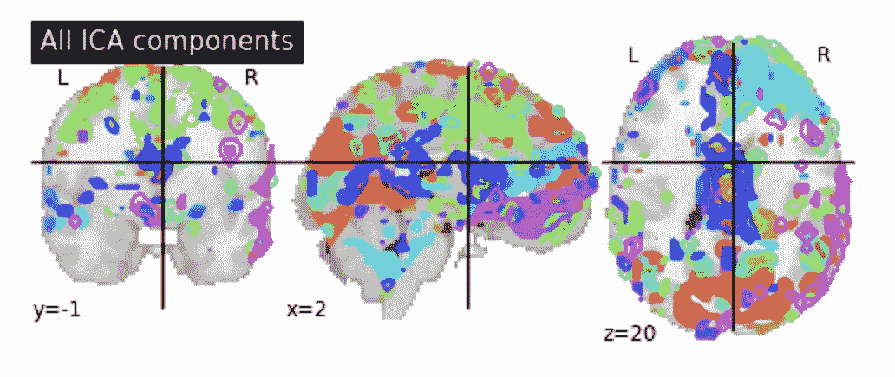

本教程通过分析 fMRI 数据的基本实践教程，提供了对神经影像研究合理实践的深入了解。我讨论(1)提出一个合适的研究问题，(2)数据收集，(3)质量控制，和预处理(4)特征提取。

*下一个 post-* [*使用具有 rs-fMRI 数据的 LSTMs 从健康对照中分类 ADHD*](/classifying-adhd-from-healthy-controls-using-lstms-with-rs-fmri-data-300c1f3e9697?source=your_stories_page---------------------------)集中于数据分析*。*

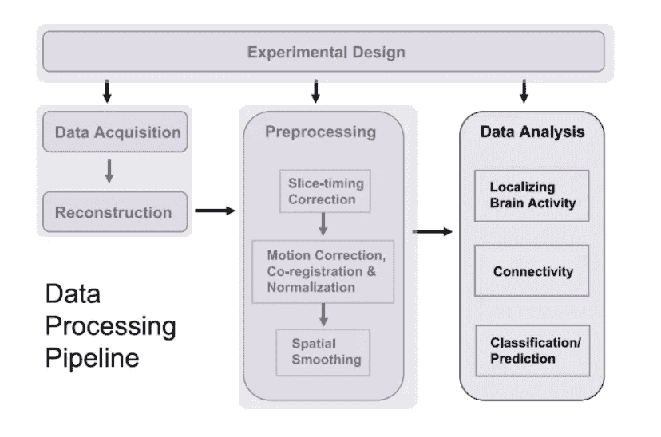

A neuroimaging study pipeline (Lindquist, 2008). This tutorial (#1) focuses on the steps highlighted in purple.

**本教程的代码可以在** [**这里**](https://github.com/karnigili/NetworksNeuroscience) **找到。**做好准备，请下载 [freesurfer](https://surfer.nmr.mgh.harvard.edu/fswiki/DownloadAndInstall) 、 [docker](https://docs.docker.com/) 、以及 [python](https://www.python.org/downloads/) 。

我选择检查精神分裂症(SZ)患者的静息状态网络，并将其与这些健康人进行比较。

> 我很好奇精神分裂症是否表现出功能上的差异，主要是这种差异是否能在静息状态的网络中找到。

我认为这是一个有趣的问题(也是 fMRI 分析教程的一个很好的案例研究)，因为它通过探索已知与异常神经回路相关的疾病，提供了对功能连接性分析的见解(Yu 等人，2012)。

## **数据收集**

不，这部分与 MRI 机器的操作无关，而是集中于提供现有扫描供公众使用的各种在线资源。其中 [openfMRI](https://www.openfmri.org) 、 [Oasis](https://www.oasis-brains.org/) 、 [openNeuro](https://openneuro.org/public/datasets) 、 [1000 功能连接体项目](http://www.nitrc.org/projects/fcon_1000/)。

大多数数据集呈现原始的、去标识的数据，而有些数据集包含一些预处理脚本。有用的数据集将按照某种标准进行组织；常见的是[脑成像数据结构](http://bids.neuroimaging.io/) (BIDS)格式。在 BIDS 格式的数据集中，您可以看到按层次结构组织的文件:首先是主题 id，然后是扫描类型，然后(如果适用)是与每种扫描相关的不同任务或运行。文件本身最有可能是 NIFTI 文件(神经成像信息学技术倡议)或压缩的 NIFTI 文件(。nii 或. nii.gz)。

我使用[来自 openneuro 的这个数据集](https://openneuro.org/datasets/ds000030/versions/00016)。它包括对 290 名被诊断患有各种生理精神疾病(精神分裂症、双相情感障碍、多动症、抑郁症、创伤后应激障碍等)的个人以及健康对照组的扫描。除了各种条件之外，该数据集还包括捕捉不同任务的几种类型的扫描。为了探索上面提出的研究问题，我选择关注 SZ 患者的静息状态 fMRI 扫描。

fMRI 数据由 3T 西门子 Trio 扫描仪获得。扫描参数如下-层厚=4 mm，34 层，TR=2 s，TE=30 ms，翻转角= 90°，矩阵 64×64°，FOV=192 mm，斜切面取向。在静息状态扫描期间，参与者被要求保持放松并保持睁开眼睛；在扫描过程中，他们没有受到任何刺激，也没有被要求做出反应(Poldrack，2016A)。

从数据集描述中，我们可以看到 T1w(解剖学)扫描已经被使用[free surfer MRI _ defage](https://surfer.nmr.mgh.harvard.edu/fswiki/mri_deface)篡改(通过面部特征移除匿名化)。根据定义，损坏的数据之前经过了一些预处理。理想情况下，处理原始数据可以确保更加统一的预处理，但是如果不是这样，那么了解已经采取了哪些步骤是非常重要的。

因为这篇文章关注的是数据准备，所以我使用数据的一个子集来演示这个教程。一名 SZ (sub-50006)和一名对照(sub-10228)受试者。数据目录(根据投标组织)应如下所示:

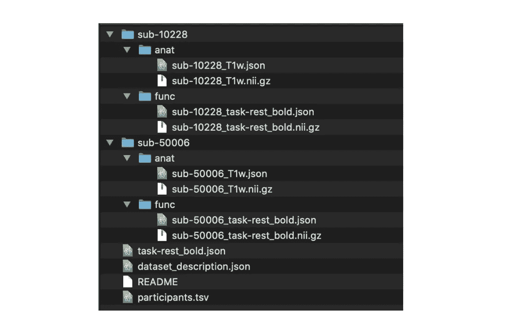

BIDS formatted data

目录，这包括数据集描述、主题人口统计信息表和任务描述文件。

让我们看看我们的数据。

NIFTI 图像包含一个头，它可以很好地为您提供关于图像的大量元数据。当我们需要校正图像的噪声和其他失真时，这些信息将变得很方便。(更多详情[此处](https://nifti.nimh.nih.gov/pub/dist/src/niftilib/nifti1.h))

我们还可以通过元数据找到扫描的切片数量(Z 轴的尺寸)和 TR。TR: 2.0，切片数:34。(万岁，这些数字似乎与作者报告的数字相符)。

此外，我们可以使用 freesurfer 轻松地将它们可视化。通过检查图像，我们可以识别扫描中的明显问题(奇怪的方向、伪像、对比度差，甚至图像缺失)。有一些工具允许自动执行这样的质量控制(我们将很快讨论它们)。

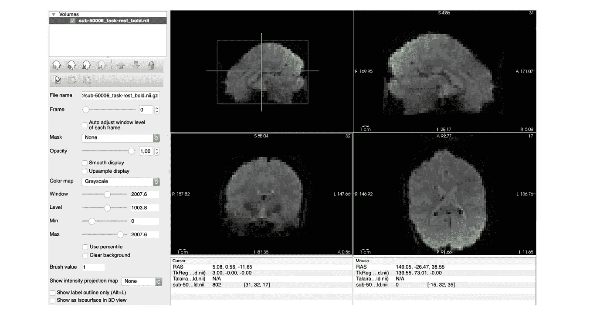

## 质量控制和预处理

在运行预处理管道之前，让我们看看手头数据的质量。质量控制(QC)有助于检测存在严重问题的图像，如伪影或严重失真。

用于分析大规模网络的数据的质量控制特别关注时间一致性。Power 等人(2011 年)详细介绍了几个图像质量指标(IQM ),重点是识别非伪相关性。我使用一个名为 [mriQC](https://mriqc.readthedocs.io/en/stable/index.html) 的软件，因为它根据同行评审的出版物(其中包括 power 等人，2011；Krüger 等人，2011 年)。下表描述了与确保时间一致性和避免虚假关联相关的 IQMs。包含坏的伪像或非常低的 SNR 的图像将被排除，而其余的进入预处理管道。在预处理期间将使用 DVARS 和 FD 来形成时间掩模(即，突出显示要移除的特定切片)。

*IQMs*

**SNR** (信噪比)

*   这是主要的空间度量。使用结构数据提取信号功率与噪声功率的比值。SNR 对于估计统计功率很重要。
*   它计算噪声均方根的信号幅度。较高的值表明重复测量的信号更稳定，因此测量的可靠性更高。

tSNR (时间信噪比)

*   报告时间序列的时间进程 SNR 的中值。
*   它计算平均 BOLD 信号(跨时间)与其对应的时间标准差图之间的比率。
*   当稍后使用数据来比较信号变化时，tSNR 很重要(低 tSNR 可能会使数据产生偏差)

**DVARS** (方差的导数)

*   衡量大脑图像的强度与之前的时间点相比变化的程度。因此，它是一个时间度量。
*   它通过体素上的导数 RMS 方差来索引 BOLD 的变化率。具有异常高值的切片被标记为排除。

**FD** (框架式位移)

*   测量头部在连续帧之间的位置变化量。
*   它计算重新校准参数的导数的绝对值之和。具有异常高值的切片被标记为排除。

该命令为您的数据目录中的所有参与者运行 QC-这是一个漫长而繁重的计算。请确保分配足够的资源(或逐个磨合)。

在查看指标之前，我先看一下结构化的可视化报告。从报告中获得的关键信息是污损过程(此处可见粗体噪声可视化上的黄色标记)。

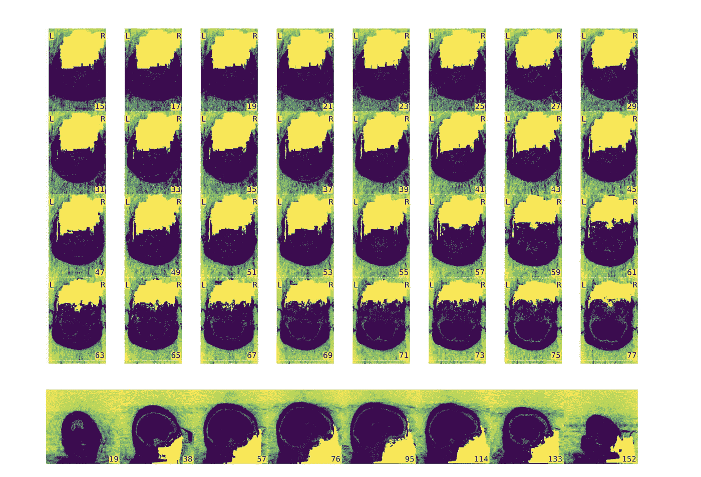

Defaced structural data

功能报告报告一段时间内的 DVARS、FD 和异常值测量值。这些图表表明，sub-10228 提供了比 sub-50006 更清晰的扫描。

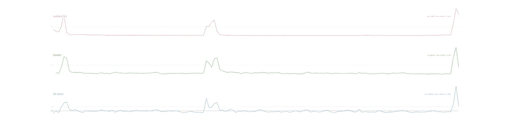

sub-10228 noise measurements. DVARS max:89 mean:24.4 FD- max:2.3 mean:0.2

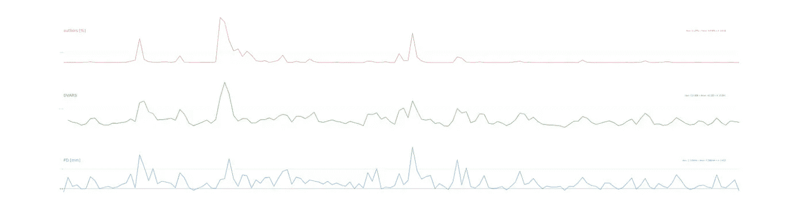

sub-50006 noise measurements.DVARS max: 131.9 mean: 42.2 FD- max:2.7 mean:0.58

组功能报告揭示了 tSNR 和 SNR 的高值。

在检查数据并确保我们对其质量满意之后，让我们执行预处理。

我使用 [fMRIPrep](https://fmriprep.readthedocs.io/en/stable/index.html) ，因为它试图提供一个标准化的预处理管道，并解决 fMRI 数据的健壮和可重复预处理的挑战。fMRIPrep 是一个独立于分析的工具，它为 fMRI 数据提供了一个灵活、最小且健壮的管道。此外，它是易于使用的开源软件，对其局限性和发展保持透明的讨论。

请注意我使用的标志- '- -fs-license-file '向 fMRIPrep 指示您的 freesurfer 许可证文件在哪里，- -fs-no-reconall '跳过 freesurfer 重建步骤(它有些错误，在这里不是必需的)，而'- -output-spaces '定义了从其重新采样数据的解剖空间(T1w 指的是图像本身，fsaverage5 指的是 free surfer 模板，而 template 指的是 MNI 地图)。

类似地，这个命令为数据目录中的所有**参与者运行 fMRIPrep。要注意。fMRIPrep 很重。更多信息[点击这里](https://fmriprep.readthedocs.io/en/stable/faq.html)。**

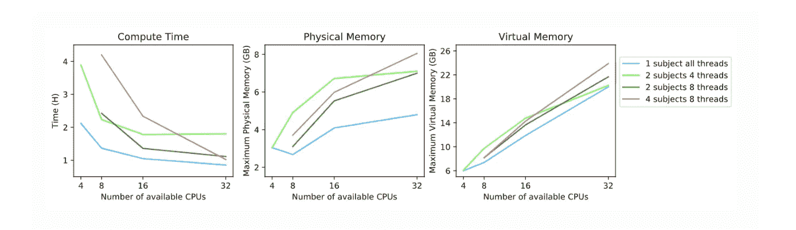

fMRIPrep computing time under different conditions

fMRIPrep 在其管道中使用结构和功能映像。它输出头部运动校正、切片定时校正后的图像，并与同一受试者的结构空间对齐，符合蒙特利尔神经研究所(MNI)的空间。MNI 是一个标准化的空间，允许将不同的大脑标准化为一个单一的、可比较的图。

简而言之，fMRIPrep 管道。更多信息请访问[文档](https://fmriprep.readthedocs.io/en/stable/workflows.html#)。

*   分析 T1w 图像以检测脑屏蔽和**脑组织分割**

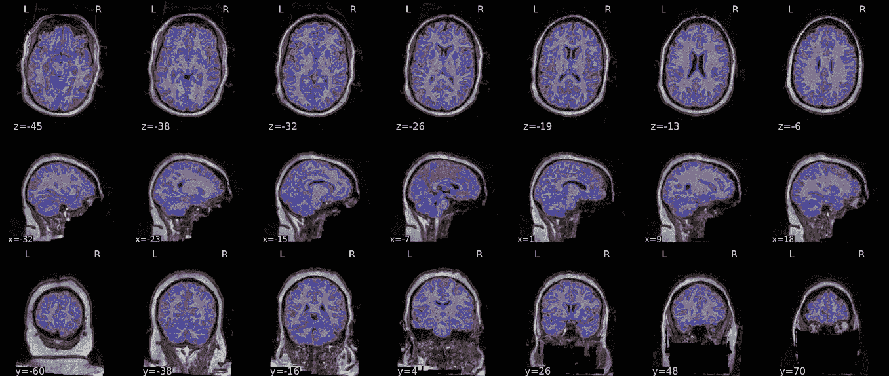

*   T1w 参考扫描用于**空间标准化**。图像将被映射到它们的原生空间以及 MNI(以及您通过标记'- **输出空间**')指定的任何其他空间)

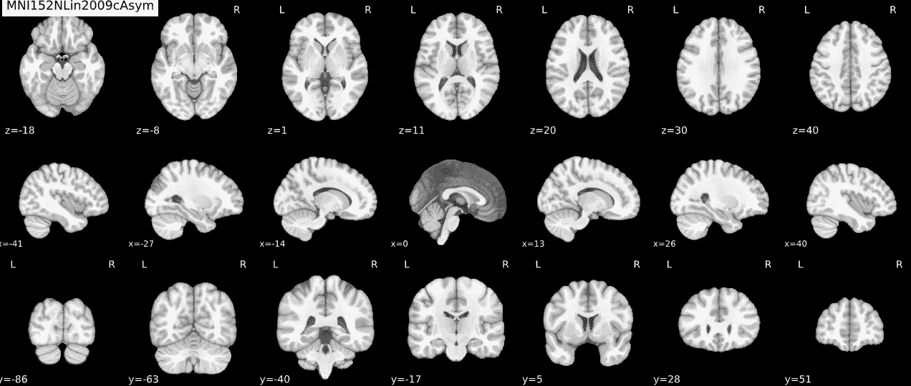

*   第一个功能性重新对准通过使用 [FSL 的 MC flight](https://fsl.fmrib.ox.ac.uk/fsl/fslwiki/MCFLIRT)算法来建立运动校正，以**头部运动**为目标。

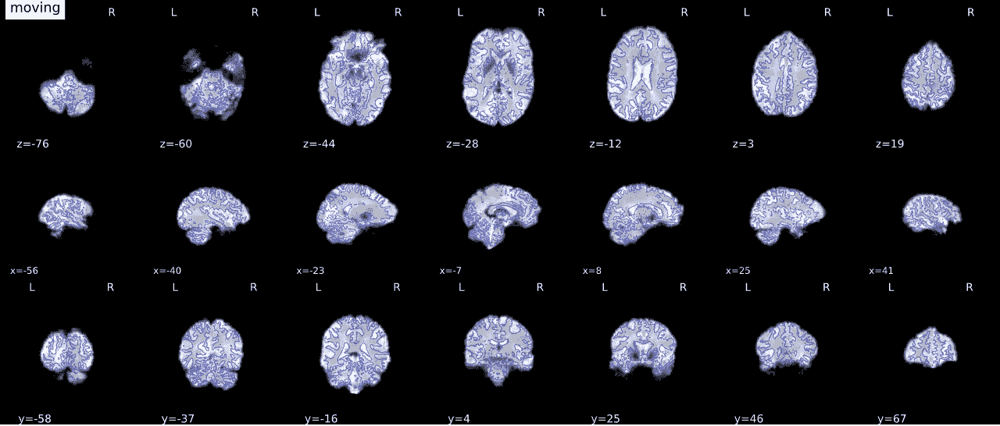

*   使用 [AFNI 的 3dTShift](https://afni.nimh.nih.gov/pub/dist/doc/program_help/3dTshift.html) 功能进行切片时间校正，以便**将所有切片在时间**上重新对齐到每个 TR 的中间。
*   磁化率失真校正(SDC)集中于**修正由扫描仪内部磁场不均匀性引起的空间失真**。
*   超过 0.5 mm FD 或 1.5 标准 DVARS 阈值的帧被**标注为**运动异常值。

这些步骤的顺序支持更稳健的校正(Power 等人，2012 年)。

比较原始数据和预处理数据的 DVARS、FD 和异常值测量，我们看到预处理减少了数据中的噪声。

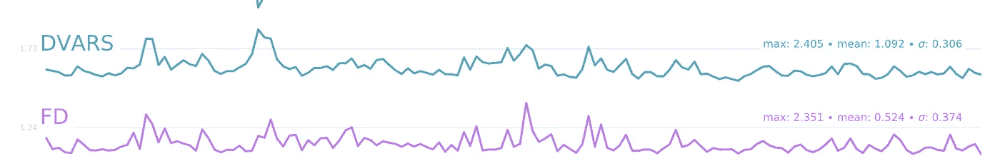

sub-50006

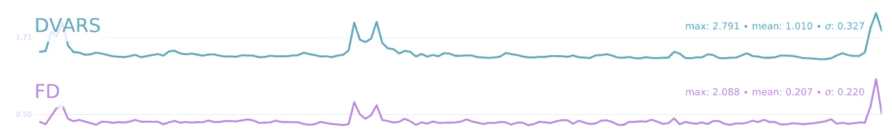

sub-10228

## 特征提取:静息状态分析方法

一旦数据被清理、去噪和预处理，我们就可以(最终)识别连通性特征。请记住，静息状态网络在空间独立的区域中表现出相关的时间模式(Jandric 等人，2018)。检查这种相关性模式的两种常见方法是基于种子的相关性分析(SCA)和独立分量分析(ICA)。SCA (Biswal 等人，1995 年)是一种基于模型的方法；因此，它需要先验地将大脑划分为感兴趣的区域(ROI)(Lee 等人，2013)。SCA 特别有用，因为它实施起来很容易，解释起来也很简单(Soares et al .，2016)。基本上，它使用先验选择的种子区域的时间序列来识别全脑功能连接图(基于指定的 ROI)。另一方面，ICA 是一种无模型的方法，并将来自整个大脑的数据分解为已识别信号的时间过程和空间图。这些信号，即独立分量，是展现最大空间独立性但随时间共同变化的区域的集合(Cole 等人，2012；史密斯等人，2013 年)。

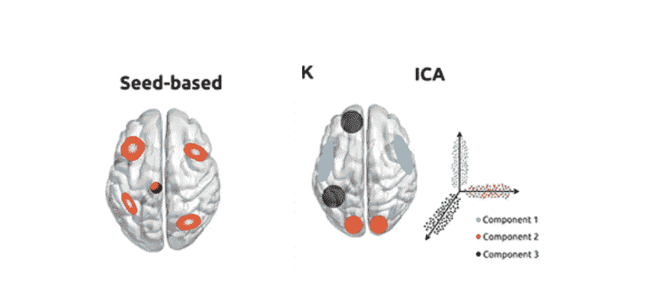

Commonly used analysis methods in functional MRI studies (Soares et al., 2016)

[Nilearn](https://nilearn.github.io/index.html) 是一个 python 库，支持这些(以及许多其他)神经影像分析方法。

首先，我们需要上传预处理过的图像:

这些工具是我们需要的，以便得到一个地区地图集，并产生一个相关矩阵。如上所述，在 SCA 中，我们使用先验图谱，而在 ICA 中，我们基于数据集创建一个图谱。

第一个函数创建一个掩码。我喜欢尼尔对面具的定义。他们让我们“把掩蔽物体想象成瑞士军刀，用于将 3D 空间中的原始神经成像数据塑造成与手头的研究问题相关的观察单位”。屏蔽器将只过滤我们感兴趣的数据部分。掩蔽者使用图谱来转换 fMRI 扫描。

事实上就是这样。变换的 fMRI 扫描反映了区域到时间步长的 2D 矩阵(即[10，160]将反映跨越 160 个时间步长的十个区域的值)。

但是为了有一个好的、简单的、可视化的效果——我们计算提取区域的相关矩阵并绘制它(第二个和第三个函数)。

**SCA 分析**

我包括两种类型的地图集。第一个是哈佛-牛津概率图谱(Makris et al .，2006；弗雷泽等人，2005 年；Desikan 等人，2006 年；Goldstein et al .，2007)，第二个是 Smith 的 ICA 功能图(Smith et al .，2009)。

哈佛-牛津图谱基于 MNI 定义的区域，因此展示了众所周知的大脑区域的先验分割。另一方面，史密斯的图谱反映了独立分析静息态 fMRIs 及其显示的激活大脑动力学产生的区域。因此，它介于 SCA 和 ICA 之间。它确实提供了一个独立于当前数据的掩码，但是它的起源是在一个相似数据集的 ICA 中。

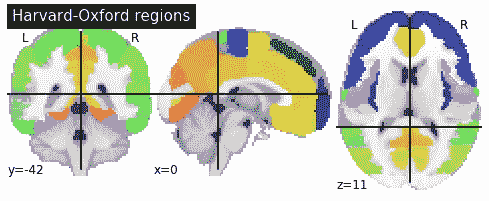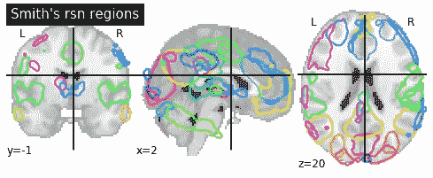

我们使用这两个地图集来创建基于提取区域的面具。计算它们相应的相关矩阵并绘图。

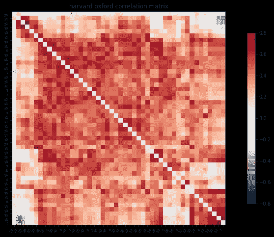

**ICA 分析**

在 ICA 中，我们不是导入地图集，而是使用数据集本身来计算它们。

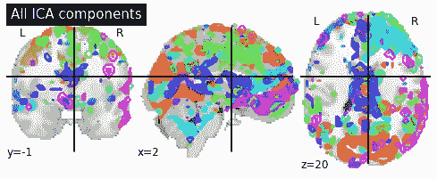

一旦生成了区域，这个过程就像我们在 SCA 中所做的一样。我们创建一个掩码并计算相关性。

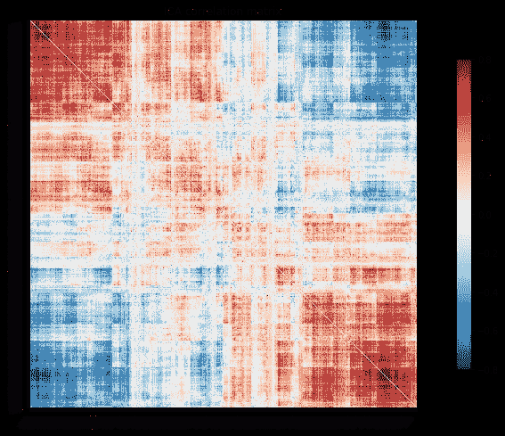

**在本教程的下一部分—** 我们如何在统计分析中使用这些数据。SZ 受试者和对照组之间的静息状态网络有差异吗？

作为一个小玩笑，这个图显示了一个 SZ 患者的相关矩阵。你能发现任何明显的不同吗？

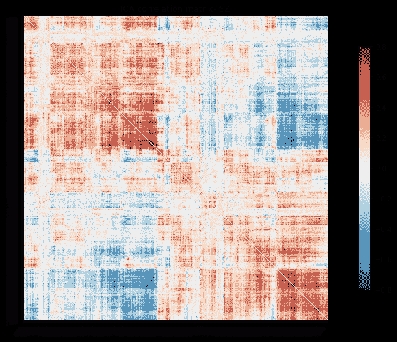

*This figure reflects the correlation between regions identified via the **control** ICA (so the plots could be comparable)

**参考文献**

Biswal、f . z . yet kin、v . m . Haughton 和 j . s . Hyde(1995 年)。使用回波平面磁共振成像研究静息人脑运动皮层的功能连接。马格纳。原因。医学。34, 537–541.doi:10.1002/MRM。19360.863863863616

科尔，D. M .，史密斯，S. M .，，贝克曼，C. F. (2010)。静息态 FMRI 数据分析和解释的进展和缺陷。系统神经科学前沿，4，8。

德斯坎 RS，塞贡内 F，菲施尔 B，奎因 BT，迪克森 BC，布莱克尔 D，巴克纳 RL，戴尔 AM，马奎尔 RP，海曼 BT，阿尔伯特 MS，基利安尼 RJ。一种自动标记系统，用于将 MRI 扫描上的人类大脑皮层细分为基于脑回的感兴趣区域。神经影像。2006 年 7 月 1 日；31(3):968–80.

埃斯特万 O，比尔曼 D，沙尔 M，科耶霍 OO，波尔德拉克 RA，戈尔戈莱夫斯基 KJ；MRIQC:推进来自未知部位的 MRI 图像质量的自动预测:PLOS 一中 12(9):e 0184661；doi:10.1371/journal . pone . 0184661。

弗雷泽 JA，邱 S，布雷兹 JL，马克里斯 N，兰格 N，肯尼迪 DN，赫伯特 MR，本特 EK，科内鲁 VK，迪特里奇 ME，霍奇 SM，劳奇 SL，格兰特 PE，科恩 BM，塞德曼 LJ，Caviness VS，比德曼 j。精神病学硕士。2005 年 7 月；162(7):1256–65

Jandric，d .，Lipp，I .，& Mumford，J. (2018)。OHBM 按需操作:静息状态功能磁共振成像分析。检索于 2019 年 10 月 26 日，来自[https://www . ohbmbrainmappingblog . com/blog/ohbm-on demand-how-to-resting-state-fmri-analysis](https://www.ohbmbrainmappingblog.com/blog/ohbm-ondemand-how-to-resting-state-fmri-analysis)

Krüger 等人，氧合敏感磁共振成像中的生理噪声，Magn。原因。医学。46(4):631–637, 2001.doi:10.1002/mrm.1240

Lang，E. W .，Tomé，A. M .，Keck，I. R .，Górriz-Sáez，J. M .，& Puntonet，C. G. (2012 年)。大脑连通性分析:一个简短的调查。计算智能和神经科学，2012，8。

Lee，M. H .，Smyser，C. D .和 Shimony，J. S. (2013 年)。静息态功能磁共振成像:方法和临床应用综述。AJNR Am。神经放射学杂志。34, 1866–1872.doi: 10.3174/ajnr。A3263

林德奎斯特，硕士(2008)。功能磁共振成像数据的统计分析。统计科学，23(4)，439–464 页。

N. K. (2008 年)。我们能做什么，不能做什么。自然，453(7197)，869。

里昂大学(2017 年)。死鲑鱼和巫毒教的相关性:我们应该怀疑功能磁共振成像吗？。大脑，140(8)，e53-e53。

大脑成像中的前瞻性运动校正:综述。Magn Reson Med 201369: 621–636.

马克里斯 N，戈尔茨坦 JM，肯尼迪 D，霍奇 SM，Caviness VS，法拉尼 SV，Tsuang 山，塞德曼 LJ。精神分裂症患者左侧和全部前岛叶体积减少。精神分裂症患者，2006 年 4 月；83(2–3):155–71

缪泽，K. T .，杰斯特，D. V .(编辑。).(2011).精神分裂症临床手册。吉尔福德出版社

Poldrack，R. A .，Congdon，e .，Triplett，w .，Gorgolewski，K. J .，Karlsgodt，K. H .，Mumford，J. A .，… & Bilder，R. M. (2016A)。神经和认知功能的全现象检查。科学数据，3160110。

Poldrack，R. A .，Baker，C. I .，Durnez，j .，Gorgolewski，K. J .，Matthews，P. M .，Munafo，m .，… & Yarkoni，T. (2016B)。扫描地平线:神经影像研究的未来挑战。bioRxiv，059188。

Power，J. D .，Cohen，A. L .，Nelson，S. M .，Wig，G. S .，Barnes，K. A .，Church，J. A .，… & Petersen，S. E. (2011 年)。人脑的功能网络组织。神经元，72(4)，665–678。

Power JD，Plitt M，Kundu P，Bandettini PA，Martin A (2017)时间插值改变 fMRI 扫描中的运动:伪影检测的幅度和结果。PLOS 一号 12(9): e0182939。doi:10.1371/journal . pone . 0182939

Raichle，M. E .，MacLeod，A. M .，Snyder，A. Z .，Powers，W. J .，Gusnard，D. A .，& Shulman，G. L. (2001 年)。大脑功能的默认模式。美国国家科学院学报，98(2)，676–682。

Smith SM，Fox PT，Miller KL，Glahn DC，Fox PM，Mackay CE，
Filippini N，Watkins KE，Toro R，Laird AR 和 Beckmann，参见 2009。
激活和休息时大脑功能结构的对应。美国国家科学院院刊(PNAS)，106(31):13040–13045。

史密斯、S. M .、维道尔、d .、贝克曼、C. F .、格拉瑟、M. F .、简金森、m .、米勒、K. L .、… &巴奇、D. M. (2013)。静息态功能磁共振成像的功能连接组学。认知科学趋势，17(12)，666–682。

Soares，J. M .、magal hes，r .、Moreira，P. S .、Sousa，a .、Ganz，e .、Sampaio，a .、… & Sousa，N. (2016 年)。功能磁共振成像指南。神经科学前沿，10，515。

Yu，q .、A . Allen，e .、Sui，j .、R . Arbabshirani，m .、Pearlson，g .、D . Calhoun，V. (2012 年)。精神分裂症患者静息态功能磁共振成像下的脑连接网络。药物化学当前主题，12(21)，2415–2425。