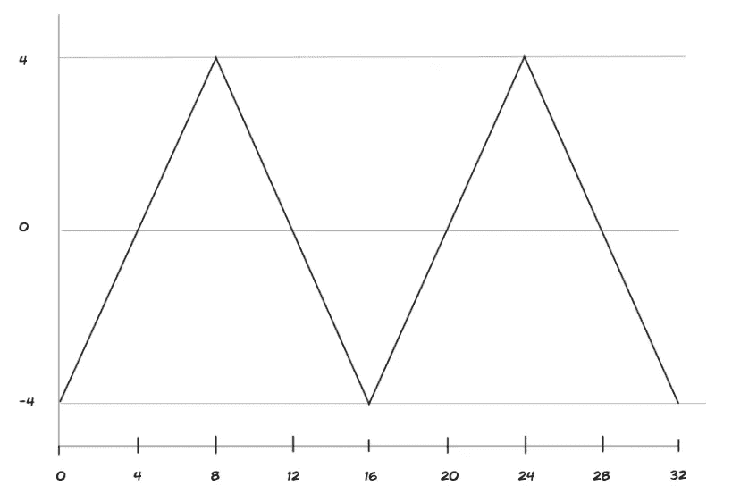
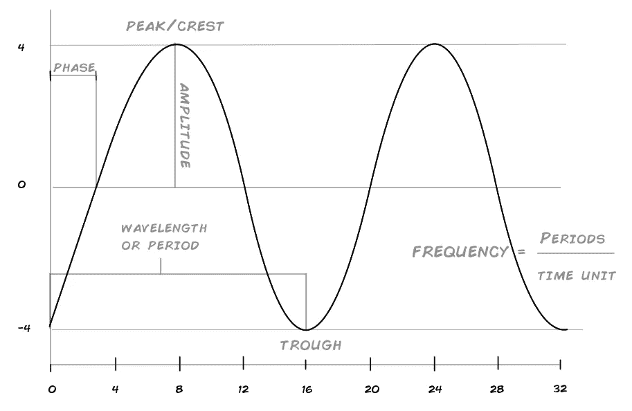
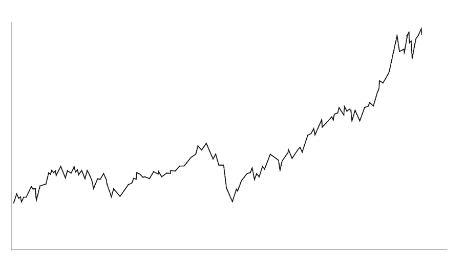
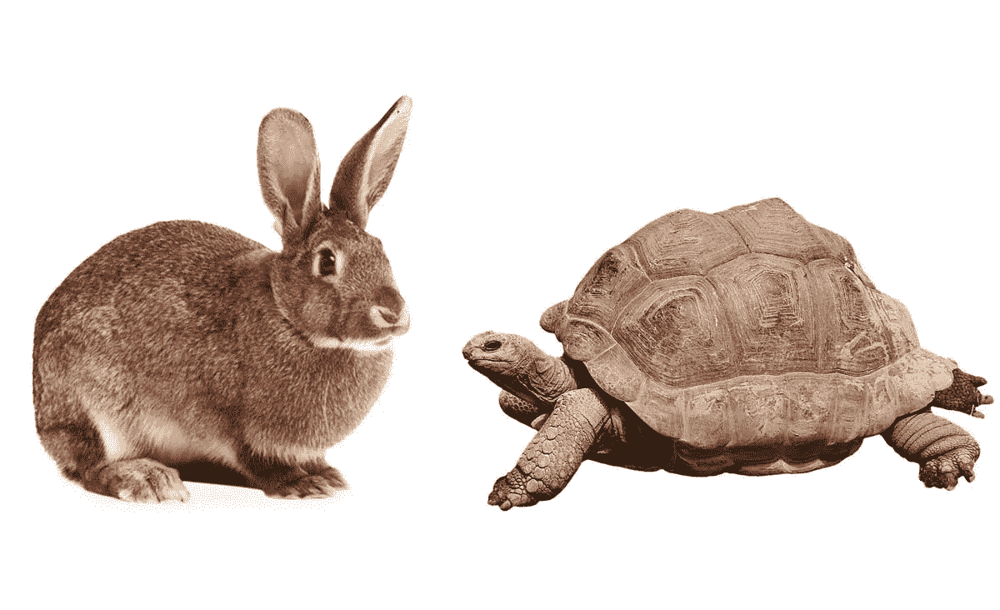
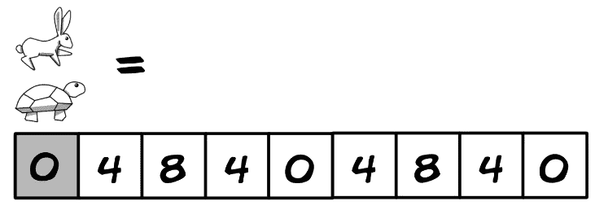
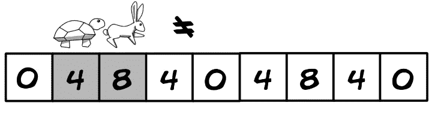
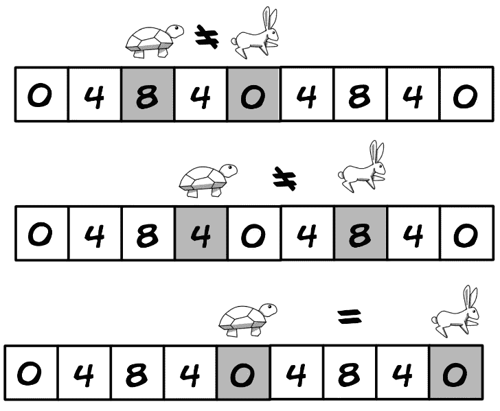
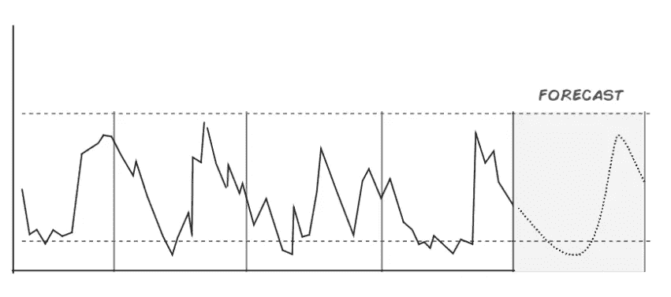
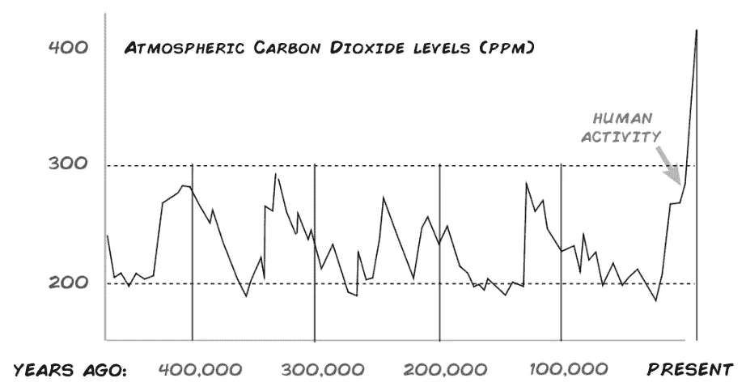

# 探索数据中的循环。

> 原文：<https://towardsdatascience.com/exploring-cycles-in-data-a1746fb19735?source=collection_archive---------8----------------------->


Photo Credit : [https://www.pexels.com/photo/two-yellow-labrador-retriever-puppies-1108099/](https://www.pexels.com/photo/two-yellow-labrador-retriever-puppies-1108099/)

## 简短的概述

## 我们充满了循环。

周期是生活的一部分，是自然的一部分，也许是你可能会遇到的一些数据，我们所说的周期是指事件在时间和空间中以一定的周期性重复发生。

如果你生活在地球上，你每天都会经历白天/夜晚的循环，大约一天的三分之一时间会变得黑暗和寒冷，然后剩下的时间会变得明亮和温暖，这一系列的事件会在我们称为一天的时间段内重复发生。

季节是另一种类型的循环，连续几天寒冷，然后变暖，这在更长的时间内重复，生与死是另一个循环的例子，但这里的时间尺度如此之大，以至于我们通常忘记或没有注意到我们是一个更大循环的一部分。

## 为什么要学习周期？

通过研究周期，我们可以发现它们，并调整我们的行为以利用或避免所述周期的某个阶段，例如，如果我们知道从现在起 6 个月后温度将会变冷，食物将会匮乏，我们就可以相应地做好准备。

如前所述，周期无处不在，我们生物被硬编码到它们的某些方面(日子和季节)，并创造我们自己的周期(睡眠/醒来，生育周期，工作/玩耍，等等，等等。)，然而知道如何识别和描述它们的效用扩展到了其他领域…

考虑一下金融市场中的周期问题以及何时投资，这里的周期受已知和未知因素的影响，但如果你想成为一名成功的投资者，你需要知道你在周期中的位置，或者如一位著名投资者所说:

```
**"Being too far ahead of your time is indistinguishable from being wrong."**- Howard Marks ( Oaktree capital )
```

## 一个循环的细节。

首先，让我们看看最简单的周期:



```
And some relevant data points: +---+----+---+---+----+----+----+----+----+----+
| **X** | 0  | 4 | 8 | 12 | 16 | 20 | 24 | 28 | 32 |
+---+----+---+---+----+----+----+----+----+----+
| **Y** | -4 | 0 | 4 | 0  | -4 | 0  | 4  | 0  | -4 |
+---+----+---+---+----+----+----+----+----+----+Note that the values **-4** and **4**repeat themselves over the non-repeating axis **0…32**, what we have here are 2 cycles that start and end at **(0,-4)** with a length of 16.
```

这是另一个遍布自然界的周期(*科学与工程*，通常被称为 [**正弦波**](https://en.wikipedia.org/wiki/Sine_wave) **:**



```
Sine waves deserve their own separate discussion, for now just note that they provide us with additional ways to talk about cycles and describe their parts.
```

但更多的时候，你会遇到像这样的原始周期:



```
The axes are left out on purpose so you can hopefully note that there are 2 large full cycles and an incomplete 3rd one, you can identify the first 2 by their peaks and troughs, the 3rd one is longer in length and hasn't peaked yet...After noticing these features, we can then reveal the mystery data as the Dow Jones Industrial Stock Average (DJIA) from May 1997 to May 2019 (~ 22 Years), these cycles represent the financial ups and downs of millions of people on planet earth during those years.
```

## 检测周期

在代表您的数据的图表上直观地检测周期是一种非常有效的方式来弄清楚这个周期业务，不幸的是它缺乏一些改进，我们可以询问关于我们的周期的具体指标，然后我们将被留在图表上做手势...*这个周期大概 hmmm 2 拇指宽*！

幸运的是，聪明人一直在以结构化和数学的方式处理周期，所以我们可以利用这一点。

```
I'll explore a common and popular algorithm for cycle detection (Floyd's Tortoise and Hare) but there are a few more if you want to explore them at your own pace, here's a good place to start:[https://en.wikipedia.org/wiki/Cycle_detection](https://en.wikipedia.org/wiki/Cycle_detection)
```



## 弗洛伊德的龟兔赛跑



我们从一个数字序列开始(这里的循环很明显),把乌龟和兔子放在同一个起点上。



就像寓言中一样，兔子跑得快，乌龟跑得慢，兔子以两个`2`的空间增量移动，而乌龟每次只移动一个`1`。



以这种速度，如果有一个循环，乌龟和兔子将在相同的值`0`相遇，从而揭示循环`0,4,8,4,0`，简单而优雅，但是…

```
**Notes:(1)** This is a very naive explanation of the algorithm (for the sake of clarity), in reality we need to deal with nodes and pointers and also implement the algorithm in your language of choice, a good starting point is python, you will need to learn and implement [**linked lists**](https://medium.com/@kojinoshiba/data-structures-in-python-series-1-linked-lists-d9f848537b4d)**,** after thatyou can add complexity, here's a few implementations: [**Rossetta Code: cycle Detection**](https://rosettacode.org/wiki/Cycle_detection#Python)**.****Notes:(2)** It might not be obvious, but you can now get cycle metrics, once you have a cycle, you can get the min/max (trough/peak ...0,8) and calculate amplitude, things like frequency and period are also possible once you incorporate pointers (the X axis, which in this example we are omitting but assume the data is continuous like a time series).**Notes:(3)** This problem/algorithm has multiple practical applications, a favorite of coding interviews, it also helps detect infinite loops and cryptographic collisions amongst other uses. 
```


Photo Credit: [https://www.pexels.com/photo/animal-canine-close-up-dog-546229/](https://www.pexels.com/photo/animal-canine-close-up-dog-546229/)

## 高级循环学

周期的世界是广阔的，取决于你的具体需求和项目，创建你自己的研究路径或分析可能是方便的，这并不是说有更先进的方法来看待数据中的周期和相应的技术和工具，这里有一些你可能想考虑的兔子洞…

[**希尔伯特-黄**](https://en.wikipedia.org/wiki/Hilbert–Huang_transform)**&**[**小波**](https://en.wikipedia.org/wiki/Wavelet_transform) **变换:**另外两种分解信号的方法，每种都有不同于傅立叶分析的方法，根据数据的类型和可用性可能会更好。

**预测:**

预测是一个沉重的课题`(c*heck the notes below)*`，一旦你发现你的数据有周期性成分并完成量化，你还需要弄清楚它是否以及何时会重复，它会跟随一个趋势吗？上，下，横着？是什么在推动这个循环，是什么让你如此确定它会永远重复下去？

这些问题不仅需要一些关于周期的知识和在未来重现周期的数学和算法，更重要的是，还需要你预测的主题的知识，以获得关于未来行为和驱动行为的潜在原因的见解。

例如，当生物体死亡时，生物学中的一个循环迟早会突然停止；周期性的季节性趋势(*想想假日销售*)可能会被新技术破坏，或者像我们将看到的外部因素也可能影响周期，这里的背景是王道，假设你遇到了以下未标记的数据/图表…



没有上下文，我们可以合理地观察到存在周期，并且我们可以很轻松地预测下一个周期，这里是实际发生的情况以及缺少的上下文…



通过恢复上下文、实际数据和之前的观察，我们现在可以认识到当前周期没有以正常或预期的方式运行，然后我们可以寻找可能的原因并弄清楚。

```
**Notes:** A few sources related to forecasting (especially time series) and cycles:**-** [**Forecasting: Principles and Practice**](https://otexts.com/fpp2/)An excellent introduction.- [**Prophet**](https://github.com/facebook/prophet)(Facebooks forecasting library), check the [**white paper**](https://peerj.com/preprints/3190.pdf) for a related discussion on forecasting, also a pretty cutting edge tool.**-** [**Time Series in Python- Part 2\. Dealing with seasonal data**](/time-series-in-python-part-2-dealing-with-seasonal-data-397a65b74051)**:** An excellent series on forecasting and extracting cyclical elements. 
```

作为周期的介绍和概述，我希望这是一个起点；如果你有任何意见或想建议增加或减少，让我知道。

最好的，

基诺。


**关于作者:**

【出生于 Eugenio Noyola Leon(基诺)我是一名设计师，软件开发人员&艺术家目前居住在墨西哥城，你可以在 www.k3no.com[T5](http://www.k3no.com)找到我