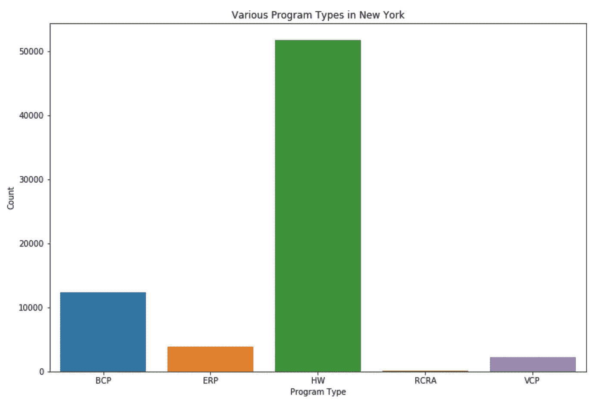

# 探索纽约的环境修复场所

> 原文：<https://towardsdatascience.com/exploring-environment-remediation-sites-in-new-york-f52b437d7982?source=collection_archive---------30----------------------->

## 使用 Matplotlib 和 Seaborn 进行数据探索

Photo by [Luca Bravo](https://unsplash.com/@lucabravo?utm_source=medium&utm_medium=referral) on [Unsplash](https://unsplash.com?utm_source=medium&utm_medium=referral)

在本文中，我将探索位于纽约的各种环境修复站点，并尝试将数据集中包含的信息可视化。该数据由纽约州托管，可在 Kaggle 上获得。您可以在下面浏览该笔记本:

 [## 探索纽约的环境修复场所

### 使用来自 NYS 环境补救地点的数据

www.kaggle.com](https://www.kaggle.com/bhanotkaran22/exploring-environmental-remediation-sites-in-ny) 

# 资料组

1.  数据集中有 70，324 个站点。
2.  每个站点信息有 42 个不同的数据列。每份记录都包括了关于场地、项目、废物处理等信息。每个记录还包括大量信息，如地址、邮政编码等。
3.  一些列具有空值，例如`Address 2`和`Waste Name`。
4.  每一列中的条目都是类型`integer`、`floats`和`objects`。

# 数据探索

## 程序类型

数据集中总共有 5 种不同的程序类型:

*   HW——州超级基金计划
*   BCP——棕色地带清理计划
*   VCP——自愿清洁计划
*   ERP——环境恢复计划
*   RCRA——危险废物管理计划

最常见的项目类型是**州超级基金项目**。此外，最不常见的类型是**危险废物管理计划**，在所有数据中几乎可以忽略不计。

## 站点类别

每个站点的类别/状态使用字母数字代码进行识别，如下所述:

*   02 —危险废物的处置对环境或健康构成了重大威胁
*   03 —污染目前不会对环境或健康构成重大威胁
*   04 —该站点已正确关闭，但需要继续进行站点管理
*   05 —不需要进一步的操作
*   A —活动
*   C —已完成
*   p——初步信息表明某一场地可能受到污染的场地
*   PR——现在或曾经受 RCRA 要求约束的场所
*   N —没有进一步的操作

虽然每个类的描述都很清楚，但是有些看起来是多余的，比如同时使用`05`和`N`来表示不需要做更多的事情。不过，还是来看看剧情吧，看看有没有透露什么信息。

数据分布本身是非常独特的。有一点很明显，那就是许多场地项目已经完工。

## 项目完成日期

虽然所有网站都提供了建议的完成日期，但我更感兴趣的是已经关闭的网站，以及数据中是否有任何趋势。

正如我们从上面的线图中看到的，从 1985 年到 2005 年，很少有网站关闭，然而，在那之后，数量显著增加。【2015 年关闭的最大站点。

> 由于 1985 年至 2005 年期间，随着人口的激增，废物产量增加，因此关闭的场所数量减少，关闭的场所也减少了。

## 污染物

与其探究废物的名称，不如知道哪个场地有什么污染物。这可以允许将类似的解决方案应用于具有相同污染物的场所。T2 有超过 237 种不同的污染物需要处理。

Sites with the given contaminant

Sites with the given contaminant

**铅**是所有场所中最常见的污染物，多达 2500 多个场所含有铅。最不常见的污染物是**酸洗液**、**矿物/白酒**和**碳酸钙**。

## 控制类型

控制类型分为顶层的制度控制和工程控制，进一步包括契约限制、决定文件、环境通知、环境地役权和其他控制。

**契约限制**是最常见的控制类型，约占总数据集的 45%。

# 结论

这些数据揭示了许多关于修复场地的信息，使我们能够处理组合在一起的类似场地。

希望你喜欢我的作品。请随时分享你的想法，建议和想法。