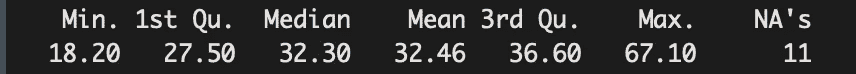

# 探索探索性数据分析

> 原文：<https://towardsdatascience.com/exploring-exploratory-data-analysis-1aa72908a5df?source=collection_archive---------14----------------------->

## 后退一步理解数据集的简单指南


Stock photo by [https://pixabay.com/](https://pixabay.com/)

探索性数据分析(EDA)的全部意义在于，在对数据集做任何事情之前，先退后一步看看数据集。EDA 与数据项目的任何部分一样重要，因为真实的数据集非常混乱，很多事情都可能出错。如果你对你的数据不够了解，你怎么知道去哪里寻找那些错误或混乱的来源呢？

花些时间了解您将要使用的数据集。每当我处理新数据集时，我都会例行地问自己/检查以下几点:

# 1.数据导入是否正确？

我过去常常为找到导入数据的正确方法而苦苦挣扎。在 R 的基本库中可以找到`read.csv()`函数，因此它是我用来导入数据集的第一个函数。

```
# the two assignment statements below render the same output> df <- read.csv("mydataset.csv")
> df <- read.csv("mydataset.csv", header = TRUE)
```

`read.csv()`的默认标题选项设置为 *TRUE* ，这意味着该函数将数据集中的第一行观察值分配给列名。

假设`mydataset.csv`只包含没有定义列名的观察值。如果`header = FALSE`是函数中指定的**而不是**，则导入的数据框的列名将获得数据集中第一个观察值的值。检查这一点的最好方法是简单地查看导入数据的前几行。在这种情况下，使用`colnames()`也会有所帮助。

```
# returns the first few rows of df
> head(df)# returns a vector of characters that correspond to the column names 
> colnames(df)
```

避免这种情况的一种方法是使用可以在 r 中的`data.table`库中找到的`fread()`。在这种情况下，header 选项被设置为 *auto* ，因此该函数会自动检查第一行观察值是否可以是列名，并相应地分配 TRUE 或 FALSE 值。我建议不管怎样，先看看前几行，但这比`read.csv()`更快、更方便

*注* : `read.csv()`返回一个数据帧，`fread()`返回一个数据表。

# 2.是否存在缺失值和异常值？

成功导入数据文件后，我总是检查数据集中是否有任何丢失的值。我发现检验这一点的最好方法是按列对来自`is.na()`的所有真值求和，如下所示:

```
> colSums(is.na(df))
```

处理缺失值的方法有很多。丢失值的处理本身是一个单独的主题，但是我在这里试图强调的是对这些值的意识。一旦我知道数据集中有丢失的值，我就可以采取适当的措施来处理这些值。

也值得问问自己“为什么这些价值观缺失了？”。了解数据集中某些值缺失的原因有助于您更好地理解数据。请记住，这个练习的全部目的是帮助您获得数据集的完整度量，以便您知道您正在处理的是什么。

一些数据集也可能有非常不寻常的值。用一个例子来讨论这个更容易，所以让我们看看来自`faraway`包的`pima`数据集。数据集的描述可以在[这里](https://www.rdocumentation.org/packages/faraway/versions/1.0.7/topics/pima)找到。

查看数据集每列的一些基本汇总统计信息是确保数据集中的值有意义的良好起点。看看下面的`pima`数据集的概要。


Summary of the dataset run in R.

具体看一下`glucose`、`diastolic`、`triceps`、`insulin`和`bmi`的最小值。这些变量取值为 0 有意义吗？不会。一个人不可能没有血压或没有体重指数。这些值为 0 的唯一可能的解释是，这些条目是没有收集数据的实例(即，它们是缺失值)。将这些值设置为 NA 值，以便可以用数据集中的任何其他缺失值来处理它们。下面是一个如何替换变量`bmi`的 0 值的例子:

```
# pima loaded as a dataframe
> pima$bmi[pima$bmi==0] <- NA
```



Updated summary of the bmi variable in R.

注意`bmi`摘要的变化。这样这些值更有意义。

现在来看看`test`。这个变量被认为是糖尿病迹象的二元指标。为什么会有均值？这清楚地表明，R 将 1 和 0 识别为定量变量，而不是分类变量。运行`class()`查看这些值在 R:

```
> class(pima$test)
[1] "integer"
```

要让 R 将该列作为分类变量来处理，可以使用`factor()`:

```
> pima$test <- factor(pima$test)
> class(pima$test)
[1] "factor"
```

检测这些实例非常重要，因为这些异常值可能会严重影响预测模型以及从中得出的任何结论。

# 3.形象化

以各种方式可视化您的数据可以帮助您看到您在探索的早期阶段可能错过的东西。以下是我的一些直观形象:

## 直方图

继续前面关于`pima`数据集的例子，下面是我使用`ggplot2`和`tidyr`库绘制的直方图。这种可视化方法有助于我查看数据集中每个变量的频率/点数:

```
> pima %>%
+   gather() %>% 
+   ggplot(aes(value)) +
+   facet_wrap(~ key, scales = "free") +
+   geom_histogram(stat="count")
```


Nine bar graphs by count for nine variables in the dataset.

通过可视化您的数据，您可以看到变量`triceps`和`insulin`明显有大量的缺失值。这表明，在这种情况下，必须小心处理丢失的数据。理解为什么如此多的值丢失可能是一个需要注意的重要特性。

*注意:如果您之前没有纠正异常的 0 值，您将会看到类似的可视化效果。*

关于使用`ggplot2`和`tidyr`进行可视化的代码详情，请看[这个网站](https://www.r-bloggers.com/quick-plot-of-all-variables/)。

## 散点图矩阵

散点图矩阵可以帮助您了解数据集中任意两个变量之间是否存在某种关系。使用`iris`数据集来看看这个成对散点图的对称矩阵。

```
> pairs(iris)
```


Pairwise plots for the iris dataset

你可以看到，只要看看上面的图，在`Petal.Length`和`Petal.Width`之间有一些线性关系。您甚至还没有进入建模阶段，就已经对您想要关注的变量有了深入的了解！

## 相关矩阵图

这个相关矩阵图为理解两个数值型变量如何相互变化提供了直观的帮助。换句话说，它实际上只是一个相关矩阵的可视化表示。

函数`cor()`用于评估相关矩阵，库`corrplot`中的函数`corrplot()`用于基于相关矩阵创建热图。看看下面使用相同`iris`数据集的例子。

```
# use only numeric type variables
> correlations <- cor(iris[,1:4])# correlation plot
> corrplot(correlations)
```


Correlation matrix plot

从刻度可以看出，大的正相关值更蓝，大的负相关值更红。因此，从这个图中，看起来`Petal.Length`和`Petal.Width`是强相关的，并且看起来`Petal.Length`和`Sepal.Length`之间也有很高的相关性。注意对角线是完全正相关的，因为它代表了变量与自身的相关性。

虽然这些结论类似于之前用散点图得出的结论，但这种方法只是提供了一个更具体的理由来相信两个属性是相关的。

经历这个理解数据的过程是至关重要的，不仅仅是因为我提到的原因。它最终也可能帮助你在选择型号时做出明智的决定。我在本文中概述的方法和过程是我在获得新数据集时最常用的一些方法和过程。您可以使用数据集探索和试验更多的可视化方式。不要退缩。你只是想看看你的数据并理解它。

我希望这篇文章有助于提供一些关于什么是探索性数据分析以及为什么经历这个过程很重要的见解。