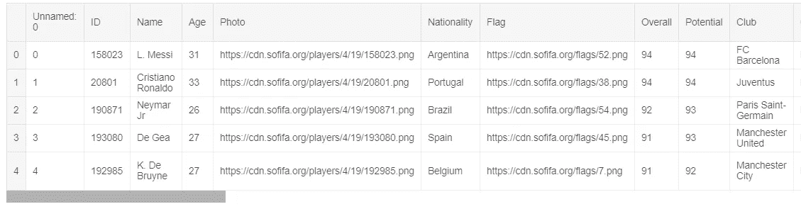
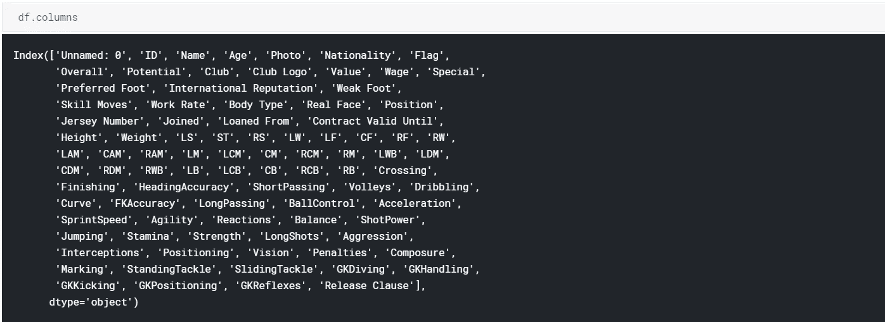
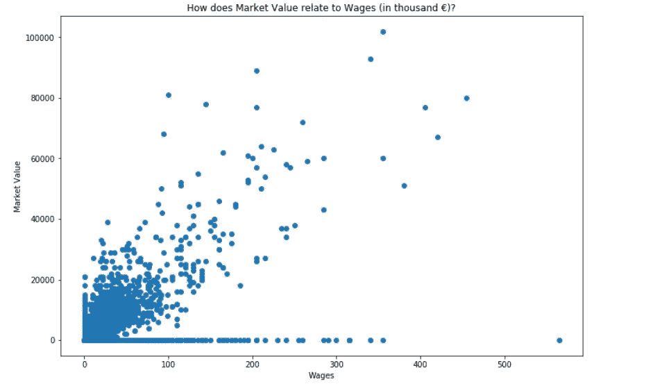
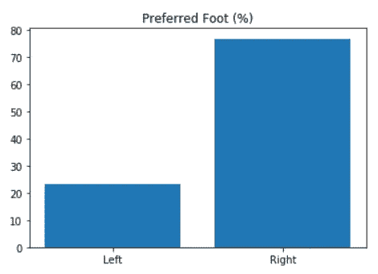
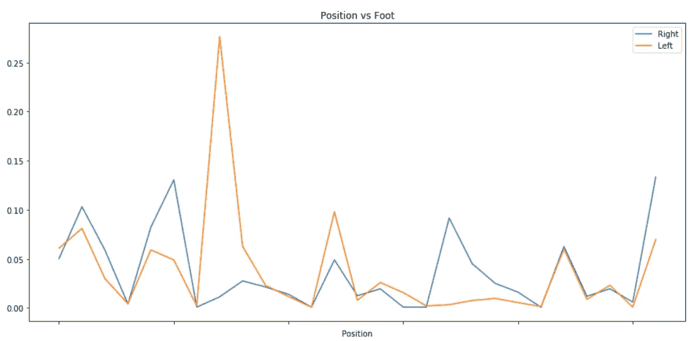
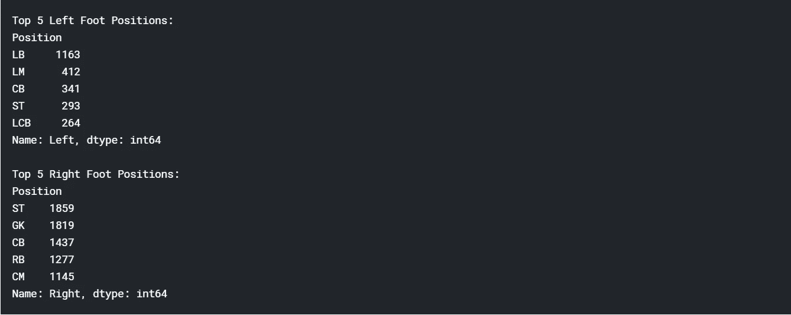
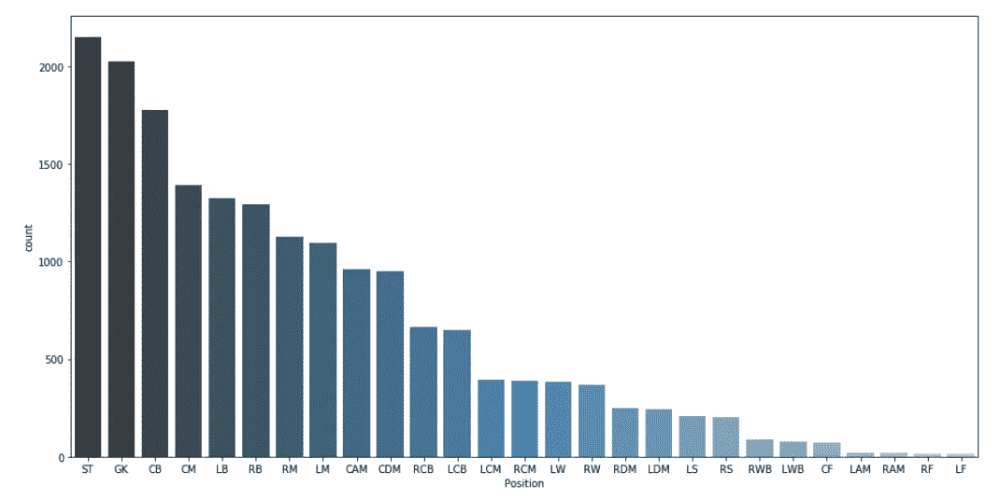
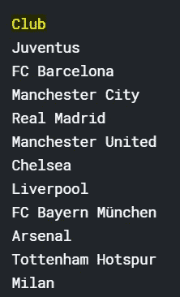
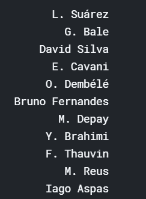

# 探索国际足联

> 原文：<https://towardsdatascience.com/exploring-fifa-277f469c8cdc?source=collection_archive---------10----------------------->

“足球的重要之处在于，它不仅仅是足球。”*~特里·普拉切特爵士。*

足球或英式足球，不仅仅是一项游戏，它是许多人的一种情感。人们追随他们最喜爱的俱乐部不亚于他们的宗教！伟大的球员受到全世界的称赞。但是并不是所有人都知道这些球员的工资是多少？，是什么促成了它们的市场价值？让我们一起来试着回答这些和类似的问题。因此，没有进一步的原因，让我们开始吧！

国际足球协会联合会(国际足联)自称是足球协会、足球联合会、沙滩足球和电子足球的国际理事机构。使用国际足联的 2019 年球员数据集，我们将尝试回答一些有趣的问题。

Kaggle 笔记本同样可以在[这里](https://www.kaggle.com/ritesaluja/fifa19/)找到。而[这里的](https://github.com/Ritesh0100/DSND/tree/master/BlogPost)是 Github 的链接，供你参考(复制下文)。要完全跟上，我们建议你分叉 Kaggle 笔记本/Github 回购。我们还提供了文档的链接，以进一步了解所用函数的技术细节。

**看&感受数据**

在进行所有花哨的分析之前，了解数据的外观和感觉是非常重要的。[该数据集的概述可在此处找到](https://www.kaggle.com/karangadiya/fifa19)。在导入必要的库并使用' df.head()'之后，我们得到了下面的输出(对不起，它不能滚动，它只是一个视图)

进一步检查数据集中所有可用的属性(字段)

从上面可以清楚地看到，根据我们的需要，我们当然需要删除某些列(字段)，并且可能进一步清理数据。但是我们现在将把它放在一边，继续定义我们需要使用这个数据集来回答的问题。

你可以明确地看到，这个数据集可以提出几个问题，这取决于需求、感知和你需要完成的目标。以下是我们想出的问题-

**球员的市值和工资有关系吗？**

在查看数据后，我们决定进行一些数据清理和格式化。准备工作完成后，我们绘制了市场价值与工资的关系图(如下)。

可以清楚地看到，通常随着市场价值的增加工资也会增加，但我们也有更高的工资和接近零的市场价值！*裁决-* ***市场价值确实在一定程度上影响球员的工资。***

**球员们最喜欢哪只脚，这对他们的定位有什么影响？**

我们发现在我们的数据集中，不到 25%的球员是左撇子(如下图所示)。

为了检查运动员的偏好脚是否对运动员的位置有任何影响，我们采用了按运动员的位置分组的偏好脚的比例。

从上面可以看出，除了少数例外，左脚和右脚的比例是相同的。也就是说，无论你是左撇子还是右撇子，职位的分布都没什么关系，一个职位对另一个职位的需求大致相同。

进一步探究，根据脚的前 5 个位置(查看下面)，我们发现 CB(中后卫)是第三个最受欢迎的位置，st(前锋)在这两个位置中都排在前 5 位。虽然有一些惊人的不同，像守门员大多是右脚！*威尔第-***是的，脚确实有影响，但只是很少，不是很实质性。**

此外*前锋、门将和中后卫*是球员数量排名前三的位置(参考下面的截图)！

我们能根据一个球员的属性(比如准确性、射门能力、反应、运球等)预测他的价值吗？

诸如“首选脚”、“位置”、“传中”、“射门”、“头球精准”、“短传”、“截击”、“运球”、“弧线球”、“控球精准”、“长传”、“控球”、“加速”、“冲刺速度”、“敏捷度”等特征被选择。

使用[一键编码](http://pandas.pydata.org/pandas-docs/stable/reference/api/pandas.get_dummies.html)对位置和首选脚列进行编码，并在格式化数据后，[删除 nan](https://pandas.pydata.org/pandas-docs/stable/reference/api/pandas.DataFrame.dropna.html)(nan 是数据不存在的空值)；我们分割数据，并尝试使用 [RandomForestRegressor](https://scikit-learn.org/stable/modules/generated/sklearn.ensemble.RandomForestRegressor.html) (集成学习器)和 [GridSearch](https://scikit-learn.org/stable/modules/generated/sklearn.model_selection.GridSearchCV.html) 进行预测(这就像在超参数调整的最佳参数列表中逐个搜索)。我们获得了“0.42”的 R 平方分数(模型评估)。

注-该模型可以进一步改进，使用不同的算法和/或特征工程。

同样使用相互信息回归器，我们发现以下是决定一名球员价值的 5 个最重要的特征-反应、控球、沉着、运球和短传。*裁决-* ***并不是所有的特征都同样有用，同样一个人可以在给定足够的数据和玩家属性的情况下预测市场价值。***

此外，我们还可以从数据中提出相当直接的问题(假设我们有适量的数据)。下面是我们尝试的两个这样的问题，后面是结论。

**工资中位数最高的俱乐部(前 11 名)？**

**解约条款最大的球员(前 11)？**

**结论**

给定 FIFA 19 球员数据集，可以问几个问题。上面我们提出了 5 个问题，我们试图回答，你可能对同一个问题不感兴趣，或者可能喜欢从不同的角度探索数据集。我们在这篇博文中的探索只是冰山一角，通过先进的机器学习技术加上正确的问题集，可以实现和理解很多东西！您可以随意使用笔记本[这里](https://www.kaggle.com/ritesaluja/fifa19)或[这里](https://github.com/Ritesh0100/DSND/tree/master/BlogPost)并摆弄数据集。

*希望您喜欢阅读这篇博文，上面的 EDA 向您概述了如何处理某个数据集以及可以使用的一些技术。*