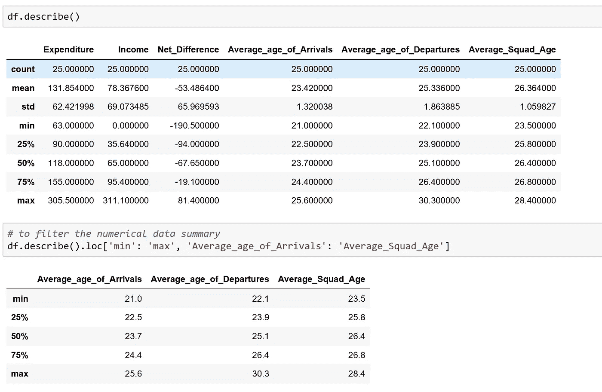
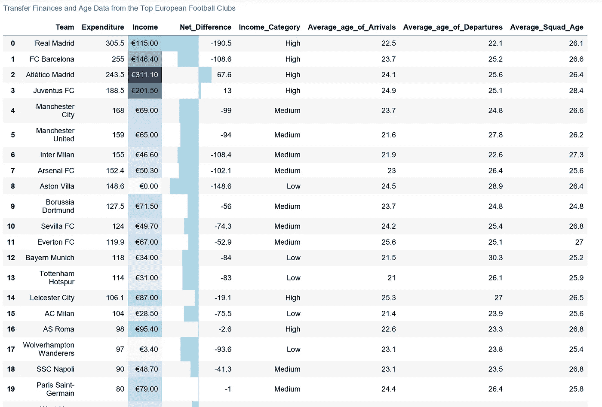
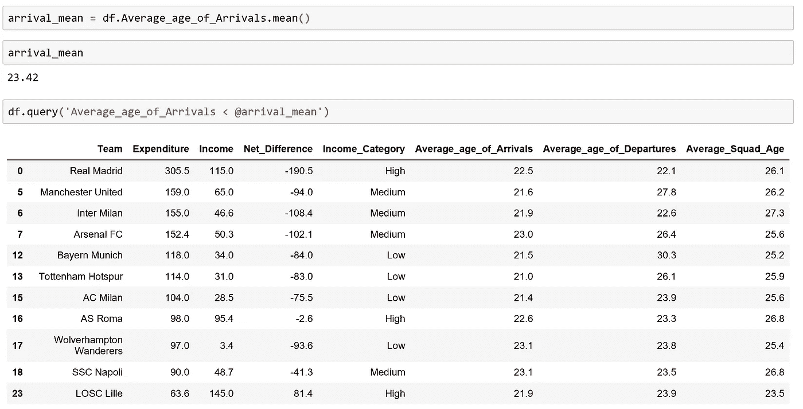

# 探索与熊猫的足球夏季转会活动

> 原文：<https://towardsdatascience.com/exploring-football-summer-transfer-activity-with-pandas-5b9127c759ee?source=collection_archive---------34----------------------->

## 欧洲前 25 大支出足球队的转会交易

Image Courtesy of [Sandro Schuh](https://unsplash.com/@schuh) via Unsplash

# 探索夏季转会的有用熊猫特征

夏季转会窗口为欧洲足球队提供了招募关键球员的机会，以加强他们各自的阵容，迎接即将到来的赛季。边缘和破坏性的球员也可以被抛弃，被租借到不同的俱乐部去积累经验。

为了深入了解欧洲最大的 25 家俱乐部的转会交易，我搜集并整理了每支球队的关键信息。这些信息包括每个团队的支出和收入。此外，我还想知道与球员年龄相关的招募策略。抓取的数据如下所示。

本教程将演示如何使用简单、直观的 Pandas 功能和特性来研究数据。另请注意，截至 2019 年 8 月 13 日，此信息可能会更改和更正。

西班牙的西甲联赛、意大利的意甲联赛、德国的德甲联赛和法国的法甲联赛都在 9 月 2 日的不同时间有转会截止日期。

# 1.将对象数据类型转换为浮点数据类型

在开始任何数据分析之前，检查每一列都是数值数据类型是很重要的。df.dtypes 属性表明,“Income”列是一个 Object (string)数据类型。Pandas 将我的 Excel 文件中的“Income”列解析为 object 数据类型，因为某些球队的条目(连字符)是非数字的，例如上面显示的索引为 8 的阿斯顿维拉。

要转换这个对象列，有必要使用 to_numeric 函数，并告诉 Pandas 通过使用 errors = ' compete '将任何无效输入转换为 NaN 值。如果知道 NaN 值实际上表示 0，可以使用。将 0 作为参数传递的 fillna(0)方法。

现在，当使用 df.dtypes 检查数据类型时，income 列是一个 float 数据类型，现在可以用于以后基于数字的操作。在数据框中，在指数 8 处，阿斯顿维拉的收入现在可以被视为 0，与之前显示的连字符相对。

# 2.新列和列重新排序

球员支出和球员销售所得之间的净差额很容易计算，但它让我们对欧洲 25 家最大支出者的财务转移交易有了有趣的了解。

新列“Net_Difference”是通过从支出列中减去收入列创建的。为了便于阅读，最好让 Net_Difference 列靠近它所引用的两个列。

数据帧的列被转换成列表，并且数据帧 df 根据索引列被重新分配。这里，前三列保持不变，但最后一列(用 python index -1 表示)跟在后面，最后一列包含特定于年龄的数据。通过打印数据帧的头部，信息可以更直观地对齐以便解释。

# 3.过滤从描述方法输出的数据

描述方法给出了数据集的数字数据摘要。但是，如果我们想要截断这个输出，只需使用。loc 函数，并根据需要过滤行和列。

在下面显示的输出中，我希望只看到具体关于年龄的数据快照，并且我只对该快照中的 min 到 max 行感兴趣。

# 4.将连续数据转换为分类数据

收入列可以用来创建一个新的收入类别数据列。在这里，可以使用 pd.cut 函数将收入列中的连续数据分成-1–40、40–80 和 80–350 范围内的区间。我给这些箱子贴上了标签:低、中、高。

这代表了每个俱乐部收到的收入是低、中、高。*现在*，快速扫一眼牌桌就能发现哪些球队为他们各自的球员获得了高收入。

# 5.设计数据框架的样式

对数据帧进行样式化可以增加视觉冲击力并有助于数据解释。在 githib gist 中显示的示例代码中，我展示了各种样式化 DataFrame 的方法。例如，要为列添加背景渐变，可以使用。background_gradient 属性，这个渐变将创建一个指示收入趋势的信息性配色方案。蓝色越深，收入越高。

此外，我为每个列值添加了一个横条，以指示该团队在净差额列中是盈利还是亏损。标题也可以添加到数据帧中，以告知观众具体信息的内容。

# 6.招聘策略并引用 query()字符串中的变量

下面 github gist 的代码片段的第一行显示了对列进行重新排序的另一种方法。

我还确定了到达年龄和离开年龄的平均值。

了解哪些球队正在招募年龄低于所有 25 支球队平均年龄的球员将是很有见地的。

为此，我创建了一个名为 arrival_mean 的变量，为了在查询字符串中引用它，我简单地在它前面加上了一个元字符' @ '。

看起来像皇家马德里、曼联甚至罗马这样的球队正在齐心协力签下年轻球员。这是他们今夏转会政策的信息，所有这些似乎都是为了签下优秀的年轻球员，让他们有更好的表现。

Daniel James (left) and Aaron Wan-Bissaka (right) are two 21-year old Man Utd Summer signings

除此之外，数据显示排名前 25 的球队正在招募的球员平均比他们释放的球员年轻大约 2 岁！

# 摘要

本教程展示了熊猫在数据分析和解释方面的一个用例。样式化和创建分类列可以简化数据解释，而在查询字符串中引用变量可以为任何调查的数据集增加有价值的洞察力。