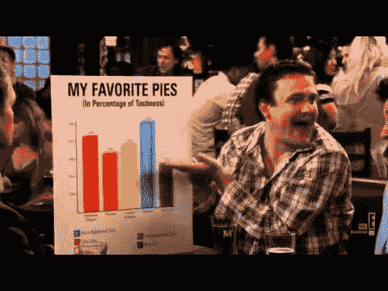
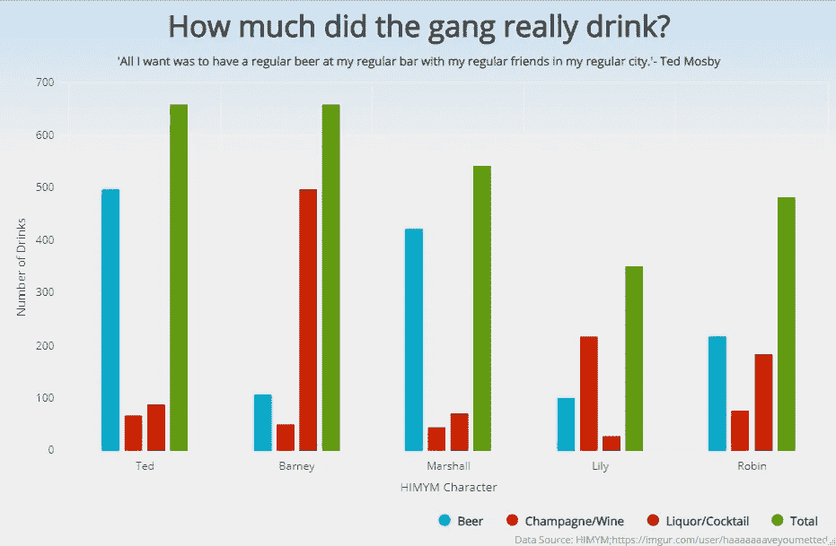
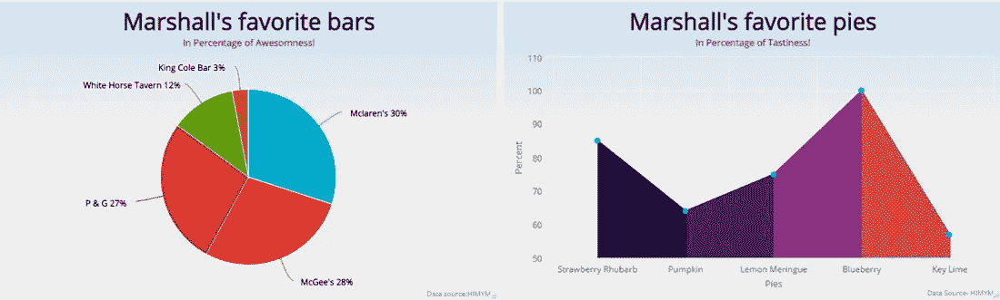
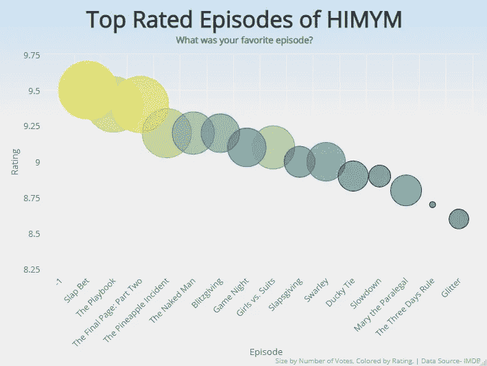
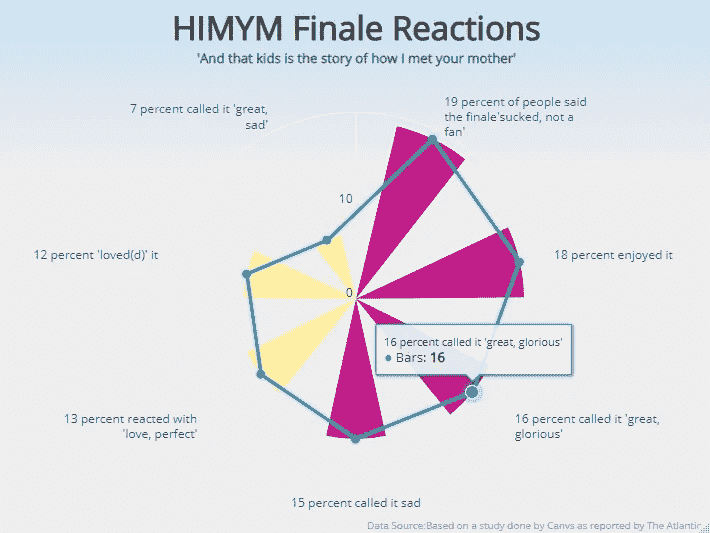

# 探索 R 中的高图表

> 原文：<https://towardsdatascience.com/exploring-highcharts-in-r-f754143efda7?source=collection_archive---------9----------------------->

## 使用《我如何遇见你的母亲》中的数据可视化趋势和模式

这篇文章最初是作为探索性的探索开始的，目的是为了理解 r 语言中的可视化数据。随后是一系列的实验、测试和探索。在此期间，我还重新观看了我最喜欢的节目《我是如何遇见你母亲的》，这次是看一些重复出现的模式&它留下的数据集。在这两种相似性之间建立联系的需要促使我记录并分享这种学习，这本身仍然是这篇文章的灵感来源。

一般的 R viz 空间目前是相当令人兴奋的，g [gplot2](https://ggplot2.tidyverse.org/) 主宰了与 Hadley Wickham 的商标学校的游戏，使复杂的操作非常轻盈。它能够快速可视化趋势，并定制您想要的任何东西，这使得它成为一个可靠的工具。 [Plotly](https://plot.ly/r/) 另一方面，让你建立非常美丽的 D3 情节，特别是网站，仪表板。它允许您灵活地悬停键盘或鼠标并查看数据标签，并允许您自定义缩放以查看特定细节，使其成为 R shiny apps & markdown 文档的典范。

2009 年进入数据 viz 空间的是 D3JS 模块“Highcharts ”,其目前的客户吹嘘脸书、微软和 Stack Overflow。

Highcharts 的[故事](https://www.highcharts.com/blog/about/)也许是一个时代的故事。它的制造商 Torstein hnsi 位于一个被峡湾、山脉和溪流环绕的挪威小镇，他正在寻找一个适中的制图工具，以更新他的主页，其中包括他家在当地山区 Vikjafjellet 的积雪深度测量结果。由于对不断遇到的插件感到厌烦，他采取了启动 Highcharts 的飞跃。自 2009 年以来，它一直是该公司 Highsoft 最畅销的产品&它作为一种主要的图表工具而闻名于世。

Joshua Kunst 在 R 中的 [Highcharter](http://jkunst.com/highcharter/) 包是原始 Highcharts Java Script 库的包装函数。本文利用一档以图表和 viz- *《我是如何遇见你的母亲》著称的节目的相关数据，探索了它的一些视觉功能。*



HIMYM features makes use of many aesthetic charts

软件包中有两个主要功能，即 hcharts()和 highcharts()，类似于 Ggplot2 的 qplot()和 Ggplot()。前者是单键快捷方式，而后者利用 html 小工具和动画。由于本文绘制了一些非常简单的图表，hcharts()函数足以满足大多数图表的需求。我在最终的图表中使用了更复杂的 highcharts()函数来组合极坐标图和折线图。

让我们跳进来吧！-

**分组柱形图**

很好的老式柱形图可能是显示分类数据的最佳图表选择，理由很充分。它以一种易于阅读的方式有效地比较和对比数据。

下面我画出了 HIMYM 一伙在这个系列中喝的酒的数量。

该语法很容易导航，使用 hcharts()快捷方式，第一个命令本身就足以完成创建原始柱形图的任务，而随后的命令行增加了美观和信息的层次。这里-标题，副标题，学分&一个自定义主题。

这里要注意的另一个方面是广泛使用了*马格里特的*(它的共同开发者 Stefan Bache 在短片中坚持说它应该用复杂的法国口音发音)% > %，即“管道”，使得语法对 tidyverse 用户友好。

```
Number_of_drinks %>% 

  hchart(type = 'column', hcaes(x = `HIMYM Character`, y = `Number of Drinks`, group = Type)) %>%

  hc_title(text = "How much did the gang really drink?",
           style = list(fontWeight = "bold", fontSize = "30px"),
           align = "center") %>% 

  hc_subtitle(text = 
                    "'All I want was to have a regular beer at my            regular bar with my regular friends in my regular city.'-Ted Mosby", 
              style = list(fontWeight = "bold"),
              align = "center") %>% 

  hc_credits(enabled = TRUE, 
             text = "Data Source: HIMYM;[https://imgur.com/user/haaaaaaaveyoumetted](https://imgur.com/user/haaaaaaaveyoumetted)",
             style = list(fontSize = "10px")) %>% 

  hc_add_theme(hc_theme_ffx())
```



Number of drinks by types of drinks & show characters.

**饼状图&彩色面积图**

幸运的是，highcharter 包的作者可能是该节目的粉丝，并在包中包含了一些基于该节目的数据集。对于这两个图表，我使用了那些数据集——马歇尔最喜欢的条形图和馅饼。在节目中，Marshall 以饼状图和条形图的形式向大家展示了他对自己喜欢的棒饼的偏好。在这里，他的偏好以饼状图的形式显现出来&彩色区域图。使用的语法与创建的第一个图表非常相似。我已经根据十六进制代码[给这些图表添加了定制的颜色。尽管可以将自定义主题编码到图表中，但软件包本身有一个巨大的迷人主题库。在整篇文章中，我使用了“ffx”主题，灵感来自 Mozilla Firefox 浏览器。](https://htmlcolorcodes.com/)

```
#pie chartfavorite_bars %>%  hchart(type = ‘pie’, hcaes(bars, percent)) %>%  hc_title(text = “Marshall’s Favorite bars”,
 align = “center”,
 style = list(fontWeight = “bold”, fontSize = “30px”)) %>% 
 hc_tooltip(enabled = T) %>%  hc_subtitle(text = “In Percentage of Awesomness!”,
 align = “center”,
 style = list(fontWeight = “bold”)) %>%  hc_add_theme(hc_theme_ffx()) %>%  hc_credits(enabled = T,text = “Data source:HIMYM”)#colored area graph

  favorite_pies %>%   mutate( segmentColor = c("#000004", "#3B0F70", "#8C2981",  "#DE4968", "#FE9F6D"))%>%   hchart(type = 'coloredarea', hcaes(x = pies, y = percent))%>% 
  hc_title(text = "Marshall's favorite pies",
           style = list(fontWeight = "bold", fontSize = "30px"),
           align = "center") %>%   hc_subtitle(text = "In Percentage Of Tastiness!",
              style = list(fontWeight = "bold"),
              align = "center") %>%   hc_add_theme(hc_theme_ffx())
```



Marshall’s favorite bars & pies- in a pie chart & colored area graph respectively

**气泡图**

倒数第二个图表是一个气泡图，直观地显示了收视率最高的剧集。与散点图不同，气泡图允许绘制 3 D 数据——气泡的大小增加了数据的维度。这里-X 轴代表剧集的名称，Y 轴代表剧集的评分，而气泡代表 IMDB 上的投票数。这有助于我们推断，尽管《三天法则》被评为十大剧集之一，但它的票数很少，因此必须谨慎解读。像这样的标注和注释也可以添加到图表中来指出某些事实——HC _ annotation()函数也允许这样做。

```
HighestRated %>%  hchart(type = “bubble”, hcaes(x = ‘Episode’, y = Rating, size = Votes, color = 
 Votes), maxSize = “20%”) %>%  hc_title(text = “Top Rated Episodes of HIMYM”,
 style =list(fontWeight = “bold”, fontSize = “30px”),
 align = “center”) %>%  hc_subtitle(text = “What was your favorite episode?”, 
 align = “center”,
 style =list(fontWeight = “bold”)) %>%  hc_credits(enabled = T, text = “Size by Number of Votes,
 Colored by Rating.
 | Data Source- IMDB”) %>%  hc_add_theme(hc_theme_ffx())
```



Top Rated episodes of the series, by Ratings & Votes on IMDB

**极线图**

最后，极线图被用来衡量人们对备受争议的 HIMYM 大结局的反应。

这个数据集有一个有趣的旋转。《HIMYM》的大结局播出后遭到了一些严重的嘲笑(这里读，这里读，这里读&[这里读](https://www.businessinsider.in/entertainment/tv/fans-are-not-happy-with-the-how-i-met-your-mother-series-finale/articleshow/33057530.cms))。事实上，即使是为这篇文章做研究，也激起了我在 5 年多前看完大结局后第一次感受到的愤怒。但是这些数据，就像人们有时知道的那样，告诉我们一个惊人的变化的故事。

社交分析平台 [Canvs](http://canvs.tv/) 研究的大多数人对结局感到乐观。Canvs 算法利用人们对 twitter 反应的情感分析来计算人们对娱乐形式的感受。

下面的图表以极坐标图的形式显示了这一数据集，将最常分享的“观点”用粉红色着色，即高于反应平均阈值的反应，而其余的用黄色突出显示。

```
highchart() %>%  hc_chart(polar = TRUE) %>%  hc_title(text = “HIMYM Finale Reactions”,
 style = list(fontWeight = “bold”, fontSize = “30px”),
 align = “center”) %>%  hc_subtitle(text = “‘And that kids is the story of how I met your mother’”,
 style = list(fontWeight = “bold”),
 align = “center”) %>% hc_xAxis(categories = fans_react$Fans,
 style = list(fontWeight = “bold”)) %>% hc_credits(enabled = TRUE,
 text = “Data Source:Based on a study done by Canvs as reported by The Atlantic”) %>% hc_add_theme(hc_theme_ffx()) %>% hc_legend(enabled = FALSE) %>% hc_series(
 list(
 name = “Bars”,
 data = fans_react$Contribution,
 colorByPoint = TRUE,
 type = “column”,
 colors = ifelse(fans_react$Contribution < mean(fans_react$Contribution),”#ffeda0",”#c51b8a”)
 ),
 list(
 name = “line”,
 data = fans_react$Contribution,
 pointPlacement = “on”,
 type = “line”))
```



HIMYM Finale reactions on twitter bucketed and visualized

关键要点-

1.  R 中的 Highcharter 包具有可导航的特性、可抓取的语法和高级 D3JS 视觉效果，是对 R viz 空间的一个很好的补充，目前由 graphics Ggolot2 包的语法所主导。
2.  它可以使用相似的语法和参数创建各种各样的图表，如气泡图、柱形图、树状图、时序图等。
3.  它不仅支持 R 对象，还使用了广受欢迎的%>% '管道'操作符，让 tidyverse 用户对它非常熟悉。这种简单的语法加上令人惊叹的视觉效果使它成为 R 闪亮应用程序和 R markdown 文档的首选工具。

代码和所有使用的数据集可以在 github [这里](https://github.com/manasi1096/Highcharts-HIMYM)找到。

感谢阅读！你可以在这里联系我。