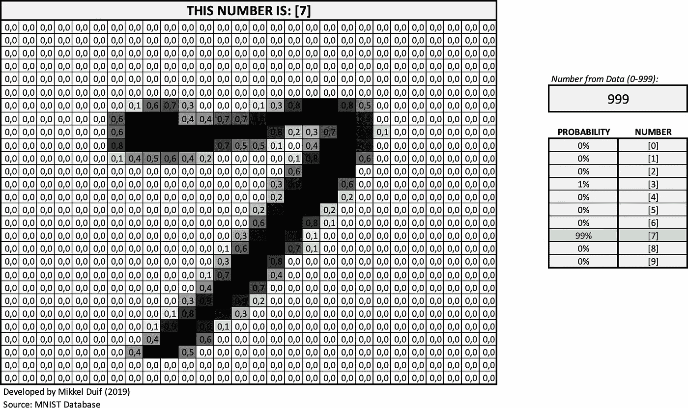
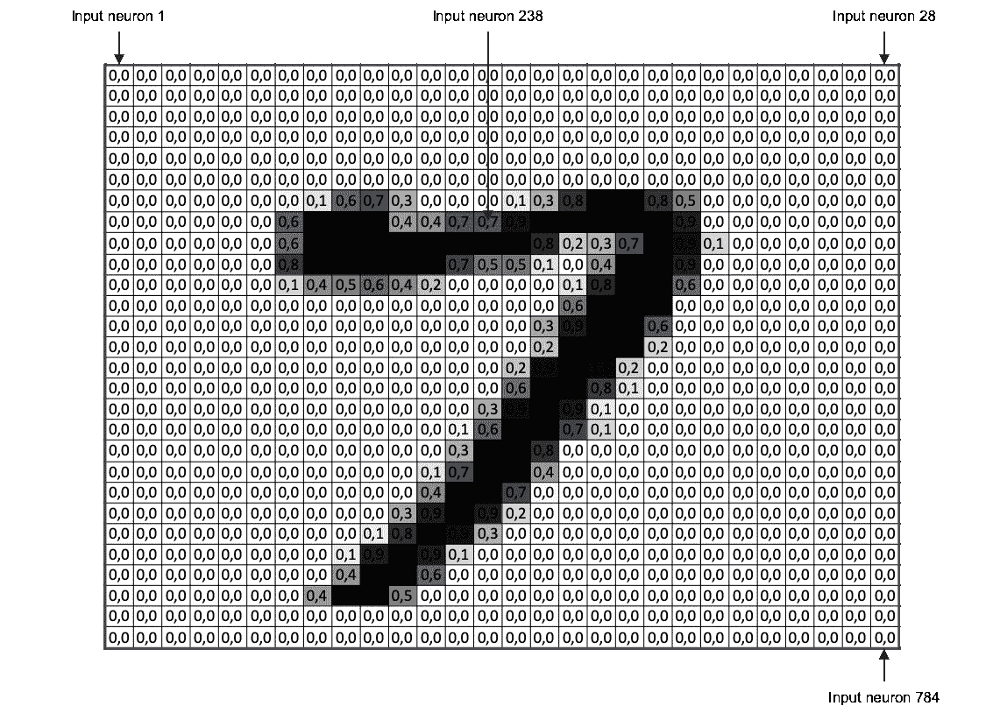
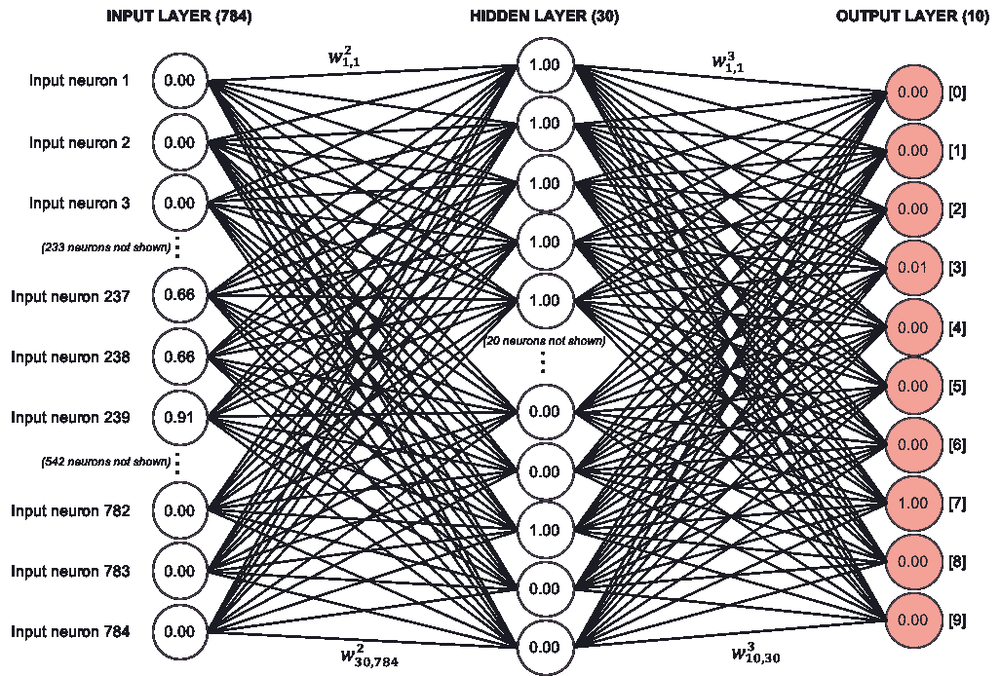
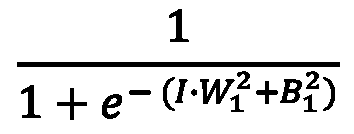
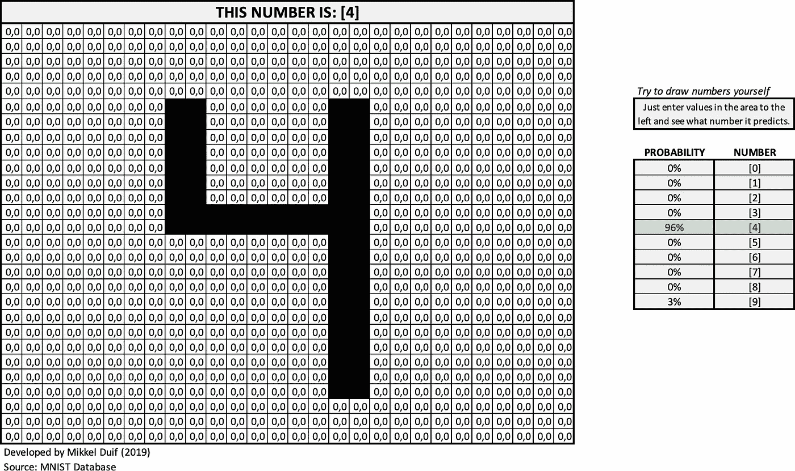

# 探索神经网络的工作方式并将其可视化

> 原文：<https://towardsdatascience.com/exploring-how-neural-networks-work-and-making-them-interactive-ed67adbf9283?source=collection_archive---------27----------------------->

## 部署一个可以识别 Excel 手写数字的神经网络，以便所有的计算和交互都可以可视化和检查

> 在本文中，我们将使用一个 Excel 文件，可以通过[点击此处](https://1drv.ms/x/s!AtALkL1BpheSiI9u4DsLalENcibY8Q?e=36qdYr)找到。尽管您应该能够在没有该文件的情况下继续学习，但我还是强烈建议您下载它，以便更深入地探索。

Preview of the Excel file | Mikkel Duif (2019)

你有没有想过神经网络背后的数学是如何工作的？数学通常以向量和矩阵的形式出现，尽管这使学习变得更加简单，但有时很难理解你只是在数百、数千或数百万个数字上做同样的计算。我破坏了一个有 30 个神经元的单层神经网络，这样你就可以从头到尾看到所有的相互作用。你也可以看到它如何实时适应输入的变化，输入你自己的数字，看看它预测了什么。

> 注意:这是一个预先训练好的神经网络，所以我们现在不讨论实际训练它的所有数学问题(这要复杂得多)，而只是看看如何使用训练好的神经网络的结果。此外，神经网络一直保持简单，在 1 层中有 30 个神经元，然而，对于更大的网络，它不会有很大的不同，可能只是更难跟上。我不记得这个网络的准确率，但我想象大约 90%(这对这个数据集来说不是很好)。我也没有加载实际的数字，但是你可以估计一下你自己会猜测的数字(有些数字甚至对人类来说也很难估计)。最后，本文也假设对神经网络有一些基本的了解，但是，大多数人应该能够理解。

## 理解数据

在我们深入研究计算之前，让我们先了解我们将使用的数据，以及神经网络的架构。

我们将使用的数据集是 MNIST 手写数字数据集，它基本上只是由人类书写的数字，然后扫描并转换为 28x28 像素的图像。我们使用的数据是基于每个像素的亮度，所以如果一个区域非常暗，它的值接近 1，没有任何墨水的区域的值接近 0。

在这里，您可以看到一个数字是什么样子，以及它对应的四舍五入到一位小数的值:

Visualizing the data | Mikkel Duif (2019)

因为我们总共有 28x28 个像素，所以总共有 784 个输入像素，这基本上就是我们的数据点。对于我们的神经网络，我们不会在矩阵中处理这些数据，而是*展平*图像(即，将其转换为向量)，我在上面记录了四个不同输入(像素)的数量，以便您可以跟随。左上角基本上是我们向量中的第一个数，右下角是我们向量中的最后一个数。

## 理解模型的架构

现在我们知道了我们的数据是什么样的，让我们看看神经网络是如何对这些手写数字进行分类的。一个神经网络基本上由一个输入层(即我们的像素)，一个隐藏层(这只是这个模型的一个)和一个输出层(这是模型从 0 到 9 分类的数字)组成。此外，它由权重和偏差组成，我将在图片下面简要解释。

Visualisation of Neural Network | Mikkel Duif (2019)

**权重**:由于每幅图像总共有 784 个像素，我们的模型中也将有 784 个输入神经元。由于 784 个神经元太多，无法在这里显示，我跳过了大部分神经元，只显示了中间的一些不只是零的输入神经元(尝试在 GIF 中找到它们)。在隐藏层，我选择了 30 个隐藏的神经元(为了简单起见，上面的图片中跳过了 20 个)。最后，我们的输出层有 10 个神经元，对应从 0 到 9 的数字。所有的神经元通过从第一个输入神经元到隐藏层中的每个神经元的权重连接。即，i *nput 神经元 1* 通过权重连接到隐藏层中 30 个神经元中的每一个——I*nput 神经元 2、*等也是如此。，一直到 i *nput 神经元 784* 。做一些简单的数学计算，这给了我们从*输入层*到*隐藏层*总共 30 x 784 = 23，520 个*权重*。这些权重中的每一个都分配有一个值，它们共同决定隐藏层中的每个值。重量可以在 *A1:AB870* 区域的*参数*选项卡的 excel 文件中找到。

从隐藏层到输出层也是如此。然而，这一次我们在隐藏层中只有 30 个神经元，每个神经元只连接到 10 个输出神经元，这一次我们只有 30 x 10 = 300 个权重。少得多，但仍然太多，无法显示每一个重量。如果你还不明白这一切是如何相互联系的，不要担心，在下一节中，我将解释这一切是如何组合在一起的——但首先，我们只需要理解*偏差*。重量可以在 *A871:A1180* 区域的*参数*选项卡的 excel 文件中找到。

> 术语:从第 1 层中的神经元 1 到第 2 层中的神经元 1 的权重可以写在第一个权重的正上方，这对应于 Excel 文件的参数选项卡上的单元格 A2 的值。从最后一个输入神经元到隐藏层中最后一个神经元的权重，即权重左下方的 w(2–1，784)可以在 AB870 单元格中找到。单元格 A872 中的重量 w(3–1，1)和单元格 A1180 中的重量 w(30–10，30)。每个权重的位置并不重要，只是让您知道如何在 Excel 表格中导航。

**偏差**:除了权重之外，神经网络也有偏差，这是添加到每个隐藏层和外部层的值中的东西。这些偏差在上图中没有显示，但是可以在 *A1181:A1222* 区域的*参数*选项卡的 excel 文件中找到。

> 你可能会想，这些权重和偏差的值是从哪里来的呢？请记住，这是一个经过训练的神经网络，这意味着我们不会经历如何获得这些权重，而只是如何使用它们。如果你很想知道如何训练一个神经网络，我建议你研究一下迈克尔·尼尔森的资源[，他使用了相同的数据集——他给了我很多学习人工智能的灵感。](http://neuralnetworksanddeeplearning.com/chap2.html)

## 理解计算

现在我们已经有了权重和偏好，让我们试着弄清楚如何计算我们需要什么。它实际上并不复杂，我们只需要计算 40 个不同的数字(30 个用于隐藏层，10 个用于输出层)。然而，输出层依赖于隐藏层中的计算(如果我们有更多的隐藏层，每一层将总是依赖于它前面的层)。为了保持数学符号简单，让我们将隐藏神经元的值写成这样:

Activation function for first neuron in hidden layer

> 注意:上标 2 并不意味着我们正在平方这个值，它仅仅意味着从第一层(下标 1)到第二层(上标 2)。

对于那些熟悉乙状结肠功能的人来说，基本上就是这样了。然而，在神经网络中，它通常被称为激活函数。让我们快速澄清一下上面等式中的字母是什么意思。

*   **e** (简单地说就是欧拉数，一个大约等于 2.71828 的常数)
*   **I** (输入神经元，即 784 个像素中每个像素的值——每个隐藏神经元的值相同)
*   **W** (从每个输入像素到隐藏层的第一个神经元的权重——也是 784 个值，但是每个隐藏神经元的新值，即总共 23，520 个不同的值)
*   **B** (属于隐藏层的第一个神经元的偏置项——对于第一个隐藏神经元，这对应于值为 0.43 的单元格 A1182)

请注意，我们取输入神经元和权重之间的点积。记住，我们有 784 个输入神经元和 784 个相应的权重(对于隐藏层中的每个神经元，权重是变化的)。输入神经元 1 的值和从输入神经元 1 到隐藏层中的神经元的权重相乘——我们对它们中的每一个都这样做，并取乘积的和，再加上偏置项。这个的负值作为欧拉数的幂，我们加 1。然后我们最后用 1 除以这些数字的和。如果我们必须提供一个包含所有数字的示例，那么这个示例会很长，但是请检查包含该数字最终值的单元格 AD2，在 Excel 中可以写成:

> = 1/(1+EXP(-(sum product(number；weight _ 1 _ 1)+INDEX(bias _ 1；1))))，其中“数字”是该数字的像素值的数组，而“权重 _1_1”表示从输入层到隐藏层中的第一个神经元的权重。我给数组命名是为了让公式更有意义——如果你想研究数组，去“公式”->“在 Excel 中定义名称”,看看数组代表什么。

第一个隐藏神经元的值在图像中显示为 1.00，但这只是由于四舍五入。真的是 0.99676789。那么这到底意味着什么呢？没有任何简单的方法来解释这一点——好的一面是它确实有效。

回到等式，我们基本上只需要对隐藏层中的每个神经元(总共 30 个)应用这个，这样我们就有了隐藏层的值。对于最终的输出层来说，这样做实际上没有太大的不同，唯一的区别只是我们不再使用 784 像素作为输入——我们使用隐藏层中每个神经元的值，即我们刚刚计算的值。隐藏层中的每一个神经元都有自己的权重(A871:A1180)分配给它们(就像图中一样)，输出层中的每一个神经元都有自己的偏置 *(A1212:A1222)* 。您可以在单元格 AE1:AE11 中找到输出图层的最终计算结果。

# 画你自己的数字

试着去 Excel 文件的‘Draw’选项卡画出自己的数字，看看神经网络是如何对自己的数字进行分类的。希望它应该做得更好一点，但仍然很有挑战性，试着画一个 7。

Preview of the Excel file | Mikkel Duif (2019)

我希望这篇短文和 Excel 文件对你更好地理解神经网络有所帮助。请随意留下您的评论或问题。也许将来我会写一篇关于如何训练一个神经网络并得出权重和偏差的新文章。