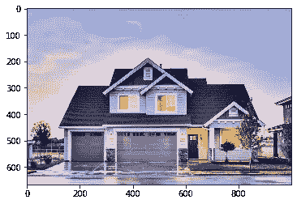
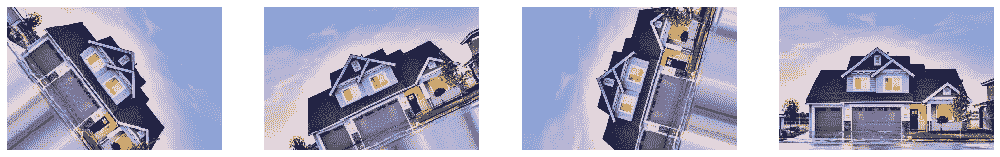
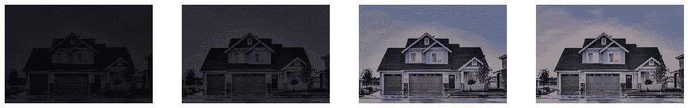
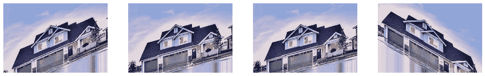
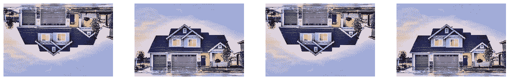
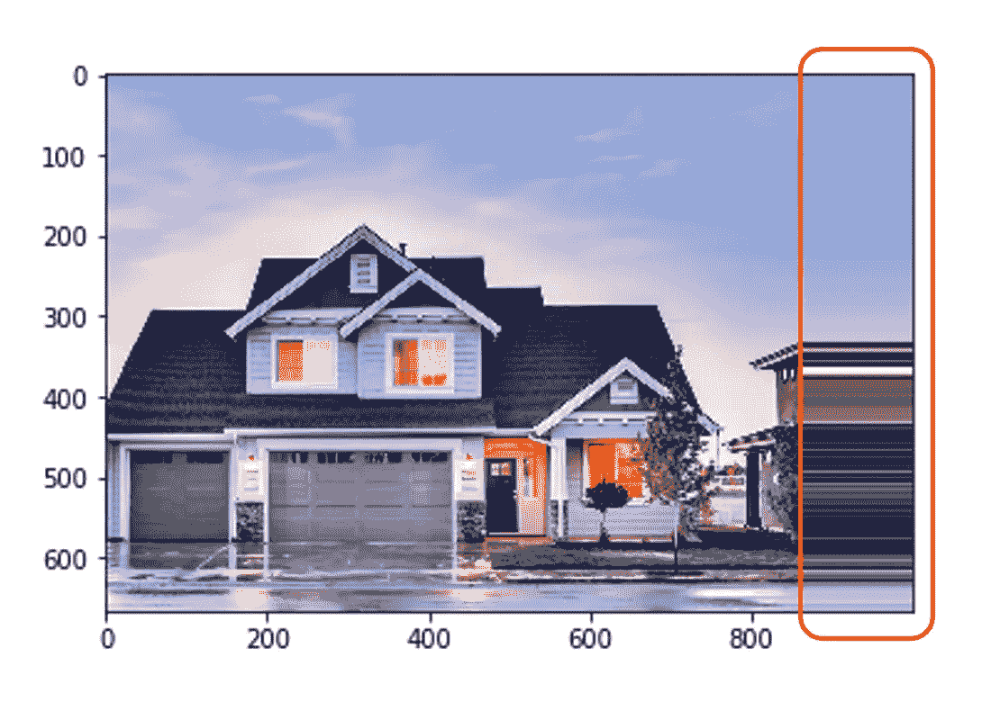
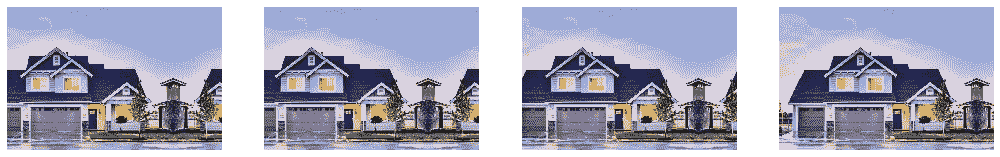
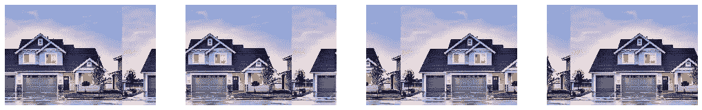
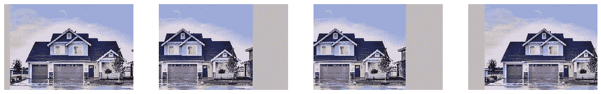

# 使用 Keras 和 TensorFlow 探索数据扩充

> 原文：<https://towardsdatascience.com/exploring-image-data-augmentation-with-keras-and-tensorflow-a8162d89b844?source=collection_archive---------2----------------------->

## 在下一个深度学习项目中使用数据增强的指南！

Photo by [Jon Tyson](https://unsplash.com/@jontyson?utm_source=medium&utm_medium=referral) on [Unsplash](https://unsplash.com?utm_source=medium&utm_medium=referral)

**数据扩充**是一种用于**通过使用裁剪、填充、翻转等技术来增加数据量**的策略。

数据扩充使得模型对于微小的变化更加**健壮**，因此**防止**模型**过度拟合**。

将增加的数据存储在内存中既不实际也没有效率，这就是 Keras 的`ImageDataGenerator`类(也包含在 TensorFlow 的高级 api 中:tensorflow.keras)发挥作用的地方。`ImageDataGenerator`通过**实时数据增强**生成**批张量图像数据**。最棒的是。只是**一行**代码！

生成器生成的输出图像将具有与输入图像相同的输出尺寸。

下面是一个辅助脚本，我们将使用它来直观地展示使用`ImageDataGenerator`类所能实现的一切。

## 1.旋转

通过指定`rotation_range`，生成的数据被随机旋转`+rotation_range`到`-rotation_range`范围内的一个角度(以度为单位)。

## 2.宽度移动

`width_shift_range`是一个介于`0.0`和`1.0`之间的浮点数，它指定了图像随机向左或向右移动的总宽度分数的上限。

## 3.高度移动

除了图像是垂直移动而不是水平移动之外，与宽度移动完全一样。

## 4.聪明

`brightness_range`指定随机选择亮度偏移值的范围。`0.0`的亮度对应绝对无亮度，`1.0`对应最大亮度。

## 5.剪切强度

剪切变换会倾斜图像的形状。这不同于旋转，因为在剪切变换中，我们固定一个轴，并以某个角度(称为剪切角)拉伸图像。这在图像中产生了一种“拉伸”,这在旋转中是看不到的。`shear_range`以度为单位指定倾斜的角度。

## 6.一款云视频会议软件

通过`zoom_range`参数获得随机缩放。小于`1.0`的缩放会放大图像，而大于`1.0`的缩放会缩小图像。

## 7.频道转换

信道偏移通过从`channel_shift_range`指定的范围中选择一个随机值来随机偏移信道值。

## 8.水平翻转

生成器将生成图像，图像将随机水平翻转。

## 9.垂直翻转

除了水平翻转，我们还可以应用垂直翻转。

## 但是那些我们没有任何价值的点呢？

我们有几个选项，从中我们可以选择我们希望如何填充这些区域。

## 1.最近的

这是默认选项，选择最接近的像素值，并对所有空值重复使用。(例如 aaaaaaaa | abcd | dddddddd)

## 2.显示

该模式创建一个“反射”,并以已知值的相反顺序填充空值。(例如 abcddcba|abcd|dcbaabcd)

## 3.包装

除了反射效果，我们还可以通过将已知点的值复制到未知点来创建“包裹”效果，同时保持顺序不变。(例如 abcdabcd|abcd|abcdabcd)

## 4.常数

如果我们想用一个常数值填充位于输入边界之外的所有点，这种模式可以帮助我们实现这一点。常量值由`cval`参数指定。

## 但还有更多！

您可以直接从该课程中获得一些额外的好处。一些例子包括将数据归零(`featurewise_center` *、* `samplewise_center`)和归一化(`*featurewise_std_normalization*` *、* `*samplewise_std_normalization*`)。这些变量可以通过将它们的布尔值传递给`ImageDataGenerator`类来设置。我们还可以通过指定`rescale`参数来重新调整这些值，它会乘以所有的值。

此外，还有一个参数`preprocessing_function`,使用它您可以指定自己的自定义函数来执行图像处理。多酷啊！

如果你喜欢这篇文章，你可能也会喜欢 [VGGNet vs ResNet:消失渐变问题的清晰答案！](/vggnet-vs-resnet-924e9573ca5c)

## 参考

[1] [Keras 文档](https://keras.io/preprocessing/image/)

[2] [张量流文档](https://www.tensorflow.org/api_docs/python/tf/keras/preprocessing/image/ImageDataGenerator)

[3] [剪切变换](https://www.tutorialspoint.com/javafx/shearing_transformation)