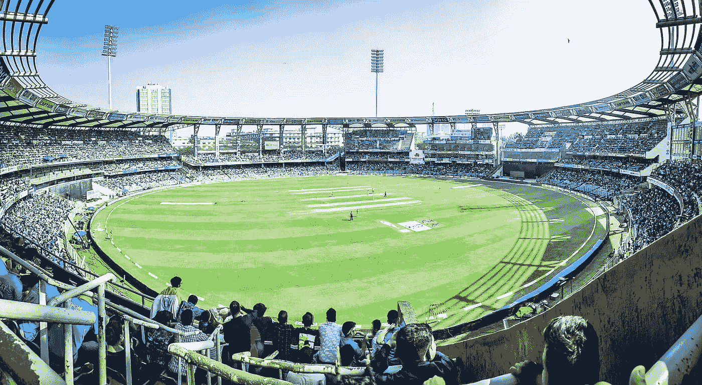

# 用交互式可视化探索印度超级联赛

> 原文：<https://towardsdatascience.com/exploring-indian-premier-league-with-interactive-visualizations-7a6ae053449?source=collection_archive---------11----------------------->

Photo by [AaDil](https://unsplash.com/@being_aheart?utm_source=unsplash&utm_medium=referral&utm_content=creditCopyText) on [Unsplash](https://unsplash.com/s/photos/cricket?utm_source=unsplash&utm_medium=referral&utm_content=creditCopyText)

> 可视化数据的艺术和实践在弥合人机差距以有意义的方式传递分析洞察力方面变得越来越重要。
> ——艾德·邓比尔

# 介绍

I **印度超级联赛(IPL)** ，印度职业二十强(T20)板球联赛成立于 2008 年。该联盟以循环小组和淘汰制为基础，在印度主要城市都有球队。

这是在[machinehack.com](https://www.machinehack.com/course/visualisation-is-beautiful-ipl-data-visualisation-challenge/)举办的 IPL 数据可视化挑战赛(2008–2018)的探索。我用 Tableau 做了可视化。

# 关于数据

该数据集包含 2008 年至 2018 年的以下信息。

1.  匹配日期—匹配的日期和年份
2.  Match_number —每个赛季的比赛号码
3.  Macth_venue —体育场名称和位置
4.  匹配时间—晚上或白天/晚上
5.  Toss_winner —赢得投掷的团队名称
6.  决定是击球还是投球
7.  第一队——先击球的队
8.  团队 1 得分—团队 1 得分
9.  第二队——第二个击球的队
10.  团队 2 得分—团队 2 得分
11.  Winning_team —赢得比赛的团队
12.  winning _ margin——每个队赢了多少分？

在这篇文章中，我们试图通过可视化来理解 IPL 球队，比赛和获胜模式。我已经用这个数据集做了初步的分析，但是还有很多工作要做。

## 以下是分析所遵循的步骤:

Python 中的数据读取、数据预处理和数据清理。*完整的源代码在* [*这里有*](https://github.com/sdhilip200/IPL-Data-Visualization-using-Tableau/blob/master/Data%20Wrangling%20-%20IPL%20.ipynb) *，万一你想看的话。*

我制作了大量可视化的工作表，探索 Tableau 中数据的各个方面。Medium 没有给我们嵌入 HTML 或 javascript 代码的选项，因此你在这个博客中看到的是一个截图。然而，我所有的可视化和仪表板都可以在这里看到

# 交互式可视化和分析

## 谁是最有胜算的 IPL 队伍？

从这个圆形的条形图中，我们可以看到孟买印度人队和钦奈超级国王队是 IPL 历史上最成功的球队，其次是加尔各答夜骑队。从 2008 年到 2018 年，孟买印度人赢得了 97 场比赛，钦奈超级国王队赢得了 90 场比赛，加尔各答骑士队赢得了 86 场比赛。

## **IPL 赛季 Top Toss 赢家？**

从这个包装好的泡泡中，可以看出孟买的印度人赢得了 IPL 中最高的投掷数，其次是加尔各答的夜间骑手和德里的夜魔侠。

## 在印度各地举行的多场比赛？

下面的地图显示了印度各地的比赛。最多的比赛在孟买、加尔各答、班加罗尔和德里举行。此外，2009 和 2014 赛季发生在南非和阿联酋，同样没有显示在下面的地图。

## IPL 冠军？

钦奈超级国王队和孟买印度队三次赢得 IPL 冠军。加尔各答骑士骑手两次获得冠军。数据集中有 12 支球队。12 支队伍中，只有 6 支队伍获得了冠军。皇家挑战者、德里夜魔侠、XI 旁遮普国王、浦那勇士、古吉拉特雄狮和高知塔斯克从未获得过冠军。

# 每个体育场打了多少场比赛？

根据下面的棒棒糖图，M Chinnaswamy 体育场举办了最多的比赛(76 场)，其次是伊甸园花园、Feroz 体育场和 Wankhede 体育场。

## 每个城市的平均分是多少？

下面的蝴蝶图显示，班加卢鲁的得分最高，其次是达兰萨拉和拉杰科特。这显然显示出对这些城市的偏爱。

## 平均团队 1_ 分是多少？

根据甜甜圈图表，钦奈超级国王和孟买印度人在第一次击球时获得了高分。

## IPL 总决赛——击球第一的团队成绩是多少？

Sunrisers Hyderabad 在 IPL 决赛中得分最高，其次是 Chennai Super Kings 和孟买印度人。孟买印度人在两个赛季的 IPL 决赛中得分最低，其次是德干充电器。

## 每个赛季进行多少场比赛？

棒棒糖图显示了 2012 和 2013 赛季的最高比赛次数，随后是 2011 赛季。

## 球队每个赛季的最低和最高分是多少？

以下两张图表显示了一支球队在 IPL 历史上的最低和最高得分。德里夜魔侠在 2008 年和 2011 年两个赛季中得分最低(56 分)。加尔各答夜骑士在 2008 年举办了 67 场，皇家挑战者在 2011 年举办了 56 场。

皇家挑战者队在 2013 年和 2016 年获得了 IPL 历史上最高的 263 分和 248 分。

## 最成功的 IPL 团队？

钦奈超级国王队是 IPL 历史上最成功的球队。尽管停赛两年，但他们三次获得冠军，五次获得亚军，两次获得季后赛资格。

上述可视化是在 Tableau 中创建的，只是一个初步的。然而，还可以做得更多。你可以在这里找到所有的可视化