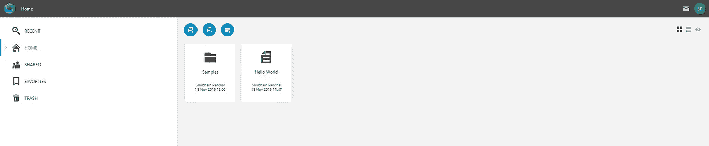
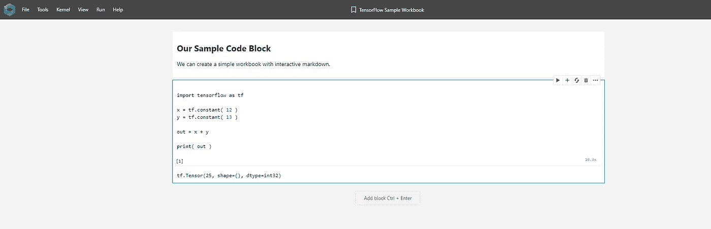
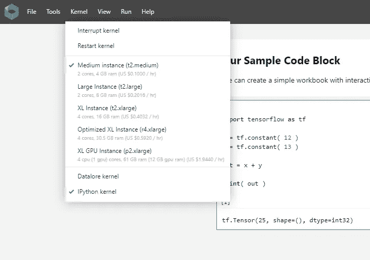
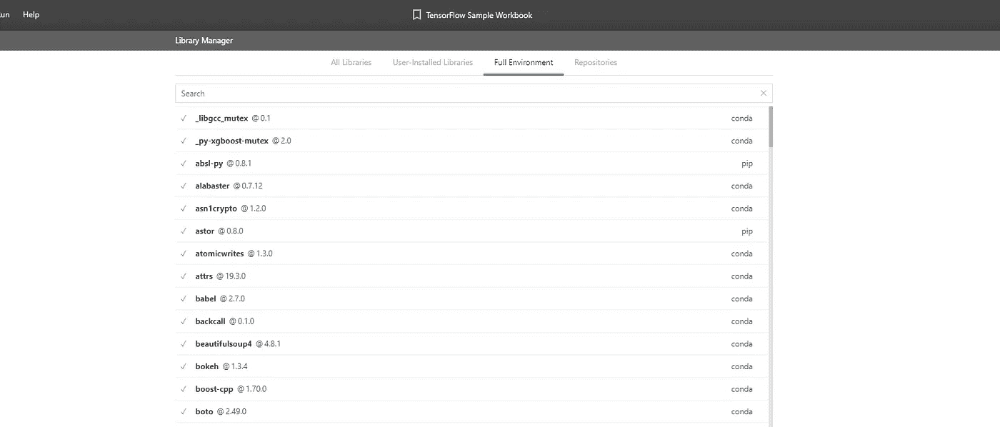
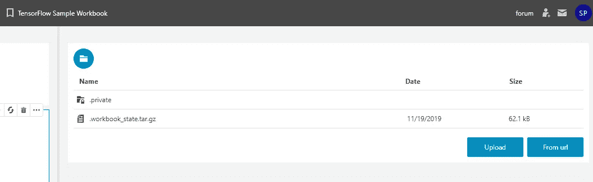
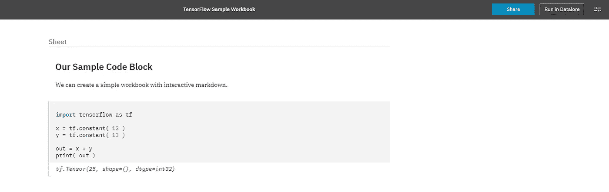
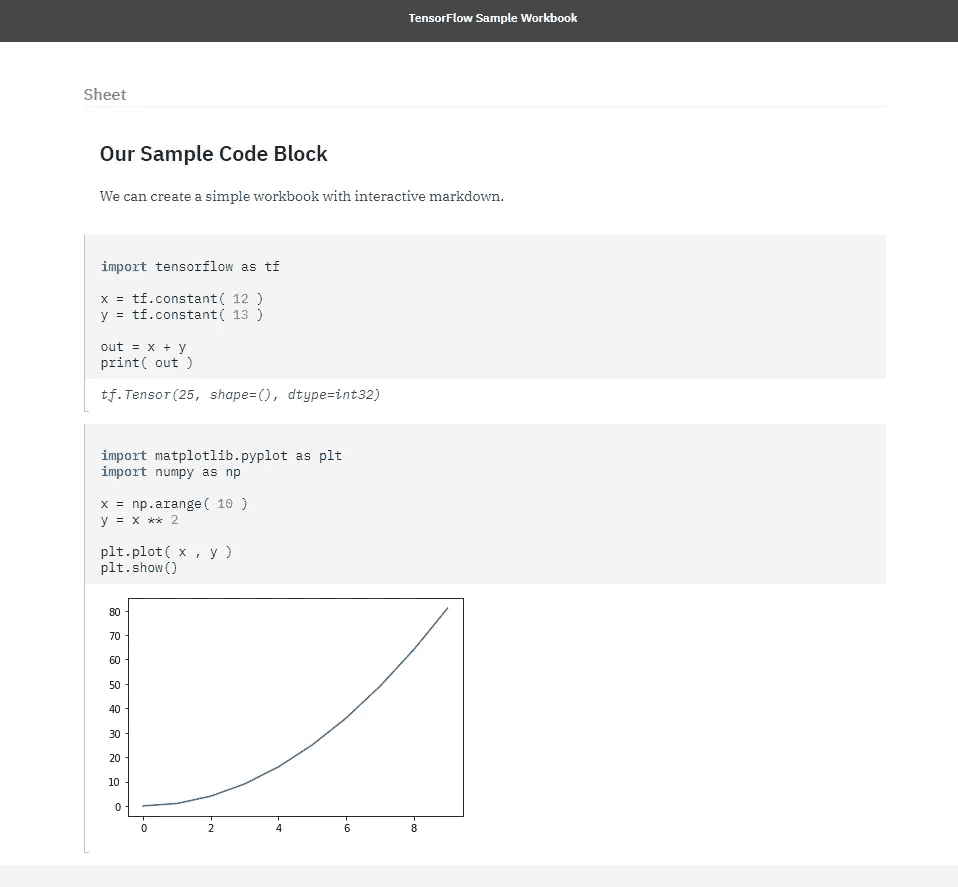

# 探索用于机器学习的 JetBrains 数据仓库

> 原文：<https://towardsdatascience.com/exploring-jetbrains-datalore-for-machine-learning-7377797ca4e5?source=collection_archive---------25----------------------->

## Datalore 是一款来自 JetBrains 的数据探索工具！

Photo by [Luke Chesser](https://unsplash.com/@lukechesser?utm_source=medium&utm_medium=referral) on [Unsplash](https://unsplash.com?utm_source=medium&utm_medium=referral)

JetBrains Datalore 可能是你的下一个 Google Colab 或 Jupyter 的替代品😌。目前，处于测试阶段的 Datalore 是 JetBrains 提供的一个数据分析 web 应用程序。今天，我们将讨论 Datalore 的一些特性，并探索它的功能。

# 1.设置 Datalore.io

转到 Datalore.io 并完成注册过程。接下来，您将看到一个主页，我们可以在上面保存我们的工作簿(笔记本😕 ).

Datalore’s Home page

通过上面的三个按钮，我们可以为我们的项目创建、导入工作簿。

# 2.工作簿环境

我们将创建一个简单的工作簿来测试数据知识。我们将写下一段张量流代码✌️来检查工作。

Datalore workbook

我们可以为我们的工作簿选择不同的*内核*。这就是 Datalore 与 Jupyter 不同的地方。我们可以有一个 *Datalore 内核*,它能够实时执行我们的代码😳。

The IPython Kernel works like Jupyter. The Datalore kernel has something different for us.

您可能会发现我们在 Datalore 内核特性方面的问题。对于我们的讨论，我们将使用 IPython 内核。如上图所示，我们有多个基于 RAM 大小的实例。

Managing libraries

我们可以管理 Datalore 中所有可用的各种包。要安装一个新的软件包，我们可以按照我们为 Jupyter 笔记本所做的正常程序。喜欢`!pip install pillow`。

File Uploader

对于任何机器学习项目，我们的下一个要求是将文件上传到工作簿的能力。这可以通过选择 ***【工具】- >文件上传选项*** 来完成。上传您的所有文件，我们可以在工作簿中访问它们。

# 3.发布我们的工作簿

这是 Datalore 的一个很好的特性。转到 ***文件- >发布*** 。Datalore 为您的工作簿创建了一个整洁的演示文稿，您可以与他人共享😎。我们可以在 [view.datalore.io](https://view.datalore.io/) 上查看我们发布的工作簿。如果您使用过 Kaggle 内核，那么您可能会注意到一些相似之处。

Published Workbook

你可以包括图表，可视化，然后发布笔记本。开发人员可以轻松地将自己与工作簿和数据可视化连接起来。

A Published workbook with a plot

# 等等，还有…

# 希望你喜欢 Datalore！

Datalore’s Live kernel execution.

Datalore 是我们数据科学项目的一个很好的工具。如果你能花💰在他们提供的各种实例(GPU)上，你可以充分利用它。感谢阅读，机器学习快乐！