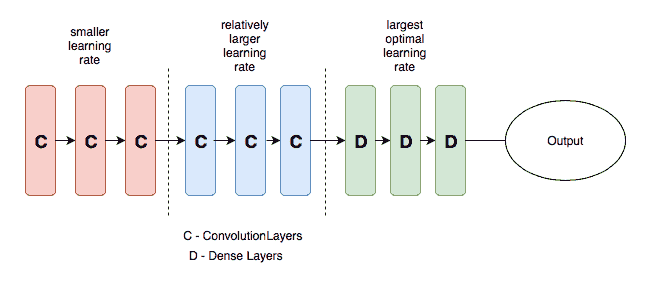
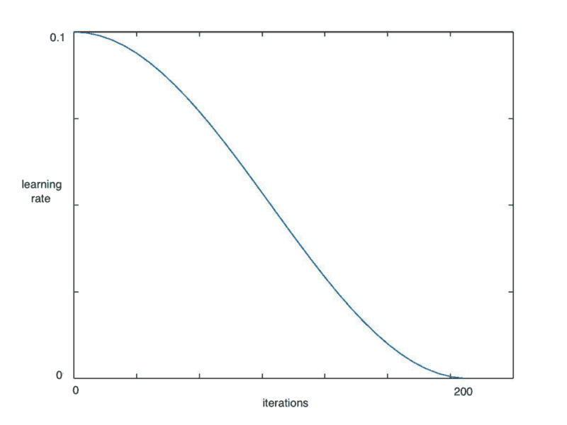

# 探索学习率以提高 Keras 中的模型性能

> 原文：<https://towardsdatascience.com/exploring-learning-rates-to-improve-model-performance-in-keras-e37f5e63f16c?source=collection_archive---------18----------------------->

学习率是一个超参数，它控制每次更新模型权重时响应估计误差而改变模型的程度。选择学习率是具有挑战性的，因为非常小的值可能会导致长时间的训练过程而停滞不前，而非常大的值可能会导致过快地学习一组次优权重或不稳定的训练过程。

# 迁移学习

我们使用迁移学习将经过训练的机器学习模型应用于不同但相关的任务。这在深度学习中工作得很好，深度学习使用由层组成的神经网络。特别是在计算机视觉中，这些网络中的早期层倾向于学习识别更一般的特征。例如，它们检测边缘、梯度等。

这是一种经过验证的方法，可以在计算机视觉任务中产生更好的结果。大多数预先训练好的架构(Resnet、VGG、inception 等。)是在 ImageNet 上训练的，根据您的数据与 ImageNet 上的图像的相似性，这些权重将需要或多或少地进行大的改变。

在 fast.ai 课程中，杰瑞米·霍华德探索了迁移学习的不同学习速率策略，以提高速度和准确性方面的模型性能。

## 1.差异学习

差分学习背后的直觉来自于这样一个事实，即在微调预训练模型时，更接近输入的层更有可能已经学习了更多的一般特征。因此，我们不想改变他们太多。然而，随着我们向模型的更深处移动，我们会想要更大程度地修改权重，以便适应手边的任务/数据。

短语“不同的学习速率”意味着在网络的不同部分使用不同的学习速率，在初始层中学习速率较低，在后面的层中逐渐增加学习速率。

Sample CNN with Differential Learning Rate

**在 Keras 中实施差异学习率**

为了在 Keras 中实现差分学习，我们需要修改优化器源代码。

Adam Optimizer source code in Keras

我们修改了上面的源代码，加入了以下内容—

*   *__init__ 函数被*修改为包括:

1.  分割层: *split_1* 和 *split_2* 分别是第一次和第二次分割的层的名称
2.  修改参数 *lr* 以接受学习率列表——接受 3 个学习率的列表(因为架构分为 3 个不同的部分)

*   在更新每一层的学习速率时，初始代码遍历所有层，并为其分配一个学习速率。我们对此进行了修改，以包含不同层的不同学习速率

Updated Optimizer Code with Differential Learning Rate

## 2.重启随机梯度下降(SGDR)

随着每一批随机梯度下降(SGD)，理想情况下，网络应该越来越接近损耗的全局最小值。因此，随着训练的进行，降低学习率是有意义的，使得算法不会超调，并且尽可能接近最小值。利用余弦退火，我们可以按照余弦函数降低学习速率。

Decreasing learning rate across an epoch containing 200 iterations

SGDR 是学习率退火的一个最新变体，由 Loshchilov 和 Hutter [5]在他们的论文“Sgdr:带重启的随机梯度下降”中引入。在这项技术中，我们不时地突然提高学习率。下面是一个用余弦退火重置三个均匀间隔的学习率的例子。

Increasing the learning rate to its max value after every 100 iterations

突然增加学习率背后的基本原理是，这样做时，梯度下降不会卡在任何局部最小值处，并且可以在朝向全局最小值的途中跳出它。

每次学习率下降到它的最低点(上图中每 100 次迭代)，我们称之为一个周期。作者还建议用某个常数因子使下一个周期比前一个周期长。

Each cycle taking twice as many epochs to complete as the prior cycle

**在 Keras 中实施 SGDR**

使用 Keras 回调，我们可以更新学习率以遵循特定的函数。我们可以参考 [*这个已经实施循环学习的回购*](https://github.com/bckenstler/CLR) 。

请查看 [***github 库***](https://github.com/gunchagarg/learning-rate-techniques-keras) 了解差分学习和 SGDR 的完整代码。它还包含一个测试文件，用于在一个样本数据集上使用这些技术。