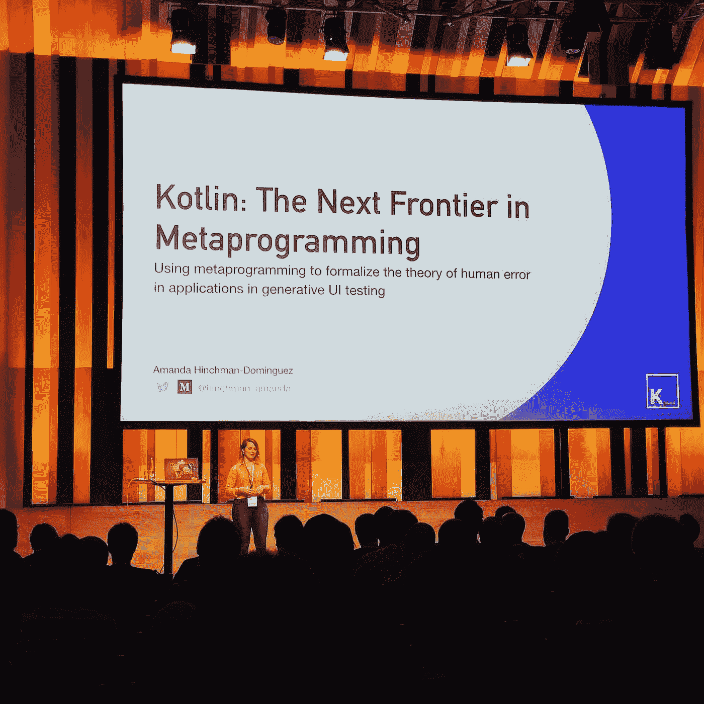
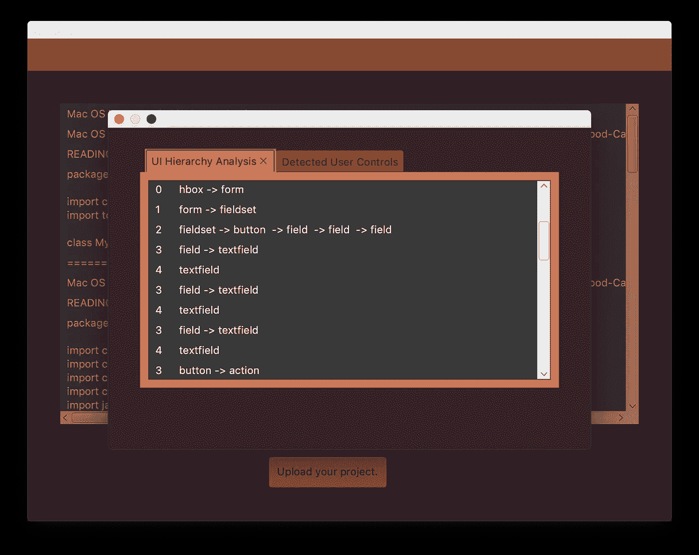
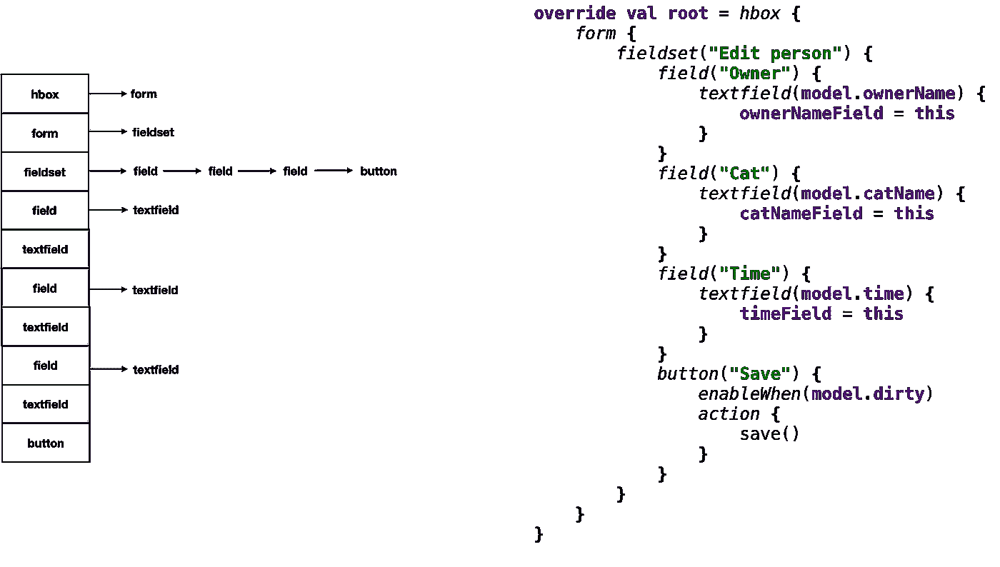
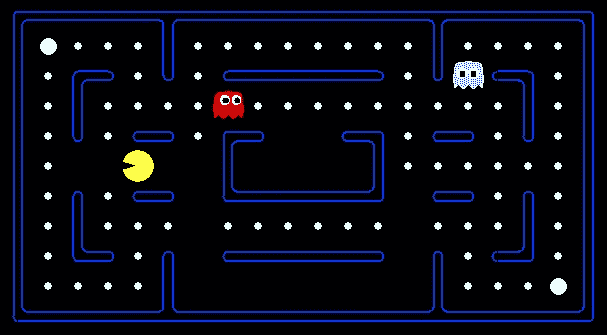
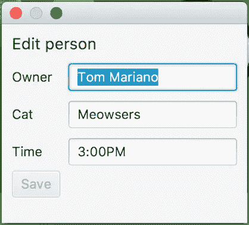

# 用 Kotlin 元编程探索神经网络:深度学习的更廉价选择？

> 原文：<https://towardsdatascience.com/exploring-neural-networking-with-kotlin-metaprogramming-a-cheaper-alternative-for-deep-learning-99c416eb7d16?source=collection_archive---------21----------------------->

## 使用抽象组合契约改进传统机器学习模型的案例研究

在科特林公司的[会议上，我就](https://www.conferenceforkotliners.com/)[龙卷风-套件](https://github.com/ahinchman1/TornadoFX-Suite/tree/mapping-nodes-to-functions)进行了发言，这是一个几乎无法实现的开源项目，旨在允许用户将龙卷风项目的源代码上传到应用程序中，应用程序将解析和分析随后的代码以生成简单的用户界面测试。

我刚刚在科特林会议上透露了初步的发现和建议，但是在我的神经紧张和等待公开分享这些发现之间，我很确定我只是兴奋地吐出了一大堆单词。



我希望有机会跟进并放慢速度，以便真正强调我们在使用 TornadoFX-Suite 时偶然发现的东西的重要性。



Most recent branch: [https://github.com/ahinchman1/TornadoFX-Suite/tree/mapping-nodes-to-functions](https://github.com/ahinchman1/TornadoFX-Suite/tree/mapping-nodes-to-functions)

# 龙卷风套件:通过分析外部代码生成用户界面测试

到目前为止，我们已经成功地创建了一个*元编程定位机制*，该机制将递归读取从 [Kastree](https://github.com/cretz/kastree) 和 [Gson](https://github.com/google/gson) 解析的抽象语法树(AST ),定位相关的节点层次结构，并保存用户交互的相关控件(文本字段、按钮等)的结果，并从中生成测试。

## 什么是元编程定位器机制？它是如何工作的？

*元编程定位机制*是我命名的术语，用于描述 TornadoFX-Suite 使用 AST 解析分析外部代码的能力，以检测所述代码中的特定问题。

在我们的例子中，我们的*元编程定位机制*负责在视图中定位用户界面节点。一旦 AST 解析识别出一个项目中的一个视图，这些节点就会出现在一个有向图中，或者一个`Digraph`中，以保留一个计算机程序很容易理解的层次结构。



Sample TornadoFX view code (left) and the corresponding digraph (right) AST parsing builds out.

有了龙卷风配置指示我们可能关心的元素(按钮、文本字段、表单等)，我们可以从保存的用户界面层次结构中拉出我们认为用户可能与之交互的节点。

## 现有人工智能定位器机制的缺点

生成 UI 测试的想法远非原创。有许多现有的产品是由来自 [test.ai](https://test.ai/) 和 [TestComplete](https://smartbear.com/product/testcomplete/overview/) 这样的地方的大型代码库和团队组成的，它们通过以多种方式解决案例中的问题来工作。同样，也有学术论文旨在检测 Android 应用程序中的 UI 元素，更多的是在机器学习中使用图像分类。

不幸的是，**当前的人工智能图像分类定位器机制受到部分视图渲染识别以及检测通常不考虑用户输入的自定义对象交互的影响**，正如在关于使用神经网络创建 GUI 骨架的研究[中所展示的](https://chunyang-chen.github.io/publication/ui2code.pdf)。

此外，许多基于人工智能的测试解决方案在资源和处理能力方面极其密集,这些资源和处理能力是由幕后存在的算法计算的。这个算法会消耗数据。往往是很多很多的数据。

出于这些原因，我认为元编程定位器机制本质上比他们的“基于训练的”定位器机制要好。

# 好的，我们检测到了这些视图。可以做什么样的测试？

目前，`buttons`和`textfields`生成的测试如下:

```
**@Test**
fun testwuwp0yiTextField() {
    assertNotNull(wuwp0yiTextField.text)
    assertTrue(!wuwp0yiTextField.text.isNullOrEmpty())
    clickOn(wuwp0yiTextField).write("Something")
    assertEquals("Something", wuwp0yiTextField.text)
}**@Test** fun testvoVuVUjButton() {
    clickOn(voVuVUjButton)
}
```

他们并不复杂。目前，对这些生成的测试所能做的最好的事情就是与这些单独的节点以及分组节点的排列进行交互。

走到这一步本身就是一个壮举，但是产生的测试充其量也只是愚蠢的。UI 测试是这样的:


Sure, we’ve grabbed a view and we perform an action on that view. But what about the last step?

我需要更智能的测试。我研究了为 TornadoFX-Suite 实现 Tensorflow 的可能性，但是在深入研究机器学习之后，我意识到我现在必须把机器学习放在一边。

# 传统机器学习模型的缺点

与测试相关的人工智能技巧是围绕理解错误理论而发展的；理解当我们处理空间和时间的复杂性时，我们是如何以及在哪里犯认知错误的。

但是 AI 并不聪明。事实上，深度学习中仍然存在很多人类因素。

在我对机器学习和计算思维的研究中，杰夫·尼曼在测试和机器学习方面的广泛工作和研究被证明是改变这个项目方向的更有影响力的作品之一，因为我不得不暂时搁置应用机器学习的想法。

这是我抛开机器学习的原因吗？

1.  在某些方面，`overfitting` / `underfitting`的概念只是我们想出来的一个术语，本质上是“机器学习实际上不能处理很多层/每层的张量”的翻译。当您的特征集严重不足或者当您的数据“太”嘈杂时，偏见可能会悄然而至。(“太吵”意味着它的证明价值被它的偏见价值压倒了。)
2.  如果正则化不充分或太强，这可能是有害的。在这种情况下，“太强”意味着你的训练数据中的任何复杂性都会被扣分；因此，为了避免`overfitting`，你应用了太多的数据正则化，这就是引入**偏差**的原因。

杰夫·尼曼在他的 [Pacument](https://github.com/jeffnyman/pacumen) 项目中展示了这种偏差-方差的区别，在该项目中，Pacman 展示了神经网络的权重如何被“调整”到足以提供一个偏向于一个方向而不是另一个方向的偏差因子。



[https://github.com/jeffnyman/pacumen](https://github.com/jeffnyman/pacumen)

因此，以《吃豆人》为例，尼曼表明，对能量丸的偏好会导致吃豆人到处追逐鬼魂，试图杀死它们，代价是完成游戏并获胜。

在这里，我们进入了以短期回报为代价的**长期回报的概念**，这是影响我们今天看到的许多机器学习的因素。

机器学习的传统模型似乎有严重的局限性，尤其是在现实生活问题中。我脑海中不断闪现的问题是“我们如何知道什么是相关的，什么是不相关的？”

我不知道什么是好的 UI 测试。我不知道是什么导致了糟糕的 UI 测试。当我不知道什么是 UI 测试的相关和不相关因素时，我如何知道我应该考虑什么权重，以及我如何能够计算偏差？

如果我不知道哪些因素是相关的或不相关的，运行这些模型所需的资源成本可能会变得很高，并且损失函数变得很难尝试和最小化。我只是没有资源或专业知识来独自处理这件事…但也许，只是也许，传统的机器学习模型不适合这个项目。

# 转向元编程来创建神经网络关系

我们可以抓取这些节点并生成可以在运行时附加的随机 id，但是我们如何知道一个节点看起来是否像它应该的样子呢？这是一个很难回答的问题。我们需要很多交织的信息来回答这样的问题。

让我们重新审视一下**短期奖励与长期奖励的对比，**短期奖励通常是在机器学习中实现的。

机器学习是在预定义的可能性空间内搜索一些输入数据的有用表示，使用来自反馈的指导，告诉我们这些表示有多好或多坏。

Machine Learning is so “smart” it can be [explained with Family Guy](https://medium.com/@hinchman_amanda/introduction-to-machine-learning-in-tensorflow-explained-by-family-guy-d6a93437f9c2)

深度学习模型是由**不同层**组成的引擎，我们可以将其视为**数据处理单元**。每个单元都包含数据过滤器。这些单元一个接一个地堆叠起来。

重要的是模型通过数据堆栈传递输入。**神经网络**本身被称为模型，但也可以被认为是算法。

从概念上讲，神经网络正在搜索成形数据的转换，并试图将其展平成可以处理的东西。

本质上，我们已经通过 AST 解析实现了数据的扁平化，并且将这些字面上的三维形状分解成类分解，这使得我们很容易在解析后进行有组织的分析。元编程如何将这种扁平化的数据提供给更具体的层？



我们点击一个按钮。接下来会发生什么？嗯，那要看情况。在这个例子中，编辑器对话框中的保存`button`直到模型被弄脏后才被激活(修改了`textfields`的内容)。

所以我们现在甚至不能点击我们的按钮！我们如何预测我们与节点交互的能力？这个问题可以比作复杂的游戏系统，如 Skyrim 或 Mass Effect。如果你与一个群体结盟，你就不能加入另一个群体(同样，如果你选择成为吸血鬼，你也不能成为狼人)。这种形式规范系统也称为**有限状态机**，这是一种通用的 ui 形式化策略。

形式化 UI 系统规范的一个好处是，正式的思想和清晰的结构使我们能够创建一个元编程可以使用的系统。

正式规范的另一个更明显的好处是允许我们检查 UI 节点的属性；是否有任何转换未明确说明？有可能被锁在互动之外吗？

You can reference a Kotlin FSM implementation of this problem in this [blurb](https://medium.com/@hinchman_amanda/kotlin-metaprogramming-using-automata-for-smarter-ui-testing-41d138b74dc3).

更重要的是，元编程如何创建自己的有限自动机来预测与模型绑定时的状态，如按钮启用和禁用？

在每个 UI 节点中，都有可能存储以下信息:

```
UINode(
    **nodeType**: String,
    **uiLevel**: Int,
    **nodeChildren:** JsonObject,
    **valueAssignment**: String,
    **functionComposition:** Digraph<UIFunctionComposition>,
    **associatedFunctions:** ArrayList<String>()
)
```

有了元编程，我意外地意识到— **也许我们不必猜测来自数据过滤器的结果的好坏。**

在这种情况下，我们可以使用 TornadoFX-Suite 的类分解和定位的 UI 节点，并重新分析我们的代码分析以创建*新的图形关系*，这可以消除一些猜测，从而能够预测来自“黑盒”测试的行为。

也就是说，在创建 UINode 时，我们创建一个空的有向图来存储节点的`functionComposition`和`associateFunctions`，这是从我们在 AST 解析中实现的初始类分解中检索的。

Will likely clean up this idea later the more I think about the definition of an associated function.

一个`associatedFunction`是一个负责影响节点属性或状态的函数。可以通过扫描具有值的节点来发现相关联的函数，这些值可以被识别为可能存在于任何其他类中的任何`View`类型成员的成员变量。只要在函数中存在对分配的节点值的引用，该函数就有可能影响节点的状态。

`functionalComposition`可以被认为是被拒绝与特定节点交互的功能。幸运的是，我们可以重用用于创建 UI 层次结构的有向图结构。

更重要的是，我们可以映射这些`functionalComposition`和`associatedFunctions`，以便元编程创建 Kotlin 状态机来帮助预测与节点的某些交互的预期状态，这是元编程定位器机制的另一个版本(只是不太明显)。处理是密集的，但是当我们继续映射这些关系时，有更少但更多的相关信息可以处理，因为我们以非常非常愚蠢的方式创建了更聪明的关系。这个想法是下一阶段实施的重点。

# 深度学习算法是神经网络；元编程创建了神经网络

什么是神经网络？按照机器学习的说法，是算法。但是神经网络通过模拟大量类似神经元抽象版本的互连处理单元来工作。

在元编程中，神经网络是一个名词，而在机器学习中，神经网络是一个动作。*在这两种情况下，都有* *一组对事物的操作，随着神经网络的进化，更多的新操作被添加*。然而，当那些操作是有限的，并且那些操作需要如何工作的定义不一定被编辑时，命令式世界工作得最好(因为试图通过调整权重来最小化损失函数往往发生在机器学习中)。

我提出的答案远没有传统机器学习模型通过隐藏层输入数据来提供的答案那么不透明。我提到人工智能并不聪明——嗯，元编程也不聪明。然而，**在给定我们已经拥有的信息的情况下，使用元编程计算和创建进一步的图形关系所需的操作似乎成比例地和指数地减少，而机器学习似乎相反。**

我真的觉得我找到了一些东西。

# 参考资料:

*   从 UI 设计图像到 GUI 骨架:一个引导移动 GUI 实现的神经机器翻译器。2018 年 5 月 27 日，chunyang-chen.github.io/publication/ui2code.pdf. ICSE 18 日，Github
*   尼曼杰夫。"揭开机器学习的神秘面纱，第二部分."*来自一个软件测试人员的故事*，2018 年 9 月 9 日，Tester Stories . com/2018/09/demysiting-machine-learning-part-2/。
*   尼曼杰夫。“测试 AI …在用 AI 测试之前。”*来自一个软件测试人员的故事*，2018 年 5 月 30 日，Tester Stories . com/2018/05/testing-ai-before-testing-with-ai/。
*   韦恩，希勒尔。"正式指定用户界面."*希勒尔·韦恩*，2018 年 6 月 11 日[www.hillelwayne.com/post/formally-specifying-uis/.](http://www.hillelwayne.com/post/formally-specifying-uis/.)