# 探索纽约市水箱检查数据。

> 原文：<https://towardsdatascience.com/exploring-new-york-city-water-tank-inspection-data-855c5776c566?source=collection_archive---------20----------------------->

## 我使用 Python 和 Plotly 探索、分析和可视化房地产数据的方法。

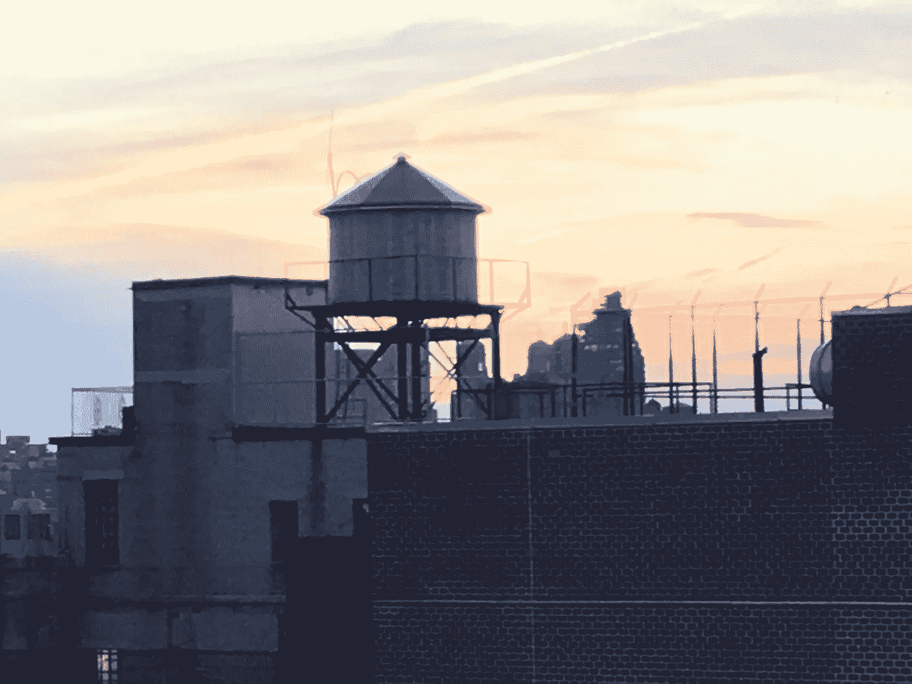

Typical water tank. Photo by author.

在过去的几年里，我一直在探索纽约市的房地产数据，并尝试各种数据分析和可视化方法。一路上，我学到了很多关于纽约市房地产数据的知识，尤其是如何获取、清理、分析和可视化/绘制这些数据。我花了大量时间学习数据和各种编程语言和技术，搜索 Stackoverflow 上的问答、关于媒体的文章和各种数据教程。我希望通过总结我一直在做的一个项目，并概述我探索数据驱动的房地产问题的过程、房地产数据的来源和数据分析工具，我将说明洞察力可以通过数据分析获得，并对那些探索自己的数据驱动问题的人有所帮助。

I spy over 12 water tanks in this photo. Photo by author.

我一直对建造水箱感兴趣。尽管科学有了很大的进步，但这些装着建筑物供水的木桶在上个世纪基本上没有变化。在纽约市，它们是维持超过 6 层的[建筑的水压所必需的。](https://www.nytimes.com/2018/05/26/realestate/how-new-york-water-tanks-work.html)

**第一步——确定你的问题和数据来源**

我很好奇水箱有多干净，是否有可识别的模式。通过一些研究，我了解到纽约市行政法规第 31 章于 2015 年 5 月生效，该法规要求业主对他们的水箱进行年度检查，并将结果报告给纽约市卫生局。第 31 章要求每栋建筑在下一年的 1 月 15 日前完成这项工作，并且所有的结果都要公之于众。纽约市卫生局有一个在线工具，可以查询纽约市任何一栋建筑的检查结果。

当城市数据在基于在线的工具中可用时，很有可能基础数据也可以通过纽约市开放数据门户获得(如果不能，就应该这样)。这是因为纽约市认识到[数据是有价值的，应该让每个人都可以访问](https://www1.nyc.gov/assets/home/downloads/pdf/reports/2015/NYC-Open-Data-Plan-2015.pdf)，并在 2012 年通过了当地法律 11，要求在 2018 年前识别和汇总全市数据。搜索这个庞大数据资源的入口是[https://opendata.cityofnewyork.us/](https://opendata.cityofnewyork.us/)

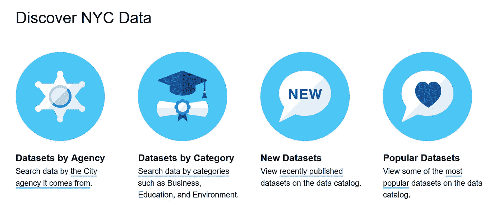

Various ways to search for datasets on https://opendata.cityofnewyork.us/

只需简单搜索水箱，您就能快速找到我们正在寻找的数据，这些数据可以作为`.csv`文件下载。

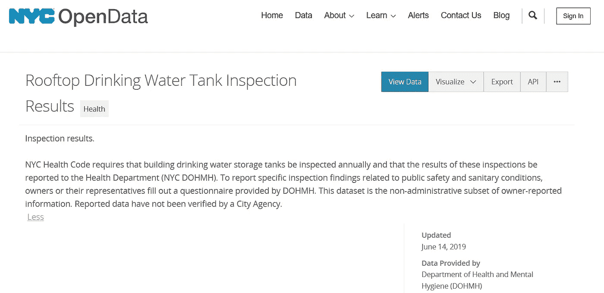

**步骤 2 —清理并浏览数据**

我一般用 Python 分析数据。我喜欢 Python 的原因(也是它非常受欢迎的原因)是它在不断地被开发和添加新的库，有大量的学习资源，并且对于你试图完成的任何事情，都有机会在 [StackOverflow](https://stackoverflow.com/questions/tagged/pandas?sort=votes&pageSize=15) 上有多个讨论来指导你。

如果你打算跟着做，我建议你安装`Anaconda`，它是一个非常流行的 Python 包，包括许多必须预装的 Python 库。一个这样的库是`Jupyter`，它允许你通过笔记本在浏览器中运行 Python 命令，这使得实验和与他人分享你的笔记本变得容易。与本文对应的 Jupyter 笔记本可以在这里通过 nb viewer[查看，所有文件(包括底层数据)都可以在这个](https://nbviewer.jupyter.org/github/LHalpern/nyc_water_tanks_jupyter_medium/blob/master/NYC_Watertower%20-%20June5data.ipynb) [GitHub](https://github.com/LHalpern/nyc_water_tanks_jupyter_medium) 资源库中找到。

另一个流行的库(也是 Jupyter 包的一部分)是`Pandas`，它简化了组织、搜索和修改表格数据的方式。加载完库后，数据(之前下载的)可以读入 Panda 的数据帧。

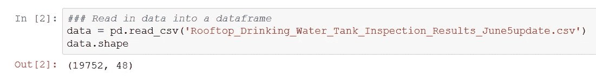

Created a dataframe called data with the tank inspection results

命令`shape`告诉我们数据由 19，752 行 48 列组成，我们可以了解下面包含的数据(和数据类型)。

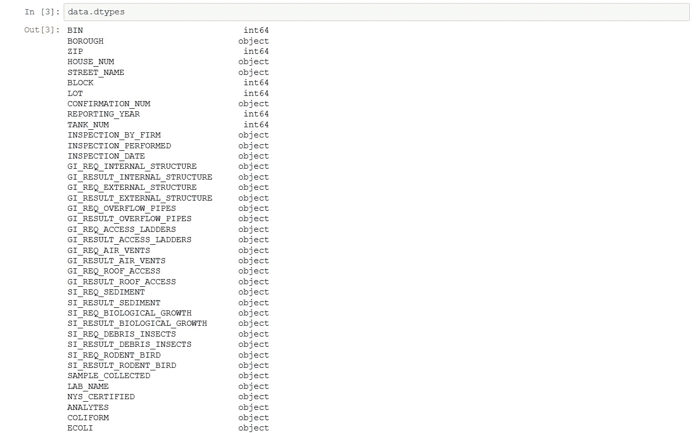

Python 的优势之一是可以快速汇总数据，下面的代码循环遍历特定的数据列，以确定每个类别中的结果数。由此我们得知，在检查计划的历史上，曼哈顿进行了 17，002 次检查，2018 年进行了 5，461 次检查，对生物生长和鸟类/昆虫残骸的观察比我希望看到的更多(尽管从百分比来看，这是非常低的)。

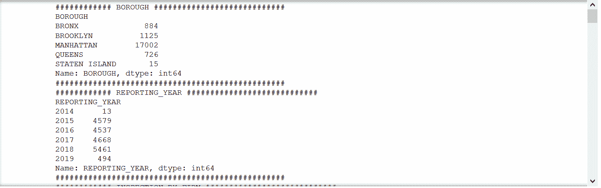

使用 Python 可视化数据也相当简单。当我们这样做时，一些观察结果就很突出，例如在过去四年中检查的增加(最大的增加是在 2017 年和 2018 年之间，大多数检查发生在曼哈顿，以及少数公司在进行检查中的主导地位。

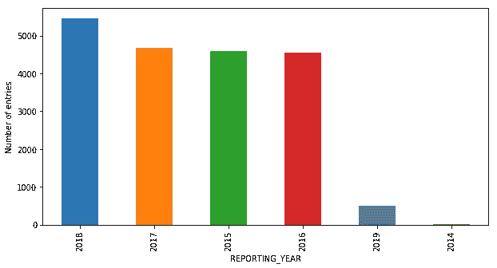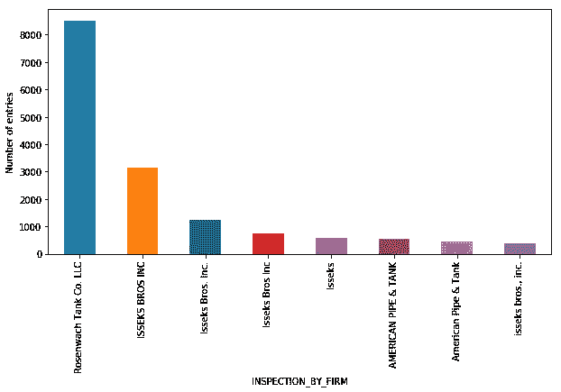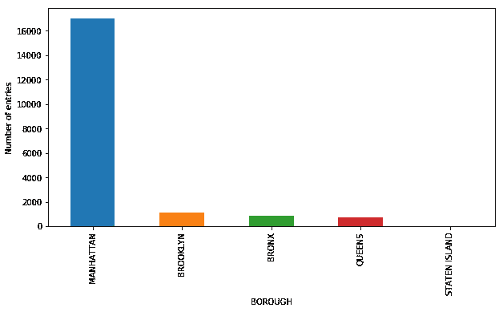

当我最初在 2019 年 5 月开始这项分析时，数据最后一次更新是在 2018 年 10 月，因此不包括 2018 年最后三个月的报告。我希望这些报告已经完成并归档，并联系纽约市开放数据中心，要求更新这些数据(纽约市开放数据中心有一个程序，要求提供关于其数据集的额外信息)。六月初，数据被更新(截止到 6 月 5 日)，现在似乎每周都在更新！

在浏览数据时，除了识别丢失的数据之外，您还经常会遇到需要清理的数据。例如，当我处理 2018 年 10 月的数据时，我注意到没有纬度列的数据，这使我意识到纬度数据被错误地标记为经度，右侧的每一列都倾斜了一列。这随后在 2019 年 6 月的数据发布中得到纠正。

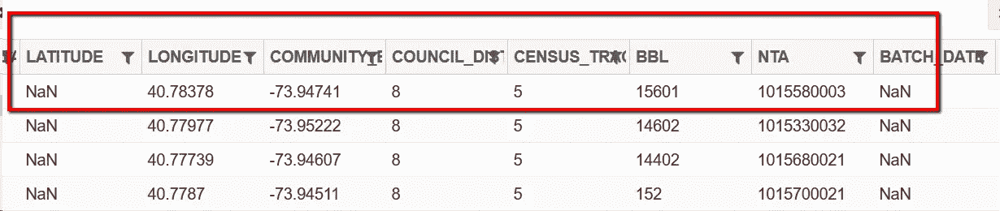

此外，检验公司的名称也不尽相同，*“伊塞克斯兄弟公司”*也被称为*“伊塞克斯兄弟公司”**“伊塞克斯”*。如果分析这一点对你的研究很重要，你会想要使数据一致。

**第三步——分析并可视化数据**

由于我对数据的初步研究，我决定将我的分析重点从检查结果转移到水箱不符合年度报告义务的问题上。

**分组数据** — Python 有一个强大的功能`GROUPBY`，它允许你按照某些属性有效地分组数据，并对结果进行各种计算(比如求和、平均和计数)。由于我们的调查仅限于建筑物是否进行了年度检查，我们将首先选择我们需要的数据。由于每个报告都有一行数据，因此我们将筛选出具有相同 BBL 的同一年的多个报告(保留最后一个)。

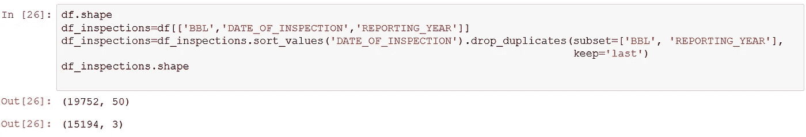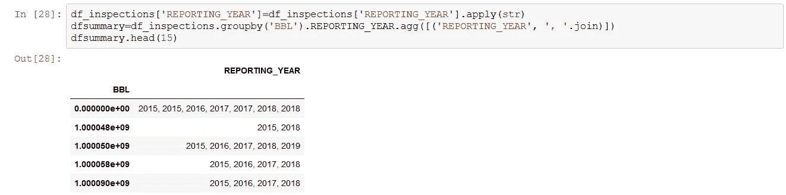

**组合数据** —当您组合多个数据集来寻找模式时，数据分析通常会变得更有趣。为了说明这一点，我将介绍[冥王星数据集](https://www1.nyc.gov/site/planning/data-maps/open-data/dwn-pluto-mappluto.page)，它结合了地理数据和每座建筑物的信息。在这个分析中，我将把重点放在曼哈顿的住宅合作和共管建筑上。我创建了一个`.csv`文件，其中包含了曼哈顿所有 6065 栋合作和共管建筑的地理编码和经纬度信息。基于我们对水箱必不可少的情况的理解，我过滤了这个数据集，只包括六层以上的建筑——共有 2919 栋。

我的计划是将水箱检查的数据框架与合作公寓建筑的数据框架结合起来，创建一个数据框架。为了做到这一点，我们需要在每个数据帧中有一个键或唯一的标识符来匹配数据。在我们的例子中，我们有 BBL，它是每栋建筑的唯一标识符(基于每栋建筑的区/块/地段)。然后，我们可以使用 Pandas 合并`df_cc`数据帧和`df_summary`数据帧。

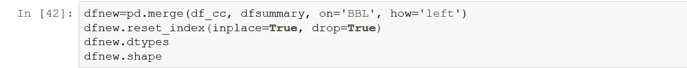

然后，我们可以确定在曼哈顿有多少本应该有水塔的合作公寓/共管公寓建筑在过去 5 年中没有被检查——其中有 1232 栋！

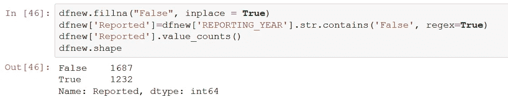

最后，使用`Plotly express`我们可以创建一个交互式地图(只用一行代码！)标识曼哈顿的合作公寓和共管公寓建筑，并将过去 5 年中未被检查的建筑标为红色。`px.scatter_mapbox(dfnew, lat=”Latitude”, lon=”Longitude”, color=”Reported”, hover_name=”Address”, hover_data=a, color_discrete_map = {“Never”: “red”, “Yes”: “green”}, zoom=14)`

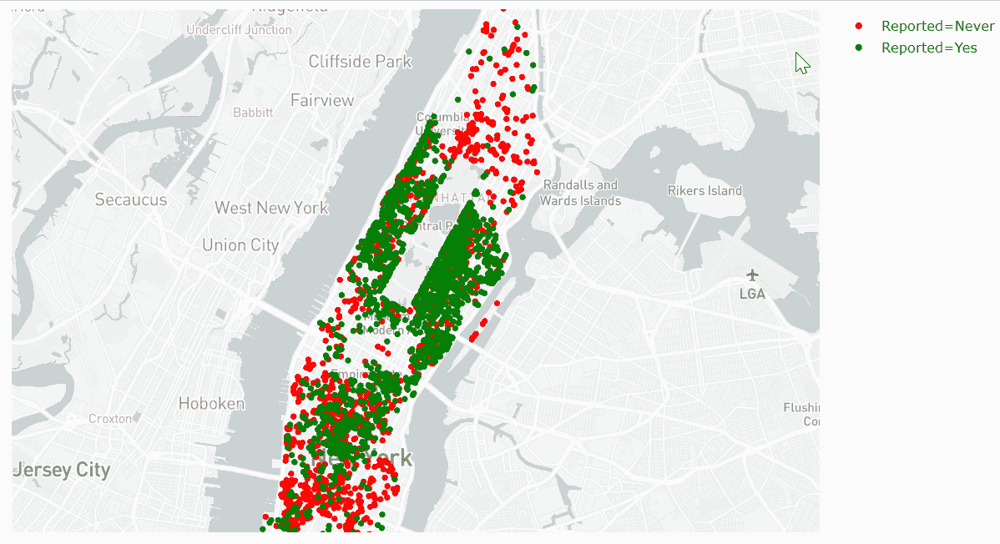

**结论/后续步骤**

根据我们的初步分析，曼哈顿有 2，919 栋带有水箱的合作公寓/共管公寓建筑，其中 1，232 栋从未进行过水箱检查— **42.2%** 。这是一个非常重要的数字，希望是夸大其词！

我的下一步是测试建筑物的样本，以(I)确认水箱的存在(可以使用谷歌地图的卫星视图或类似服务)，我怀疑六层以上的建筑物需要水箱的前提过于简化，以及(ii)将我的结果与通过[纽约市健康建筑水箱搜索工具](https://www1.nyc.gov/site/doh/business/permits-and-licenses/rooftop-drinking-water-tank-inspection-results.page)提供的信息进行比较，以确认调查结果。

我欢迎反馈和建议，并且特别想知道其他人如何在此基础上发展。你可以在推特上找到我