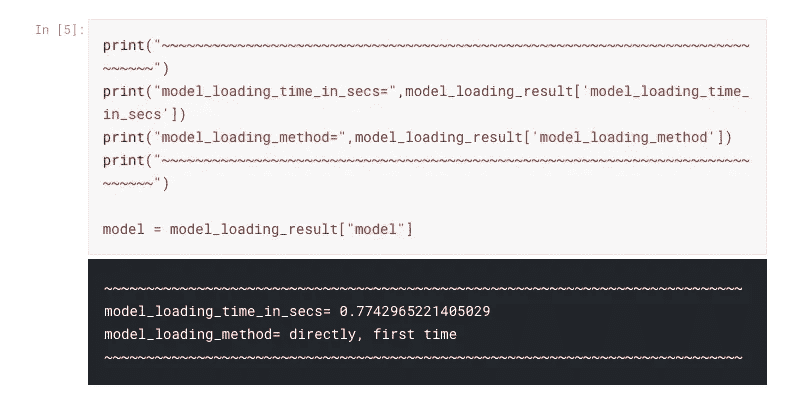
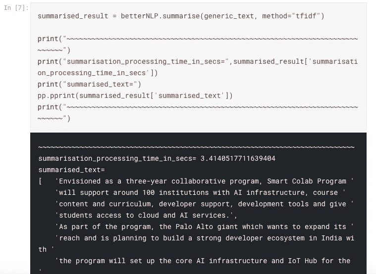

# 使用 Apache OpenNLP 探索 NLP 概念

> 原文：<https://towardsdatascience.com/exploring-nlp-concepts-using-apache-opennlp-4d59c3cac8?source=collection_archive---------39----------------------->

# 介绍

Open-source image [widely used](https://www.google.co.uk/search?hl=en-GB&tbs=simg:CAQS5gIJws2O9UB3iiMa2gILELCMpwgaYgpgCAMSKPIUyxXeFdEV0hXdFeYV9RTlFYALyiimKrUqoyqpKskopyrNOKQqzjgaMLapFKN038S_1R2IDB3kjS2lXpJND1fI-eDwEVaqFtuZviKuyy3gfcz2S1aM9EVZZmiAEDAsQjq7-CBoKCggIARIEa370BAwLEJ3twQka0gEKJQoRbmF0dXJhbCBsYW5kc2NhcGXapYj2AwwKCi9tLzAzZDI4eTMKFwoFc2hhZGXapYj2AwoKCC9tLzBobmRsCiwKGG5vcnRoZXJuIGhhcmR3b29kIGZvcmVzdNqliPYDDAoKL20vMDNkM3pxbgoyCh92YWxkaXZpYW4gdGVtcGVyYXRlIHJhaW4gZm9yZXN02qWI9gMLCgkvbS8wMmp2azMKLgoabm9ydGhlcm4gd2hpdGUgY2VkYXIgc3dhbXDapYj2AwwKCi9tLzA0XzdodHAM&sxsrf=ALeKk0371dkX4j_Wlyi9eHXEuSFMsDmiHQ:1604266002900&q=nolde+forest&tbm=isch&sa=X&ved=2ahUKEwiRjenJpOLsAhXEsHEKHeIIBKEQwg4oAHoECB8QKw&biw=1440&bih=728#imgrc=P9t6yFAw7n76XM)

在查看了 [Awesome AI/ML/DL](https://github.com/neomatrix369/awesome-ai-ml-dl/) 上列出的许多[基于 Java/JVM 的 NLP 库](https://github.com/neomatrix369/awesome-ai-ml-dl/blob/master/natural-language-processing/java-jvm.md#javajvm)之后，我决定选择 [Apache OpenNLP](https://opennlp.apache.org/) 库。其中一个原因是另一个开发者(之前看过)推荐了它。此外，这是一个 Apache 项目，在过去二十年左右的时间里，他们一直是 F/OSS Java 项目的大力支持者。不言而喻， [Apache OpenNLP](https://opennlp.apache.org/) 由 [Apache 2.0 许可证](https://www.apache.org/licenses/LICENSE-2.0.html)支持。

此外，来自 NLP 研究人员的这条推文对此事增加了一些信心:

> *在我目前的研究项目中，我用*[*@ apacheopenlp*](https://twitter.com/ApacheOpennlp?ref_src=twsrc%5Etfw)*进行了实验，很高兴看到这是一个有价值的 nlp 工具包，它有一个用户友好的 API。把*[*@ apacheopenlp*](https://twitter.com/ApacheOpennlp?ref_src=twsrc%5Etfw)*和*[*@ stanfordnlp*](https://twitter.com/stanfordnlp?ref_src=twsrc%5Etfw)*做个比较还为时过早。我先看看它们在命名实体识别中的表现。*
> 
> *- Linda(夏)刘(@ DrLiuBigData)*[*2019 年 3 月 2 日*](https://twitter.com/DrLiuBigData/status/1101890668283215872?ref_src=twsrc%5Etfw)

我想说的是，到目前为止，我的个人体验与 [Apache OpenNLP](https://opennlp.apache.org/) 很相似，我赞同它的简单性和用户友好的 API 和设计。当我们进一步探索时，你会发现事实就是如此。

# 使用 Apache OpenNLP 探索 NLP

## Java 绑定

在这篇文章中，我们不会涉及 Java API 到 [Apache OpenNLP](https://opennlp.apache.org/) 工具，但是你可以在[他们的文档](https://opennlp.apache.org/docs/1.9.1/manual/opennlp.html)中找到一些例子。过一会儿，为了更进一步，你还需要这篇文章底部的**资源**部分的一些资源。

## 命令行界面

我被可用的 CLI 的简单性所吸引，它只是开箱即用，例如在需要模型的情况下，以及当它被提供时。它不需要额外的配置就可以工作。

为了使它更容易使用，也不必记住它支持的所有 CLI 参数，我整理了一些 [shell 脚本](https://github.com/valohai/nlp-java-jvm-example#scripts-provided)。看看 [README](https://github.com/valohai/nlp-java-jvm-example#nlp-javajvm-) 来更深入地了解它们是什么以及如何使用它们。

## 入门指南

从现在开始，您将需要以下内容:

*   Git client 2.x 或更高版本(GitHub 上用于派生回购的帐户)
*   Java 8 或更高版本(建议安装 [GraalVM CE](https://www.graalvm.org) 19.x 或更高版本)
*   Docker CE 19.x 或更高版本，并在继续操作之前检查它是否正在运行
*   能够从 CLI 运行 [shell 脚本](https://github.com/valohai/nlp-java-jvm-example#scripts-provided)
*   了解读/写 shell 脚本(可选)

注意:在撰写本文时，Apache OpenNLP 的 1.9.1 版本已经发布。

我们已经将[的脚本](https://github.com/valohai/nlp-java-jvm-example#scripts-provided)放在一起，让每个人都可以轻松完成这些步骤:

这将引导我们找到包含以下文件的文件夹:

*注意:已经提供了一个* [*docker 映像*](https://hub.docker.com/r/neomatrix369/nlp-java) *来运行一个 docker 容器，该容器将包含您进一步需要的所有工具。您可以看到已经创建了* `*shared*` *文件夹，这是一个挂载到您的容器中的卷，但它实际上是在您的本地计算机上创建的***目录，并映射到该卷。因此，在那里创建或下载的任何东西即使在您退出容器后也仍然可用！**

*快速阅读主 [README](https://github.com/valohai/nlp-java-jvm-example#nlp-javajvm-) 文件，了解如何使用 [docker-runner.sh shell 脚本](https://github.com/valohai/nlp-java-jvm-example/blob/master/docker-runner.sh)，并快速浏览[用法部分](https://github.com/valohai/nlp-java-jvm-example#usage) *。*此后，还可以查看一下 [Apache OpenNLP README](https://github.com/valohai/nlp-java-jvm-example/blob/master/images/java/opennlp/README.md) 文件，查看其中提供的[脚本](https://github.com/valohai/nlp-java-jvm-example/tree/master/images/java/opennlp#scripts-provided)的[用法](https://github.com/valohai/nlp-java-jvm-example/tree/master/images/java/opennlp#exploring-nlp-concepts)。*

## *运行 NLP Java/JVM docker 容器*

*在项目的根目录下，在本地计算机命令提示符下，执行以下操作:*

*在得到提示之前，您有可能首先看到以下内容:*

*然后您将看到容器内的提示:*

*该容器中包含了开始探索各种 NLP 解决方案所需的所有 Apache OpenNLP 脚本/工具。*

## *在容器中安装 Apache OpenNLP*

*当您在容器内部时，在容器命令提示符下，我们将进一步了解以下内容:*

*您将看到`apache-opennlp-1.9.1-bin.tar.gz`工件被下载并展开到`shared`文件夹中:*

## *查看和访问共享文件夹*

*就像你运行容器一样，一个共享的文件夹被创建，开始的时候它可能是空的，但是随着时间的推移，我们会发现它被不同的文件和文件夹填满了。*

*你也可以在这里找到下载的模型，Apache OpenNLP 二进制文件被展开到它自己的目录中(名为`apache-opennlp-1.9.1`)。*

*您也可以从命令提示符(在容器外部)访问并查看它的内容:*

*从容器内部看，这是您所看到的:*

## *在容器内执行 NLP 操作*

*好的一面是，你无需离开当前文件夹就可以执行这些 NLP 操作(查看[自述](https://github.com/valohai/nlp-java-jvm-example/tree/master/images/java/opennlp#apache-opennlp--)中的[探索 NLP 概念](https://github.com/valohai/nlp-java-jvm-example/tree/master/images/java/opennlp#exploring-nlp-concepts)部分):*

*任何脚本的使用帮助:在任何时候，您都可以通过以下方式查询脚本:*

*例如*

*给我们这个用法文本作为输出:*

*   *检测单行文本或文章中的语言(见[语言缩写图例](https://www.apache.org/dist/opennlp/models/langdetect/1.8.3/README.txt)*

*更多示例和详细输出见[自述文件](https://github.com/valohai/nlp-java-jvm-example#nlp-javajvm-)中的[检测语言](https://github.com/valohai/nlp-java-jvm-example/blob/master/images/java/opennlp/README-detecting-language.md)部分。*

*   *检测单行文本或文章中的句子。*

*更多示例和详细输出见[自述文件](https://github.com/valohai/nlp-java-jvm-example#nlp-javajvm-)中的[检测句子](https://github.com/valohai/nlp-java-jvm-example/blob/master/images/java/opennlp/README-detecting-sentences.md)部分。*

*   *在单行文本或文章中查找人名、组织名、日期、时间、金钱、位置、百分比信息。*

*更多示例和详细输出见[自述文件](https://github.com/valohai/nlp-java-jvm-example#nlp-javajvm-)中的[查找名称](https://github.com/valohai/nlp-java-jvm-example/blob/master/images/java/opennlp/README-finding-names.md)部分。本节中有许多类型的名称查找器示例。*

*   *将一行文本或一篇文章标记成更小的组成部分(如单词、标点、数字)。*

*更多示例和详细输出见[自述文件](https://github.com/valohai/nlp-java-jvm-example#nlp-javajvm-)中的[符号化](https://github.com/valohai/nlp-java-jvm-example/blob/master/images/java/opennlp/README-tokenise.md)部分。*

*   *解析一行文本或一篇文章，识别组合在一起的单词或短语(参见 [Penn Treebank 标签集](https://www.ling.upenn.edu/courses/Fall_2003/ling001/penn_treebank_pos.html)了解令牌类型的图例)，也参见【https://nlp.stanford.edu/software/lex-parser.shtml.】T2*

*更多例子和详细输出见[自述文件](https://github.com/valohai/nlp-java-jvm-example#nlp-javajvm-)中的[解析器](https://github.com/valohai/nlp-java-jvm-example/blob/master/images/java/opennlp/README-parser.md)部分。*

*   *标记一行文本或一篇文章中每个标记的词性(参见 [Penn Treebank 标记集](https://www.ling.upenn.edu/courses/Fall_2003/ling001/penn_treebank_pos.html)了解标记类型的图例)，也参见[https://nlp.stanford.edu/software/tagger.shtml.](https://nlp.stanford.edu/software/tagger.shtml)*

*有关更多示例和详细输出，请参见[自述文件](https://github.com/valohai/nlp-java-jvm-example#nlp-javajvm-)中的[标记词性](https://github.com/valohai/nlp-java-jvm-example/blob/master/images/java/opennlp/README-tag-parts-of-speech.md)部分。*

*   *文本分块通过将文本或文章分成单词的句法相关部分，如名词组、动词组。您可以将此功能应用于已标记的词性文本或文章。*对已经由 PoS tagger* 标记的文本应用分块(参见 [Penn Treebank tag set](https://www.ling.upenn.edu/courses/Fall_2003/ling001/penn_treebank_pos.html) 了解标记类型的图例，也参见[https://nlpforhackers.io/text-chunking/](https://nlpforhackers.io/text-chunking/)*

*更多示例和详细输出见[自述文件](https://github.com/valohai/nlp-java-jvm-example#nlp-javajvm-)中的[分块](https://github.com/valohai/nlp-java-jvm-example/blob/master/images/java/opennlp/README-chunking.md)部分。*

## *退出 NLP Java/JVM docker 容器*

*事情就是这么简单:*

*您将返回到本地计算机提示符。*

# *标杆管理*

*该工具的一个显著特点是，它记录和报告其在不同执行点的操作的指标—在微观和宏观级别所用的时间，这里有一个示例输出来说明这一特点:*

*从以上内容中，我发现了对我作为科学家、分析师甚至工程师都有用的 5 个指标:*

*在进行性能比较时，像这样的信息是非常宝贵的，例如:*

*   *在两个或多个模型之间(加载时和运行时性能)*
*   *在两个或多个环境或配置之间*
*   *在执行相同 NLP 的应用程序之间，使用不同的技术栈将动作放在一起*
*   *还包括不同的语言*
*   *寻找不同文本数据语料库之间的相互关系(定量和定性比较)*

# *经验例子*

*[*BetterNLP*](https://bit.ly/better-nlp-launch) *用 python 写的库也在做类似的事情，参见*[*Kaggle*](https://kaggle.com)*kernel:*[*Better NLP 笔记本*](https://www.kaggle.com/neomatrix369/better-nlp-class-notebook) *和* [*Better NLP 总结者笔记本*](https://www.kaggle.com/neomatrix369/better-nlp-summarisers-notebook) *(搜索* *time_in_secs* *这两个笔记本里面都有**

****

*就个人而言，这非常鼓舞人心，也证明了这是一个提供给最终用户的有用特性(或行为)。*

# *其他概念、库和工具*

*在下面的**参考资料**部分中提到了其他的[基于 Java/JVM 的 NLP 库](https://github.com/valohai/nlp-java-jvm-example#libraries--frameworks-provided)，为了简洁起见，我们不会涉及它们。所提供的链接将为你自己的追求带来进一步的信息。*

*在 [Apache OpenNLP](https://opennlp.apache.org/) 工具本身中，我们只讨论了它的命令行访问部分，而没有讨论 Java 绑定。此外，我们并没有再次介绍该工具的所有 NLP 概念或特性，因为简洁起见，我们只介绍了其中的一小部分。但是[文档](https://opennlp.apache.org/docs/)和[资源](https://github.com/apache/opennlp#useful-links)在 [GitHub repo](https://github.com/apache/opennlp) 上应该有助于进一步的探索。*

*你也可以通过检查 [docker-runner 脚本](https://github.com/valohai/nlp-java-jvm-example/blob/master/docker-runner.sh)来找出如何为自己构建 [docker 形象](https://hub.docker.com/r/neomatrix369/nlp-java)。*

# *结论*

**

*[Image source](https://unsplash.com/photos/RQR94izYg2k) by [Simon Ray](https://unsplash.com/@simonbhray)*

*在经历了以上内容之后，我们可以通过探究其优缺点来总结以下关于 [Apache OpenNLP](https://opennlp.apache.org/) 工具的内容:*

***优点***

*   *这是一个易于使用和理解的 API*
*   *浅显的学习曲线和包含大量示例的详细文档*
*   *涵盖了许多 NLP 功能，在[文档](https://opennlp.apache.org/docs/)中有比我们上面所做的更多的内容要探索*
*   *简单的[外壳脚本](https://github.com/valohai/nlp-java-jvm-example#scripts-provided)和 [Apache OpenNLP 脚本](https://github.com/valohai/nlp-java-jvm-example/tree/master/images/java/opennlp)已经被提供来使用这个工具*
*   *下面有很多资源可以用来了解关于 NLP 的更多信息(参见下面的**资源**部分)*
*   *为快速入门和探索 [Apache OpenNLP](https://opennlp.apache.org/) 工具而提供的资源*

***缺点***

*   *查看 [GitHub](https://github.com/apache/opennlp) 回购，似乎进展缓慢或停滞不前(最近两次提交有很大差距，即 2019 年 5 月和 2019 年 10 月 15 日)*
*   *浏览[文档(手册)](https://opennlp.apache.org/docs/1.9.1/manual/opennlp.html)中的示例时，遗漏了一些型号*
*   *根据您的使用案例，当前提供的模型可能需要进一步培训，请参见此推文:*

# *资源*

## *Apache OpenNLP*

*   *NLP-Java-JVM-示例 GitHub 项目*
*   *[Apache OpenNLP](https://opennlp.apache.org/)|[GitHub](https://github.com/apache/opennlp)|[邮件列表](https://opennlp.apache.org/mailing-lists.html)|[@ Apache openlp](https://twitter.com/@apacheopennlp)*
*   ***文档***
*   *[文档资源](https://opennlp.apache.org/docs/)*
*   *[手动](https://opennlp.apache.org/docs/1.9.1/manual/opennlp.html)*
*   *[Apache OpenNLP 工具 Javadoc](https://opennlp.apache.org/docs/1.9.1/apidocs/opennlp-tools/index.html)*
*   ***下载***
*   *[Apache OpenNLP Jar/二进制](https://opennlp.apache.org/download.html)*
*   ***模型动物园***
*   *[车型页面](https://opennlp.apache.org/models.html)*
*   *[语言检测模型](http://www.mirrorservice.org/sites/ftp.apache.org/opennlp/models/langdetect/1.8.3/langdetect-183.bin)*
*   *[支持文档中示例的旧型号](http://opennlp.sourceforge.net/models-1.5/)*
*   ***图例支持文档中的示例***
*   *[语言列表](https://www.apache.org/dist/opennlp/models/langdetect/1.8.3/README.txt)*
*   *[Penn Treebank 标签集](https://www.ling.upenn.edu/courses/Fall_2003/ling001/penn_treebank_pos.html)*
*   *在[自述文件](https://github.com/valohai/nlp-java-jvm-example/blob/master/images/java/opennlp/README.md#apache-opennlp--)的[资源](https://github.com/valohai/nlp-java-jvm-example/blob/master/images/java/opennlp/README.md#resources)部分找到更多信息*

## *其他相关员额*

*   *[如何在 Valohai 平台上做 Java 的深度学习？](https://blog.valohai.com/nlp_with_dl4j_in_java_all_from_the_command-line?from=3oxenia9mtr6)*
*   *[NLP 与 DL4J 在 Java 中，全部来自命令行](https://blog.valohai.com/nlp_with_dl4j_in_java_all_from_the_command-line?from=3oxenia9mtr6)*

## *关于我*

*Mani Sarkar 是一名主要在 Java/JVM 领域充满激情的开发人员，目前在与小团队和初创公司合作时加强团队并帮助他们加速，作为一名自由软件工程师/数据/ml 工程师，[更多…](https://neomatrix369.wordpress.com/about)*

***推特:**[@ theneomatrix 369](https://twitter.com/@theNeomatrix369)|**GitHub:**[@ neomatrix 369](https://github.com/neomatrix369)*

***最初发表于**[**https://blog.valohai.com**](https://blog.valohai.com/exploring-nlp-concepts-using-apache-opennlp-1?from=3oxenia9mtr6)**。***