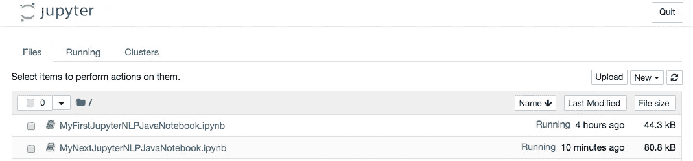
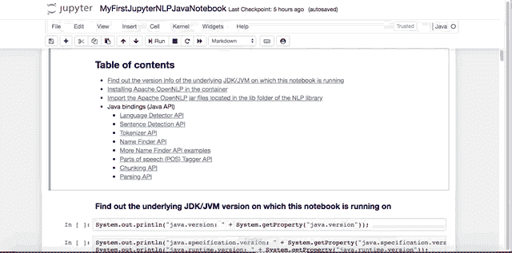
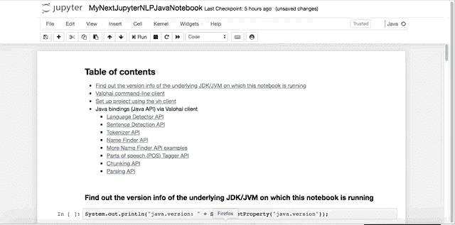
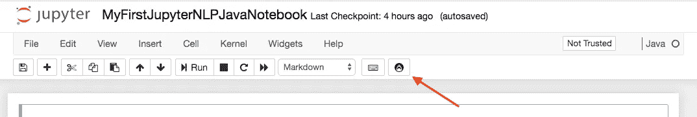

# 在支持 Java 的 Jupyter 笔记本中使用 Apache OpenNLP 探索 NLP 概念

> 原文：<https://towardsdatascience.com/exploring-nlp-concepts-using-apache-opennlp-inside-a-jupyter-notebook-e53489ba2bd8?source=collection_archive---------39----------------------->

# 介绍


[Image source](https://unsplash.com/photos/gEta6dbzFy0) (unsplash) via [Daniel Olah](https://unsplash.com/@danesduet)

经过一番说服之后，我一直在探索和使用 Apache OpenNLP 库。对于那些不知道它的人来说，这是一个 [Apache](https://apache.org) 项目，过去二十年左右 F/OSS Java 项目的支持者(见[维基百科](https://en.wikipedia.org/wiki/The_Apache_Software_Foundation))。我发现他们的命令行界面使用起来非常简单，对于学习和理解自然语言处理(NLP)来说，这是一个非常好的学习工具。独立于这篇文章，你可以找到使用 Apache OpenNLP 的另一种视角，所有这些都直接来自你的命令提示符。

我可以说，这个领域的几乎每个人都知道并熟悉 [Jupyter 笔记本](https://jupyter.org/)(如果你不是，可以看看这个[视频](https://www.youtube.com/watch?v=HW29067qVWk)或[【1】](http://www.geomarvel.com/2019/09/03/getting-started-with-jupyter-notebooks/)或[【2】](https://www.dataquest.io/blog/jupyter-notebook-tutorial/))。从现在开始，我们将会在笔记本的领域内做和你自己的实验一样的事情。

# 使用 Apache OpenNLP 探索 NLP

# 命令行界面

我会让你参考[贴子](https://medium.com/@neomatrix369/exploring-nlp-concepts-using-apache-opennlp-4d59c3cac8?source=---------2------------------&gi=2aabe5762998)，在那里我们讲述了关于 [Apache OpenNLP](https://opennlp.apache.org/) 的命令行体验，这是让你熟悉这个 NLP 库的一个很好的方法。

# Jupyter 笔记本:入门

在继续下一步之前，请执行以下操作:

```
$ git clone git@github.com:neomatrix369/nlp-java-jvm-example.gitor$ git clone https://github.com/neomatrix369/nlp-java-jvm-example.git$ cd nlp-java-jvm-example
```

*然后是* *请参阅 README 的* [*部分中的*](https://github.com/neomatrix369/nlp-java-jvm-example/blob/master/images/java/opennlp/README-exploring-nlp-java-jupyter-notebook.md#exploring-nlp-concepts-from-inside-a-java-based-jupyter-notebook) [*入门*](https://github.com/neomatrix369/nlp-java-jvm-example/blob/master/images/java/opennlp/README-exploring-nlp-java-jupyter-notebook.md#getting-started) *一节，从基于 Java 的 Jupyter 笔记本* *内部探索 NLP 概念，然后再继续。*

此外，默认情况下，我们将 JDK 选择为 [GraalVM](https://graalvm.org) ，您可以从控制台消息中的这些行看到这一点:

```
<---snipped-->JDK_TO_USE=GRAALVMopenjdk version "11.0.5" 2019-10-15OpenJDK Runtime Environment (build 11.0.5+10-jvmci-19.3-b05-LTS)OpenJDK 64-Bit GraalVM CE 19.3.0 (build 11.0.5+10-jvmci-19.3-b05-LTS, mixed mode, sharing)<---snipped-->
```

***注意*** *:已经提供了一个* [*docker 镜像*](https://hub.docker.com/r/neomatrix369/nlp-java) *来运行一个 docker 容器，它将包含您需要的所有工具。您可以看到已经创建了共享文件夹，它链接到装入容器的卷，从本地机器映射您的文件夹。因此，任何创建或下载到共享文件夹中的内容，即使在您退出容器后也仍然可用！*

快速阅读主 [README](https://github.com/neomatrix369/nlp-java-jvm-example#nlp-javajvm-) 文件，了解如何使用 [docker-runner.sh shell 脚本](https://github.com/neomatrix369/nlp-java-jvm-example/blob/master/docker-runner.sh)，并快速浏览[脚本](https://github.com/neomatrix369/nlp-java-jvm-example/tree/master/images/java/opennlp#scripts-provided)和**的[用法部分](https://github.com/neomatrix369/nlp-java-jvm-example#usage)。**

# 运行 Jupyter 笔记本容器

*请参阅 README 的* [*部分中的*](https://github.com/neomatrix369/nlp-java-jvm-example/blob/master/images/java/opennlp/README-exploring-nlp-java-jupyter-notebook.md#exploring-nlp-concepts-from-inside-a-java-based-jupyter-notebook) [*运行 Jupyter 笔记本容器*](https://github.com/neomatrix369/nlp-java-jvm-example/blob/master/images/java/opennlp/README-exploring-nlp-java-jupyter-notebook.md#running-the-jupyter-notebook-container) *部分，从基于 Java 的 Jupyter 笔记本* *内部探索 NLP 概念。*

您所需要做的就是在克隆上面链接中提到的 repo 之后运行此命令:

```
$ ./docker-runner.sh --notebookMode --runContainer
```

一旦你运行了上面的操作，这个操作将会自动打开并加载 Jupyter 笔记本界面到一个浏览器窗口中。您将有几个 Java 笔记本可供选择(放在本地机器上的 shared/notebooks 文件夹中):



# 在容器中安装 Apache OpenNLP

当处于笔记本模式的容器中时，有两种方法可以安装 [Apache OpenNLP](https://opennlp.apache.org/) :

*   **从命令行界面(可选)**
*   *参见* [*部分的*](https://github.com/neomatrix369/nlp-java-jvm-example/blob/master/images/java/opennlp/README-exploring-nlp-java-jupyter-notebook.md#exploring-nlp-concepts-from-inside-a-java-based-jupyter-notebook) [*在容器中安装 Apache open NLP*](https://github.com/neomatrix369/nlp-java-jvm-example/blob/master/images/java/opennlp/README-exploring-nlp-java-jupyter-notebook.md#installing-apache-opennlp-in-the-container)*小节中的命令行界面* *小节中的* [*从基于 Java 的 Jupyter 笔记本*](https://github.com/neomatrix369/nlp-java-jvm-example/blob/master/images/java/opennlp/README-exploring-nlp-java-jupyter-notebook.md#from-the-command-line-interface) *部分探索 NLP 概念，然后再继续阅读。*
*   **从 Jupyter 笔记本里面(推荐)**
*   *请参阅自述文件* [*部分的*](https://github.com/neomatrix369/nlp-java-jvm-example/blob/master/images/java/opennlp/README-exploring-nlp-java-jupyter-notebook.md#exploring-nlp-concepts-from-inside-a-java-based-jupyter-notebook) [*在容器中安装 Apache open NLP*](https://github.com/neomatrix369/nlp-java-jvm-example/blob/master/images/java/opennlp/README-exploring-nlp-java-jupyter-notebook.md#installing-apache-opennlp-in-the-container)[中的](https://github.com/neomatrix369/nlp-java-jvm-example/blob/master/images/java/opennlp/README-exploring-nlp-java-jupyter-notebook.md#exploring-nlp-concepts-from-inside-a-java-based-jupyter-notebook)[](https://github.com/neomatrix369/nlp-java-jvm-example/blob/master/images/java/opennlp/README-exploring-nlp-java-jupyter-notebook.md#from-inside-the-jupyter-notebook)**小节，然后再继续。**

# *查看和访问共享文件夹*

**请参阅自述文件* [*中的*](https://github.com/neomatrix369/nlp-java-jvm-example/blob/master/images/java/opennlp/README-exploring-nlp-java-jupyter-notebook.md#exploring-nlp-concepts-from-inside-a-java-based-jupyter-notebook) [*查看和访问共享文件夹*](https://github.com/neomatrix369/nlp-java-jvm-example/blob/master/images/java/opennlp/README-exploring-nlp-java-jupyter-notebook.md#viewing-and-accessing-the-shared-folder) *部分，从基于 Java 的 Jupyter 笔记本* *内部探索 NLP 概念。**

*这也将在下一节的 Jupyter 笔记本中有所涉及。您可以通过%system [Java cell magic](https://github.com/SpencerPark/IJava/blob/master/docs/magics.md) 看到目录内容，然后从命令提示符看到类似的文件/文件夹布局。*

# *在 Jupyter 笔记本中执行 NLP 操作*

*当您运行笔记本电脑服务器时，笔记本电脑服务器一启动，您就会看到此启动器窗口，其中包含笔记本电脑和其他支持文件的列表:*

**

*上面的每个笔记本都有一个用途，[myfirstjupyternlp javanotebook . ipynb](https://github.com/neomatrix369/nlp-java-jvm-example/blob/master/shared/notebooks/MyFirstJupyterNLPJavaNotebook.ipynb)展示了如何在 IPython 笔记本中编写 Java，并使用调用 [Apache OpenNLP](https://opennlp.apache.org/) 库功能的 Java 代码片段执行 NLP 操作(参见[文档了解关于类和方法的更多细节](https://opennlp.apache.org/docs/1.9.1/apidocs/opennlp-tools/index.html)，以及 [Java 文档了解关于 Java API 用法的更多细节](https://opennlp.apache.org/docs/1.9.1/apidocs/opennlp-tools/index.html))。*

*另一个笔记本[mynextjupyternlpjavanotebook . ipynb](https://github.com/neomatrix369/nlp-java-jvm-example/blob/master/shared/notebooks/MyNextJupyterNLPJavaNotebook.ipynb)在一个远程云实例上运行相同的 Java 代码片段(在 [Valohai CLI](https://docs.valohai.com/valohai-cli/index.html) 客户端的帮助下)并返回单元格中的结果，只需一个命令。[创建账户](https://app.valohai.com/accounts/signup/)并在[自由层计划](https://valohai.com/pricing/)内使用快速且免费。*

*我们能够从两个基于 Java 的笔记本内部检查以下 Java API 与 [Apache OpenNLP](https://opennlp.apache.org/) 库的绑定:*

*   *[语言检测器 API](https://opennlp.apache.org/docs/1.9.1/manual/opennlp.html#tools.langdetect.classifying.api)*
*   *[句子检测 API](https://opennlp.apache.org/docs/1.9.1/manual/opennlp.html#tools.sentdetect.detection.api)*
*   *[记号赋予器 API](https://opennlp.apache.org/docs/1.9.1/manual/opennlp.html#tools.tokenizer.api)*
*   *[名称查找器 API](https://opennlp.apache.org/docs/1.9.1/manual/opennlp.html#tools.namefind.recognition.api) (包括其他示例)*
*   *[词性标注 API](https://opennlp.apache.org/docs/1.9.1/manual/opennlp.html#tools.postagger.tagging.api)*
*   *[分块 API](https://opennlp.apache.org/docs/1.9.1/manual/opennlp.html#tools.parser.chunking.api)*
*   *[解析 API](https://opennlp.apache.org/docs/1.9.1/manual/opennlp.html#tools.parser.parsing.api)*

***直接通过笔记本探索上述 Apache OpenNLP Java APIs】***

*我们能够在笔记本内部完成这项工作，运行 [IJava Jupyter 解释器](https://github.com/SpencerPark/IJava)，它允许在典型的笔记本中编写 Java。我们将使用 Java 代码的小片段探索上述命名的 Java APIs，并在笔记本中看到结果:*

**

*因此，回到您的浏览器，寻找[myfirstjupyternlpjavanotebook . ipynb](https://github.com/neomatrix369/nlp-java-jvm-example/blob/master/shared/notebooks/MyFirstJupyterNLPJavaNotebook.ipynb)笔记本，用它玩一玩，读取并执行每个单元格，观察响应。*

***借助远程云服务，通过笔记本探索上述 Apache OpenNLP Java APIs】***

*我们能够在笔记本内部完成这项工作，运行 [IJava Jupyter 解释器](https://github.com/SpencerPark/IJava)，它允许在典型的笔记本中编写 Java。但是在这本笔记本中，我们更进一步，使用了%system [Java cell magic](https://github.com/SpencerPark/IJava/blob/master/docs/magics.md) 和 [Valohai CLI](https://docs.valohai.com/valohai-cli/index.html) magic，而不是像以前的笔记本那样在各个单元格中运行 Java 代码片段。*

*这样，模型的下载和使用模型的文本处理就不会在本地机器上进行，而是在云中一个更复杂的远程服务器上进行。你可以从笔记本电脑内部控制这个过程。当要处理的模型和数据集很大，而您的本地实例没有必要的资源来支持长期的 NLP 过程时，这一点更为重要。我看到 NLP 培训和评估需要很长时间才能完成，因此高规格的资源是必须的。*

**

*再次回到你的浏览器，寻找[mynextjupyternlpjavanotebook . ipynb](https://github.com/neomatrix369/nlp-java-jvm-example/blob/master/shared/notebooks/MyNextJupyterNLPJavaNotebook.ipynb)笔记本，用它玩一玩，读取并执行每个单元格。所有必要的细节都在那里，包括文档和支持页面的链接。*

*为了更深入地了解这两个笔记本是如何组装在一起的，以及它们是如何操作的，请查看所有的[源文件](https://github.com/neomatrix369/nlp-java-jvm-example/tree/master/shared/notebooks)。*

# *合上 Jupyter 笔记本*

*在执行此操作之前，请确保您已经保存了笔记本。切换到运行 docker-runner shell 脚本的控制台窗口。在运行 Docker 容器的控制台中按下 **Ctrl-C** ,您会看到:*

```
*<---snipped--->[I 21:13:16.253 NotebookApp] Saving file at /MyFirstJupyterJavaNotebook.ipynb^C[I 21:13:22.953 NotebookApp] interruptedServing notebooks from local directory: /home/jovyan/work1 active kernelThe Jupyter Notebook is running at:[http://1e2b8182be38:8888/](http://1e2b8182be38:8888/)Shutdown this notebook server (y/[n])? y[C 21:14:05.035 NotebookApp] Shutdown confirmed[I 21:14:05.036 NotebookApp] Shutting down 1 kernelNov 15, 2019 9:14:05 PM io.github.spencerpark.jupyter.channels.Loop shutdownINFO: Loop shutdown.<--snipped-->[I 21:14:05.441 NotebookApp] Kernel shutdown: 448d46f0-1bde-461b-be60-e248c6342f69*
```

*这将关闭容器，您将返回到本地机器的命令提示符下。您的笔记本会保留在本地计算机上的“共享/笔记本”文件夹中，前提是您在不断更改它们时已经保存了它们。*

# *其他概念、库和工具*

*下面的**参考资料**部分提到了其他基于 [Java/JVM 的 NLP 库](https://github.com/neomatrix369/nlp-java-jvm-example#libraries--frameworks-provided)，为了简洁起见，我们就不一一赘述了。所提供的链接将为你自己的追求带来进一步的信息。*

*在 Apache OpenNLP 工具本身中，我们只讨论了它的命令行访问部分，而没有讨论 Java 绑定。此外，我们并没有再次介绍该工具的所有 NLP 概念或特性，因为简洁起见，我们只介绍了其中的一小部分。但是[文档](https://opennlp.apache.org/docs/)和[资源](https://github.com/apache/opennlp#useful-links)在 [GitHub repo](https://github.com/apache/opennlp) 上应该有助于进一步的探索。*

*您还可以通过检查 [docker-runner 脚本](https://github.com/neomatrix369/nlp-java-jvm-example/blob/master/docker-runner.sh)来了解如何为自己构建 [docker 映像](https://hub.docker.com/r/neomatrix369/nlp-java)。*

# *限制*

*尽管 Java cell magic 确实有所不同，并有助于运行命令。即使它不是基于 Python 的笔记本，我们仍然可以在我们的单元中运行 shell 命令和执行 Java 代码，并在 Jupyter 笔记本中做一些不错的 NLP 工作。*

*如果你有一个基于 python 的笔记本，那么 [Valohai](https://www.valohai.com) 的扩展 [Jupyhai](https://docs.valohai.com/jupyter/index.html) 就足够了。看看本帖**资源**版块的**聚居地**子版块(在帖子末尾)。事实上，我们一直在 Jupyhai 笔记本中运行我们的所有操作，尽管我一直称它为 Jupyter Notebook，看看浏览器中面板中间部分工具栏上的图标):*

**

# *结论*

**

*[Image source](https://unsplash.com/photos/CKlHKtCJZKk) (unsplash) via [Aaron Burden](https://unsplash.com/@aaronburden)*

*这是一种与大多数其他探索和学习方式非常不同的体验，你可以看到为什么整个行业，特别是涵盖学术界、研究、数据科学和机器学习的领域，都像风暴一样采用这种方法。我们仍然有局限性，但是随着时间的推移，它们会被克服，让我们的经历变得更顺利。*

*在你的代码所在的同一个页面上看到你的结果是一个很大的保证，给了我们一个简短快速的反馈循环。尤其是能够看到可视化并动态地改变它们并获得即时结果，这可以为每个领域的忙碌和渴望的学生、科学家、数学家、工程师和分析师开辟道路，而不仅仅是计算或数据科学或机器学习。*

# *资源*

# *ijjava(Jupyter 解释程序)*

*   *[Github](https://github.com/SpencerPark/IJava)*
*   *[单据](https://github.com/SpencerPark/IJava/tree/master/docs)*
*   *[%system Java 细胞魔术实现](https://github.com/SpencerPark/IJava/pull/78)*
*   *[Docker 镜像与 IJava + Jupyhai +其他依赖关系](https://hub.docker.com/r/neomatrix369/nlp-java)*

# *朱皮海*

*   *[Jupyter 笔记本的版本控制](https://get.valohai.com/jupyter-notebook-version-control)*
*   *[Jupyter 笔记本上的博客](https://blog.valohai.com/topic/jupyter-notebook)*
*   *[瓦罗海的 Jupyter 笔记本扩展](https://blog.valohai.com/valohai-jupyter-notebook-extension)*
*   *[数据科学中的异步工作流](https://blog.valohai.com/asynchronous-workflows-in-data-science)*
*   *[自动版本控制遇上 Jupyter 笔记本](https://blog.valohai.com/automatic-version-control-meets-jupyter-notebooks)*
*   *[将您的机器学习代码从笔记本提升到生产阶段](https://blog.valohai.com/leveling-up-your-ml-code-from-notebook)*
*   *[在任何云提供商上运行 Jupyter 笔记本](https://blog.valohai.com/run-jupyter-notebook-any-cloud-provider)*
*   *[valo hai 笔记本电脑更新](https://blog.valohai.com/jupyter-extension-updates)*
*   *【Jupyter 笔记本的版本控制(视频)*
*   *[文档](https://docs.valohai.com/jupyter/index.html)*

# *Apache OpenNLP*

*   *[NLP-Java-JVM-示例](https://github.com/neomatrix369/nlp-java-jvm-example) GitHub 项目*
*   *[Apache OpenNLP](https://opennlp.apache.org/)|[GitHub](https://github.com/apache/opennlp)|[邮件列表](https://opennlp.apache.org/mailing-lists.html)|[@ Apache openlp](https://twitter.com/@apacheopennlp)*
*   *文件（documents 的简写）*
*   *[文档资源](https://opennlp.apache.org/docs/)*
*   *[手动](https://opennlp.apache.org/docs/1.9.1/manual/opennlp.html)*
*   *[Apache OpenNLP 工具 Javadoc](https://opennlp.apache.org/docs/1.9.1/apidocs/opennlp-tools/index.html)*
*   *[计] 下载*
*   *[Apache OpenNLP Jar/binary](https://opennlp.apache.org/download.html)*
*   *模型动物园*
*   *[车型页面](https://opennlp.apache.org/models.html)*
*   *[语言检测模式](http://www.mirrorservice.org/sites/ftp.apache.org/opennlp/models/langdetect/1.8.3/langdetect-183.bin)*
*   *[支持文档中示例的旧型号](http://opennlp.sourceforge.net/models-1.5/)*
*   *图例支持文档中的示例*
*   *[语言列表](https://www.apache.org/dist/opennlp/models/langdetect/1.8.3/README.txt)*
*   *[宾州树木银行标签集](https://www.ling.upenn.edu/courses/Fall_2003/ling001/penn_treebank_pos.html)*
*   *在[自述文件](https://github.com/neomatrix369/awesome-ai-ml-dl/blob/master/examples/nlp-java-jvm/images/java/opennlp/README.md#apache-opennlp--)的[资源](https://github.com/neomatrix369/awesome-ai-ml-dl/blob/master/examples/nlp-java-jvm/images/java/opennlp/README.md#resources)部分找到更多信息*

# *其他相关员额*

*   *[如何为 Java 做深度学习？](https://medium.com/@neomatrix369/how-to-do-deep-learning-for-java-on-the-valohai-platform-eec8ba9f71d8?source=---------7------------------)*
*   *[NLP 与 DL4J 在 Java 中，全部来自命令行](https://medium.com/@neomatrix369/applying-nlp-in-java-all-from-the-command-line-1225dd591e80?source=---------4------------------)*
*   *[使用 Apache OpenNLP 探索 NLP 概念](https://medium.com/@neomatrix369/exploring-nlp-concepts-using-apache-opennlp-4d59c3cac8)*