# 探索波士顿和西雅图的房地产投资机会

> 原文：<https://towardsdatascience.com/exploring-real-estate-investment-opportunity-in-boston-and-seattle-9d89d0c9bed2?source=collection_archive---------18----------------------->

Airbnb’s treehouse

## 让 Airbnb 的数据告诉你下一个投资的房产。

该项目旨在设计一个城市房地产市场分析框架，目标是确定 Airbnb 市场中产生租金收入的房地产。随着 Airbnb 成为事实上的短期住宿市场，甚至成为酒店的替代品，其用户活动反映了一个城市房地产和酒店业的脉搏。房产所有者现在能够像一个迷你连锁酒店那样经营，提供短期到中期的住宿空间。波士顿和西雅图的数据集用于开发该框架，但其真正的目标是使其可用于 Airbnb 覆盖的其他城市，假设其他城市数据集共享相同的要素数据。

# 商业理解

波士顿和西雅图是位于美国两侧的两个城市，据说具有鲜明的房地产特征:房地产的需求和供应以及在决定价格方面发挥作用的因素。分析结果将用于房地产投资者，他们打算翻新投资的物业，以从 Airbnb marketplace 获得租金收入。该分析试图回答以下问题:

1.  哪个城市的租赁市场更强劲，因此对投资更有吸引力？
2.  需求是否稳定且不断增长？
3.  这座城市的哪个街区投资回报率更高？
4.  投资哪种类型的房产？
5.  哪些因素决定租金收益率/价格？

以下技术问题应回答上述商务问题:

1.  波士顿和西雅图的价格分布是怎样的？
2.  这些年来，这两个城市的租赁需求发生了怎样的变化？有什么潜在的因素影响他们吗？市场饱和了吗？
3.  与价格高度相关的特征是什么？

# 数据理解

CSV 文件中的三个数据集用于分析:

1.  列表—显示每个列表的 92(西雅图)和 95(波士顿)属性的列表数据。
2.  评论——由客人给出的具有 5 个属性的评论。关键属性包括日期(日期时间)、列表标识(离散)、审阅者标识(离散)和注释(文本)。
3.  日历-通过列表预订下一年的数据。总共四个属性，包括 listing_id(离散)、date(日期时间)、available(分类)和 price(连续)。

值得注意的是，Airbnb 数据集有其局限性，因此它只是这两个城市短期租赁市场的一部分。例如，它不会显示未满足的需求。它也没有提供购买投资性房地产的价格数据，以获得良好的投资回报(ROI):

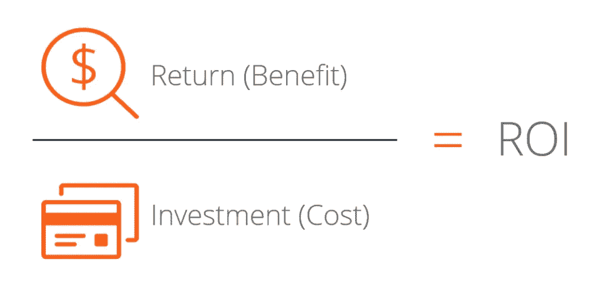

Airbnb 数据集是分子。分母仍然需要房地产价格数据集，这将在同一主题的后续文章中探讨。

# 数据准备

为了准备用于分析的数据，需要采取几个步骤来清理数据集:

1.  处理缺失值-删除缺失值超过 1000 的列
2.  低值列—删除包含 URL 链接、不可用记录(如主机名、街道)以及只有一个唯一值的列。
3.  布尔列—带有“t”和“f”的列被转换为布尔“真”和“假”。
4.  数字列—清理价格、费率和百分比等列，以便提取其数值并保存为浮点型。
5.  分类数据-包含分类数据(如邮政编码、物业类型、邻居、房间类型、床类型)的列经过编码，以便用于机器学习算法。
6.  异常值-识别异常值并记录下来，它可能会影响以后的分析。然而，它们仍然保留在数据集中，以供可视化观察。稍后将采取措施处理异常值。
7.  共线特征-由于在此阶段尚未采用机器学习，因此尚未识别共线特征。此处做了一个注释，以便在未来工作中需要时处理共线特征。

# Q1。哪个城市的租赁市场更强劲，因此对投资更有吸引力？

就短期住宿业务而言，这两个城市全年都有大量的文化节、音乐会、会议和展览以及体育赛事。波士顿也是举办大型活动的热门地点，例如波士顿马拉松赛吸引了大量的人群来到这个城市。这些活动带来的活力是短期租赁市场的巨大商机。

 [## 西雅图—活动日历

### 有趣的事情，夏季活动，街头集市，艺术和音乐节。食物、啤酒和葡萄酒品尝。活动日历…

www.events12.com](https://www.events12.com/seattle/)  [## 波士顿活动|音乐会、节日、马拉松、展览

### 波士顿的活动包括餐厅周、体育赛事、节日、假日活动等等。找到一个完整的…

www.bostonusa.com](https://www.bostonusa.com/events/events-calendar/) 

除了休闲和文化，我们还可以把这个城市视为一个吸引商务旅客的商业中心。这些旅行者将能够在这个城市没有任何活动发生的安静时期填补空白。

大学毕业时期是另一个季节性事件，当父母和亲戚参加毕业典礼时，会吸引大量人群进入城市。在这方面，波士顿大都会有一长串的学院:

 [## 波士顿大都会的学院和大学列表—维基百科

### 这是波士顿大都市的学院和大学列表。有些位于波士顿市区内，而有些…

en.wikipedia.org](https://en.wikipedia.org/wiki/List_of_colleges_and_universities_in_metropolitan_Boston) 

虽然西雅图作为教育中心有点落后，但仍然是毕业季的保证:

 [## 华盛顿西雅图附近的四年制大学列表-华盛顿西雅图四年制大学

### 探索华盛顿州西雅图的四年制大学列表。

www.collegesimply.com](https://www.collegesimply.com/colleges/washington/seattle/four-year-colleges/) 

旅游景点在城市是另一个点，看看填补空置客房在非季节性期间。

为了更好地了解住宿需求，我们可能需要两个城市的旅客和交通数据来进行更全面的定量分析。与此同时，Airbnb 的预订数据揭示了反映在价格上的需求。

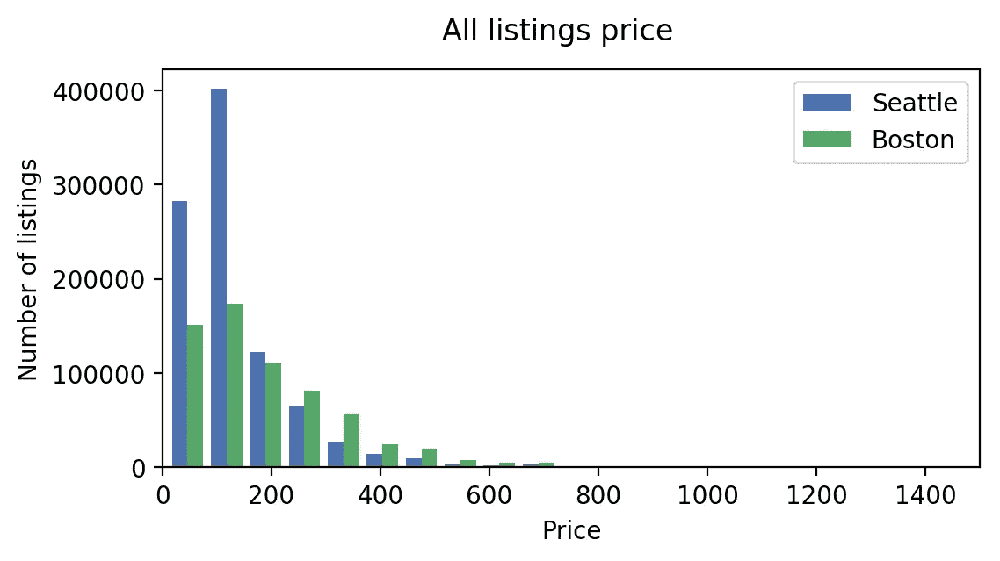

Figure 1

从 Airbnb 预订数据集生成的价格分布图按需提供了一些提示。波士顿分布有一个更厚的尾部，显示了更不稳定的价格范围。而西雅图价格大多在 500 美元以内。

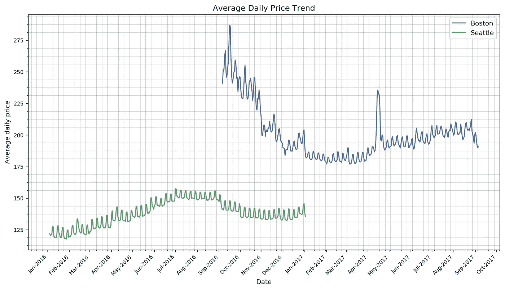

Figure 2

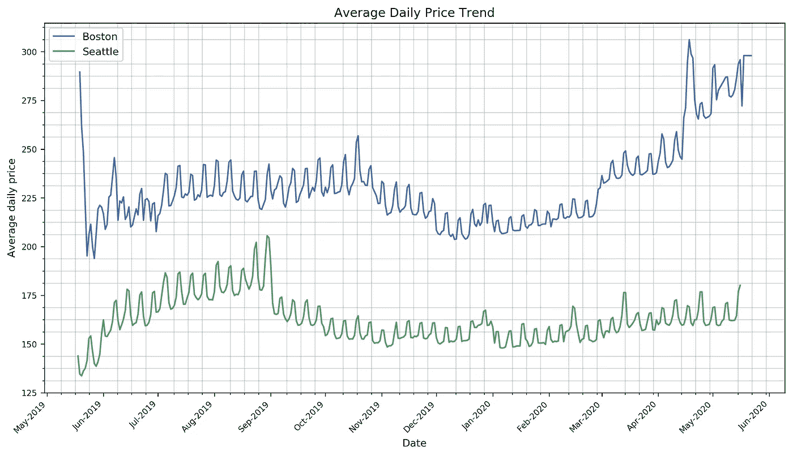

Figure 3

当我们把同一个预订数据集作为趋势来看，对每天的价格进行平均，我们会看到需求是如何在定价中发挥作用的。当供应不能满足城市大型活动的需求时，价格就会上涨。该图显示了周波动和季节动态。波士顿的价格趋势反映了受供应限制的更加多事和强劲的租赁市场。因此，不稳定的价格波动所造成的需求得不到满足。图 2 中 2017 年 4 月的大幅飙升很可能是波士顿马拉松的结果。规则和微小的波动是周末效应，因为网格线是在周六绘制的。

# Q2。需求是否稳定且不断增长？

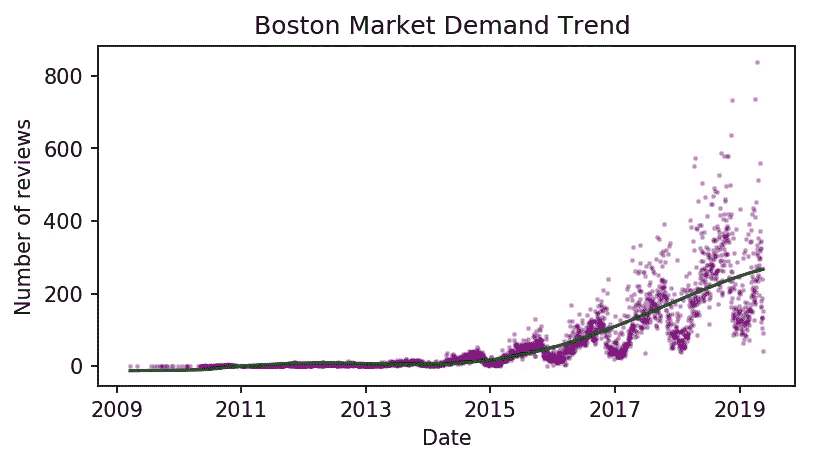

Figure 4

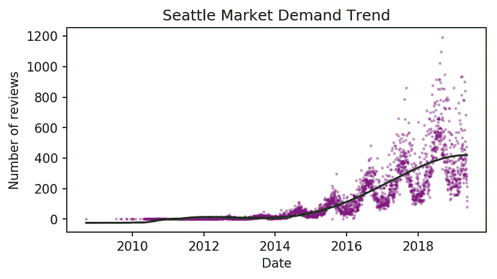

Figure 5

评论是由用户在入住酒店后提供的，因此可以很好地代表已满足的需求。从这两个城市的需求趋势来看，我们可以说这些年来需求确实在稳步攀升。波士顿在过去的两年里经历了需求的急剧攀升。价格波动每年都有季节性变化，这在 Q1 得到了部分揭示。图 4 和图 5 提供了更大的图景，需求通常在夏末秋初达到峰值。

然而，波士顿的价格动态仍处于上升轨道，而西雅图在 4 年的增长后看起来已经饱和。

# Q3。这座城市的哪个街区投资回报率更高？

看图 2 和图 3，我们注意到波士顿的价格区间较高，甚至在淡季也高于西雅图的价格区间。这表明，在供应有限的情况下，中国对短期住房的需求更加强劲。

然而，这只是投资回报率的一部分。我们还需要考虑拥有房产的价格，以验证更高的租金收入是否能证明总体收益是合理的。换句话说，如果波士顿的房地产价格高得多，导致租金收入的收益率较低，那么市场就不会提供更好的投资回报率。

# Q4。投资哪种类型的房产？

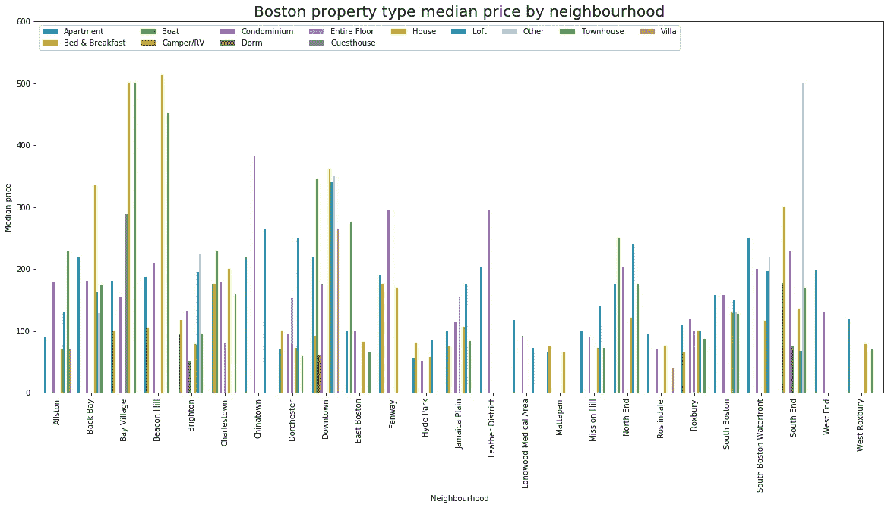

Figure 6

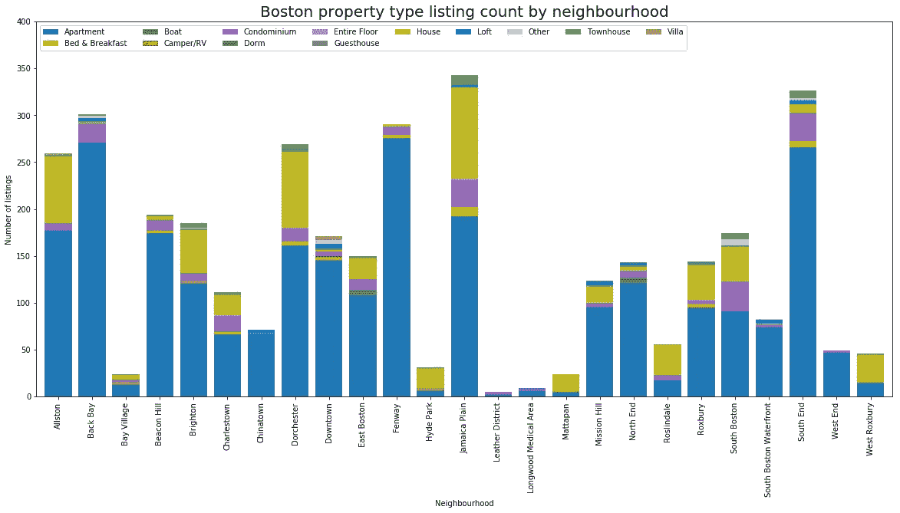

Figure 7

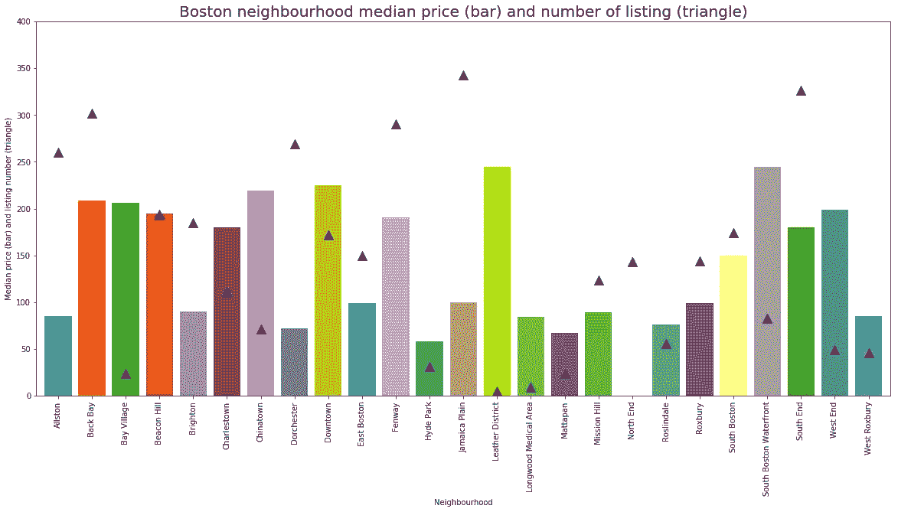

Figure 8

# 波士顿

对于波士顿市场，我们可以看到，公寓，共管公寓和房子是最受欢迎的产品在这里的大多数街区。租金收入较高的房产类型包括房子、联排别墅和共管公寓，这可能是因为上市数量柱状图显示的供应有限。

根据图 8，市中心、皮革区和南波士顿滨水区的租金通常高于其他街区。Back Bay，Dorchester，Fen Way，Jamaica Plain 和 South End 是供应充足的街区，这些应该是市场竞争更激烈的街区，因此低于平均租金价格。从这个角度来看，海湾村、南波士顿海滨和西区是供应方面竞争较弱的市场，租户的良好需求反映在他们愿意支付更高的价格。

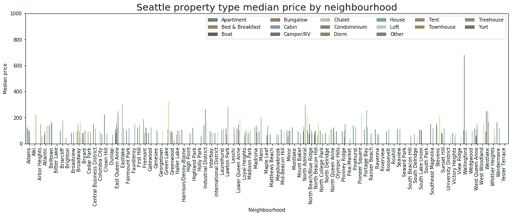

Figure 9

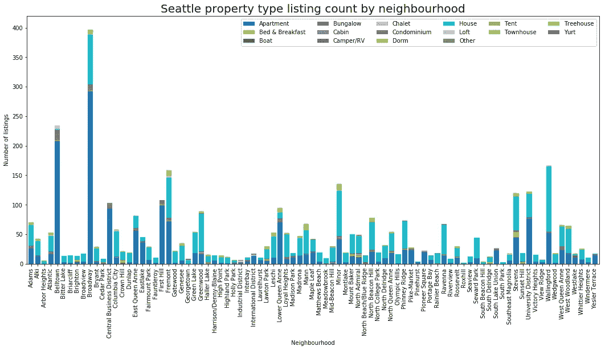

Figure 10

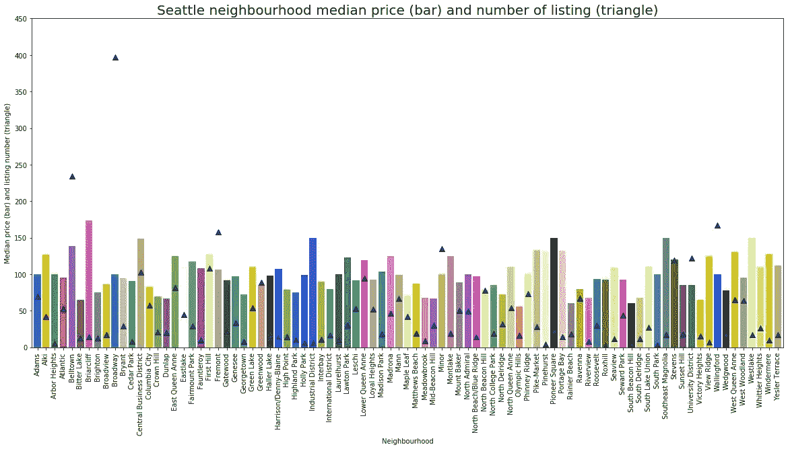

Figure 11

# 西雅图

公寓，房子和公寓是西雅图最受欢迎的住宿产品。除了沃灵福德可能是一个异常值之外，大多数街区的租金都保持在一个范围内。价格最高的房产类型是船，一种奇异的房产。贝尔敦、弗里蒙特 Minor 和沃林福德出租物业价格更具竞争力，供应充足。荆棘崖、工业区、先锋广场和东南木兰是供应较少的街区，因此租金较高。如果购买房产的成本与其他地区相比，这些地区可能值得投资。

简而言之，位置和季节性在价格设定中扮演着重要的角色。

# Q5。哪些因素决定租金收益率/价格？

由数字特征组成的相关矩阵显示，该房产可容纳的人数、床位、卧室和浴室的数量与租赁价格最相关，这非常合理，因为这意味着更大的房产。所以它在这里没有帮助揭示太多的洞察力。

包括点评分数在内的其他因素在设定租金价格时几乎不起作用。

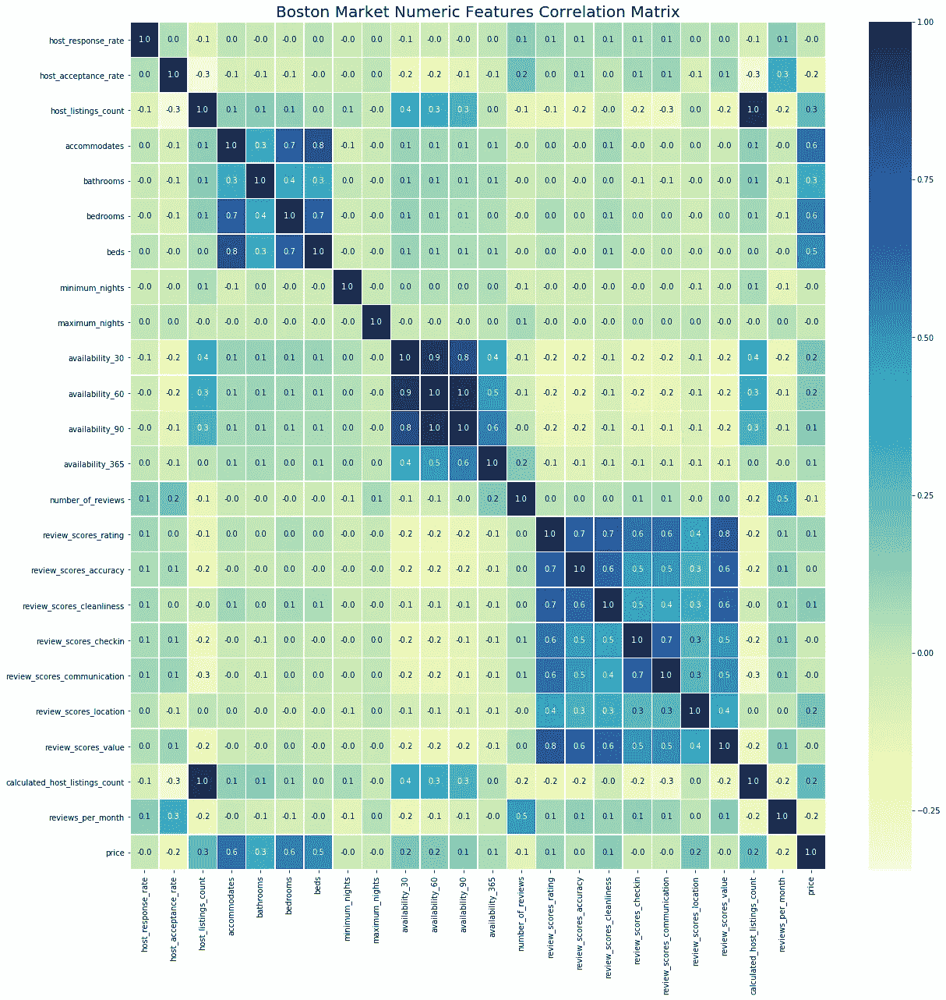

Figure 12

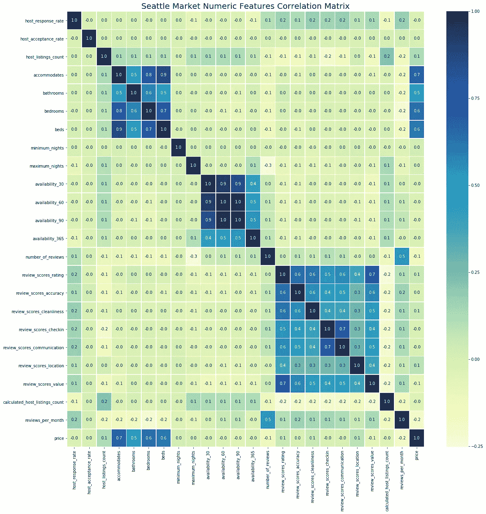

Figure 13

根据以上分析，海湾村、南波士顿海滨和波士顿西区看起来是更好的投资选择。也许我们需要房地产价格数据来确定他们的投资回报率。

总之，随着 Airbnb 的发展和将其市场扩展到更多的城市，基于城市的数据集在分析房地产市场方面变得非常方便。然而，由于它们只是图片的一部分，有必要将数据集与其他房地产市场(如 Trulia、Zillow)以及旅客和交通跟踪数据结合起来，以促进房地产投资分析。

该框架编码在一个 Jupyter 笔记本中，可以从我的 [Github 库](https://github.com/jiewwantan/Real_estate_Investment_with_Airbnb)中获得