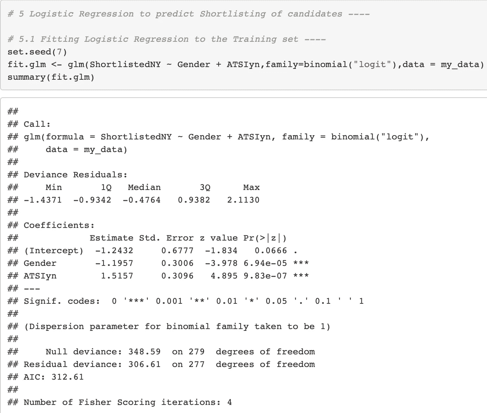

# 使用机器学习和 R 探索招聘偏差

> 原文：<https://towardsdatascience.com/exploring-recruitment-bias-using-machine-learning-and-r-8e071dad7dce?source=collection_archive---------20----------------------->

你好，

由于我在人力资源咨询方面的背景，我有机会与世界各地的众多人力资源专业人士共事。通过我的工作和学习，我很快意识到招聘过程是任何与多元化相关的研究的起点。与招聘过程相关的潜在人为偏见有很多。我希望我的工作有助于确立它毕竟不是一项复杂的研究。

# **目标:**

使用一个 ***实验性*** 数据集进行本案例研究，我工作的主要目标是只调查招聘流程的入围阶段，以及:

*   对招聘数据进行探索性数据分析，以确定招聘阶段的性别、种族模式
*   调查性别和种族是否影响申请人入围流程
*   应用机器学习来预测谁将入围并确定关键驱动因素
*   根据调查结果建议更新招聘策略

# **数据集概述:**

实验数据集包含以下字段:

*   **申请人代码**:系统中每个申请的唯一标识符

*   **性别**:男性代码为 1，女性代码为 2
*   **ATSIyn** :如果候选人是土著居民或托雷斯海峡岛民，则指定 1 =是。如果候选人是普通申请人，分配 2 =否
*   **入围 yn** :如果被拒绝则分配 0，如果入围则分配 1
*   **已面试**:未面试分配 0，面试分配 1
*   **FemaleONpanel** :仅针对男性小组分配 1 分，如果小组中有女性成员，则分配 2 分
*   OfferNY :如果向候选人提供了 offer，则分配 1；如果没有提供 offer，则分配 0
*   **AcceptNY** :如果接受则赋值 1，如果拒绝则赋值 0
*   **JoinYN** :如果加入则赋值 1，如果不加入则赋值 0

# **研究性别和种族模式的探索性数据分析:**

女性申请者占申请者总数的 72.1%。

土著或托雷斯海峡岛民申请人占申请人总数的将近一半(43.2%)。

在简历筛选后，总共 280 名申请人中有 88 人进入下一阶段的决选名单。

入围的申请者中有 55 人接受了面试。

在进行的 55 次访谈中，有 22 次有女性成员。

在总共进行的 55 次面试中，有 28 人被录用。

要约接受率为 64%。18 名接受聘用的申请人加入了该公司。

# **调查性别和种族是否影响申请人入围流程:**

根据上述探索性研究，申请人中的性别和种族比例分别为 72 %和 43%。抛开所有外部条件不谈，一个公正的招聘过程应该导致基于性别和种族的入围申请人具有相当相似的代表性。这是本节研究的目的。

**申请人入围名单中的种族偏见分析:**

如上所述，申请人的族裔比例为 43.2%。然而，根据以下调查结果，候选人名单中的族裔比例下降到 15% (19/88)。 ***这似乎表明在入围过程中倾向于一般申请者。***

气球图表明，一般申请人可能会入围。

**使用统计分析(卡方) ,可以确定具有种族背景的申请人的预期数量和观察数量之间存在巨大差距。在下面的案例中，只有 19 个入围(观察到)，而预期的数字应该是 38。**

入围过程中对普通类申请人的偏好是出于运气或机遇的可能性已经被非常低的卡方值 23.184 所否定，p < 0.0001.

**对入围申请人的性别偏见的分析:**

如上所述，女性在申请人中的比例为 72%。然而，根据以下调查结果，入围申请人名单中的女性比例已降至 56.7% (50/88)，被拒人数高达 152 人。这似乎显示出在入围过程中对男性申请者的偏爱。

气球情节证实了女性申请者在面试入围阶段的高拒绝率。

**使用统计分析(卡方检验) ,可以确定入围的女性申请人的预期人数和实际人数之间存在差距。在下面的案例中，只有 50 人入围(观察到)，而预期数字应该是 63 人。**

入围过程中优先考虑男性申请人是出于运气或机遇的可能性已经被非常低的卡方值 13.905 否定，p < 0.0001。

# 应用机器学习来预测申请人的入围名单并确定关键驱动因素:

在上述分析中，性别和种族是分开评估的。然而，如果大多数有种族背景的申请人碰巧是女性，那么暗示性别和有种族背景的申请人都面临偏见是不正确的。因此，在本节中，预测申请人入围名单的分析将考虑这两个变量。

进行这种分析的方法是通过逻辑回归。逻辑回归是一种机器学习算法，可用于预测申请人在申请流程中入围的可能性。该算法将用于研究我们的数据集，以确定申请人入围名单的主要驱动因素。

机器学习分析的结果表明，性别和 ATSIyn(土著或托雷斯岛民)都是申请人入围的重要预测因素。

**总之，根据调查结果，男性申请人被列入候选名单的可能性是女性申请人的 3.3 倍。普通类申请人比土著或托雷斯海峡岛民申请人入围的可能性高 4.5 倍。**

# 准备一个招聘策略来抵消偏见:

数据分析表明，基于综合数据集，性别和种族偏见存在于公司内部招聘流程的入围阶段。

**为了消除偏见，推荐的策略是引入盲审流程，在入围流程中，对审查工作申请的内部或外部招聘人员隐藏申请人的姓名、性别和种族背景信息。**

# **代码和数据集的引用和链接:**

这两位学生在这一领域的工作深深地激励了我，这也是我在这一领域进一步探索的兴趣的起点。视频链接在这里给你看看。

所用的数据集和案例研究如马丁·爱德华兹和柯尔斯顿·爱德华兹所著的《预测性人力资源分析——掌握人力资源指标》一书中所述。r 代码是我开发的。

我的 github 账号上有数据集和 R 代码。下面提供了链接:

 [## sambit 78/人员分析项目

### 我的所有个人项目都与人员分析相关-sambit 78/人员分析-项目

github.com](https://github.com/Sambit78/People-Analytics-Project/tree/master/05%20-%20Recruiting%20Bias%20Analysis) 

谢谢:)