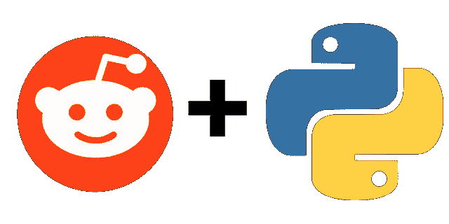
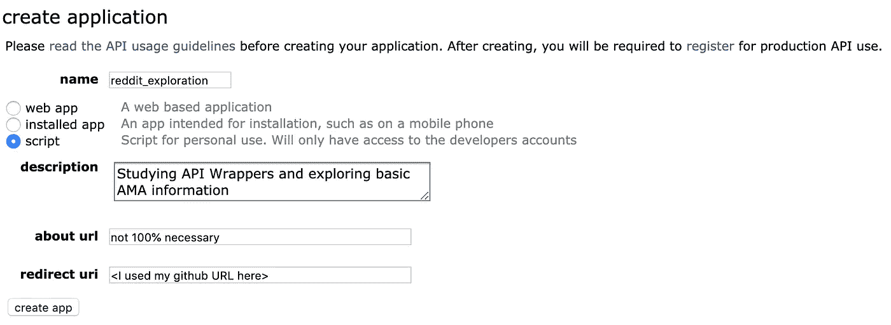
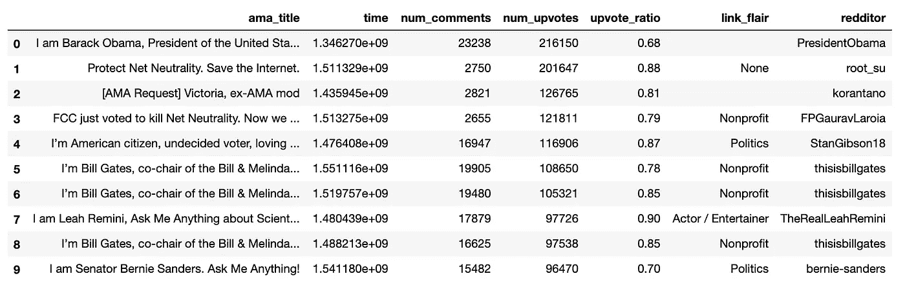
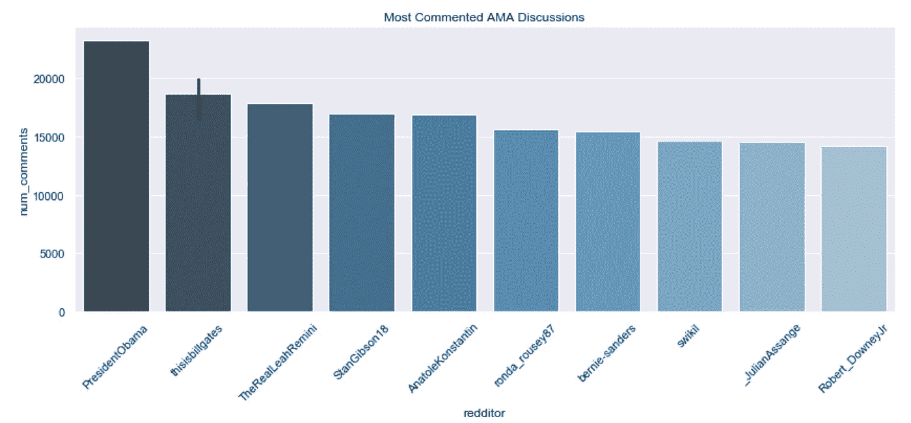
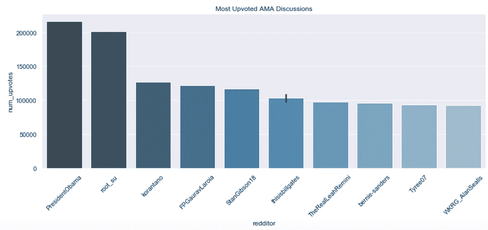
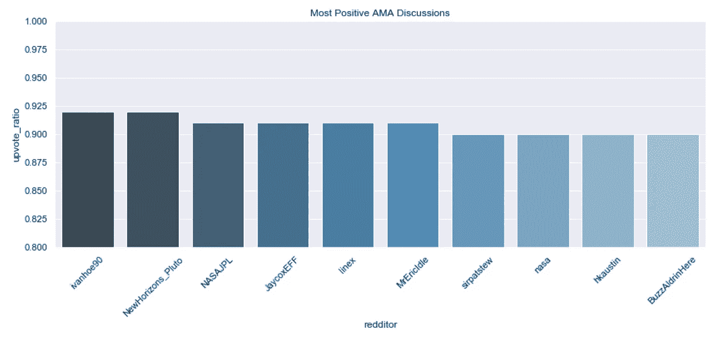
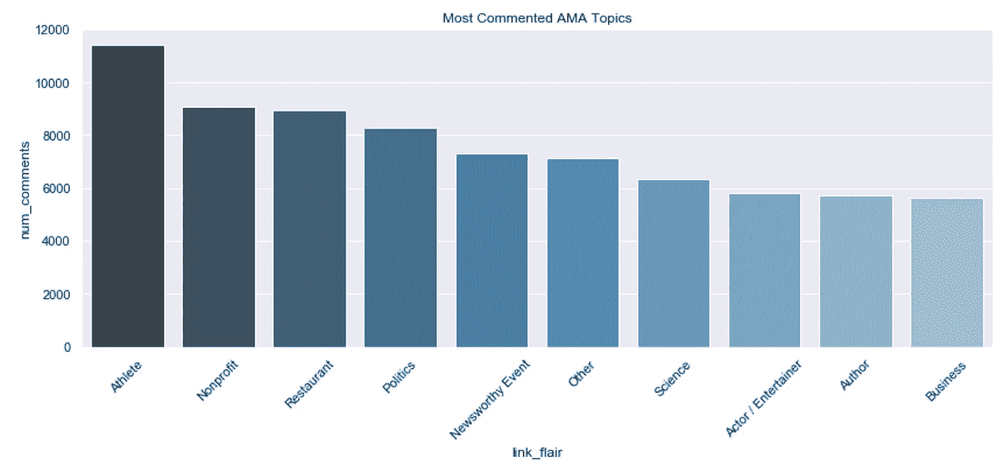
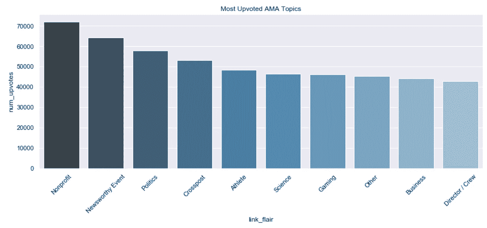
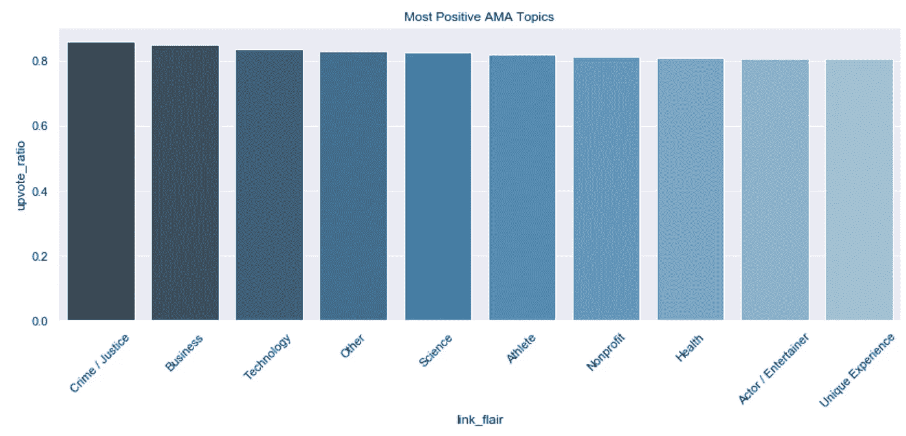

# 使用 PRAW API 包装器探索 Reddit 的“问我任何问题”

> 原文：<https://towardsdatascience.com/exploring-reddits-ask-me-anything-using-the-praw-api-wrapper-129cf64c5d65?source=collection_archive---------14----------------------->

## 未来 Reddit 分析师的简短 PRAW 教程



PRAW + Python can be used to quickly access Reddit’s API

在撰写本文时，Reddit.com 是美国互联网上第五大最受欢迎的网站。你们中的大多数人可能都在这个网站上呆过，但对于那些不熟悉的人来说，Reddit 是一个由社区驱动的论坛或“子编辑”的大集合，在这里人们可以分享几乎任何主题的新闻、内容和观点。最受欢迎的社区之一，向我提问(r/IAmA)，将著名或有趣的人物与日常 Redditors 联系起来，以便直接回答匿名参与者的问题，旨在充分利用与世界上最引人注目的一些人的无与伦比的接触。

在本文中，我将重点关注这个特定的社区，通过使用 PRAW(一种 Python“包装器”)连接到 Reddit API 中的基本信息的过程，在高层次上指导当前和未来的数据科学家，这种包装器就像一个附加包，可以将 API 调用集简化为用户易于使用的函数。这个特定的演练更多的是关于快速建立连接，避免任何深入到业务应用程序中(联系 [Reddit Partnerships](https://www.redditinc.com/partnerships) 以获得该信息)。也就是说，我希望留给你的不仅仅是一种新的数据技能，还有一些最引人注目的 AMA 作品的集合。

**第一步:在你的终端上安装或更新 PRAW**

```
#to install for the first time
pip install praw#to update
pip install praw --upgrade praw
```

**步骤 2:创建和/或登录您的 Reddit 帐户，开始通过 OAuth 进行身份验证**

点击[此处](https://www.reddit.com/)创建账户或登录现有账户，并确保您已经验证了您的电子邮件。完成后点击[这里](https://www.reddit.com/prefs/apps/)进入你的应用列表，点击有点难找到的按钮‘创建应用’。



Beware of Reddit’s API guidelines.

命名你的应用程序和用例(“脚本”适合基本的、天真的探索)，写一个关于你的计划的简短说明，并输入一个必需的重定向 URL(为此我使用了我的 GitHub URL)。点击“创建应用程序”后，您的页面将会更新，显示一个**个人使用脚本**密钥(在许多 API 教程中通常被称为“客户端 id ”)和一个**机密**密钥(您可能知道它是“API 密钥”)。

当使用需要 API 密钥和密码的 API 时，你应该*不要*将这些值硬编码到你的主文件中。为了保护你的 API 密匙不被公开传播，看看这个伟大的教学 jupyter 笔记本，里面有一些关于[设置**的更详细的注释。secret/** 目录](https://github.com/Bmcgarry194/dsc-2-17-08-using-the-yelp-api-codealong-data-science/blob/master/index.ipynb)将您的敏感信息存储在本地 JSON 文件中，并在需要时适当地调用它。您的`credentials.json`文件应该如下所示:

```
{"client_id": "XXXXXXXXX-XXXX","api_key": "XXXXXXXXXXXX_XXXXXX-XXXXXXX","username": "<your Reddit username>","password": "<your Reddit password"}
```

**步骤 3:创建您的第一个授权 Reddit 实例**

从`credentials.json`或类似标题的文件夹中加载您的密钥:

```
# Load secret keys from credentials.json
import json
url = '[https://www.reddit.com/'](https://www.reddit.com/')
with open('/Users/<Your CPUs User>/.secrets/credentials.json') as f:
    params = json.load(f)
```

导入 PRAW 包装并授权 Reddit 实例:

```
import praw
reddit = praw.Reddit(client_id=params['client_id'], 
                     client_secret=params['api_key'],
                     password=params['password'], 
                     user_agent='<name it something descriptive> accessAPI:v0.0.1 (by /u/<yourusername>)',
                     username=params['username'])
```

**步骤 4:从你的 reddit 实例中获取一个 Subreddit 实例**

要获得 subreddit 实例，在您的`reddit`实例上调用`subreddit`时传递 subreddit 的名称。例如:

```
subreddit = reddit.subreddit('iama')print(subreddit.display_name)  # Output: iama
print(subreddit.title)         # Output:I Am A, where the mundane...
print(subreddit.description)
```

*其他一些基本分析的子编辑方法:*

`**created_utc**`:创建子编辑的时间，用 [Unix Time](https://en.wikipedia.org/wiki/Unix_time) 表示。

`**description**`:子编辑描述，降价中。

`**display_name**`:子编辑的名称。

`**id**`:子编辑的 ID。

`**name**`:子编辑的全称。

`**subscribers**`:用户数

**第五步:从你的 Subreddit 实例中获取一个提交实例**

为了收集感兴趣的 subreddit 中提交的一些数据，我们可以使用 for 循环遍历指定数量的提交，按照页面上的*有争议、镀金、热门、新、上升、*或 *top* 提交进行排序。

```
#iterating through the 10 submissions marked **hot**
for submission in subreddit**.hot**(limit=**10**):
    print(submission.title)  # Output: the submission's title
    print(submission.score)  # Output: the submission's upvotes
    print(submission.id)     # Output: the submission's ID
    print(submission.url)    # Output: the URL
```

*基础分析的其他一些提交方法:*

`**author**`提供了`Redditor`的一个实例。

`**created_utc**`提交创建的时间，用 [Unix 时间](https://en.wikipedia.org/wiki/Unix_time)表示。

`**distinguished**`划界案是否有区别。

`**link_flair_text**`link flair 的文本内容(有点像 subreddit 中的提交类别)，或者如果没有 flair 就没有。

`**name**`提交材料的全称。

`**num_comments**`提交的评论数量。

`**over_18**`提交的文件是否被标记为 NSFW。

`**spoiler**`提交的内容是否被标记为剧透。

`**stickied**`提交的文件是否被粘贴。

`**title**`提交的标题。

`**upvote_ratio**`提交的所有投票中赞成票所占的百分比。

提交链接到的 URL，如果是自发布，则是永久链接。

**步骤 6:从“问我任何问题”子编辑中创建一个熊猫基本提交统计数据框架**

我选择制作一个 200 行 7 列的数据框架，由 r/IAmA subredit 上的 **top** 提交内容组成，许多著名的“问我任何问题”讨论都在这里进行。这可能需要相当长的时间，取决于从子 reddit 获取的数据的大小以及本地或虚拟机的速度，所以我喜欢在 for 循环中包含 print 语句，以便跟踪进度。

```
ama_title = []
time = []
num_upvotes = []
num_comments = []
upvote_ratio = []
link_flair = []
redditor = []
i=0for submission in subreddit.top(limit=200):
    i+=1
    ama_title.append(submission.title)
    time.append(submission.created_utc)
    num_upvotes.append(submission.score)
    num_comments.append(submission.num_comments)
    upvote_ratio.append(submission.upvote_ratio)
    link_flair.append(submission.link_flair_text)
    redditor.append(submission.author)
    if i%5 == 0:
        print(f'{i} submissions completed')
```

这将为 for 循环遍历的每 5 个提交打印一个注释。一旦完成，你可以把你的数据放入熊猫的数据框架中进行交钥匙辩论和分析。

```
ama_df = pd.DataFrame(
    {'ama_title': ama_title,
     'time': time,
     'num_comments': num_comments,
     'num_upvotes': num_upvotes,
     'upvote_ratio': upvote_ratio,
     'link_flair': link_flair,
     'redditor': redditor
    })ama_df.head(10)
```

这应该会产生类似这样的结果:



**第七步:探索数据**

帮助我们快速判断最有意义的 ama 的最简单的方法是根据最多评论(num_comments)、最多投票(num_upvotes)和最积极(upvote ratio)来绘制领导者，然后在根据主题/类别(“link_flair”)对行进行分组后，做同样的事情，取每个组的这些相同统计的平均值。

## 最迷人的 AMA 人物



这些名单中的一些人是不足为奇的名人:欧巴马、比尔·盖茨、伯尼·桑德斯、小罗伯特·唐尼。然而，如果你有时间，我强烈建议你读一读其中一些真正有趣的惊喜。[丽亚·雷米尼](https://www.reddit.com/r/IAmA/comments/5fjszg/i_am_leah_remini_ask_me_anything_about_scientology/)讨论了她从山达基教会走向情感和精神自由的非凡旅程，她是 2016 年总统选举期间病毒般犹豫不决的选民[肯·伯恩](https://www.reddit.com/r/IAmA/comments/57dw9a/im_american_citizen_undecided_voter_loving/)，约瑟夫·史达林独裁统治下公开诚实的幸存者[阿纳托利·康斯坦丁](https://www.reddit.com/r/IAmA/comments/4xum3y/iama_survivor_of_stalins_dictatorship_and_im_back/)，以及最近被拘留的维基解密创始人、记者兼计算机科学家[朱利安·阿桑奇](https://www.reddit.com/r/IAmA/comments/5n58sm/i_am_julian_assange_founder_of_wikileaks_ask_me/)。



一些纯粹正面的 ama 让我真的很欣赏一些非超级名人的讨论。有一位工程师在现场为他的免费 Photoshop 版本实施新功能建议( [ivanhoe90](https://www.reddit.com/r/IAmA/comments/9urjmg/comment/e973t9l/?st=JPDHUMUF&sh=e7da7b16) )，接触到美国宇航局瞄准冥王星以外的新视野团队的太空科学家([艾伦·斯特恩](https://www.reddit.com/r/space/comments/a581g4/hi_i_am_alan_stern_head_of_nasas_new_horizons/))，美国宇航局 [JPL](https://www.reddit.com/r/technology/comments/5ici9l/were_developers_hiring_managers_for_software_jobs/) 的软件开发人员和招聘经理，以及第二个在月球上行走的人[巴兹·奥德林](https://www.reddit.com/r/IAmA/comments/2a5vg8/i_am_buzz_aldrin_engineer_american_astronaut_and/)。喜剧传奇人物[埃里克·艾多尔](https://www.reddit.com/r/IAmA/comments/1r5057/eric_idle_here_ive_brought_john_cleese_terry/)加入了这些极其引人注目的冒险家，他带着整个《巨蟒剧团》剧组来到 AMA，与粉丝们交流。

## 最吸引人的 AMA 话题



由于职业运动员的高知名度、广泛的媒体报道以及像 NBA、UFC ( [隆达·罗西](https://www.reddit.com/r/IAmA/comments/3gixri/rowdy_ronda_rousey_here_ama/))、体育机构和服装品牌这样的大公司的可能支持，他们在网络上获得大量追随者并不奇怪。众所周知，这些 ama 有时会与推广产品、活动或品牌的活动一起预订。非营利主题出现在所有三个条形图由于比尔盖茨代表他的基金会，网络中立活动家和美国公民自由联盟的支持者。像 Reddit 这样以社区为先的平台，对于那些寻求组织起来煽动变革，或者在 Twitter 上谈论如何打击你的快餐竞争对手的人来说，确实是一个很好的枢纽([温迪的社交团队](https://www.reddit.com/r/IAmA/comments/7jsvm6/we_are_the_team_behind_the_wendys_twitter_account/))。



高票的有新闻价值的事件讨论由 [Sid Fischer](https://www.reddit.com/r/IAmA/comments/7xzpac/im_sid_fischer_a_student_who_was_in_the_third/) 主持，他是佛罗里达州帕克兰市斯通曼道格拉斯高中第三个房间枪击案的幸存者，还有一个稍微轻松一点的人，他打扮成[大富翁](https://www.reddit.com/r/IAmA/comments/74nyxw/im_the_monopoly_man_that_trolled_equifax_ama/)去轰炸前 Equifax 首席执行官理查德·史密斯的参议院听证会。



《犯罪与正义》在最积极的 AMA 话题中独占鳌头，因为一个话题引起了相当一致的庆祝，这个话题自豪地写道:“爱达荷州通过了一项 Ag-Gag 法律，将揭露工厂化农场虐待动物的行为定为犯罪。我们起诉了他们并赢了。“著名的辛普森谋杀案审判检察官[克里斯托弗·达顿](https://www.reddit.com/r/IAmA/comments/6oybbr/hi_reddit_i_am_christopher_darden_prosecutor_on/)，也在 2017 年 7 月花了一点时间向 AMA 社区开放。Elon Musk 和 Reddit 的新任首席执行官 Steve Huffman 帮助提高了商业话题的投票率。

我希望我能够扩大那些对数据科学感兴趣的人和那些通过 PRAW 新连接到 Reddit 的 API 的人的研究潜力！

对于未来的文章，请联系我们，提出任何问题、评论、想法或想法。

感谢您的阅读，

亚历克斯

*详细 API 连接&探索代码，查看我的* [*GitHub*](https://github.com/as6140/reddit_api_explore_praw) *！*

*有关充分利用 PRAW 的更多详情，请查看* [*文档*](https://praw.readthedocs.io/en/latest/getting_started/quick_start.html#prerequisites) *。*

*我们连线上*[*LinkedIn*](https://www.linkedin.com/in/alexandershropshire/)*！*