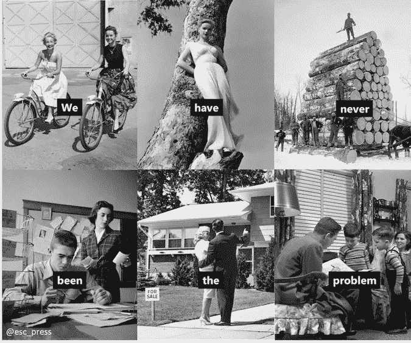
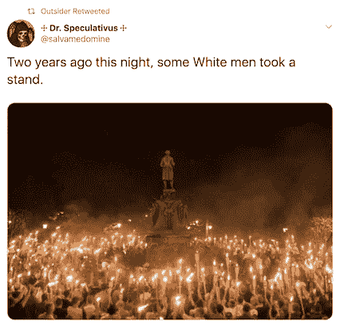
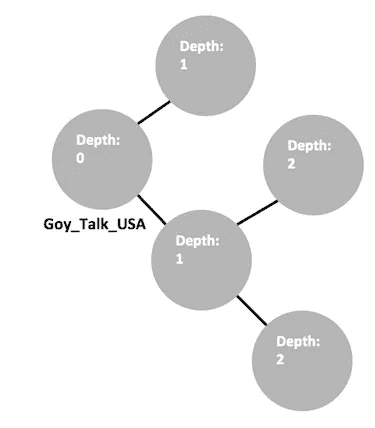
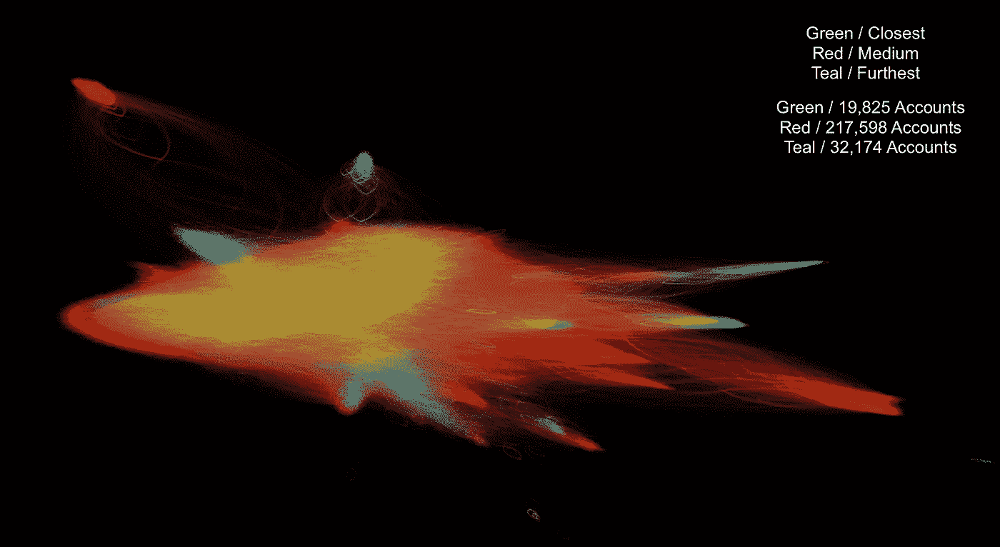

# 探索推特上的右翼极端主义

> 原文：<https://towardsdatascience.com/exploring-right-wing-extremism-on-twitter-941a9d02825e?source=collection_archive---------16----------------------->

# 介绍

在过去的几个月里，我们已经看到社交媒体网站如何成为极右翼观点的避风港。《纽约时报》探究了 YouTube 如何通过其推荐算法将用户推向激进内容, [ProPublica 详细介绍了脸书的一个组织，ICE 员工在那里分享关于移民的种族主义迷因。Reddit 也因托管极端右翼内容而受到](https://www.propublica.org/article/secret-border-patrol-facebook-group-agents-joke-about-migrant-deaths-post-sexist-memes)[的争议](https://www.nytimes.com/2017/10/26/us/reddit-violence-policy.html?searchResultPosition=1&module=inline)。Twitter 是这场争论中相对毫发无损的一个社交媒体网站。这很大程度上是由于社交网站的分布式特性。用户不会被聚集到容易识别的论坛或子区域中，而是每个账户作为一个独立的实体存在。虽然拥有许多追随者的知名用户被禁止(如亚历克斯·琼斯)，但更难识别推广极端主义内容的个人网络。这是我所知的第一次大规模分析 Twitter 上的极右极端主义。

为了调查这个问题，我分析了来自两个极右翼极端主义用户的 297849 个 Twitter 账户。我的发现确定了一个约有 19，000 名用户的网络，这些用户与极端主义内容高度接近。著名的右翼人物，如查理·柯克和瑞安·福尼尔，在这个网络中的影响力不亚于公开的种族主义报道。

# 调查的结果

最接近极端主义内容的用户群中最有影响力的前十个账户可以归类为毫不掩饰的白人民族主义者和另类右翼巨魔账户。这些用户公开分享种族主义迷因，宣扬白人至上主义。四个最著名的用户是@NoWhiteGuilt、@Outsider__14、@esc_press 和@Urbanus_Crusade

Top ten most influential users by PageRank

在下面的推文中，@Urbanus_Crusade 将他们的“MAGA 议程”列为包括“欧洲同质人口”:

Tweet by @Urbanus_Crusade

@esc_press 分享了无忧无虑的白人的老照片，标题通常是“按[esc]键返回”，暗示已经失去的田园时光。在一条现已删除的[推文中](https://twitter.com/esc_press/status/1158515267783352322)，他们通过分享这张图片揭露了他们的种族主义议程:

Image shared by @esc_press

@Outsider__14 主要分享推文，充当分发极端主义内容的枢纽。在这里，他们转发了一个用户赞扬白人民族主义者联合权利的抗议:

这四个白人民族主义用户总共有 21607 名粉丝，他们在推特上发布这种内容。总的来说(减去已删除的账户)，前 10 个账户共有 354，602 名关注者。

令人惊讶的是，在网络中发现了大量的土耳其用户。前 10 名中被删除的用户是一名受欢迎的土耳其记者，他似乎与右翼极端主义没有太大关系。土耳其账户是一个意外的发现。这似乎表明有大量的土耳其人对右翼主题的内容感兴趣。甚至可能是他们中的一些人在幕后操纵这些账户，但目前我只能推测。

一旦我对这个网络中的内容类型有了了解，我就开始关注拥有最多追随者的个人。这揭露了一些著名的右翼人物:

Popular right-wing personalities by PageRank

我们找到 Ryan Fournier，Trump 的学生主管，他的 PageRank 是 16。从这个角度来看，这意味着在这个网络中，瑞安·福涅尔的影响力不亚于发布这条微博的人:

Tweet by @AMERIOPA

前国会候选人查克·卡列斯托排在第 46 位,“转折点美国”的负责人查理·柯克排在第 153 位。紧随查理·柯克之后的是@PayYourG0yTax(现已暂停)，让你感受一下这些人物的陪伴。

# 过程

从 2019 年 5 月开始，我开始收集极端右翼推特账户的数据。开始，我选了两个账号:@NoWhiteGuiltNWG 和@Goy_Talk_USA。这两个用户都运营着 YouTube 频道，他们在那里制作视频宣传白人民族主义理论，并且在 Twitter 上也非常活跃。下面是@Goy_Talk_USA 发来的一条推文，让你了解一下他们宣传的内容:

我收集了这两个账户的关注者的数据，然后是他们每个人的关注者，以此类推，直到我建立了一个拥有 297，849 名用户的网络。对于每个用户，我计算了他们与两个原始极端主义用户的距离。下图对此进行了说明:

Goy_Talk_USA is depth 0\. Each of their followers is depth 1\. Their follower’s-followers are depth 2.

我根据深度将网络中的用户分为三组。距离最初两个极端分子账户 0-2 深度的用户是最接近的。距离 3 个深度的用户为中等，距离大于 3 个深度的用户为最远。最接近可以解释为最接近极端主义内容的用户，中等和最远被几层用户移除。总的来说，我在最接近的组中找到了 19，825 个用户。

下图显示了这个网络。网络的核心是绿色最接近的用户。规模更大、更温和的红色媒体用户从他们那里扩散开来。最后，我们看到最远的用户要么自己孤立，要么在网络的末端。

下一步是使用一种叫做 PageRank 的算法来计算网络中每个用户的连通性。这将根据用户在网络中出现的次数为他们分配一个号码。经常出现的用户会有较高的数字，而不经常出现的用户会有较低的数字。它可以被解释为一种衡量某人在网络中的影响力的方法。

# 摘要

这些发现指向一大群用户在 Twitter 上推广极端右翼内容。其他社交媒体平台已被追究其平台上极端主义活动的责任，并已采取行动遏制此类内容。然而，Twitter 允许这些网络相对不受约束地继续发展。所有这些账户都是公开的，这意味着任何人只需点击几下鼠标就可以查看和阅读极端主义言论。持续展示这些内容有助于将仇恨言论正常化，并使个人变得激进。我希望这项研究将有助于揭示 Twitter 上存在的极端主义的规模和范围，并有助于社交媒体平台上正在进行的关于极端主义的讨论。

# 密码

这个项目分为两部分:从 Twitter 上收集数据，然后进行分析。下面是这两个步骤的 GitHub 库。

 [## nbucklin/twitternet 网络

### 这个程序从单个用户开始生成一个 Twitter 追随者网络。对于第一个用户，它将检索…

github.com](https://github.com/nbucklin/TwitterNetwork)  [## nbucklin/BigNetworkPython

### 此时您不能执行该操作。您已使用另一个标签页或窗口登录。您已在另一个选项卡中注销，或者…

github.com](https://github.com/nbucklin/BigNetworkPython)