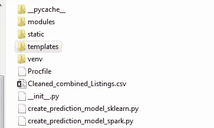

# 使用 Dash、Flask 和 Heroku 构建的交互式 Webapp 探索 SG 的租赁——第 1 部分

> 原文：<https://towardsdatascience.com/exploring-sgs-rentals-with-an-interactive-webapp-built-using-dash-flask-and-heroku-part-1-cccd9e8dd1b8?source=collection_archive---------26----------------------->

## 通过构建 DS/ML Webapp 并将其部署到世界各地来升级

## 1.介绍

您是否曾经研究过一些有趣的数据科学问题，并获得了一些真正有趣的见解或 ML 解决方案，但最终却意识到您所拥有的只是一个装满代码的 Ipython 笔记本，而这些代码将**永远不会到达**观众手中？或者，它可能只会被你的同道 DS 从业者阅读，你已经花了相当多的时间说服他们克隆你的回购协议，下载你的笔记本——出于对你的尊重——努力让**通读整本书**,最终实现你的才华

你不满足了。一方面，你希望你的工作被更广泛的受众欣赏，不仅仅是你的技术同行，也包括你的非技术同行。也许你想把它分享给你的朋友，他对 DS 很好奇，但可能不完全理解代码，仅仅是因为他/她从未真正潜过那么深。也许你想向你的非工程师朋友、同事、老板甚至是《商业分析 101》中坐在你旁边的可爱女孩/男孩炫耀。

另一方面，你觉得也许你本可以做得更多，你需要加快你的步伐来制作一些更最终的东西，一些或多或少类似于成品的东西，这样你就可以宣称“啊哈！我建造了这个。这不是很酷吗？”

在我最近的项目中，我一度有这种感觉。我决定通过构建一个完全交互式的 web 应用程序将它提升到一个新的水平——尽管我以前从未构建过——在那里用户可以**处理数据，构建他们的模型，挑选他们的重要特征**并获得某个**预测/结果**。

最后，我成功了——构建了我的第一个 ML Webapp。你可以在这里查看 app [。这是一个关于探索新加坡租赁物业的应用程序，我就住在那里。](https://sg-property-99co.herokuapp.com/)

该应用程序由 3 部分组成

*A.* ***第一部分*** *允许用户通过指定最小&最大租金来处理数据，然后选择他们感兴趣的功能和物业类型，应用程序返回一些* ***交互式可视化效果***

*B.* ***第二部分*** *允许用户提出一个假设的物业，应用程序将尝试* ***预测其租金*** *使用由用户通过一些引导性问题*就地 *建造的模型*

**C.**

*我使用 **Flask** 作为我的 Webapp 框架来创建我的服务器端 Python 程序，使用 **Plotly Dash** 来为我的交互式可视化服务，使用常见的怀疑对象 **Numpy、Pandas、Scikit-learn** 作为工具来构建我的程序的各个部分。最后但同样重要的是，我使用免费的应用托管网站 Heroku 来部署我的工作。看看这里:https://www.heroku.com/home 的*

*对于那些对学习如何构建这样的应用感兴趣的人，请系好安全带，因为我将在后续章节中更详细地解释这些步骤。*

## *2.了解所需的库*

***A .烧瓶***

*Flask 是基于 Werkzeug、Jinja 2 的 Python *的 web 开发微框架。你可以在这里查看它的官方网站[http://flask.pocoo.org/](http://flask.pocoo.org/)。它允许您设置不同的路由/视图(稍后将详细介绍),这些路由/视图与您的 web 浏览器的 HTTP 请求进行交互，并执行一些功能/任务来将某些内容返回到浏览器或呈现的 Html 页面。您可以使用 pip 通过一个简单的命令下载该框架**

```
*pip install -U flask*
```

*最新版本是 Flask 1 . 0 . 2——你可以在这里测试一个简单的 Flask 应用程序*

```
*from flask import Flaskapp = Flask(__name__)@app.route('/')
def hello():
    return 'Hello, World!'if __name__ == '__main__':
 app.run(port=8080, debug=True)*
```

*这将在 localhost:8080 提供应用程序供您查看*

***B .破折号***

*Dash 是一个 Plotly 产品，它是一个用于交互式可视化的 Python 框架，作为 web 应用程序的一部分。你可以在这里查看它的官方网站[https://plot.ly/products/dash/](https://plot.ly/products/dash/)。它允许你收集不同的元素，如下拉菜单/滑动条/条形图/地图，这些元素可以相互交流，形成一个布局，并在 web 视图中提供*

*   *您可以在这里安装组件*

```
*pip install -U dash
pip install dash_core_components
pip install dash_html_components*
```

*   *您可以测试写在主介绍页面上的示例程序。请记住指定以下内容*

```
*app.scripts.config.serve_locally = True
if __name__ == '__main__':
    app.run_server(port=8080)*
```

***C. Wtforms***

*Wtforms 是一个很好的 API，允许你定制你的前端表单，它接受用户的输入并把它们提供给你的后端应用。该 API 支持大量流行的 Python web 开发框架，包括 Flask 和 Django。你可以从这里的文档中阅读更多关于如何使用 wtforms 的内容[https://wtforms.readthedocs.io/en/stable/](https://wtforms.readthedocs.io/en/stable/)。*

*   *您可以安装它*

```
*pip install -U dash*
```

***D .通常的嫌疑人——Numpy，Pandas，Scikit-learn，Seaborn…***

*这些是清理、准备、探索和分析数据以及构建机器学习模型来处理这些数据的基本包。对使用 Python 实践数据科学略知一二的读者应该熟悉这些包。如果没有，随时欢迎您查看我以前讨论其他项目的文章*

*   *** *现在所有的框架/包都有了自己的介绍，让我们继续探索如何将它们结合在一起交付一个最终的工作产品**

## *3.构建所需的模块*

*实现该项目需要几个模块/组件:*

*A.具有完全定义的布局的嵌套 Dash 应用程序*

*B.配置用于主 HTML 页面的输入表单*

*C1。主 HTML 页面由带有输入表单的不同部分组成*

*C2。由主程序的不同路径/视图提供的其他 HTML 页面*

*D.要在主应用程序中调用的助手函数*

*   *让我们讨论每一个组件*

*— — — — — — — — — — — — — — — — — — — — — — — — — — — — — —*

> ***组件 A —仪表板应用***

*   ***app_dash** = Dash 应用的名称。还为仪表板配置了一个名为 **'/dashboard'** 的单独视图*
*   *首先为 Dash 应用程序设置虚拟布局。*
*   ***'/哈哈哈'**视图将被触发&每当 **form4** 提交请求 **—** 时，应用程序的布局将填充一些**交互图表**。*
*   *构建图的参数取自用户在**表格 1** 的输入。这意味着用户需要确保在他/她触发图表视图之前提交**form 1**(该操作还会导致交互式图表的**创建**并将 **plot_charts_cue** 更改为 True)*
*   *否则，如果用户未能首先提交 form1，将首先显示一个**error.html**页面*

*   *交互式图表是用打包的 Plotly 的图形对象构造的(导入为 **go** )。每个图表由一个图表布局和一组元素组成。这些元素有很多选择(go。走吧。散开，走。Map…)，这取决于您想要绘制的图表类型*
*   *下面是一个如何创建交互式条形图的示例*

*— — — — — — — — — — — — — — — — — — — — — — — — — — — — — — —*

> ***组件 B——配置的输入表单***

*输入表单可以通过以下方式进行配置:首先定义一个基于表单的扩展表单类，然后定义表示表单中需要填写的信息的不同变量名，以及这些变量的输入字段类型。*

*例如，第 1 部分(修改数据集)和第 3 部分(搜索相似列表)的两个表单类是:*

*   *您可以使用**验证器**对输入字段强制执行一些规则。关于如何使用它们的更多细节，请参见[文档](https://wtforms.readthedocs.io/en/stable/validators.html)*
*   *在主**index.html**页面上，如果验证器不满足要求，将会闪烁**错误消息**(由您指定)。如果输入值的类型不同于指定的字段类型，该字段还会闪烁其默认错误消息*

*然后，这些表格通过以下代码集成到主程序中。*

```
*from flask import requestform1 = ResuableForm(request.form)
form3 = ReusableForm_SimFilter(request.form)//Parse the forms to the rendered main Html page
@app.route('/')
def some_func():
    //Do sth
    return render_template('index.html', form1=form1, form3=form3*
```

*最后但同样重要的是，在 index.html 页面上，应该有两个表单部分，它们的**各自的 id**应该分别是‘form 1’和‘form 3’。稍后将详细介绍如何构建这个页面*

*— — — — — — — — — — — — — — — — — — — — — — — — — — — — — — —*

> ***组件 C —所需的 HTML 模板***

*这个项目使用的所有 HTML 模板都放在一个“template”文件夹中，这个文件夹与主程序放在同一个目录中。这是 render_template 函数的一个要求。您应该对自己项目的模板做同样的事情*

**

*用于主视图的真实 index.html 要长得多，由许多形式组成。但是，我将简化这种情况，只使用一个表单(获取参数以修改数据集所需的表单)来呈现模板的简短版本。看看下面表单的代码:*

** * *有一些解释可以帮助您更好地理解这种形式:*

*   ***<form></form>**是如何在模板内部声明一个表单节。属性 **method = post** 决定了表单提交后将向后端程序发送何种请求。*
*   *可以使用属性 **action = 'view_name'** 来指定表单提交将触发哪个 Flask route/view。如果未指定属性，提交将默认将其数据发送到主视图*
*   *在模板中调用 form1。因此，当页面被渲染时，form1 首先需要被定义、赋值并作为参数被解析到 render_template()函数中*
*   *属于 form1 的字段可以调用为 **form1.field_name** 并由模板进行相应的处理*
*   *您也可以使用 **<选择></选择>** 来配置分类特性的下拉值选择，而不是使用空白输入字段*
*   *还要注意**闪烁错误消息**是如何在模板中配置的*
*   *关于表单的 CSS 样式，请自己阅读要点*
*   *如果你想访问完整的 index.html 版本，你可以在项目目录 [**的文件夹 **Flaskapp/template** 里面查看一下**](https://github.com/huytofu/huytofu.ML_Projects/tree/content/SG%20Real%20Estate%20Exploration) **！***

*在主页的顶部，您的模板文件夹应该包含**其他模板**(例如由一个视图返回的模板，显示您的模型试图预测的结果)。我使用另外两个模板，一个是 **prediction_result.html** ，用于返回第 2 部分的答案，另一个是 **filtering_result.html** ，用于返回第 3 部分的答案。每当程序的某些条件不满足时，我还使用各种各样的模板向用户返回一些带有说明的错误页面。下面显示了一个示例*

*— — — — — — — — — — — — — — — — — — — — — — — — — — — — — — —*

> ***组件 D —辅助功能***

*我的项目需要许多助手功能。例如:*

1.  *为 Dash 应用程序绘制交互式图表的函数(讨论组件 B 的部分展示了一个这样的例子)*
2.  *基于用户偏好修改数据集的函数*
3.  *使用 Pyspark 或 Sklearn 库(取决于用户的选择)为第 2 部分创建和训练预测模型的函数*
4.  *第 2 节中使用的函数，用于将测试实例转换为适合已训练模型的格式，并返回预测*
5.  *第 3 节中使用的函数，用于将测试实例转换成适合已训练模型的格式，并返回类似的结果*

*此类功能的一个示例如下所示。这就是上面第 5 点提到的功能。该函数建立一个最近邻居的学习模型，并使用它根据用户给定的权重搜索相似的列表:*

*我不会继续展示这个项目中使用的所有助手函数。如果您有兴趣深入阅读它们，可以通过我的 Github 库查看项目目录*

****最后……****

*在我们创建完 Flaskapp 所需的所有模块之后，是时候构建项目的最后也是最重要的部分了:主程序。看看这篇文章的第二部分，自己看看如何做到这一点。*

*— — — — — — — — — — — — — — — — — — — — — — — — — — — — — — —*