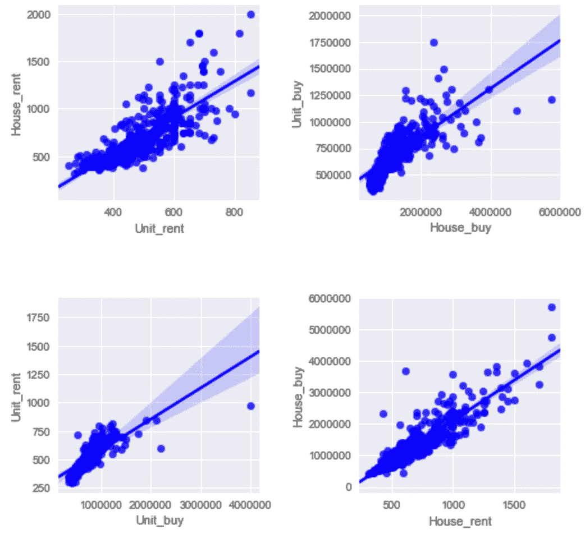
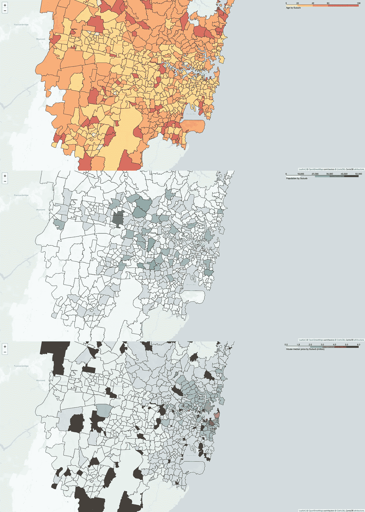
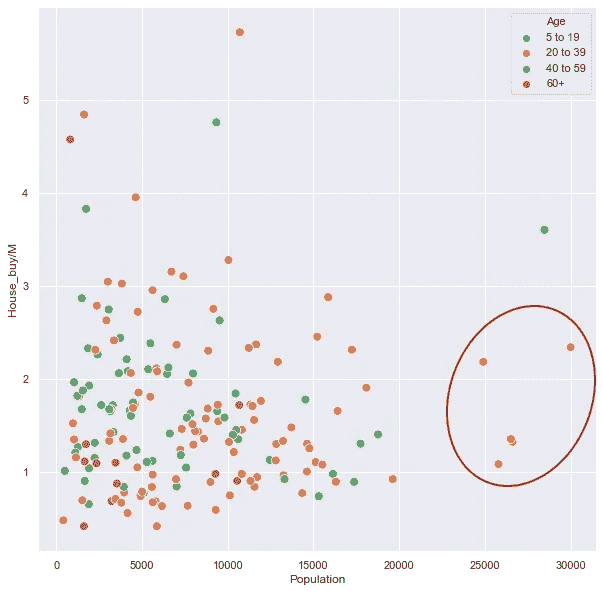

# 探索悉尼郊区，开一家新餐馆

> 原文：<https://towardsdatascience.com/exploring-sydney-suburbs-for-opening-a-new-restaurant-e1e43a6c32c7?source=collection_archive---------23----------------------->


Sydney harbour bridge photoed by Jun

## Python 数据科学的魔力

在过去的几个月里，我一直在学习 Coursera 的 IBM 数据科学课程。在学习完本课程的所有 Python 基本技能和工具后，下面是最后一个作业。这个任务的目标是定义一个与我选择的城市相关的商业问题，然后通过使用 [Foursquare 位置数据](https://foursquare.com/)来解决它。

虽然这是一项任务，但它非常类似于数据分析师在日常工作中需要解决的真实世界的问题，包括**问题定义**、**数据收集**、**数据清理**、**数据分析**、**数据可视化**和**报告形成**。在整个作业中，我使用了网络抓取、缺失值插补、Foursquare API、follow map 和 k 均值聚类。

我希望你能从这篇文章中收集信息或找到有用的数据。欢迎留下任何建议和意见。详细的代码/笔记本/数据也可以在[这里](https://github.com/Perishleaf/applied-data-science-capstone)找到。

## 1.商业问题

你在一家专门从事餐厅营销的精品咨询公司工作。一位客户希望在悉尼新开一家意大利餐厅，但是他不确定新地点的最佳位置和营销策略。你被指派帮助他制定一个全面的营销计划。悉尼是一个充满活力的城市，一年四季都有精彩的活动。它以其旅游景点和田园海滩而闻名。漫步在城市郊区，如果没有数据驱动的方法，它很难在现有的竞争对手中找到一个开辟新餐馆的干净利基。你会如何建议你的客户使用数据科学来决定他的餐厅位置？

## 2.数据收集/清理

综合自*创业出版社出版的*披萨店、咖啡馆、熟食店、面包店、餐饮企业*以下要素被认为是选择餐厅位置的关键因素:人口统计、交通密度、犯罪率、竞争对手和房价承受能力。我们可能无法在如此短的时间内解决所有这些因素，但是，可以通过使用可用的公共数据集或网络搜集来解决其中的一些问题。*

**2.1。维基百科上的悉尼郊区列表**

由于整个分析是基于位置的，我们应该考虑悉尼所有郊区的详细坐标。从[政府网站](https://data.gov.au/dataset/ds-dga-91e70237-d9d1-4719-a82f-e71b811154c6/details)不难找到新南威尔士州所有郊区的 geojson 文件。但是，挑战在于选择悉尼市区内的那些郊区？在这里，我使用 web 爬行方法，使用`requests`和`Beautifulsoup4`从[维基百科](https://en.wikipedia.org/wiki/Category:Suburbs_of_Sydney)中删除了一个列表。

此外，我也刮了所有悉尼郊区的邮政编码列表从[这里](https://www.costlessquotes.com.au/postcode_tool/postcode_list_NSW.php)使用相同的方法。经过一些修改，我得到了下面的数据帧:

```
 Suburb        State    Postcode    Suburbs_with_boundries
0    Abbotsbury    New South Wales    2176    ABBOTSBURY
1    Abbotsford    New South Wales    2046    ABBOTSFORD
2    Acacia GardensNew South Wales    2763    ACACIA GARDENS
3    Agnes Banks   New South Wales    NaN     AGNES BANKS
4    Airds         New South Wales    2560    AIRDS
```

检查最终表以查看在该过程中是否生成了任何不正确的行是非常重要的。例如，“Agnes Banks”在最终表中没有邮政编码，但是它实际上有一个。这对于后面的步骤非常重要。

**2.2。悉尼人口统计和郊区房价中位数**

找了好一阵子后，我找不到任何关于悉尼郊区人口统计和房价中位数的数据表。最后，我再次使用网络爬行从[域](https://www.domain.com.au/suburb-profile/)获取人口统计数据(人口和年龄范围),从[房地产](https://www.realestate.com.au/neighbourhoods)获取房产中值价格数据。这是澳大利亚两个很受欢迎的房地产网站。您可能已经注意到，查找给定郊区的 url 结构只是域名链接、郊区名称、新南威尔士州和邮政编码的组合。

```
url = 'https://www.domain.com.au/suburb-profile/{}-nsw-{}'.format(            suburb,postcode)
```

下面是我在这个任务中使用的主要函数的一个例子:

**2.3。房产中值价格的缺失数据插补**

从网上抓取数据永远不会完美。那很好。重要的是，我们需要有自己的假设来预测基于不同情况的缺失值。在我的例子中，人口、年龄范围、购房中间价、租房中间价、单位购房中间价和单位租房中间价都有缺失值。

在研究了人口统计表后，我发现人口或年龄范围值缺失的郊区通常是偏远郊区，要么年龄范围为 60 岁以上，要么人口为 0。然后，我相应地估算所有这两种类型的缺失值。像这样:

```
sydney_demography_data[['Age']] = sydney_demography_data[['Age']].fillna('60+')
```

房地产价格中位数的情况有点复杂，如线性回归图所示。我们在不同的对之间有非常不同的线性关系。



Linear regression between two parameters

为了简化问题，我决定用购房中值价格作为房产负担能力的指标。由于购房中间价和租房中间价之间存在明显的正相关关系，我为这两个参数建立了一个简单的线性模型。然后，该模型用于预测这两个参数的缺失值。

**2.4。人口、年龄范围和财产负担能力分布图**

在这个阶段，我们已经有了解决人口统计和房产负担能力所需的数据。让我们把它们放在地图上以便有一个清晰的视野。以下是该任务的示例代码:

地图看起来像这样，它们可以从[这里](https://github.com/Perishleaf/applied-data-science-capstone/blob/master/GeoJSON_and_choropleth_age.html)下载。



Choropleth map for age range, population, and property affordability

**2.5。使用 Foursquare API 检索所有悉尼郊区的场馆**

有了最终的悉尼郊区列表，我们就可以使用 Foursquare API 检索每个郊区的场地列表。Foursquare 是一个强大的位置信息数据库。你基本上只需要通过`radius`、`LIMIT`、`latitudes`、`longitudes`就可以得到定义半径内特定地点的场馆列表。注意，你需要注册 Foursquare API，拥有自己的`CLIENT_ID`和`CLIENT_SECRET`才能使用 Foursquare 的服务。它的免费版本足以进行这种类型的分析。试试吧，你会喜欢的。这是我在这个任务中使用的函数。

## 3.数据分析

现在数据终于准备好了。我们来看看数据。正如我们在这里看到的，只有 565 个郊区归还场馆。这可能是因为任意选择的郊区中心并不是真正的郊区中心，我们应该在未来找到一种更好的方法来定义郊区中心。但总的来说，这个列表非常接近现实。

Code for list top 20 suburbs with the most venue numbers

```
565
Suburb    Venue
0    Darlinghurst    100
1    The Rocks    100
2    Surry Hills    89
3    Crows Nest    86
4    Newtown    85
5    Haymarket    83
6    Chippendale    79
7    Millers Point    73
8    Burwood    72
9    Sydney    72
10    North Sydney    68
11    Dawes Point    64
12    Woolloomooloo    59
13    Randwick    57
14    Enmore    57
15    Milsons Point    55
16    Rushcutters Bay    53
17    Coogee    53
18    Waterloo    51
19    Paddington    51
```

由于我们的任务是从 698 个郊区挑选一些候选人，我们可能会发现首先根据这些郊区最常见的场地对它们进行分组是有用的。这背后的想法是寻找以餐馆为特色的郊区。这种类型的郊区可以为新的企业提供稳定的客户来源。因此，我在这个任务中使用了 k 均值聚类:

我们发现第二组中的郊区以餐馆、酒吧和咖啡馆为特色。然后，我们缩小了第二组中的候选郊区列表。在这个集群中，我们需要确定相对较低的房地产价格，高人口密度和中年郊区。为了能够看出这一点，让我们使用一个散点图，用`Population`作为 X 轴，`House_buy/M`作为 Y 轴，`Age`作为色调。

```
plt.figure(figsize=(10,10))
ax = sns.scatterplot(x="Population", y="House_buy/M", hue='Age', s=80,
                     data=sydney_demography_data_cluster[sydney_demography_data_cluster['Cluster Labels'] == 2])
```



Scatterplot to find candidate suburbs

如散点图所示，我们可以确定有 5 个郊区符合我们的要求。他们分别是查茨伍德、兰德威克、马里克维尔、帕拉马塔和莱德。进一步研究这 5 个郊区的餐馆概况，考虑到餐馆类型的多样性，Randwick 和 Chatswood 都很突出。在一个特定的郊区，不同的餐馆类型可能意味着当地的顾客愿意尝试新事物，从而为我们的新餐馆提供相对容易生存的经营环境。

```
----CHATSWOOD----
Chinese Restaurant       4
Thai Restaurant          2
Sushi Restaurant         2
Malay Restaurant         2
Udon Restaurant          1
Japanese Restaurant      1
Arepa Restaurant         1
Szechuan Restaurant      1
Portuguese Restaurant    1
Dumpling Restaurant      1
Name: 111, dtype: object ----MARRICKVILLE----
Vietnamese Restaurant        8
Thai Restaurant              2
Fast Food Restaurant         1
Greek Restaurant             1
Japanese Restaurant          1
Indonesian Restaurant        0
Indian Restaurant            0
Indian Chinese Restaurant    0
Grilled Meat Restaurant      0
Dumpling Restaurant          0
Name: 321, dtype: object ----PARRAMATTA----
Japanese Restaurant        1
South Indian Restaurant    1
Seafood Restaurant         1
Lebanese Restaurant        1
Asian Restaurant           1
Australian Restaurant      1
Chinese Restaurant         1
Falafel Restaurant         0
Fast Food Restaurant       0
Filipino Restaurant        0
Name: 402, dtype: object ----RANDWICK----
Thai Restaurant          7
Indonesian Restaurant    2
Tapas Restaurant         2
Fast Food Restaurant     2
Spanish Restaurant       1
Japanese Restaurant      1
Lebanese Restaurant      1
Mexican Restaurant       1
Moroccan Restaurant      1
Vietnamese Restaurant    1
Name: 433, dtype: object ----RYDE----
Vietnamese Restaurant        0
Dumpling Restaurant          0
Iraqi Restaurant             0
Indonesian Restaurant        0
Indian Restaurant            0
Indian Chinese Restaurant    0
Grilled Meat Restaurant      0
Greek Restaurant             0
German Restaurant            0
French Restaurant            0
Name: 462, dtype: object
```

此外，如果我们考虑这两个郊区之间的位置因素，Randwick 比 Chatswood 有明显的优势。Coogee beach 距离 Randwick 中心不到一公里。新南威尔士大学也在 Randwick 旁边，这提供了大量的潜在客户群，包括国际学生。最重要的是，有了新运营的[悉尼轻轨](https://sydneylightrail.transport.nsw.gov.au/)，来自 CBD 的潜在客户只需要再花 15-20 分钟就可以到达 Randwick。

## 4.结论

综合来看，兰德威克是我们应该考虑开设意大利餐厅的最佳郊区。但是，我们应该注意，这只是使用公共数据集的非常原始的分析。我们只能解决在选择餐厅位置时很重要的几个因素。例如，我们还没有考虑人口构成、客户流量和停车位。这些信息可以使我们进一步了解在 Randwick 地区经营意大利餐厅的可行性。然而，这一分析展示了数据科学在解决现实世界问题方面的神奇力量。

一如既往，我欢迎反馈，建设性的批评，并听取您的数据科学项目。你可以在 Linkedin 上找到我。