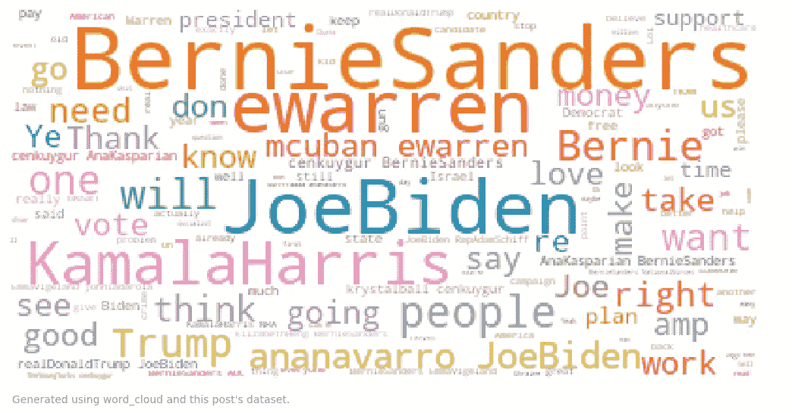
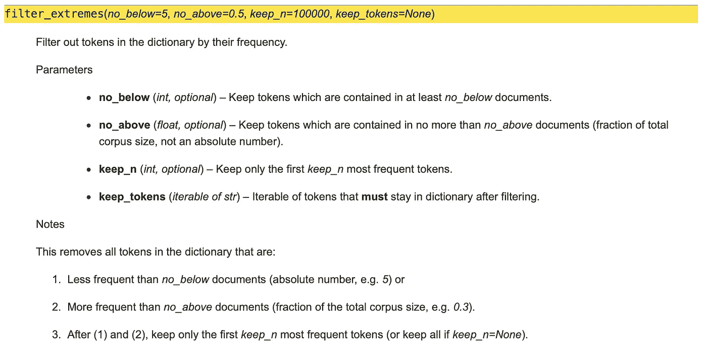
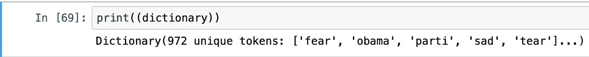
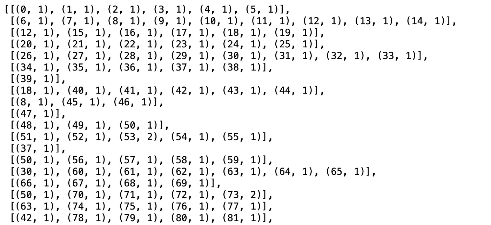
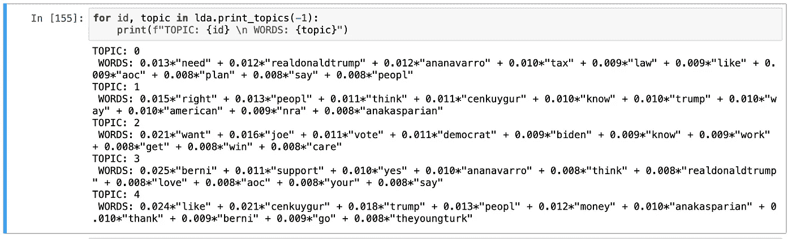
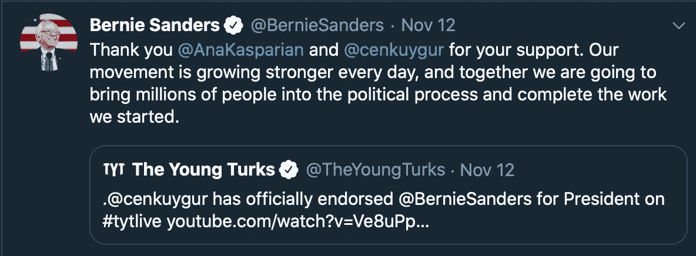
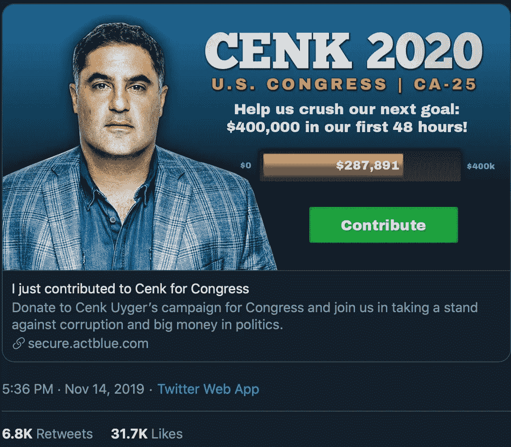
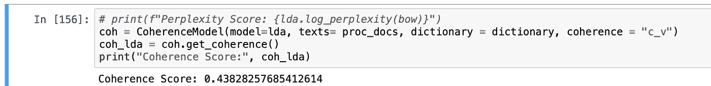

# 使用 LDA 探索文本数据

> 原文：<https://towardsdatascience.com/exploring-textual-data-using-lda-ef1f53c772a4?source=collection_archive---------29----------------------->

## 通过应用机器学习原理来理解非结构化文本数据。



# **简介**

我最近在工作中完成了我的第一个机器学习项目，并决定将该项目中使用的方法应用到我自己的项目中。我在工作中完成的项目围绕着使用[潜在狄利克雷分配](https://en.wikipedia.org/wiki/Latent_Dirichlet_allocation) (LDA)对文本数据进行自动分类。

LDA 是自然语言处理领域中的一种无监督机器学习模型。由于其无监督的性质，LDA 不需要标记的训练集。这使得它非常适合某些用例，或者当大型的、带标签的文本数据集不容易获得时。

LDA 主要用于主题建模，通过相似性对文本文档进行聚类。文档大小可以小到一个单词(不理想),大到整个出版物。LDA 聚类的内容是使用每个文档中的术语(单词)以及它们出现的频率来确定的，有时甚至是它们出现的顺序(使用 [n-grams](https://en.wikipedia.org/wiki/N-gram) )。被认为彼此相似的文档被聚类在一起，并且我们假设每个聚类代表一个主题，尽管直到聚类被创建之后我们才知道主题本身是什么。需要指出的是**模型既不理解这些集群中文档的内容也不理解其上下文**，因此实际上不能给集群一个主题标签。相反，它使用来自( *0* ， *n)的索引整数来“标记”每个聚类；* *n* 是我们告诉模型要寻找的主题数量。一个人，或者说[非常聪明的水生哺乳动物](https://www.independent.co.uk/news/world/europe/beluga-whale-catch-hvaldimir-russian-spy-programme-video-a9197106.html)，需要分析这些聚类，并确定每个聚类应该如何被标记。

在这篇文章中，我们将清理一些 Twitter 数据，并编写一个 LDA 模型来对这些数据进行聚类。然后我们将使用 [pyLDAvis](https://pyldavis.readthedocs.io/en/latest/) 来生成集群的交互式可视化。

**关键依赖:**熊猫、 [nltk](https://www.nltk.org) 、 [gensim](https://pypi.org/project/gensim/) 、numpy、 [pyLDAvis](https://pyldavis.readthedocs.io/en/latest/)

**这里有一些需要事先熟悉的定义:**

1.  *文档:*文本对象(例如 tweet)
2.  [*字典*](https://radimrehurek.com/gensim/corpora/dictionary.html) *:* 我们的文档集合中所有惟一标记(单词、术语)的列表，每个标记都有一个惟一的整数标识符
3.  [](https://www.geeksforgeeks.org/bag-of-words-bow-model-in-nlp/)**:*我们所有文档的集合，每个文档简化为一个矩阵列表，文档中的每个单词对应一个矩阵— *使用 gensim 的*[*doc 2 bow*](https://kite.com/python/docs/gensim.corpora.Dictionary.doc2bow)*，每个矩阵表示为一个元组，带有一个* ***术语的唯一整数 id*** *，索引为 0 和(例如，文档“the box was in the bigger box”将被简化为类似于[("the "，2)，(" box "，2)，(" was "，1)，(" in "，1)，(" bigger "，1)]的内容，但用" term "替换术语的唯一字典 id)**
4.  **coherence score:* 一个范围从 0 到 1 的浮点值，用于评估我们的模型和聚类数与我们的数据的吻合程度*
5.  **集群:*代表一组文档的节点，一个推断的主题*

# *1.数据*

*今年早些时候，我开始收集几十万条政治推文，最终目标是对推文及其元数据进行各种分析，为 2020 年美国总统大选做准备。*

*这篇文章的数据集将由 3500 条推文组成，其中至少提到以下一条:“@berniesanders”、“kamalaharris”、“joebiden”、“ewarren”(分别是伯尼·桑德斯、卡玛拉·哈里斯、乔·拜登和伊丽莎白·沃伦的推特账号)。我在 2019 年 11 月初收集了这些推文，并在这里提供下载[。我们将研究这些数据，并试图找出人们在 11 月初发推文的内容。](https://drive.google.com/drive/folders/1ebI3pEkrz3JbyF_aZF4DVPX2LSG1hVn_?usp=sharing)*

*我不会深入研究如何收集推文，但我已经包括了我在下面使用的代码。成功运行代码需要访问 [tweepy API](http://tweepy.readthedocs.org) 。我没有收集转发，也没有收集不是用英语写的推文(该模型需要更多的调整以适应多种语言)。*

```
*class Streamer(StreamListener):
    def __init__(self):
        super().__init__()
        self.limit = 1000 # Number of tweets to collect.
        self.statuses = []  # Pass each status here.

    def on_status(self, status):
        if status.retweeted or "RT @" 
        in status.text or status.lang != "en":
            return   # Remove re-tweets and non-English tweets.
        if len(self.statuses) < self.limit:
            self.statuses.append(status)
            print(len(self.statuses))  # Get count of statuses
        if len(self.statuses) == self.limit:
            with open("/tweet_data.csv", "w") as    file: 
                writer = csv.writer(file)  # Saving data to csv. 
                for status in self.statuses:
                    writer.writerow([status.id, status.text,
              status.created_at, status.user.name,         
              status.user.screen_name, status.user.followers_count, status.user.location]) 
            print(self.statuses)
            print(f"\n*** Limit of {self.limit} met ***")
            return False
        if len(self.statuses) > self.limit:
            return False

streaming = tweepy.Stream(auth=setup.api.auth, listener=Streamer())

items = ["@berniesanders", "@kamalaharris", "@joebiden", "@ewarren"]  # Keywords to track

stream_data = streaming.filter(track=items)*
```

*这会将 tweet 文本数据及其元数据(id、创建日期、名称、用户名、关注者数量和位置)传递给名为 tweet_data 的 csv。*

```
*import pandas as pddf = pd.read_csv(r"/tweet_data.csv", names= ["id", "text", "date", "name", "username", "followers", "loc"])*
```

*现在我们已经将数据打包到一个整洁的 csv 中，我们可以开始为我们的 LDA 机器学习模型准备数据了。文本数据通常被视为非结构化数据，在进行有意义的分析之前需要清理。由于不一致的性质，推文尤其混乱。例如，任何给定的 Twitter 用户可能某一天用完整的句子发推，而第二天用单个单词和标签发推。另一个用户可能只发链接，另一个用户可能只发标签。除此之外，还有用户可能会有意忽略的语法和拼写错误。还有一些口语中使用的术语不会出现在标准英语词典中。*

## *清洁*

*我们将删除所有标点符号、特殊字符和 url 链接，然后对每条推文应用 *lower()* 。这为我们的文档带来了一定程度的一致性(记住每条 tweet 都被视为一个文档)。我还删除了“berniesanders”、“kamalaharris”、“joebiden”和“ewarren”的实例，因为它们会扭曲我们的词频，因为每个文档至少会包含其中一项。*

```
*import stringppl = ["berniesanders", "kamalaharris", "joebiden", "ewarren"]def clean(txt):
    txt = str(txt.translate(str.maketrans("", "", string.punctuation))).lower() 
    txt = str(txt).split()
    for item in txt:
        if "http" in item:
            txt.remove(item)
        for item in ppl:
            if item in txt:
                txt.remove(item)
    txt = (" ".join(txt))
    return txt

df.text = df.text.apply(clean)*
```

# *2.数据准备*

*下面是我们需要导入的包，以便在将数据输入模型之前准备好数据。**在编写数据准备的代码时，我也会包括这些导入。***

```
*import gensim
from gensim.utils import simple_preprocess
from gensim.parsing.preprocessing import STOPWORDS as stopwords
import nltk
nltk.download("wordnet")
from nltk.stem import WordNetLemmatizer as lemm, SnowballStemmer as stemm
from nltk.stem.porter import *
import numpy as np
np.random.seed(0)*
```

*我们已经清理了一些文档，但是现在我们需要[对它们进行词法分析和词干分析。词汇化将文档中的单词转换为第一人称，并将所有动词转换为现在时。词干处理将文档中的单词还原为它们的根格式。幸运的是，nltk 有一个 lemmatizer 和一个词干分析器可供我们利用。](https://nlp.stanford.edu/IR-book/html/htmledition/stemming-and-lemmatization-1.html)*

*LDA 涉及到一个[随机过程](https://en.wikipedia.org/wiki/Stochastic_process)，意味着我们的模型需要产生随机变量的能力，因此有了 *numpy* 导入。添加 *numpy.random.seed(0)* 允许我们的模型是可重复的，因为它将生成并使用相同的随机变量，而不是在每次代码运行时生成新的变量。*

*Gensim 的停用词是一个被认为不相关或可能混淆我们词汇的术语列表。在 NLP 中，“停用词”指的是我们不希望模型选取的术语集合。此列表将用于从我们的文档中删除这些不相关的术语。我们可以 *print(stopwords)* 来查看将要删除的术语。*

*以下是停用词中的术语。*

**

*对于这个模型，我们将保持停用词列表不变，但在某些情况下，可能需要添加我们希望模型忽略的特定术语。下面的代码是向停用词添加术语的一种方法。*

```
*stopwords = stopwords.union(set(["add_term_1", "add_term_2"]))*
```

## *词汇化和词干化*

*让我们为我们的数据准备写一些代码。*

```
*import warnings 
warnings.simplefilter("ignore")
import gensim
from gensim.utils import simple_preprocess
from gensim.parsing.preprocessing import STOPWORDS as stopwords
import nltk
nltk.download("wordnet")
from nltk.stem import WordNetLemmatizer as lemm, SnowballStemmer as stemm
from nltk.stem.porter import *
import numpy as np
np.random.seed(0)*
```

*初始化词干分析器。*

```
*stemmer = stemm(language="english")*
```

*写一个函数，既能对我们的文档进行词汇化，又能对其进行词干分析。GeeksforGeeks 有关于使用 nltk 进行词法分析的[个例子](https://www.geeksforgeeks.org/python-lemmatization-with-nltk/)和关于使用 nltk 进行词干分析的[个例子](https://www.geeksforgeeks.org/python-stemming-words-with-nltk/)。*

```
*def lemm_stemm(txt):
    return stemmer.stem(lemm().lemmatize(txt, pos="v"))*
```

*编写一个函数，将停用词从我们的文档中删除，同时也应用*lemm _ stem()*。*

```
*def preprocess(txt):
    r = [lemm_stemm(token) for token in simple_preprocess(txt) if       token not in stopwords and len(token) > 2]
    return r*
```

*将我们清理和准备好的文档分配给一个新变量。*

```
*proc_docs = df.text.apply(preprocess)*
```

# ***3。模型的制作***

*现在我们已经准备好了数据，我们可以开始编写模型了。*

## *词典*

*正如引言中提到的，字典(在 LDA 中)是在我们的文档集合中出现的所有唯一术语的列表。我们将使用 gensim 的语料库包来构建我们的词典。*

```
*dictionary = gensim.corpora.Dictionary(proc_docs)
dictionary.filter_extremes(no_below=5, no_above= .90)
len(dictionary)*
```

**filter_extremes()* 参数是针对停用词或其他常用术语的第二道防线，这些停用词或常用术语对句子的意义没有什么实质意义。摆弄这些参数可以帮助微调模型。关于这一点我就不赘述了，但我在下面附上了来自 [gensim 的字典文档](https://radimrehurek.com/gensim/corpora/dictionary.html#gensim.corpora.dictionary.Dictionary.filter_extremes)中解释参数的截图。*

**

*我们的字典有 972 个独特的单词(术语)。*

**

## *词汇袋*

*如引言中所述，单词包(在 LDA 中)是我们分解成矩阵的所有文档的集合。矩阵由术语的标识符和它在文档中出现的次数组成。*

```
*n = 5 # Number of clusters we want to fit our data to
bow = [dictionary.doc2bow(doc) for doc in proc_docs]
lda = gensim.models.LdaMulticore(bow, num_topics= n, id2word=dictionary, passes=2, workers=2)print(bow)*
```

**

*让我们通过查看定义集群的关键术语来了解我们的集群是如何形成的。*

```
*for id, topic in lda.print_topics(-1):
    print(f"TOPIC: {id} \n WORDS: {topic}")*
```

**

*查看每个主题群，我们可以了解它们代表了什么。看一下题目 1 和题目 4。*

**关于话题 1:* 在话题 1 中，关键词“cenkuygur”和“anakasparian”是指 [Cenk 维吾尔族](https://twitter.com/cenkuygur) 和**[Ana Kasparian](https://twitter.com/AnaKasparian)**，**共同主持人**[少壮派](https://tyt.com)(某政论事务所及节目)。主题 1 还包括关键术语“权利”、“特朗普”和“全国步枪协会”。*****

*****11 月 15 日，加州圣塔克拉里塔附近的索格斯高中发生了校园枪击案。关于这一悲剧事件，T2 媒体进行了大量报道，网上也议论纷纷。年轻的土耳其人(TYT)是更严格的枪支法律的口头支持者，并经常与全国步枪协会和其他枪支团体发生冲突。TYT 甚至带头发起了名为#NeverNRA 的承诺[运动。](https://join.tyt.com/nevernra/)*****

*****这个主题群可以被标为“TYT 对全国步枪协会”，或类似的东西。*****

******关于主题 4:* 术语“cenkuygur”和“anakasparian”在主题 4 中重复出现。话题 4 还包括“theyoungturk”，指的是年轻的土耳其人，以及“berni”，指的是伯尼·桑德斯。*****

*****11 月 12 日，岑克维为候选人伯尼·桑德斯发布[公开背书](https://youtu.be/m4mspXXNiqg)。TYT 的推特账户重复了这一表态。伯尼·桑德斯随后公开感谢他们的支持。此外，11 月 14 日，维吾尔先生宣布他将竞选国会议员。这两项进展都在 Twitter 上获得了显著关注。*****

*****这个主题群可以被称为“TYT 和伯尼·桑德斯”，或者类似的名称。*****

********************

*****其他主题群也有类似的解释。*****

# *******4。评估、可视化、结论*******

*****大多数好的机器学习模型和应用都有一个反馈环。这是一种评估模型的性能、可伸缩性和整体质量的方法。在主题建模空间中，我们使用[一致性分数](http://qpleple.com/topic-coherence-to-evaluate-topic-models/)来确定我们的模型有多“一致”。正如我在介绍中提到的，coherence 是一个介于 0 和 1 之间的浮点值。为此我们也将使用 gensim。*****

```
*****# Eval via coherence scoringfrom gensim import corpora, models
from gensim.models import CoherenceModel
from pprint import pprintcoh = CoherenceModel(model=lda, texts= proc_docs, dictionary = dictionary, coherence = "c_v")
coh_lda = coh.get_coherence()
print("Coherence Score:", coh_lda)*****
```

**********

*****我们得到了 0.44 的一致性分数。这不是最好的，但实际上也不算太差。这个分数是在没有任何微调的情况下获得的。真正挖掘我们的参数和测试结果应该会得到更高的分数。得分真的没有官方门槛。我的一致性分数目标通常在 0.65 左右。参见这篇[文章](https://datascienceplus.com/evaluation-of-topic-modeling-topic-coherence/)和这个堆栈溢出[线程](https://stackoverflow.com/questions/54762690/coherence-score-0-4-is-good-or-bad)了解更多关于一致性评分的信息。*****

## *****用 pyLDAvis 可视化*****

*****最后，我们可以使用 pyLDAvis 可视化我们的集群。这个包创建了一个聚类的距离图，沿着 x 和 y 轴绘制聚类。这个距离地图可以通过调用 *pyLDAvis.display()* 在 Jupiter 中打开，也可以通过调用 *pyLDAvis.show()* 在 web 中打开。*****

```
*****import pyLDAvis.gensim as pyldavis
import pyLDAvislda_display = pyldavis.prepare(lda, bow, dictionary)
pyLDAvis.show(lda_display)*****
```

*****这是我们的 pyLDAvis 距离图的截图。*****

**********

*****将鼠标悬停在每个集群上，会显示该集群中关键术语的相关性(红色)以及这些相同关键术语在整个文档集合中的相关性(蓝色)。这是向风险承担者展示调查结果的有效方式。*****

## *******结论*******

*****这里是我上面使用的所有代码，包括我用来生成单词云的代码和我用来收集推文数据的代码。*****

```
*****### All Dependencies ###

import pandas as pd
from wordcloud import WordCloud as cloud
import matplotlib.pyplot as plt
import string
import gensim
from gensim.utils import simple_preprocess
from gensim.parsing.preprocessing import STOPWORDS as stopwords
import nltk
nltk.download("wordnet")
from nltk.stem import WordNetLemmatizer as lemm, SnowballStemmer as stemm
from nltk.stem.porter import *
import numpy as np
np.random.seed(0)
from gensim import corpora, models
from gensim.models import CoherenceModel
from pprint import pprint
import pyLDAvis.gensim as pyldavis
import pyLDAvis

### Word Cloud ###

df = pd.read_csv(r"/tweet_data.csv", names=["id", "text", "date", "name",
                                                                 "username", "followers", "loc"])

def clean(txt):
    txt = str(txt).split()
    for item in txt:
        if "http" in item:
            txt.remove(item)
    txt = (" ".join(txt))
    return txt

text = (df.text.apply(clean))

wc = cloud(background_color='white', colormap="tab10").generate(" ".join(text))

plt.axis("off")
plt.text(2, 210, "Generated using word_cloud and this post's dataset.", size = 5, color="grey")

plt.imshow(wc)
plt.show()### Stream & Collect Tweets ###class Streamer(StreamListener):
    def __init__(self):
        super().__init__()
        self.limit = 1000 # Number of tweets to collect.
        self.statuses = []  # Pass each status here.

    def on_status(self, status):
        if status.retweeted or "RT @" 
        in status.text or status.lang != "en":
            return   # Remove re-tweets and non-English tweets.
        if len(self.statuses) < self.limit:
            self.statuses.append(status)
            print(len(self.statuses))  # Get count of statuses
        if len(self.statuses) == self.limit:
            with open("/tweet_data.csv", "w") as    file: 
                writer = csv.writer(file)  # Saving data to csv. 
                for status in self.statuses:
                    writer.writerow([status.id, status.text,
              status.created_at, status.user.name,         
              status.user.screen_name, status.user.followers_count, status.user.location]) 
            print(self.statuses)
            print(f"\n*** Limit of {self.limit} met ***")
            return False
        if len(self.statuses) > self.limit:
            return False

streaming = tweepy.Stream(auth=setup.api.auth, listener=Streamer())

items = ["@berniesanders", "@kamalaharris", "@joebiden", "@ewarren"]  # Keywords to track

stream_data = streaming.filter(track=items)### Data ###

df = pd.read_csv(r"/tweet_data.csv", names= ["id", "text", "date", "name",
                                                                 "username", "followers", "loc"])

### Data Cleaning ###

ppl = ["berniesanders", "kamalaharris", "joebiden", "ewarren"]

def clean(txt):
    txt = str(txt.translate(str.maketrans("", "", string.punctuation))).lower()
    txt = str(txt).split()
    for item in txt:
        if "http" in item:
            txt.remove(item)
        for item in ppl:
            if item in txt:
                txt.remove(item)
    txt = (" ".join(txt))
    return txt

df.text = df.text.apply(clean)

### Data Prep ###

# print(stopwords)

# If you want to add to the stopwords list: stopwords = stopwords.union(set(["add_term_1", "add_term_2"]))

### Lemmatize and Stem ###

stemmer = stemm(language="english")

def lemm_stemm(txt):
    return stemmer.stem(lemm().lemmatize(txt, pos="v"))

def preprocess(txt):
    r = [lemm_stemm(token) for token in simple_preprocess(txt) if       token not in stopwords and len(token) > 2]
    return r

proc_docs = df.text.apply(preprocess)

### LDA Model ###

dictionary = gensim.corpora.Dictionary(proc_docs)
dictionary.filter_extremes(no_below=5, no_above= .90)
# print(dictionary)

n = 5 # Number of clusters we want to fit our data to
bow = [dictionary.doc2bow(doc) for doc in proc_docs]
lda = gensim.models.LdaMulticore(bow, num_topics= n, id2word=dictionary, passes=2, workers=2)
# print(bow)

for id, topic in lda.print_topics(-1):
    print(f"TOPIC: {id} \n WORDS: {topic}")

### Coherence Scoring ###

coh = CoherenceModel(model=lda, texts= proc_docs, dictionary = dictionary, coherence = "c_v")
coh_lda = coh.get_coherence()
print("Coherence Score:", coh_lda)

lda_display = pyldavis.prepare(lda, bow, dictionary)
pyLDAvis.show(lda_display)*****
```

*****LDA 是探索文本数据的一个很好的模型，尽管它需要大量的优化(取决于用例)来用于生产。在编写、评估和显示模型时，gensim、nltk 和 pyLDAvis 包是无价的。*****

*****非常感谢你让我分享，以后还会有更多。😃*****