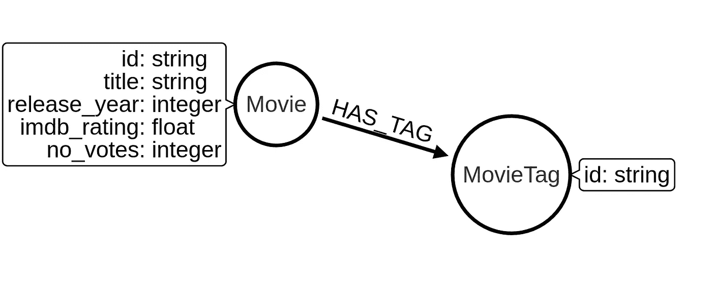
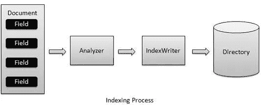

# 在电影数据集上探索 Neo4j 中的全文搜索索引

> 原文：<https://towardsdatascience.com/exploring-the-full-text-search-index-in-neo4j-on-a-movies-dataset-3cddca69db7a?source=collection_archive---------11----------------------->

[全文搜索索引](https://neo4j.com/docs/operations-manual/current/performance/index-configuration/fulltext-search/)是在 Neo4j 版本 3.5 中引入的，由 Apache Lucene 支持索引。这篇博文的议程是介绍基本的 Lucene 查询语言，并描述如何在 Neo4j 中使用它。正如您将看到的，我们还可以将 Lucene 和 Cypher 结合起来操作结果。

我这篇博文的大部分灵感来自[克里斯托夫·威廉森](https://twitter.com/ikwattro)，他是 [Graphaware 团队](https://graphaware.com/)的一员。他很好地描述了 FTS 对像我这样的新手的使用，谢谢！

*   博客:[深入 Neo4j 3.5 全文搜索](https://graphaware.com/neo4j/2019/01/11/neo4j-full-text-search-deep-dive.html)
*   网上研讨会:[生存还是毁灭。全文搜索提示和技巧。](https://www.youtube.com/watch?v=TFXoYQBHl4Q&list=PL9Hl4pk2FsvUbsmdPrqTRF_DWvUb4z5AK&index=24)

我们将使用 kaggle 上的[电影对话语料库](https://www.kaggle.com/Cornell-University/movie-dialog-corpus)数据集。它有丰富的元数据，因为它包含了 617 部不同电影中角色之间的所有对话。我有几篇使用该数据集的博客文章，但是首先，我们将只使用关于电影的数据来探索全文搜索索引功能。

# 图形模型



Made using apcjones.com/arrows/

我们的图表中有两个标签(电影、电影标签)。它们通过 HAS_TAG 关系进行连接。电影可以有额外的属性，如发行年份、IMDB 评级和 IMDB 上的投票数。

**创建约束**

为了优化导入和以后的查询，我们为电影和电影标签定义了唯一的约束。

```
CREATE CONSTRAINT ON (m:Movie) ASSERT m.id IS UNIQUE;
CREATE CONSTRAINT ON (m:MovieTag) ASSERT m.id IS UNIQUE;
```

## 导入

在运行导入查询之前，将*movie _ titles _ metadata . tsv*文件复制到 *$Neo4j/import* 文件夹中。

```
LOAD CSV FROM "file:///movie_titles_metadata.tsv" as row FIELDTERMINATOR "\t"
MERGE (m:Movie{id:row[0]})
SET m.title = row[1],
    m.release_year = toInteger(row[2]),
    m.imdb_rating = toFloat(row[3]),
    m.no_votes = toInteger(row[4])
WITH m, apoc.convert.fromJsonList(
          replace(row[5]," ",",")) as tags
UNWIND tags as tag
MERGE (mt:MovieTag{id:tag})
MERGE (m)-[:HAS_TAG]->(mt)
```

# 全文搜索索引

简单来说，lucene 索引管道由两个步骤组成。第一步是“分析器”步骤，它负责文本的预处理。第二步，“索引器”将“分析器”的结果存储到索引中。



Image from [https://www.tutorialspoint.com/lucene/lucene_indexing_process.htm](https://www.tutorialspoint.com/lucene/lucene_indexing_process.htm)

在这篇博文中，我们将使用 Neo4j 中默认的“标准”分析器。它对非字母进行标记，并过滤掉英语停用词和标点符号。不做词干分析，但注意将可能的产品名称、URL 和电子邮件地址作为单个术语。

您可以查看其他可用的分析仪。

```
CALL db.index.fulltext.listAvailableAnalyzers;
```

## 创建全文搜索索引

首先，我们必须将所有包含数字的属性转换成字符串，因为我们不能索引整数或浮点数。索引过程会自动忽略数字。

IMDB 评级属性是一个只有一个小数点的数字。要将其转换为字符串，我们将首先将其乘以 10，然后将其转换为字符串。例如，评分 6.1 将被保存为“61”。

```
MATCH (m:Movie)
SET m.string_rating = toString(toInteger(m.imdb_rating * 10)),
    m.string_release_year = toString(m.release_year)
```

当使用范围查询时，我们必须小心，因为排序是按照词汇顺序(字母顺序)进行的。在我们的例子中，所有的评级都在“00”到“99”之间，所以应该没有问题。例如，如果范围跨越到“150”，我们就会遇到一个问题，因为默认情况下，在“50”和“150”之间查找间隔将不起作用。在 [Lucene range 的博客文章](https://brettscott.wordpress.com/2011/11/19/lucene-number-range-search-integers-floats/)中描述了解决方法。为了允许在具有不同位数的数字之间进行范围搜索，我们需要对这些值进行预处理，在它们前面加上零，以确保所有的值都具有相同的位数。

在这个例子中，我们将所有的数字预处理为七位数。

```
WITH 7 as total_length
MATCH (m:Movie)
WHERE exists (m.imdb_rating)
WITH m, total_length, 
        toString(toInteger(m.imdb_rating * 10)) as string_rating
WITH m, total_length — length(string_rating) as zeros, string_rating
WITH m, apoc.text.join([x in range(1,zeros) | “0”],””) +    
                                  string_rating as final_rating
SET m.range_rating = final_rating
```

现在我们创建“MovieIndex”索引，它包含带有标签 Movie 和四个指定属性的节点。第一个参数是索引的名称。第二个参数定义节点的标签，第三个参数定义我们想要索引的属性。

```
CALL db.index.fulltext.createNodeIndex(
"MovieIndex",["Movie"],["title","string_rating","range_rating","string_release_year"])
```

## Lucene 查询

让我们看看一些基本的 lucene 查询操作符。

**具体属性**

搜索标题中带有“梦”字的电影。

```
CALL db.index.fulltext.queryNodes("MovieIndex", "title:dream") YIELD node, score
RETURN node.title as title, score
```

结果

**逻辑运算符**

有两种逻辑运算符可用，“或”和“与”。

搜索 1999 年或 2000 年发行的电影。

```
CALL db.index.fulltext.queryNodes("MovieIndex", 
     "string_release_year:1999 or 2000") YIELD node, score
RETURN node.title as title, score
LIMIT 5
```

结果

**单字符通配符**

单字符通配符操作符`?`查找与被替换的单个字符匹配的术语。

```
CALL db.index.fulltext.queryNodes("MovieIndex", "title:th?") YIELD node, score
RETURN node.title as title, score
```

结果

需要注意的一点是,“黑客帝国”电影不会显示在结果中，因为标准分析器删除了像“the”这样的停用词。

**多字符通配符**

多字符通配符运算符查找零个或多个字符。也可以像`dre*am`一样把运算符放在词条中间。为了防止极其缓慢的通配符查询，术语不应该以通配符`*dream`开头。

```
CALL db.index.fulltext.queryNodes("MovieIndex", "title:drea*") YIELD node, score
RETURN node.title as title, score
```

结果

**模糊搜索**

模糊搜索通过使用数学公式来计算两个单词之间的相似度。计算相似性的常用方法是 Levenshtein 距离。

```
CALL db.index.fulltext.queryNodes("MovieIndex", "title:dream~") YIELD node, score
RETURN node.title as title, score
LIMIT 5
```

结果

**范围查询**

Lucene 区分了具有包含或排除端点的范围操作符。

操作员:

{} ->不包括边缘

[] ->包括边缘

```
CALL db.index.fulltext.queryNodes("MovieIndex", "string_rating:[50 TO 99}") YIELD node, score
RETURN node.title as title,score
LIMIT 5
```

结果

为了说明为什么我们在进行范围搜索时需要相同位数的数字，让我们尝试下面的查询。

```
CALL db.index.fulltext.queryNodes("MovieIndex", "string_rating:[50 TO 100]") YIELD node, score
RETURN node.title as title,score
```

直觉上你会认为它工作得很好，但是由于词汇排序的原因，情况并非如此。我们用来解决这个问题的变通方法是 range_rating 属性，其中的值以零为前缀，以允许在不同数量级的数字之间进行字母排序。

```
CALL db.index.fulltext.queryNodes(“MovieIndex”, “range_rating:[0000050 TO 0000150]”) YIELD node, score
RETURN node.title as title,score
LIMIT 5
```

结果

## 提高分数

Lucene 查询语言还支持使用脱字符(^) 操作符提升结果的分数。

提升 string_rating 介于 50 和 99 之间的结果。

```
CALL db.index.fulltext.queryNodes("MovieIndex", "title:dream string_rating:[50 TO 99]^2") YIELD node, score
RETURN node.title as title,score
LIMIT 5
```

结果

**时间衰变**

我在 Christophe Willemsen 的 [Nodes 2019 网络研讨会上看到一个 lucene time decay 查询，我想复制它。基本上，我们结合许多增强参数来实现时间衰减效果。为了说明这意味着什么，我们将使用`apoc.text.join()`来生成九个助推参数。](https://www.youtube.com/watch?v=TFXoYQBHl4Q&list=PL9Hl4pk2FsvUbsmdPrqTRF_DWvUb4z5AK&index=24)

```
RETURN apoc.text.join([
 x in range(0,8) | 
 "string_release_date:" + toString((date().year - x)) + "^" + toString(10-x)
]," ")
```

结果

```
string_release_date:2019^10 string_release_date:2018^9 string_release_date:2017^8 string_release_date:2016^7 string_release_date:2015^6 string_release_date:2014^5 string_release_date:2013^4 string_release_date:2012^3 string_release_date:2011^2
```

你可以看到，2019 年上映的电影将增加 10 倍，2018 年的电影将增加 9 倍，以此类推。

总结这篇博文，让我们在一个查询中结合评分提升和时间衰减效果。为了让你知道以后你可以用 cypher 处理结果，让我们添加一个过滤器，只返回惊悚片。

```
WITH apoc.text.join([x in range(0,10) | 
"string_release_date:" + toString((date().year — x)) + "^" +   
  toString(10-x)]," ") as time_decay
CALL db.index.fulltext.queryNodes("MovieIndex", "title:dream string_rating:[50 TO 99]^2 "+ time_decay) YIELD node, score
// filter only thrillers
MATCH (node)-[:HAS_TAG]->(:MovieTag{id:'thriller'})
RETURN node.title as title,score
LIMIT 5
```

结果

# 结论

全文搜索是一个非常受欢迎的特性，它可以帮助我们开发更好更快的 Neo4j 应用程序，还可以解决其他问题。如果您有任何问题或反馈，请加入 [Neo4j 社区论坛](https://community.neo4j.com/)。

*所有代码在*[*Github*](https://github.com/tomasonjo/blogs/tree/master/Explore_full_text_search)*上都有。*