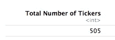

# 用 R 刮和探索 SP500 第 1 部分

> 原文：<https://towardsdatascience.com/exploring-the-sp500-with-r-part-1-scraping-data-acquisition-and-functional-programming-56c9498f38e8?source=collection_archive---------10----------------------->

## 刮擦、数据采集和功能编程

今天，我想通过一个简单的例子，使用函数式编程和整洁的迭代概念，将抓取、对 Yahoo finance api 的调用、数据连接和简单的资产分析结合起来。


photo credit: [https://unsplash.com](https://unsplash.com/)

# 最终目标:

我想确定过去 3 个月哪些 SP500 资产的平均回报率最高。

## **这个** [**分析的最终结果**](https://medium.com/@Psr1/exploring-the-sp500-with-r-part-2-asset-analysis-657d3c1caf60) **就是这个图表:**

这个图表的制作，资产分析，回答我的问题，会在这个系列 的第二部分 [**中讲到。**](https://medium.com/@Psr1/exploring-the-sp500-with-r-part-2-asset-analysis-657d3c1caf60)

# 介绍和 Tidyverse:

在今天的分析中，我将使用 R 编程语言。如果你过去读过我在 Linkedin 或 Medium 上的任何帖子，你可能已经注意到我通常用 python 编程。总的来说，我更喜欢 python 编程语言，因为它的语法更简单，应用更广泛，也更容易投入生产。

**潮间带生态系统:**

在 R 编程语言中，有一组包组成了所谓的 [**tidyverse**](https://www.tidyverse.org/) 。这些软件包主要由 Rstudio 的工程师和数据科学家维护，并提供了一种简单、集成和统一的方法来操作 r 中的数据。tidyverse 围绕着 [**整理数据**](https://vita.had.co.nz/papers/tidy-data.pdf) 这是 Hadley Wickham 创造的一个术语，用来描述数据，其中:

*   每个变量都是一列
*   每个观察(或案例)都是一行

今天我将利用几个图书馆。在下面的代码块中，我导入了我将要使用的库。

```
# for scraping
library(rvest)
# blanket import for core tidyverse packages
library(tidyverse)
# tidy financial analysis 
library(tidyquant)
# tidy data cleaning functions
library(janitor)
```

我要做的下一件事是用今天的日期定义一个变量。然后我从今天减去 3 个月。这将返回另一个 date 对象，指示 3 个月前的某一天。我需要这个，因为我想得到每个股票最近 3 个月的价格数据。

```
# save current system date to a variable
today <- Sys.Date()
# subtract 3 months from the current date
date = today %m+% months(-3)
print(date)
```


# 一个股票

我将使用 tidyquant 包获取所有 SP500 证券交易所的财务数据。tidyqunat 包的核心函数是 tq_get()，可以用来获取股票的各种信息。如果我将一个包含股票代号的字符串传递给 tq_get()，它将返回开盘、盘高、盘低、收盘或 OHLC 数据。我将 SP500 的报价器^GSPC 传递给 tq_get()函数。

```
# pass SP500 ticker ^GSPC to tq_get function
one_ticker = tq_get("^GSPC", from = date)
one_ticker %>% 
  head()
```


上面有几件事需要注意

*   tq_get()返回一个整洁的数据帧
*   股票代码名称不在数据帧中
*   %>%运算符称为管道。它将前面的对象作为第一个参数传递给后面的函数。

# 放大第 1 部分—获得所有 505 个分笔成交点的向量:

我想要所有 SP500 售票员的 OHLC 数据。为了做到这一点，我需要做几件事:

*   创建所有 SP500 证券交易所的向量
*   迭代这个向量并对向量的每个元素调用 tq_get()，为向量中的每个元素返回一个 dataframe
*   将所有这些数据帧组合成一个数据帧

哇！听起来有点复杂，对吧？幸运的是，有了 R，这将变得非常简单。维基百科有一个包含所有 505 家 SP500 证券交易所(一些公司，如谷歌，有多个资产类别)的表格，位于以下网址:

https://en.wikipedia.org/wiki/List_of_S%26P_500_companies

为了得到所有的 SP500 ticker，我们将使用 rvest 包来清理这个表。rvest 包是 R 中的一个简单的刮包，非常类似于 python 的美汤。在编程的上下文中，抓取被定义为以编程方式从互联网和网页上收集人类可读的内容。

在下面的代码中，我抓取了维基百科表格，并创建了一个包含所有 SP500 证券交易所的向量:

*   我首先将维基百科的 URL 赋给一个变量
*   从 URL 读入 html
*   选择正确的 html 节点并提取 html 表格
*   对股票代号做了一个小小的改动，因为雅虎财经用了一个“_”而不是“.”对于某些符号名称

抓取最困难的部分是找出 xpath 或 css 来指示选择哪些 html 节点。我真的不太了解 html 或 css，但是使用 Google Chrome 我能够找到正确的 xpath(下面会有更多相关内容)。

```
# get the URL for the wikipedia page with all SP500 symbols
url <- "[https://en.wikipedia.org/wiki/List_of_S%26P_500_companies](https://en.wikipedia.org/wiki/List_of_S%26P_500_companies)"
# use that URL to scrape the SP500 table using rvest
tickers <- url %>%
  # read the HTML from the webpage
  read_html() %>%
  # one way to get table
  #html_nodes(xpath='//*[[@id](http://twitter.com/id)="mw-content-text"]/div/table[1]') %>%
  # easier way to get table
  html_nodes(xpath = '//*[[@id](http://twitter.com/id)="constituents"]') %>% 
  html_table()
#create a vector of tickers
sp500tickers <- tickers[[1]]
sp500tickers = sp500tickers %>% mutate(Symbol = case_when(Symbol == "BRK.B" ~ "BRK-B",
                                           Symbol == "BF.B" ~ "BF-B",
                                            TRUE ~ as.character(Symbol)))
```

## 如何使用 Google Chrome 找到我传递给 html_nodes 函数的 xpath:

*   去 https://en.wikipedia.org/wiki/List_of_S%26P_500_companies
*   右击网页，选择检查选项


*   大多数网页内容通常在 html 文档的主体中。我们会扩大那部分。看起来会像这样:


*   查看网页时，我可以看到我想要的表格就在第一个 h2 标题的下方:


*   在浏览了页面结构后，我找到了第一个 h2 标题和我想要放在它下面的表格


*   我可以点击这个表，右键点击并复制这个表所需要的 xpath


*   XPath =//*[[@ id](http://twitter.com/id)= " constituents "]，这就是传递给 html_nodes 的内容

```
html_nodes(xpath = '//*[[@id](http://twitter.com/id)="constituents"]'
```

# 向上扩展第 2 部分— Purrr、迭代和函数式编程:

迭代是指以编程方式重复一个步骤或一组步骤，重复一定的次数，或者直到达到某个条件。

通常，当我们在任何编程语言中迭代时，我们使用循环，通常是 for 循环。我需要迭代 SP500 ticker 向量中的每个元素，并将其传递给函数 tq_get()。我可以用 for 循环做到这一点，但是使用 purrr 包是一个更好的主意。R 中的循环很慢，很难读懂。purrr 包提供了一套用于迭代和函数式编程的函数，可以很好地与 tidyverse 的其余部分集成。map()中 purrr 的核心函数。大多数编程语言(包括我最喜欢的一个 python)都有一个 map 函数，用于将一个函数应用于一个对象的所有元素。

**函数式编程**是一种编程范式，与[类](https://softwareengineering.stackexchange.com/questions/179965/functional-programming-compared-to-oop-with-classes)相反，函数构建程序的结构和逻辑。在函数式编程中，通常避免使用 For 循环。相反，函数被映射或应用于列表或其他对象。

正如哈德利·韦翰在他的《高级 R 书》中所说:

“很难准确描述什么是功能性*风格*，但通常我认为它意味着将一个大问题分解成更小的部分，然后用一个功能或功能组合来解决每个部分。当使用函数式风格时，您努力将问题的组成部分分解成独立操作的孤立函数。每个函数本身都简单易懂；复杂性是通过以各种方式组合函数来处理的。”

让我们用一个例子来看看 purrr 中的迭代和 for 循环的区别。这两种操作大致相同:

```
# get a sequence of the numbers 1 to 5
numbers = seq(1:5)
print('for loop')# for loop 
for (i in numbers){

  print(i)
}print('purrr :)')# purr functional programming approach
list = map(numbers, print)
```


**需要注意的几件事:**

*   for 循环和 map 函数都对向量中的每个元素进行运算
*   **map 函数返回一个嵌套的列表，其中每个条目都是在该列表中调用的函数的结果，该函数针对的是被迭代的对象中的一个条目。我把它赋给一个变量列表，以避免它被打印出来。**
*   **使用 purrr 的 map 函数只需要一行代码和很少的代码**
*   **使用 purrr 的地图功能更容易阅读**

## **好吧，现在让我们迭代得到所有 505 SP500 ticker！**

**首先，我需要编写一个函数来迭代或应用到向量的每个元素。我不能简单地将 tq_get()与 map()一起使用，因为它不会将 ticker 名称作为 dataframe 的一列返回。为了获得带有数据帧的 ticker，我将使用 dplyr 中的 mutate()函数创建一个带有 ticker 名称的新列。**

```
get_symbols = function(ticker = "AAPL"){
  df = tq_get(ticker, from = date) %>% mutate(symbol = rep(ticker, length(date)))
}
```

**然后，我将这个函数与 map()结合使用来遍历所有符号的列表。这将返回一个嵌套列表，其中包含每个 ticker 的数据帧。我使用 dplyr bind_rows()函数将数据帧按行绑定在一起，创建一个包含所有 SP500 报价机的数据帧。**

```
#create the dataframe of SP500 data by interating over our list of symbols and call our get symbols function each time
#the map function accomplishes thistickers_df = map(symbols, get_symbols) %>% bind_rows()
```

**我还希望这个数据帧包含来自维基百科表的信息，最重要的是公司的名称。这可以通过用符号连接两个数据帧来实现。**

```
tickers_df = tickers_df %>% 
  # left join with wikipedia data
  left_join(sp500tickers, by = c('symbol' = 'Symbol')) %>% 
  # make names R compatible
  clean_names() %>% 
  # keep only the columns we need
  select(date:security, gics_sector, gics_sub_industry)
```

**加入数据后，我们应该做一个快速的健全检查，以确保我们有所有 505 SP500 ticker**

```
tickers_df %>% 
# select just the symbol column
select(symbol)%>% 
# get the distinct values
distinct()%>% 
# count the distinct values 
count() %>% 
# we can use select to rename columns 
select("Total Number of Tickers" = n)
```

****

**最后，我们可以检查数据帧的前几行，以确认我们已经获得了想要的数据:**

```
tickers_df %>% 
  head()
```

****

**完美！正如我们所料。**

****总结:****

**在第一篇博文中，我们有:**

*   **了解了 tidyverse 生态系统和 tidyquant 的基础知识**
*   **学习了整洁迭代和函数式编程的基础知识**
*   **学会了如何利用 rvest 和 chrome 从维基百科收集数据**
*   **学会了如何从阅读单一资产转移到整个 SP500**

****中的** [中的**下一篇**](https://medium.com/@Psr1/exploring-the-sp500-with-r-part-2-asset-analysis-657d3c1caf60) **:****

**我来回答我原来的问题:**

****过去 3 个月，哪些 SP500 资产的平均回报率最高？****

**需要注意一些事情:**

*   **使用 TQ _ index(“SP500”)，您可以更容易地获得所有 SP500 股票的列表。这个函数需要 XLConnect 库。我目前在本地机器上导入并运行这个库时遇到了问题。**

****

*   **tq_get()实际上接受报价器列表，所以没有必要使用 map()**
*   **我有意以这种方式编写代码，以演示所描述的概念**

**声明:在大学里，我用 SP500 数据和 python 做了一个项目。分享这个项目是违反班级政策的。虽然我在这里做的事情有些类似，但我使用的是完全不同的编程语言，回答的是完全不同的问题。鉴于我之前陈述，我断言这并不违反课程政策。我有意使用 R 编程语言，而不是 python，以完全避免任何问题，并尊重我以前的教授的意愿。**

**[代码可以在这里找到](https://github.com/pysr1/medium_sp500)**

**这是另一个关于抓取的很好的资源，对写这篇文章有一点帮助。**

**[https://medium . com/@ ky leake/Wikipedia-data-scraping-with-r-rvest-in-action-3c 419 db 9 af 2d https://medium . com/@ ky leake/Wikipedia-data-scraping-with-r-rvest-in-action-3c 419 db 9 af 2d](https://medium.com/@kyleake/wikipedia-data-scraping-with-r-rvest-in-action-3c419db9af2d)**

*****注来自《走向数据科学》的编辑:*** *虽然我们允许独立作者根据我们的* [*规则和指导方针*](/questions-96667b06af5) *发表文章，但我们不认可每个作者的贡献。你不应该在没有寻求专业建议的情况下依赖一个作者的作品。详见我们的* [*读者术语*](/readers-terms-b5d780a700a4) *。***